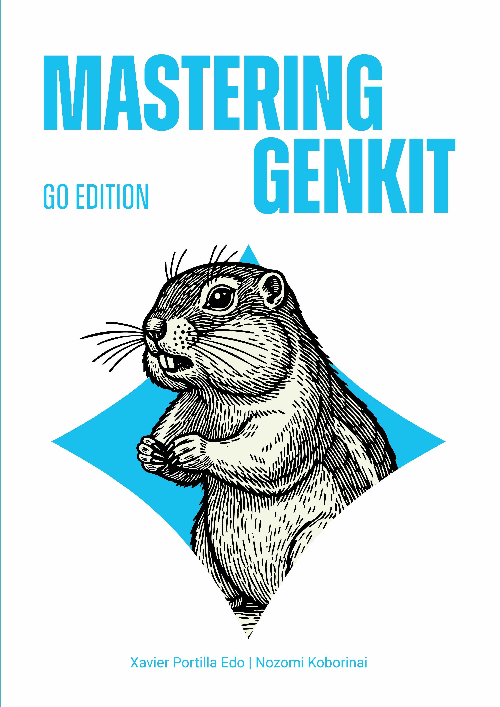

# Mastering Genkit: Go Edition

**Build Production-Ready AI Applications with Go and Genkit**

[]()
[](LICENSE)
[](https://golang.org)
[](https://firebase.google.com/products/genkit)
[](https://github.com/mastering-genkit/mastering-genkit-go)



A comprehensive guide to building AI applications with Firebase Genkit and Go. This book takes you from the basics of setting up your development environment to advanced topics like RAG systems, AI agents, and production deployment.

## About This Book

Master the art of building AI applications with Genkit and Go. Learn to harness the power of Genkit's flow-based architecture, integrate with leading AI models, implement robust evaluation systems, and deploy scalable AI applications.

### 👥 Authors

- **Xavier Portilla Edo** - Google Developer Expert in AI and Cloud, Microsoft MVP, GitHub Star
- **Nozomi Koborinai** - Google Cloud Partner Top Engineer, Genkit Dart Client Developer

## What You'll Learn

- **Foundation**: Understanding Genkit architecture and Go integration
- **Development Environment**: Setting up your Go development environment for AI
- **AI Generation**: Mastering structured output and AI model integration
- **Flows**: Building robust, scalable AI workflows
- **Streaming**: Implementing real-time AI responses
- **Tools**: Creating and integrating custom tools
- **MCP**: Model Context Protocol implementation
- **RAG**: Retrieval-Augmented Generation systems
- **Evaluations**: Testing and validating AI applications
- **Agents**: Building autonomous AI agents
- **Monitoring**: Observability and performance tracking
- **Deployment**: Production-ready deployment strategies

## 📁 Repository Structure

```
src/
├── chapters/           # Book chapters in Markdown
├── examples/          # Go code examples and projects
├── images/            # Book images and diagrams
├── diagrams/          # Technical diagrams
└── metadata/          # Book metadata and configuration
```

## 🚀 Quick Start

### Prerequisites

- Go 1.24 or later
- Git for version control

### Getting Started

1. **Clone the repository:**

   ```bash
   git clone https://github.com/mastering-genkit/mastering-genkit-go.git
   cd mastering-genkit-go
   ```

2. **Explore the examples:**

   ```bash
   cd src/examples
   # Each chapter has its own example directory
   ```

3. **Read the book:**

   - Online: [https://mastering-genkit.github.io/mastering-genkit-go](https://mastering-genkit.github.io/mastering-genkit-go)

## 📋 Available Formats

- 🌐 **Web** - Interactive online version with code examples
- 📖 **EPUB** - For e-readers and tablets
- 📱 **MOBI** - For Amazon Kindle devices
- 📄 **PDF** - For printing and offline reading
- 📚 **Leanpub** - Direct markdown publishing platform

You can get these formats from the [Releases](https://github.com/mastering-genkit/mastering-genkit-go/releases).

## Resources

### Official Links
- [Firebase Genkit Documentation](https://genkit.dev)
- [Genkit Go SDK](https://pkg.go.dev/github.com/firebase/genkit/go)
- [Genkit Examples](https://github.com/firebase/genkit/tree/main/go/samples)

### Community
- [Genkit Discord](https://discord.gg/qXt5zzQKpc)
- [Stack Overflow](https://stackoverflow.com/questions/tagged/genkit)

### Authors
- Xavier Portilla Edo: [Website](https://xavidop.me) | [LinkedIn](https://www.linkedin.com/in/xavierportillaedo/) | [GitHub](https://github.com/xavidop)
- Nozomi Koborinai: [Medium](https://medium.com/@nozomi-koborinai) | [LinkedIn](https://www.linkedin.com/in/nozomi-koborinai/) | [GitHub](https://github.com/nozomi-koborinai)

## 📄 License

This book content is licensed under the [Creative Commons Attribution-NonCommercial-NoDerivatives 4.0 International License](LICENSE). 

This means you are free to:
- **Share** — copy and redistribute the material in any medium or format

Under the following terms:
- **Attribution** — You must give appropriate credit, provide a link to the license, and indicate if changes were made
- **NonCommercial** — You may not use the material for commercial purposes
- **NoDerivatives** — If you remix, transform, or build upon the material, you may not distribute the modified material

Individual code examples may have the same licenses.

---

**Ready to master AI development with Genkit and Go?** 
Dive into the [first chapter](src/chapters/01-introduction-genkit-go.md)!

[](https://github.com/mastering-genkit/mastering-genkit-go)
