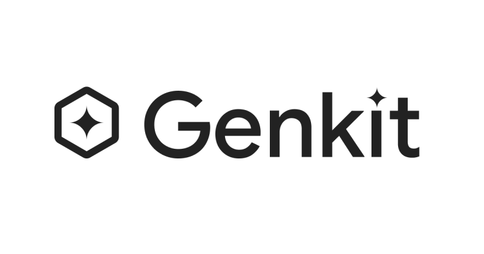
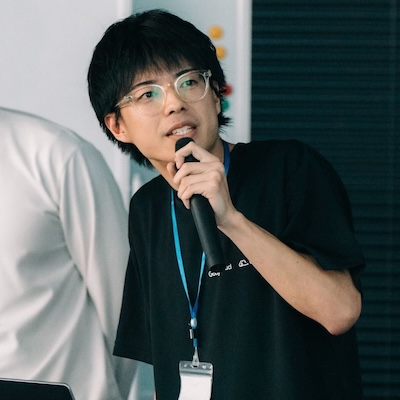

# Introduction



## About this book

Hey! We want to welcome you to the book **Mastering Genkit: Go Edition**. Thanks for picking it up! We hope you find it useful and enjoyable.

### Authors

#### Nozomi Koborinai



Nozomi graduated from an IT technical college in March 2019, where he built his foundation in object-oriented programming with Java.

This book emerged from Xavier's invitation as a collaborative effort. Driven by his passion for great products and developer communities, Nozomi feels a strong mission to spread their value worldwide. Deeply impressed by Firebase's exceptional developer experience, he explored Genkit and was captivated by its innovative approach. He now actively contributes to expanding the Genkit ecosystem, including developing the Dart client for Genkit.

In his 6 years of experience, the first four were spent developing electronic medical record systems using C#, teaching at Flutter University (Japan's Flutter engineering community), and co-authoring books on Flutter design patterns. Currently, he works at a Google Cloud Partner company in Japan, specializing in Serverless Application development (Identity Platform, Firebase, Cloud Run, DevOps, IaC). His deep interest in software architecture has made him proficient in ensuring quality through DDD and clean architecture principles.

He was awarded Google Cloud Partner Top Engineer (Serverless App Development) 2025, a Japan-exclusive award program, and serves as a former instructor and current 1-on-1 mentor at Flutter University. With speaking experience at Google I/O Extended Tokyo and GDG DevFest, he believes that promoting good products is essential for energizing developer communities.

Beyond technology, he enjoys music (guitar and beat-making), reading, and contributing to open-source projects. Improving developer experience is at the heart of his work and brings him the greatest joy.

#### Xavier Portilla Edo


Xavier obtained his degree in Computer Engineering at the Polytechnic University of Valencia (UPV) in 2014. He then completed his master’s degree in application software development in 2017 at the aforementioned university. During his academic journey, he had the chance to work on several team projects. The Hyperloop UPV −the future of transportation, is one of them.

This book means a creation whose purpose is to showcase his work and allow readers to dive in his experience and knowledge. This is Xavier’s way of showing the details behind the projects and businesses in which he has successfully been part of.

Xavier began his career in the AI in October 2019, after developing 4 applications for Alexa. Since then, he has been working on the development of AI applications, as well as in the creation of tools for the AI community. Recognized speaker in several events.

He has +10 years of experience with a focus on Cloud, Kubernetes, DevOps, Q&A, microservices, Generative AI & Conversational AI and mentoring startups thanks to the Google & Microsoft For Startups Program. He is an organizer of GDG Madrid, DevopsDays Madrid. He has been recognized as a Microsoft MVP, GitHub Star, AWS Alexa Champion & Community Builder, and Google Developer Expert in AI and Cloud.

To fulfill his passion for music and friendship, he enjoys live concerts, football (soccer), team sports and many other activities. Starting to play the guitar is on his bucket list. For Xavier, it has been always rewarding to help others learn everything about the trends in new technologies.

### Acknowledgments

We want to thank the vast community of developers who dedicate their time to write or talk about certain topics on their own sites or communities. Your huge contribution gave us enough motivation to start doing the same and we find great satisfaction in sharing our knowledge. You all inspire us to keep doing it.

We would also like to make a special mention to the entire Genkit team. Their uplifting technical dissemination inspired us to do the same through articles, events and online sessions, which in sum gave birth to the idea of creating this book.

In addition, it is only fair to dedicate a few words to all the people we stopped seeing or frequenting because of the time we spent on this book. There are friends and relatives who patiently encouraged us to devote time in this work instead of being with them. We have no words to express how enormously grateful we are to you.

Finally, we thank you, dear reader, for placing your complete confidence in this work. We hope you enjoy the lessons and learning of the concepts described here as much as we have enjoyed writing them.

### How to read this book

This book is structured in 15 chapters which address specific topics about programming in Go, with the main focus on creating AI Applications using Genkit.

This book deals with basic development related topics, as it has been conceived not only to be read, but also to act as a structured guide that provides a series of exercises, activities, etc. It is possible to find part of this material and other additional resources on the following blogs:
[https://medium.com/@nozomi-koborinai](https://medium.com/@nozomi-koborinai) - [https://xavidop.me/](https://xavidop.me/)

In them we will publish news, errata and complementary information related to this book. You can also find new tutorials, videos, references, etc., which are not included here.

#### Code examples

All the material published in this book has been produced by using the latest version of Genkit Go, which is open-source.
The sample programs shown in the pages of this book were carried out in late September 2025 being Genkit Go in beta.
The source code for all these examples remains hosted in the following GitHub repository:
[https://github.com/mastering-genkit/mastering-genkit-go](https://github.com/mastering-genkit/mastering-genkit-go)

We invite you to clone the directory structure to your local drive or device or to download the .zip file in order to run the examples correctly. We will try to keep the code up to date with the latest version and fix any bugs that may have slipped away.
You can also report any bugs and give us any feedback about the book or the source code by clicking on the Issues button on GitHub.

It should be mentioned that, in order to submit a new issue, you need to have a GitHub account. Just in case you haven’t got one yet.

#### Interactive book

This book is also available in an interactive format, which allows you to see the content directly in your browser. This format is designed to provide a more engaging reading experience, with features such as clickable code examples, and direct links to resources. Access the interactive version by visiting: [https://mastering-genkit.github.io/mastering-genkit-go](https://mastering-genkit.github.io/mastering-genkit-go)

### Special thanks

We owe special thanks to our dear friend **Iman Rahmati** for agreeing to serve as the technical editor of the book you’re holding today. We know it wasn’t an easy task.

His trust in our work, combined with his thoughtful guidance, has been invaluable throughout this journey. Iman has contributed not only to the development of this book, but also to our growth as authors.

Above all, we’re especially grateful for his patience and availability, which allowed us to learn and grow through many lively discussions. His involvement has enriched this project—and marked the beginning of a lasting friendship.

**Thank you, Iman!**

We also extend our heartfelt gratitude to the entire **Genkit team** at Google. Your innovative work in creating this powerful framework has made this book possible. The team's dedication to building developer-friendly AI tools and their commitment to open-source principles has been very inspiring.

The Genkit team's responsiveness to community feedback, their documentation, and their vision for making AI development accessible to all Go developers has shaped not only this book but the future of AI application development.

**Thank you to the Genkit team for making AI development in Go a reality!**

## New Choices in AI Development - Introduction to Genkit for Go Developers

The landscape of AI application development has fundamentally shifted. What began as experimental projects with ChatGPT has evolved into production-grade systems that demand reliability, performance, and maintainability. For Go developers, this evolution presents both challenges and opportunities.

This chapter explores why Genkit Go represents a significant advancement for building AI applications in Go. You'll understand the current AI development ecosystem, learn where Genkit Go fits within it, and see concrete examples of what makes it uniquely suited for Go developers building production AI systems.

## Prerequisites

Before diving into this book, you should have:

- **Basic Go knowledge**: Familiarity with Go syntax, error handling, and basic concurrency concepts
- **Understanding of REST APIs**: Experience building or consuming HTTP services
- **General AI awareness**: Basic understanding of what LLMs (Large Language Models) are and their capabilities
- **Command line proficiency**: Comfortable with terminal/command line operations

No prior AI development experience is required. We'll build your AI engineering knowledge from the ground up.

## Current State of AI Application Development

In 2025, AI development has entered a new phase. More than two years have passed since the emergence of ChatGPT, and many companies are beginning to transition from experimental stages to full-scale implementation.

What has become clear in this process is that AI application development comes with its own unique challenges. Unlike traditional software development, we face new types of problems: non-deterministic outputs, response latency, and difficulty in predicting costs.

The developer community has seen the emergence of various approaches to address these challenges, with frameworks optimized for different languages and ecosystems.

## The Diversifying AI Development Framework Landscape

The AI framework ecosystem has matured significantly, with each framework carving out its specialized niche. Understanding these frameworks helps contextualize where Genkit Go fits in the broader landscape.

### The Major Players

**LangChain** has emerged as the most comprehensive framework, supporting Python, TypeScript, and Java. Its strength lies in flexibility and extensive third-party integrations, making it ideal for complex chatbots and workflow automation. However, this comprehensiveness comes with a steeper learning curve and frequent breaking changes as the framework rapidly evolves.

**LlamaIndex** (formerly GPT Index) takes a different approach, focusing specifically on search and retrieval tasks. It excels at RAG applications with sophisticated vector store integrations and efficient data processing pipelines. Production teams often choose LlamaIndex when their primary need is connecting LLMs to large document repositories.

**Semantic Kernel** represents Microsoft's enterprise-focused approach. With tight Azure integration and robust telemetry features, it's the natural choice for organizations already invested in the Microsoft ecosystem. Its planning and orchestration capabilities are particularly strong, though the community is smaller compared to open-source alternatives.

**Haystack** by deepset emphasizes production readiness and scalability. Built with a modular pipeline architecture, it's designed for teams building serious NLP systems at scale. While it requires more setup than simpler frameworks, it offers industrial-strength reliability for question-answering and semantic search systems.

### The Rise of Agent Frameworks

Beyond traditional AI frameworks, specialized agent development platforms have emerged:

**Mastra**, created by the Gatsby team, brings TypeScript-native agent development to the JavaScript ecosystem. With built-in memory persistence, workflow orchestration, and type-safe integrations, it allows web developers to build sophisticated AI agents without leaving their familiar toolchain. Its deployment flexibility makes it particularly attractive for teams already using React or Next.js.

**Agent Development Kit (ADK)** represents Google's vision for enterprise-grade agent development. Launched in 2025, this code-first framework supports Python, Java, and Go, offering sophisticated multi-agent orchestration capabilities. Its integration with Google Cloud's Agent Engine provides a fully managed runtime, while the Agent2Agent protocol enables cross-platform agent collaboration - a crucial feature for complex enterprise systems.

### Genkit and ADK: Complementary Layers

Within the Genkit community, there has been a lot of discussion about how Genkit relates to Google's Agent Development Kit (ADK). One engineer working on Genkit at Google summarized Genkit's role this way:

> Genkit focuses on “low-level” AI APIs: models, tools, prompts, MCP, and developer tools such as o11y tooling and playgrounds.  
> Genkit lets you interact directly with LLMs, ships without hardcoded prompts by default, and its o11y tooling lets you see exactly what your agent is doing. No surprises.

In November 2025, Google also introduced the Agent Development Kit (ADK) for Go, an open-source, code-first toolkit for building, evaluating, and deploying sophisticated AI agents with flexibility and control (ADK for Go: <https://github.com/google/adk-go>). In the broader Vertex AI Agent Builder ecosystem, you build agents with ADK and run and scale them on Vertex AI Agent Engine Runtime, a fully managed service for deploying and operating agents in production. For more details, see ADK overview: <https://docs.cloud.google.com/agent-builder/agent-development-kit/overview> and Vertex AI Agent Builder overview: <https://docs.cloud.google.com/agent-builder/overview>.

A useful mental model in the Genkit community — one we also share — is to think in terms of **complementary layers** rather than "which one is better":

- **ADK** is a higher-level *agent framework* for orchestrating sophisticated, often multi-agent systems, with batteries-included features such as session management, memory, evaluation, and first-class integration with Google Cloud's Vertex AI Agent Engine Runtime and Agent Builder. If your requirements include managed scaling, production-grade observability, and long-lived, session-aware agents on Google Cloud, ADK is a natural fit.
- **Genkit** is a more general-purpose, lower-level *AI framework* that focuses on models, tools, prompts, MCP, and o11y. You can use it on its own to build agents (as we do in this book), to power other types of AI services, or even as the foundation beneath higher-level frameworks.

In a rapidly changing AI ecosystem, this separation of concerns matters. A common recommendation in the Genkit community — which we also agree with — is to follow Anthropic's guidance in "Building effective agents – When and how to use frameworks": <https://www.anthropic.com/engineering/building-effective-agents#when-and-how-to-use-frameworks>. Especially when you are starting out or learning, it often makes sense to begin with a lower-level toolkit like Genkit to deeply understand models, tools, prompts, and o11y, and then adopt an agent framework such as ADK based on your application's requirements.

That is why this book focuses on Genkit as a low-level foundation for Go developers: once you master these building blocks, you can confidently evaluate, choose, and combine agent frameworks — such as ADK on Google Cloud or other AI agent frameworks from different vendors — based on your application's requirements, or even build your own custom framework on top of Genkit when your architecture calls for it.

### The Framework Selection Challenge

Each framework represents different philosophical approaches to AI development:

- **Flexibility vs. Simplicity**: LangChain maximizes flexibility at the cost of complexity
- **Specialization vs. Generalization**: LlamaIndex specializes in retrieval while others aim for broader use cases
- **Ecosystem Lock-in vs. Portability**: Semantic Kernel works best within Microsoft's ecosystem
- **Research vs. Production**: Some frameworks prioritize cutting-edge features while others focus on stability

This fragmentation creates a dilemma for development teams: choosing a framework often means committing to its specific paradigms, tooling, and limitations.

## Production Environment Challenges

When deploying AI applications to production environments, developers face common challenges.

- **Performance and Scalability:** LLM inference costs increase proportionally with the number of requests. Balancing response time and cost becomes a critical challenge, especially when dealing with long contexts or complex reasoning requirements.

- **Integration Complexity:** Communication between components written in different languages, protocol standardization, and data format unification present numerous technical challenges.

- **Operational Considerations:** Building monitoring, logging, error handling, and deployment pipelines requires consideration of AI-specific requirements. In particular, monitoring model output quality and dealing with unexpected responses are new challenges.

## What is Genkit?

In 2024, Google's Firebase team announced ["Genkit"](https://genkit.dev) as a new approach to AI development. Genkit is an open-source framework aimed at simplifying AI application development and allowing developers to focus on their core business logic.

The distinctive concepts of Genkit include:

**Unified Interface**: Different LLM providers (OpenAI, Anthropic, Google, Vertex AI, etc.) can be handled with a unified API, making provider switching easy.

**Vendor Lock-in Avoidance**: Despite being developed by Google's Firebase team, Genkit is designed as an open-source framework that avoids vendor lock-in, allowing developers to choose any LLM provider or hosting platform.

**Developer Experience Focus**: Provides GUI tools for efficient debugging, testing, and evaluation in local development environments, addressing AI application-specific development challenges.

**Production-Ready**: Built with production operations in mind from the start, incorporating features like monitoring, tracing, and error handling.

**Plugin Architecture**: Various extensions such as vector databases, evaluation tools, and deployment targets can be added as plugins.

Genkit was initially developed in TypeScript/JavaScript, but its design philosophy was language-agnostic. And in 2025, the Go and Python language version has finally arrived.

## A New Choice for Go Developers: Genkit Go

In this context, Google announced Genkit Go. This is the full-fledged framework that allows Go developers to build AI applications in a native Go environment.

Genkit Go's design philosophy reflects Go's core values. If you've written Go code before, you'll immediately recognize the patterns. The framework embraces simplicity by offering clear, readable APIs that avoid unnecessary abstractions. Just like standard Go libraries, every operation returns errors that must be explicitly handled - there's no hidden magic or exceptions.

Type safety is paramount, with compile-time guarantees for structured inputs and outputs, preventing runtime surprises. The architecture favors composition over inheritance, building complex functionality from small, composable functions rather than deep class hierarchies. And true to Go's nature, it maintains minimal overhead with predictable performance characteristics.

```go
// Simple and readable API
response, err := genkit.Generate(ctx, g,
    ai.WithPrompt("Explain the basic concepts of quantum computing")
)
if err != nil {
    return fmt.Errorf("generation error: %w", err)
}

// Type-safe structured output
type Recipe struct {
    Name        string   `json:"name"`
    Ingredients []string `json:"ingredients"`
    Steps       []string `json:"steps"`
}

recipe, resp, err := genkit.GenerateData[Recipe](ctx, g,
    ai.WithPrompt("Create a healthy breakfast recipe")
)
```

## Why It Matters for Go Developers

- **Limited Production-Ready Options for Go:** Unlike Python or JavaScript ecosystems that offer numerous AI frameworks, Go developers have historically had limited choices for production-ready AI development. Most AI frameworks focus on Python first, leaving Go developers to either write bindings, use REST APIs, or switch languages entirely. Genkit Go changes this landscape by providing a native, production-ready framework specifically designed for Go - and with Google's backing, it's here to stay.

- **Integration with Existing Infrastructure:** Many companies already operate high-performance backend systems built with Go. Genkit Go can natively integrate AI capabilities into these systems.

- **Predictable Performance:** Go's efficient memory management and concurrency model allow precise control over AI inference latency and resource usage.

- **Deployment Simplicity:** Compilation to a single binary, minimal dependencies, and container-friendly design make deployment to any hosting platform straightforward - from cloud services like Cloud Run and Kubernetes to traditional servers and container orchestration platforms.

- **Ecosystem Consistency:** If your team is already familiar with Go, there's no need to learn new languages or paradigms.

## Common Misconceptions About AI Development

### Misconception 1: AI Calls Are Just Like API Calls

Many developers initially treat AI model interactions like traditional API calls - send a request, get a response. However, AI systems introduce fundamentally different characteristics:

- **Non-deterministic responses**: The same prompt can yield different results
- **Variable latency**: Response times can range from seconds to minutes
- **Token limits and context windows**: Constraints that don't exist in traditional APIs

Successful AI applications acknowledge these differences from the start, designing systems that embrace rather than fight against these characteristics.

### Misconception 2: One Model Fits All Use Cases

The temptation to use the most powerful model for every task is strong but misguided. In production:

- **Cost scales linearly with usage**: What works in development can bankrupt in production
- **Latency matters**: Faster, smaller models often provide better user experience
- **Accuracy isn't everything**: Sometimes consistency matters more than correctness

The art lies in matching model capabilities to specific use cases, not defaulting to maximum power.

### Misconception 3: AI Solves Problems Automatically

Perhaps the biggest misconception is that AI systems automatically understand and solve problems. In reality:

- **Context engineering is the new paradigm**: While prompt engineering focuses on "how you ask," context engineering designs entire information ecosystems - managing what the AI knows, when it knows it, and how it accesses tools and data
- **From prompts to systems**: The shift from prompt engineering to context engineering reflects AI's maturation - we're no longer just crafting clever questions but building dynamic systems that provide the right context at the right time
- **Evaluation is essential**: Without systematic testing, AI systems degrade unpredictably
- **Human-in-the-loop often necessary**: Pure automation is rarely the answer

These misconceptions highlight why frameworks like Genkit Go, designed with production realities in mind, become essential for serious AI development.

## Thinking About Language Choice

The important question is not "which language is the best" but "what is the optimal choice for your team and project."

Python has rich AI libraries and community, making it ideal for R&D and experimental projects. JavaScript excels at full-stack web applications and real-time interactions. C# provides robustness in enterprise environments.

And Go offers a new option for teams that need native integration with high-performance backend systems, predictable performance, and operational simplicity.

## What We'll Build Throughout This Book

Rather than following a single project theme, this book takes a different approach. Each chapter introduces Genkit Go's features through carefully chosen practical examples that best demonstrate the concepts at hand.

### Learning Through Diverse Examples

Our philosophy is simple: the best way to understand a feature is through its ideal use case. This book is structured in five comprehensive parts:

**Part 1: Foundation** establishes your understanding of Genkit Go's architecture and the AI development landscape. You'll learn why Genkit Go matters and how to set up your development environment.

**Part 2: Core Features** dives into the essential capabilities - from basic generation and structured outputs to building flows and streaming responses. These chapters form the backbone of your Genkit Go knowledge.

**Part 3: Advanced Features** explores sophisticated patterns like tool calling, Model Context Protocol (MCP), RAG systems, evaluation frameworks, and building AI agents. Here you'll learn to create more intelligent and capable applications.

**Part 4: Production Excellence** focuses on real-world deployment concerns - observability, monitoring, deployment strategies, and cost optimization. These chapters ensure your applications are production-ready.

**Part 5: Integration Patterns** rounds out your knowledge with client integration strategies, showing how to connect Genkit Go applications with various frontend frameworks and architectural patterns.

### Progressive Complexity

The examples progress from simple to complex, each building upon previous knowledge:

1. **Foundation**: Start with basic AI generation and structured outputs
2. **Interaction**: Add streaming, tool calling, and external integrations
3. **Intelligence**: Implement RAG systems, evaluation, and multi-step reasoning
4. **Production**: Deploy, monitor, and scale your AI applications

### Why This Approach?

1. **Feature-focused learning**: Each example is chosen to best demonstrate specific Genkit Go capabilities
2. **Practical diversity**: Exposure to various AI application patterns prepares you for real-world projects
3. **Flexibility**: Pick and choose examples relevant to your immediate needs
4. **Depth over breadth**: Deep dive into Genkit Go's internals rather than surface-level API usage

## Key Takeaways

- **AI development has evolved** from experimentation to production, requiring new engineering approaches
- **Genkit Go offers a Go-native solution** that aligns with Go's philosophy of simplicity and performance
- **Framework choice matters** - Genkit Go is optimal for teams already using Go who need production-grade AI
- **Context engineering is the new paradigm** - moving beyond simple prompts to designing information ecosystems
- **Common misconceptions exist** in AI development, but understanding them helps build better systems
- **Production considerations** like cost, latency, and non-determinism must be addressed from the start

## Next Steps

In Chapter 2, we'll dive deep into Genkit's architecture to understand why this framework feels so natural for Go developers. You'll learn:

- How Genkit's plugin system enables flexibility without complexity
- The design decisions that make Genkit Go production-ready
- Detailed comparisons with other AI frameworks from an architectural perspective
- Why Genkit's approach aligns perfectly with Go's design philosophy

Get ready to explore the technical foundations that make Genkit Go a powerful choice for AI application development.

## Reflections: Toward the Future of AI Development

The world of AI development is evolving rapidly. What's important is that this is not an entirely new field but an extension of existing software engineering. Like data engineering and DevOps before it, AI engineering is a field that anyone can tackle with the right tools and knowledge.

As a Go developer, you already have a solid engineering foundation. Genkit Go provides the tools to build AI capabilities on top of that foundation. Rather than dismissing other languages or frameworks, it provides the optimal choice for your skill set and requirements.

Let's begin the journey of AI development for Go developers.
