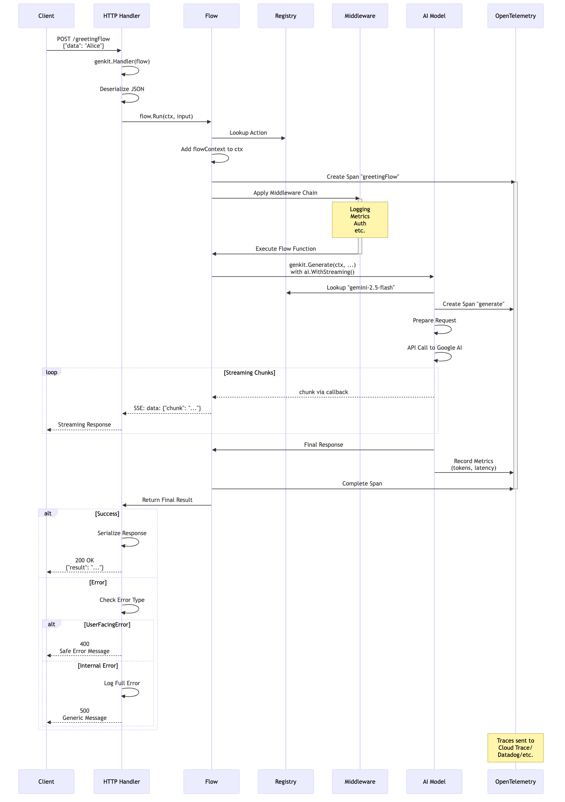

# Understanding Genkit Architecture

After exploring why Genkit Go matters in Chapter 1, this chapter dives deep into its internal architecture. Understanding these internals isn't just academic curiosity—it's essential for building robust, production-ready AI applications. When you grasp how Genkit Go works under the hood, you can make informed decisions about performance optimization, error handling strategies, and architectural patterns that align with your application's needs.

## Prerequisites

Before diving into this chapter, you should have:

- Completed Chapter 1 to understand Genkit Go's position in the AI development landscape
- Basic understanding of Go's interfaces and type system
- Understanding of HTTP request/response lifecycle

## Genkit's Design Philosophy

Genkit Go's architecture reflects a deliberate set of design choices that prioritize Go's core values while adapting them for AI development. Let's examine these design principles and understand why they matter for your applications.

### Embracing Go's Philosophy

When you look at Genkit Go's initialization pattern in the source code, you'll notice something familiar:

```go
func Init(ctx context.Context, opts ...GenkitOption) *Genkit {
    ctx, _ = signal.NotifyContext(ctx, os.Interrupt, syscall.SIGTERM)
    
    gOpts := &genkitOptions{}
    for _, opt := range opts {
        if err := opt.apply(gOpts); err != nil {
            panic(fmt.Errorf("genkit.Init: error applying options: %w", err))
        }
    }
    
    r := registry.New()
    g := &Genkit{reg: r}
    
    // Plugin initialization
    for _, plugin := range gOpts.Plugins {
        actions := plugin.Init(ctx)
        for _, action := range actions {
            action.Register(r)
        }
        r.RegisterPlugin(plugin.Name(), plugin)
    }
    
    // ... additional setup
    return g
}
```

This pattern mirrors Go's standard library approach—functional options, explicit error handling, and clear initialization flow. Unlike many AI frameworks that rely on global state or complex inheritance hierarchies, Genkit Go maintains Go's preference for explicitness and simplicity.

The `Genkit` struct itself is remarkably minimal:

```go
type Genkit struct {
    reg *registry.Registry // Registry for actions, values, and other resources.
}
```

This simplicity is intentional. Rather than building a monolithic framework, Genkit Go follows Go's composition principle—small, focused components that work together through well-defined interfaces.

### Production-First Design

Genkit Go embeds production concerns directly into its architecture. When you initialize Genkit with `GENKIT_ENV=dev`, it automatically starts a reflection server:

```go
// During local development (when the `GENKIT_ENV` environment variable is set to `dev`),
// Init also starts the Reflection API server as a background goroutine. This server
// provides metadata about registered actions and is used by developer tools.
```

This isn't just a development convenience—it demonstrates how Genkit Go considers the full lifecycle from development to production. The reflection server provides introspection capabilities that power the Developer UI, but the same underlying registry system enables production monitoring and debugging.

### Error Handling as a First-Class Concern

Genkit Go's error system provides two distinct error types for different contexts:

```go
// GenkitError is the base error type for Genkit errors.
type GenkitError struct {
    Message  string         `json:"message"` // Exclude from default JSON if embedded elsewhere
    Status   StatusName     `json:"status"`
    HTTPCode int            `json:"-"`                // Exclude from default JSON
    Details  map[string]any `json:"details"`          // Use map for arbitrary details
    Source   *string        `json:"source,omitempty"` // Pointer for optional
}

// UserFacingError is the base error type for user facing errors.
type UserFacingError struct {
    Message string         `json:"message"` // Exclude from default JSON if embedded elsewhere
    Status  StatusName     `json:"status"`
    Details map[string]any `json:"details"` // Use map for arbitrary details
}
```

This dual-error structure serves multiple purposes:

- **Security**: `UserFacingError` prevents internal details from leaking to clients
- **Debugging**: `GenkitError` captures stack traces but only exposes them in development mode
- **Integration**: HTTP status codes map cleanly to REST API responses

The distinction between `GenkitError` (internal) and `UserFacingError` (external) reflects production experience where internal exceptions must never leak to attackers, while developers still need detailed debugging information.

## Plugin System Deep Dive

The plugin system is where Genkit Go's architectural elegance becomes apparent. Unlike frameworks that require complex configuration files or runtime discovery, Genkit Go's plugin system leverages Go's type system for compile-time safety and runtime flexibility.

### The Plugin Interface

At its core, a plugin is remarkably simple:

```go
type Plugin interface {
    Name() string
    Init(ctx context.Context) []core.Action
}
```

This simple interface hides powerful functionality. When you add any plugin to your Genkit instance:

```go
// Mix and match providers as needed
g := genkit.Init(ctx,
    genkit.WithPlugins(
        &openai.OpenAI{},           // OpenAI's GPT models
        &anthropic.Anthropic{},     // Anthropic's Claude models
        &googlegenai.GoogleAI{},    // Google's Gemini models
    ),
)
```

Here's what happens behind the scenes:

1. Each plugin's `Init` method is called
2. They return lists of "actions" - the actual AI models you can use
3. All models get registered in Genkit's unified registry
4. You can now use any model with the same API

```go
// Switch between providers with just a string change
result, err := genkit.Generate(ctx, g, 
    ai.WithModel("openai/gpt-5"),  // or "Claude models" or "Google Gemini models"
    ai.WithPrompt("Hello!"),
)
```

This unified interface means all models work through the same API, regardless of provider.

### Dynamic Plugin Resolution

For more complex scenarios, Genkit Go supports dynamic plugins:

```go
type DynamicPlugin interface {
    Plugin
    ListActions(ctx context.Context) []core.ActionDesc
    ResolveAction(atype core.ActionType, name string) core.Action
}
```

Dynamic plugins enable lazy loading and runtime discovery of capabilities. This is particularly useful for:

- Cloud-based model providers that may add new models without code changes
- Multi-tenant systems where available actions depend on the current user context
- Development tools that need to discover available actions without executing them

### Plugin Categories and Capabilities

While all plugins share the same interface, they provide different types of functionality. Let's look at what actually happens inside a real plugin:

#### Model and Embedder Providers (Google AI Plugin)

The Google AI plugin demonstrates how a plugin provides multiple capabilities. Its `Init` method sets up both AI models and text embedders:

```go
// Simplified from the actual googlegenai.go implementation
func (ga *GoogleAI) Init(ctx context.Context) []core.Action {
    // First, validate and setup API key
    apiKey := ga.APIKey
    if apiKey == "" {
        apiKey = os.Getenv("GEMINI_API_KEY")
        // ... check other env vars
    }
    
    // Create the client
    client, err := genai.NewClient(ctx, &gc)
    ga.gclient = client
    
    var actions []core.Action
    
    // Register all available models (gemini-2.5-flash, gemini-2.5-pro, etc.)
    models, err := listModels(googleAIProvider)
    for name, modelInfo := range models {
        model := newModel(ga.gclient, name, modelInfo)
        actions = append(actions, model.(core.Action))
    }
    
    // Also register embedders for text-to-vector conversion
    embedders, err := listEmbedders(gc.Backend)
    for name, embedderOpts := range embedders {
        embedder := newEmbedder(ga.gclient, name, &embedderOpts)
        actions = append(actions, embedder.(core.Action))
    }
    
    return actions
}
```

After this initialization, your application can use any of these models through Genkit's unified API. The plugin has transformed external API capabilities into Genkit actions.

#### Custom Tools and Flows

You can also create your own "actions" using flows, which we'll explore more in Chapter 6:

```go
// Your custom flow becomes an action in the registry
weatherFlow := genkit.DefineFlow(g, "getWeather", 
    func(ctx context.Context, city string) (Weather, error) {
        // Your implementation here
        return fetchWeatherData(city)
    })
```

Once defined, this flow can be:

- Called directly in your code
- Exposed as an HTTP endpoint
- Used as a tool by AI models (for function calling)

The key insight is that Genkit treats everything uniformly - whether it's a sophisticated AI model or a simple function you wrote, they all become "actions" in the registry with consistent interfaces.

## How Genkit Go Differs from Genkit JS/TS

>While officially called "Genkit JS", the JavaScript version is primarily written in TypeScript, so we'll refer to it as JS/TS throughout this book

Understanding the differences between Genkit Go and its JS/TS counterpart reveals important architectural decisions that affect how you build applications. These aren't just implementation details—they fundamentally shape your development experience and application characteristics.

### Type System Implications

JS/TS Genkit leverages TypeScript's structural typing and runtime type checking:

```typescript
// TypeScript version
const myFlow = defineFlow({
    name: 'myFlow',
    inputSchema: z.string(),
    outputSchema: z.string(),
}, async (input) => {
    // Runtime validation happens here
    return processInput(input);
});
```

Go's version uses compile-time type safety with generics:

```go
// Go version
greetingFlow := DefineFlow(g, "greetingFlow", 
    func(ctx context.Context, name string) (string, error) {
        // Type safety enforced at compile time
        return processName(name)
    })
```

This difference has profound implications:

- **Go**: Errors are caught at compile time, but you lose some runtime flexibility
- **JS/TS**: More flexible at runtime, but requires careful schema management

### Error Handling Philosophy

JavaScript's Promise-based error handling:

```typescript
try {
    const result = await generate({ prompt: "Hello" });
} catch (error) {
    // All errors bubble up through Promise rejection
}
```

Go's explicit error returns:

```go
result, err := Generate(ctx, g, ai.WithPrompt("Hello"))
if err != nil {
    // Explicit error handling at each step
    return fmt.Errorf("generation failed: %w", err)
}
```

Go's approach means more verbose code, but it forces you to consider error cases at each step. This aligns with Go's philosophy that errors are values to be handled, not exceptions to be caught.

### Execution Model

The JavaScript version runs on Node.js with its event loop and async/await model. The Go version leverages goroutines and callbacks for concurrency. This affects how you structure streaming responses.

In Chapter 7, we'll explore streaming in detail, but here's how the architecture differs:

**JS/TS**: Uses async generators and Promises

```typescript
// JS uses async iteration
for await (const chunk of generateStream({ prompt })) {
    console.log(chunk);
}
```

**Go**: Uses callback functions for streaming

```go
// DefineStreamingFlow signature shows callback-based approach
func DefineStreamingFlow[In, Out, Stream any](
    g *Genkit, 
    name string, 
    fn func(ctx context.Context, input In, cb func(context.Context, Stream) error) (Out, error),
) *Flow[In, Out, Stream]

// Real-world example: streaming AI responses
recipeFlow := genkit.DefineStreamingFlow(g, "recipeFlow",
    func(ctx context.Context, dish string, stream func(context.Context, string) error) (string, error) {
        // Generate with real-time streaming from AI model
        final, err := genkit.Generate(ctx, g,
            ai.WithPrompt(fmt.Sprintf("Create a recipe for %s", dish)),
            ai.WithStreaming(func(ctx context.Context, chunk *ai.ModelResponseChunk) error {
                // Forward each AI response chunk to the client immediately
                for _, content := range chunk.Content {
                    if stream != nil {
                        if err := stream(ctx, content.Text); err != nil {
                            return err
                        }
                    }
                }
                return nil
            }),
        )
        
        if err != nil {
            return "", fmt.Errorf("generation failed: %w", err)
        }
        
        // Return the complete response
        return final.Text(), nil
    })
```

The key architectural difference: Go's callback-based streaming avoids the complexity of async iterators while maintaining explicit control flow. The callback parameter (`cb`) being nil or non-nil determines whether the flow streams or not—a pattern that aligns with Go's preference for explicit behavior over implicit magic.

### Deployment Characteristics

JS/TS Genkit produces Node.js applications that require the Node runtime. Go Genkit compiles to single, self-contained binaries. This means:

- **Go binaries**: Ship with all dependencies compiled in, start faster, use less memory
- **Node.js apps**: Require npm modules at runtime, but easier to patch without recompilation

From production experience, Go binaries typically show 3-5x better cold start performance in serverless environments, making them ideal for Cloud Run or Lambda deployments where cold starts affect user experience.

## Internal Request Flow

Understanding how requests flow through Genkit Go helps you design better error handling, implement effective logging, and debug production issues. Let's trace a request from HTTP endpoint to AI model and back.

### Request Lifecycle

When a client calls your Genkit flow via HTTP, here's what happens internally:

#### 1. HTTP Handler Registration

```go
mux.HandleFunc("POST /greetingFlow", genkit.Handler(greetingFlow))
```

The `genkit.Handler` wrapper converts your flow into an HTTP handler that:

- Deserializes JSON input
- Manages context propagation
- Serializes responses
- Handles errors appropriately

#### 2. Context Propagation

Genkit Go uses Go's `context.Context` to propagate cancellation, deadlines, and values through the entire request:

```go
func (f *Flow[In, Out, Stream]) Run(ctx context.Context, input In) (Out, error) {
    return (*ActionDef[In, Out, Stream])(f).Run(ctx, input, nil)
}
```

This context propagation enables powerful patterns:

- Request timeout enforcement (context deadline)
- Distributed tracing correlation (spans are automatically created)
- Flow-specific metadata (via flowContext)
- Graceful cancellation on server shutdown

#### 3. Middleware Pipeline

Actions (including flows and model calls) support middleware for cross-cutting concerns. The middleware system allows you to wrap action execution with pre/post processing, modify inputs and outputs, and add logging, metrics, or authentication.

> For detailed middleware implementation patterns and examples, see `Chapter 4: Mastering AI Generation`, where we explore logging middleware, retry logic, and other production patterns.

### Observability Integration

Genkit Go automatically creates OpenTelemetry spans during action execution, as shown in the sequence diagram. This built-in instrumentation captures the complete request lifecycle without additional code.

> For detailed observability implementation patterns, monitoring strategies, and production deployment guidance, see `Chapter 13: Monitoring and Observability` with Genkit Go.

### Putting It All Together

The following sequence diagram illustrates the complete request flow we've discussed—from HTTP handler registration through middleware, context propagation, model execution, and error handling:



This diagram shows how all the architectural components work together: the HTTP handler deserializes requests, context flows through every layer enabling cancellation and tracing, middleware wraps execution for cross-cutting concerns, and errors are properly categorized for security while maintaining debuggability.

## Key Takeaways

- Compile-time type safety in Go provides different tradeoffs than TypeScript's runtime validation
- Production concerns like error handling and observability are built into the architecture, not bolted on
- Understanding these internals helps you avoid vendor lock-in and make better architectural decisions

## Next Steps

With a solid understanding of Genkit Go's architecture, you're ready to set up your development environment in Chapter 3. You'll apply this architectural knowledge to configure your workspace, understand how the Developer UI connects to your application, and begin building your first Genkit Go applications with confidence in the underlying system.
