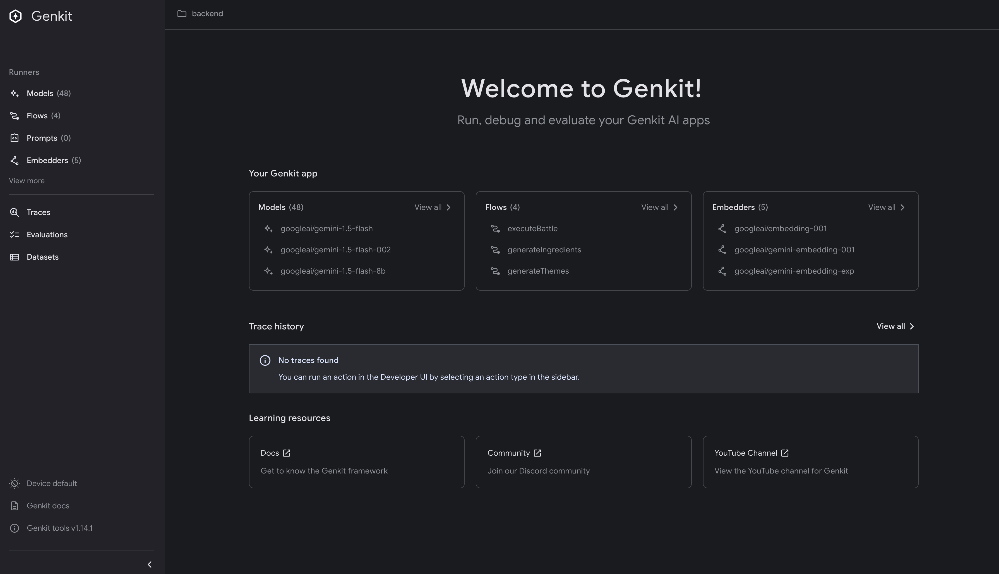

# Setting Up Your Development Environment

## Introduction

Before we can start building AI applications with Genkit Go, we need to set up our development environment. Unlike many AI frameworks that require complex configurations and multiple dependencies, Genkit Go maintains Go's philosophy of simplicity. This chapter walks through the minimal setup required to get Genkit Go running on your machine.

By the end of this chapter, you'll have a working Genkit Go environment and will have successfully made your first AI model request. Let's get started with the essentials.

## Go Environment Setup

### Install Go 1.24 or Later

Genkit Go requires Go 1.24 or later.

```bash
# Download from https://go.dev/doc/install
# Verify installation
go version
```

## Initialize a Genkit Go Project

Create a new directory and initialize a Go module.

```bash
mkdir my-genkit-app && cd my-genkit-app
go mod init example/my-genkit-app
go get github.com/firebase/genkit/go
```

## API Key Setup

### Google AI API Key

To use Google's Gemini models.

1. Visit [Google AI Studio](https://aistudio.google.com/apikey)
2. Click "Create API Key"
3. Copy the generated key

Set the environment variable.

```bash
export GEMINI_API_KEY=<your API key>
```

Google AI provides a generous free tier and doesn't require a credit card to get started.

[pricing](https://ai.google.dev/gemini-api/docs/pricing)

## Verify Your Setup

Create a `main.go` file to test your setup.

```go
package main

import (
    "context"
    "log"
    
    "github.com/firebase/genkit/go/ai"
    "github.com/firebase/genkit/go/genkit"
    "github.com/firebase/genkit/go/plugins/googlegenai"
)

func main() {
    ctx := context.Background()
    
    // Initialize Genkit with Google AI plugin
    g, err := genkit.Init(ctx,
        genkit.WithPlugins(&googlegenai.GoogleAI{}),
        genkit.WithDefaultModel("googleai/gemini-2.5-flash"),
    )
    if err != nil {
        log.Fatalf("could not initialize Genkit: %v", err)
    }
    
    // Make a test request
    resp, err := genkit.Generate(ctx, g, 
        ai.WithPrompt("What is the meaning of life?"),
    )
    if err != nil {
        log.Fatalf("could not generate model response: %v", err)
    }
    
    log.Println(resp.Text())
}
```

Run the application.

```bash
go run .
```

You should see a response from the model.

## Genkit CLI Installation (Optional)

The Genkit CLI provides developer tools for testing and debugging. It requires Node.js.



### Node.js/npm Requirements - Technical Architecture

The requirement for Node.js in a Go project stems from an architectural decision to build Genkit CLI as a unified, language-agnostic tool. The CLI ([genkit-cli npm package](https://www.npmjs.com/package/genkit-cli)) is built with Node.js/TypeScript to provide consistent developer experience across JavaScript, Go, and Python SDKs.

```bash
# Install Node.js from https://nodejs.org
# Then install Genkit CLI
npm install -g genkit

# Verify installation
genkit --version
```

To use the developer UI with your Go application.

```bash
genkit start -- go run .
```

This opens the developer UI at http://localhost:4000.

## Summary

You now have a working Genkit Go development environment.

- Go 1.24 or later installed
- Genkit Go package added to your project
- API key configured
- Basic application tested

In the next chapter, we'll explore Genkit's core features by building your first AI application.
