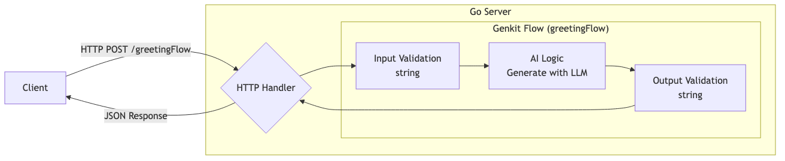

# Setting Up Your Development Environment

## Introduction

Getting started with Genkit Go requires more than just installing a package. You need to understand how Genkit's unique architecture influences your development setup, project structure, and workflow. Unlike traditional Go libraries that integrate seamlessly into existing projects, Genkit Go brings its own developer tools, runtime requirements, and architectural patterns that fundamentally shape how you build AI applications.

This chapter guides you through setting up a production-ready Genkit Go development environment. You'll learn not just the "how" but the "why" behind each configuration choice, understand the Developer UI's role in your workflow, and establish project structures that scale from prototypes to production systems.

## Prerequisites

Before setting up your Genkit Go environment, ensure you have:

- **Go 1.24 or later**: Genkit Go leverages modern Go features for type safety and performance
- **Node.js 20+ and npm**: Required for the Genkit CLI and Developer UI
- **Git**: For version control and accessing example repositories
- **Basic understanding of Go modules**: Familiarity with `go mod` commands and dependency management

## Installing Genkit CLI

The Genkit CLI is your primary interface for development, providing the Developer UI, flow testing, and deployment utilities. While Genkit Go applications can run without the CLI in production, it's essential for development.

```bash
# Install Genkit CLI globally
npm install -g genkit-cli

# Verify installation
genkit --version
```

The CLI installation provides several key commands:

- `genkit start -- <command to run your code>`: Launches the Developer UI and connects to your running application
- `genkit flow:run <flowName>`: Run a specified flow. Your runtime must already be running in a separate terminal with the `GENKIT_ENV=dev` environment variable set.
- `genkit eval:flow <flowName>`: Evaluate a specific flow. Your runtime must already be running in a separate terminal with the `GENKIT_ENV=dev` environment variable set.

## Understanding the Genkit Developer UI


AI application development presents unique challenges that traditional debugging tools weren't designed to handle. When working with LLMs, you face:

- **Non-deterministic outputs**: The same prompt can produce different responses each time, making it impossible to write traditional unit tests with expected outputs
- **Black-box behavior**: Understanding why an LLM generated a specific response is often opaque, unlike stepping through deterministic code
- **Complex interaction chains**: AI applications often involve multiple model calls, tool invocations, and context management that are difficult to trace
- **Cost and latency concerns**: Each model call has financial and performance implications that need monitoring

Genkit's Developer UI addresses these AI-specific challenges by providing purpose-built tools for AI development. Rather than trying to force traditional debugging paradigms onto probabilistic systems, it embraces the unique nature of AI applications with visual inspection of model interactions, flow execution tracking, and real-time observability.

### Architecture Deep Dive

Looking at the source code implementation:

```go
// Reflection server starts on port 3100 by default
addr := "127.0.0.1:3100"
if os.Getenv("GENKIT_REFLECTION_PORT") != "" {
    addr = "127.0.0.1:" + os.Getenv("GENKIT_REFLECTION_PORT")
}
```

[https://github.com/firebase/genkit/blob/main/go/genkit/reflection.go#L61-L126](https://github.com/firebase/genkit/blob/main/go/genkit/reflection.go#L61-L126)

The reflection server is the bridge between your Go application and the Developer UI. When your application runs in development mode, it automatically starts this server, exposing runtime information about flows, prompts, and model interactions. This design allows the JavaScript-based Developer UI to introspect your Go application without language barriers.

### Starting the Genkit Developer UI for Go

When developing with Genkit Go, you have two options for running your application:

1. Production mode: Run your Go application directly with `go run .`
2. Development mode: Use the Genkit CLI to launch both your application and the Developer UI together

For development, the recommended approach is to use the Genkit CLI to manage your application lifecycle. This ensures proper communication between your Go application and the Developer UI through the reflection server:

```bash
# Start Developer UI with your Go application
genkit start -- go run .

# For applications with specific entry points
genkit start -- go run ./cmd/server
```

This approach ensures proper connection between the Developer UI (available at <http://localhost:4000>) and your application's reflection server. The Developer UI automatically discovers available flows, monitors executions, and provides real-time feedback.

## Project Structure Best Practices

While there's no single "correct" way to structure a Genkit Go application, certain patterns have proven effective for maintainability and scalability. Here's one approach that aligns well with Go conventions while accommodating Genkit's specific needs:

```text
myapp/
├── main.go                 # Application entry point
├── internal/
│   ├── flows/              # Flow definitions
│   │   ├── flows.go        # Flow registration
│   │   ├── greeting.go     # Individual flow implementations
│   │   └── chat.go
│   ├── prompts/            # Prompt management
│   │   └── templates.go
│   └── tools/              # Custom tool implementations
│       └── calculator.go
├── prompts/                # Dotprompt files (optional)
│   └── greeting.prompt
├── go.mod
├── go.sum
└── README.md
```

This structure balances Go's preference for flat hierarchies with the organizational needs of AI applications. The `internal` package prevents external imports of your application logic, while clear subdirectories help organize different Genkit components. Adapt this structure to your specific needs - smaller projects might need less separation, while larger ones might benefit from additional organization.

For our first application in this chapter, we'll start with a much simpler structure - just a single `main.go` file. This allows us to focus on verifying that our environment is correctly set up before diving into more complex architectural patterns in later chapters.

## First Genkit Go Application with Server and Flows

Let's build a Genkit Go application with a proper server and Flow definition to fully utilize the Developer UI.

A Flow is a reusable, configurable function that encapsulates your AI logic with well-defined input and output types - think of it as a structured API endpoint specifically designed for AI operations.

In our example, we'll create a `greetingFlow` that accepts a user's name and returns a personalized greeting. Here's how this Flow architecture works within our HTTP server:



As shown in the diagram, the Flow sits inside your Go server and handles the complete request lifecycle: validating input, calling the LLM with your AI logic, and returning the response. Let's implement this pattern.

### Step 1: Initialize the Project

```bash
# Create and navigate to project directory
mkdir genkit-intro && cd genkit-intro

# Initialize Go module
go mod init example/genkit-intro

# Install Genkit package
go get github.com/firebase/genkit/go

# Download and verify dependencies
go mod tidy
```

### Step 2: Create a Server Application with Flows

Create a `main.go` file with the following content:

> If you encounter import errors when writing the code, run `go mod tidy` to ensure all dependencies are properly downloaded.

```go
package main

import (
    "context"
    "fmt"
    "log"
    "net/http"
    "os"

    "github.com/firebase/genkit/go/ai"
    "github.com/firebase/genkit/go/genkit"
    "github.com/firebase/genkit/go/plugins/googlegenai"
    "github.com/firebase/genkit/go/plugins/server"
)

func main() {
    ctx := context.Background()

    // Initialize Genkit with the Google AI plugin and Gemini 2.5 Flash.
    g, err := genkit.Init(ctx,
        genkit.WithPlugins(&googlegenai.GoogleAI{}),
        genkit.WithDefaultModel("googleai/gemini-2.5-flash"),
    )
    if err != nil {
        log.Fatalf("could not initialize Genkit: %v", err)
    }

    // Define a greeting flow that accepts a user's name and generates a personalized greeting
    greetingFlow := genkit.DefineFlow(g, "greetingFlow", func(ctx context.Context, userRequest string) (string, error) {
        resp, err := genkit.Generate(ctx, g,
            ai.WithSystem("You are a friendly assistant that creates warm, personalized greetings. When given a name, respond with a welcoming message that makes the person feel valued."),
            ai.WithPrompt(fmt.Sprintf("Create a greeting for %s", userRequest)),
        )
        if err != nil {
            return "", fmt.Errorf("failed to generate response: %w", err)
        }

        return resp.Text(), nil
    })

    mux := http.NewServeMux()
    mux.HandleFunc("POST /greetingFlow", genkit.Handler(greetingFlow))

    port := os.Getenv("PORT")
    if port == "" {
        port = "9090"
    }

    log.Printf("Starting server on 127.0.0.1:%s", port)
    log.Fatal(server.Start(ctx, "0.0.0.0:"+port, mux))
}
```

This production-ready example demonstrates:

- Initializing Genkit with proper plugin configuration
- Defining a Flow that can be called and tested
- Setting up an HTTP server to handle Flow requests
- Proper error handling and logging
- Integration with the Developer UI

Note that Genkit automatically reads either `GEMINI_API_KEY` or `GOOGLE_API_KEY` from your environment variables, so you don't need to explicitly pass it in your code.

### Step 3: Running the Application with Developer UI

Configure your Gemini API key by setting the environment variable:

```bash
# Either of these environment variables will work
export GEMINI_API_KEY=<your API key>
# OR
export GOOGLE_API_KEY=<your API key>
```

If you don't already have one, create a key in [Google AI Studio](https://aistudio.google.com/app/apikey). Google AI provides a generous free-of-charge tier and does not require a credit card to get started.

> **Security Warning**: Never commit your API key to version control or expose it publicly. Leaked API keys can be exploited, resulting in unexpected charges or security breaches.

Now, launch your application with the Developer UI:

```bash
# Start the application with Developer UI integration
genkit start -- go run .
```

If your API key is not properly set, you'll see an error like:

```text
could not initialize Genkit: genkit.Init: plugin *googlegenai.GoogleAI initialization failed: 
GoogleAI.Init: Google AI requires setting GEMINI_API_KEY or GOOGLE_API_KEY in the environment. 
You can get an API key at https://ai.google.dev
exit status 1
```

Once your API key is properly configured, you should see output like:

```text
Genkit Developer UI: http://localhost:4000
2025/08/01 21:34:43 Starting server on 127.0.0.1:9090
```

You can now access the Developer UI by navigating to `http://localhost:4000` in your web browser. We'll explore its features in detail in the next section.

## Exploring the Developer UI

Once your application is running with `genkit start -- go run .`, the Developer UI provides a comprehensive interface for developing and testing your AI workflows.

>As you use the Developer UI, Genkit creates a `.genkit` directory in your project root as a local file trace store, containing telemetry data, flow execution traces, and other development artifacts. Consider adding `.genkit` to your `.gitignore` file if you don't need to share these development traces with your team.

### Main Dashboard


The main dashboard displays:

- **Models**: All available AI models from registered plugins (googleai/gemini-1.5-flash, googleai/gemini-2.5-flash, etc.)
- **Flows**: Your defined flows (in our case, `greetingFlow`)
- **Embedders**: Available text embedding models for semantic search and similarity
- **Trace History**: Recent flow executions with detailed telemetry

### Testing Flows in the UI

Click on `greetingFlow` in the Flows section to open the flow testing interface:


To test your flow:

1. Enter a name in the input field (e.g., "Alice")
2. Click "Run" to execute the flow
3. View the generated greeting response
4. Observe token usage and execution time

### Trace Inspection

After running a flow, click on the trace in the Trace History section to see detailed execution information:


The trace view provides:

- **Execution Timeline**: Visual representation of each step in the flow
- **Token Usage**: Exact input/output token counts.
- **Full Request/Response**: Complete prompt sent to the model and generated text
- **Timing Information**: Latency for each operation

### Model Explorer

Click on "Models" in the left navigation to explore available models:


The Models section shows:

- Model names and versions
- Configuration options and limits
- Direct testing interface for each model

### Real-time Development Workflow

The Developer UI fundamentally changes how you develop AI applications. Without it, testing AI workflows typically requires deploying to the cloud, then testing via curl commands or building a frontend just to see if your prompts work correctly. This cycle can take minutes or even hours for each iteration.

With the Developer UI, you can modify your code locally and immediately test changes through a purpose-built interface. When you adjust prompts, tweak parameters, or update flow logic, you see results in seconds, not minutes. The trace inspection reveals exactly what the LLM received and generated, eliminating the guesswork of debugging through logs or print statements. This local development experience means you can perfect your AI workflows before deploying, saving both development time and cloud costs.

## Testing Flows from the Command Line

While the Developer UI is excellent for interactive development, you can also test flows directly from the command line using the Genkit CLI.

### Using genkit flow:run

With your application running via `genkit start -- go run .`, open another terminal and use the `genkit flow:run` command:

```bash
# Run the flow with a string input
genkit flow:run greetingFlow '"Nozomi"'
```

Expected output:

```text
Telemetry API running on http://localhost:4034
Running '/flow/greetingFlow' (stream=false)...
Result:
"Hello Nozomi! It's so wonderful to connect with you. Wishing you a day filled with warmth and good cheer!"
```

### Using curl for Direct HTTP Requests

You can also test your flow endpoint directly using curl:

```bash
curl -X POST http://localhost:9090/greetingFlow \
  -H "Content-Type: application/json" \
  -d '{"data": "Nozomi"}'
```

Expected output:

```json
{
  "result": "Hello Nozomi! 👋 It's so wonderful to connect with you. We're absolutely delighted to have you here! Your presence is truly valued."
}
```

## Instructing Your AI Copilot

Modern AI development requires your coding assistant to understand Genkit's specific patterns and conventions. Genkit provides comprehensive documentation sets at [llms.txt](https://genkit.dev/llms.txt), each serving different purposes:

- **Complete documentation**: [llms-full.txt](https://genkit.dev/llms-full.txt)
- **Abridged documentation**: [llms-small.txt](https://genkit.dev/llms-small.txt)
- **Building AI Workflows**: [_llms-txt/building-ai-workflows.txt](https://genkit.dev/_llms-txt/building-ai-workflows.txt)
- **Deploying AI Workflows**: [_llms-txt/deploying-ai-workflows.txt](https://genkit.dev/_llms-txt/deploying-ai-workflows.txt)
- **Observability**: [_llms-txt/observing-ai-workflows.txt](https://genkit.dev/_llms-txt/observing-ai-workflows.txt)
- **Writing Plugins**: [_llms-txt/writing-plugins.txt](https://genkit.dev/_llms-txt/writing-plugins.txt)

Configure your preferred AI coding assistant by creating the appropriate instruction file. Here are examples for popular tools:

### Claude Code

Create `CLAUDE.md` in your project root:

```markdown
# Genkit Go Project

Reference official Genkit documentation:
- Complete docs: https://genkit.dev/llms-full.txt
- Building workflows: https://genkit.dev/_llms-txt/building-ai-workflows.txt
- Observability: https://genkit.dev/_llms-txt/observing-ai-workflows.txt
```

### Gemini CLI

Create `GEMINI.md` in your project root:

```markdown
# Genkit Go with Gemini

Reference official documentation:
- Genkit docs: https://genkit.dev/llms-full.txt
- Workflow patterns: https://genkit.dev/_llms-txt/building-ai-workflows.txt
- Plugin docs: https://genkit.dev/_llms-txt/plugin-documentation.txt
```

### Cursor

Create `.cursor/rules/genkit.mdc`:

```markdown
---
description:
globs: *.go
alwaysApply: false
---

This project uses Genkit Go. Reference official documentation:
- Complete reference: https://genkit.dev/llms-full.txt
- Quick reference: https://genkit.dev/llms-small.txt
- Deployment guide: https://genkit.dev/_llms-txt/deploying-ai-workflows.txt
```

### GitHub Copilot

Create `.github/instructions/genkit.instructions.md`:

```markdown
---
applyTo: '**'
---

This project uses Genkit Go. Reference the official documentation:
- Complete docs: https://genkit.dev/llms-full.txt
- Building workflows: https://genkit.dev/_llms-txt/building-ai-workflows.txt
```

### Cline

Create `.clinerules` in your project root:

```text
This project uses Genkit Go. Reference official documentation:
- Complete reference: https://genkit.dev/llms-full.txt
- Building workflows: https://genkit.dev/_llms-txt/building-ai-workflows.txt
- Observability: https://genkit.dev/_llms-txt/observing-ai-workflows.txt
```

### Windsurf

Create `.windsurfrules` in your project root:

```text
This project uses Genkit Go. Reference official documentation:
- Genkit docs: https://genkit.dev/llms-full.txt
- Quick reference: https://genkit.dev/llms-small.txt
- Workflow patterns: https://genkit.dev/_llms-txt/building-ai-workflows.txt
```

By creating these simple instruction files, your AI coding assistant will know to reference the official Genkit documentation when generating code. This helps ensure accuracy and keeps your assistant up-to-date with the latest patterns.

## AI-Assisted Development

> This is an experimental feature and may change in future releases.

Beyond static documentation references, Genkit offers an AI-Assisted Development feature that enables your AI coding assistant to directly interact with your running Genkit application. This powerful capability transforms your AI assistant from a passive code generator into an active development partner.

### Understanding the Key Concepts

**Model Context Protocol (MCP)** is an open standard that enables secure communication between AI assistants and external systems. Think of it as a standardized API that allows your AI coding assistant to safely discover and execute functionality in your Genkit application. (For deep technical details on MCP architecture and building MCP servers, see `Chapter 9: Model Context Protocol (MCP)`)

**Tools** in this context are specific functions that AI assistants can invoke—like reading files, executing flows, or retrieving documentation. Each tool has defined inputs, outputs, and permissions, ensuring safe and predictable interactions. (For comprehensive coverage of creating custom tools and tool patterns, see `Chapter 8: Tool Calling`)

### Setting Up MCP Integration

Initialize the AI-Assisted Development feature for your project:

```bash
genkit init:ai-tools
```

This command will:

1. Prompt you to select your AI development tool (Claude Code, Cursor, Gemini CLI, etc.)
2. Generate the appropriate MCP configuration for your selected tool
3. Install the Genkit MCP server that enables dynamic interaction

The setup creates an MCP server (<https://genkit.dev/docs/mcp-server>) that exposes your Genkit application's capabilities to AI assistants, allowing them to discover, execute, and debug your flows in real-time.

### Available Tools

Once configured, your AI assistant gains access to these MCP-provided tools for interacting with your Genkit application:

- **`lookup_genkit_docs`**: Query Genkit documentation programmatically based on context
- **`list_flows`**: Discover all flows defined in your project, including their input/output schemas
- **`run_flow`**: Execute any flow with proper input validation and receive the output
- **`get_trace`**: Retrieve detailed execution traces to analyze performance and debug issues

Through these MCP tools, your AI assistant becomes an active participant in your development workflow—capable of testing flows, validating outputs, and debugging issues in real-time.

### Generated Configuration Files

When you run `genkit init:ai-tools` and select your AI tools, the command automatically generates the appropriate configuration files. Here's what gets created for each tool:

#### Claude Code

For Claude Code, the command automatically generates `.mcp.json`:

```json
{
  "mcpServers": {
    "genkit": {
      "command": "npx",
      "args": [
        "genkit",
        "mcp"
      ]
    }
  }
}
```

#### Gemini CLI

For Gemini CLI, the command automatically generates `.gemini/settings.json`

```json
{
  "mcpServers": {
    "genkit": {
      "command": "npx",
      "args": [
        "genkit",
        "mcp"
      ],
      "cwd": ".",
      "timeout": 30000,
      "trust": false,
      "excludeTools": [
        "run_shell_command(genkit start)",
        "run_shell_command(npx genkit start)"
      ]
    }
  }
}
```

#### Cursor

For Cursor, the command automatically generates `.cursor/mcp.json`:

```json
{
  "mcpServers": {
    "genkit": {
      "command": "npx",
      "args": ["@genkit-ai/mcp-server"],
      "env": {}
    }
  }
}
```

#### Other AI Tools (Generic Configuration)

For tools not directly supported, selecting the generic option generates the same `GENKIT.md` file but without tool-specific MCP configuration. You can manually integrate this file with your preferred AI tool's configuration system:

- **GitHub Copilot**: Copy contents to `.github/copilot-instructions.md`
- **JetBrains IDEs**: Add to `guidelines.md`
- **VS Code**: Include in `.instructions.md`
- **Windsurf**: Integrate into `guidelines.md`

### Customizing GENKIT.md

The `genkit init:ai-tools` command always generates a `GENKIT.md` file, regardless of which tools you select. This file contains:

- Genkit API rules and best practices
- Code examples for common patterns
- Project structure recommendations
- Model configuration guidelines

While the default `GENKIT.md` provides comprehensive coverage for Node.js/TypeScript projects, you should customize it to match your specific needs. For Go projects, consider:

- Replacing TypeScript examples with Go equivalents
- Updating import statements to use Go packages
- Adjusting flow definitions to match Go syntax
- Adding project-specific conventions and patterns

The `GENKIT.md` file serves as the primary knowledge base for your AI assistant, ensuring consistent and accurate code generation aligned with your project's requirements.

### When to Use AI-Assisted Development

AI-Assisted Development is particularly valuable when:

- **Iterating on prompt engineering**: Test prompts immediately without manual copy-paste
- **Debugging flow behavior**: Analyze traces to understand unexpected outputs
- **Exploring existing codebases**: Discover and understand flows in unfamiliar projects
- **Performance optimization**: Identify bottlenecks through trace analysis
- **Integration testing**: Validate flow interactions before deployment

The combination of static documentation (llms.txt) and dynamic interaction (MCP) provides a comprehensive AI-assisted development experience that adapts to your workflow needs.

## Key Takeaways

- **Go 1.24+ and Node.js 20+** are required for Genkit Go development
- **Genkit CLI is essential** for development, providing the Developer UI and testing utilities
- **Production-ready from the start**: Server with HTTP endpoints and testable Flows
- **Developer UI integration**: Real-time testing without deploying to cloud or building frontends
- **Environment variables matter** - use `GEMINI_API_KEY` or `GOOGLE_API_KEY` and never commit to version control
- **Multiple testing approaches**: Developer UI, CLI with `genkit flow:run`, and direct HTTP requests via curl
- **AI copilot instructions** help generate accurate Genkit code by referencing official documentation

## Next Steps

With your development environment configured, Chapter 4 dives into mastering AI generation with Genkit Go. You'll learn:

- Deep understanding of `Generate` vs `GenerateData` internals
- Schema validation mechanisms and custom validators
- Error handling patterns specific to AI interactions
- Advanced prompt management with Dotprompt

Your environment is ready. Let's start building sophisticated AI applications with Genkit Go.
