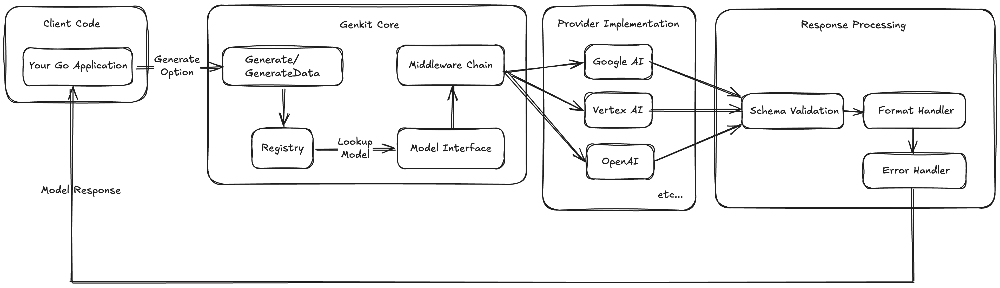
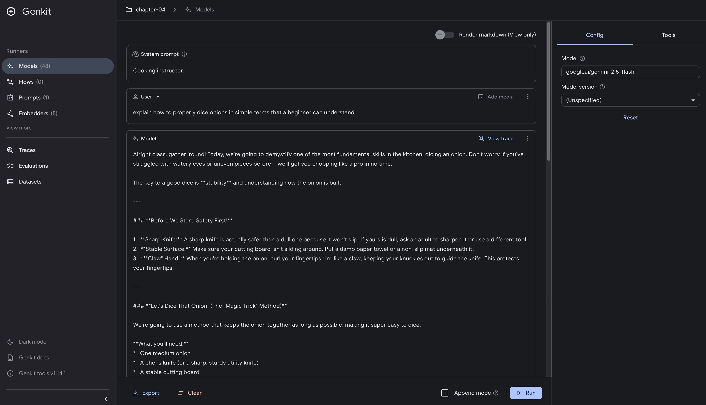
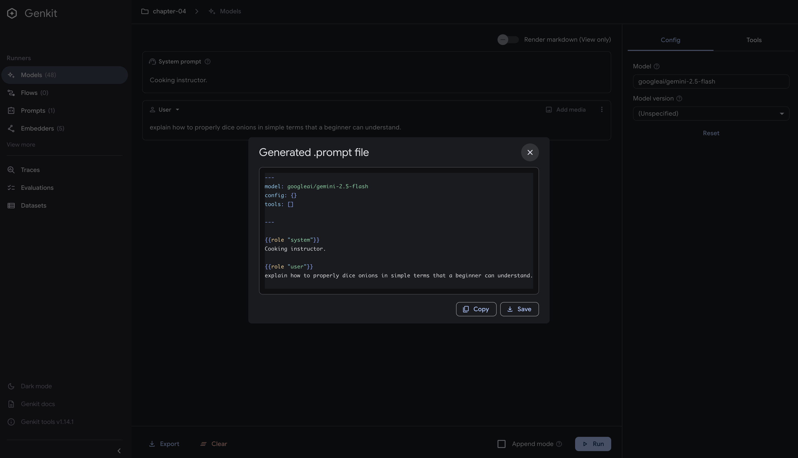

# Mastering AI Generation

## Introduction

At the heart of every AI application lies the fundamental operation of generation - transforming prompts into meaningful responses. While this might seem straightforward, the reality is far more nuanced. Generation in Genkit Go isn't just about calling an API; it's about understanding the intricate dance between type safety, error handling, schema validation, and the non-deterministic nature of AI responses.

This chapter delves deep into Genkit Go's generation capabilities, exploring not just how to use `Generate` and `GenerateData`, but why they're designed the way they are. You'll learn how Genkit's architecture provides both flexibility and safety, allowing you to build production-ready AI applications that handle edge cases gracefully.

## Prerequisites

Before diving into this chapter, you should have:

- Completed Chapter 3 and have a working Genkit Go development environment
- Basic understanding of Go's type system and error handling
- Familiarity with JSON schemas and data validation concepts

## The Generation Architecture

Genkit Go's generation system is elegantly designed around a few key abstractions that work together seamlessly. Understanding this architecture helps you make better decisions when building AI applications.



The architecture follows a clear flow:

### 1. Your Application Layer

Your application initiates generation requests through Genkit's high-level APIs:

```go
// genkit.go:672-674
func (g *G) Generate(ctx context.Context, opts ...ai.GenerateOption) (*ai.ModelResponse, error) {
    return ai.Generate(ctx, opts...)
}
```

These thin wrappers provide a clean interface while delegating to the core `ai.Generate()` functions.

### 2. Registry: The Central Nervous System

The Registry manages all components with thread-safe operations:

```go
// internal/registry/registry.go:44-55
type Registry struct {
    tstate  *tracing.State
    mu      sync.Mutex
    frozen  bool           // when true, no more additions
    parent  *Registry      // parent registry for hierarchical lookups
    actions map[string]any // Values follow interface core.Action
    plugins map[string]any // Values follow interface genkit.Plugin
    values  map[string]any // Values can truly be anything
    
    ActionResolver ActionResolver // Function for resolving actions dynamically
    Dotprompt      *dotprompt.Dotprompt
}
```

Key features include:

- **Thread-safe storage** for models, tools, flows, and plugins
- **Hierarchical lookups** through parent-child relationships ([see implementation](https://github.com/firebase/genkit/blob/main/go/internal/registry/registry.go#L168-L181))
- **Dynamic resolution** of models at runtime via `ActionResolver`

### 3. Model Interface Lookup

The system parses model names and retrieves implementations dynamically:

```go
// ai/generate.go:177-197
func LookupModelByName(r *registry.Registry, modelName string) (Model, error) {
    if modelName == "" {
        return nil, core.NewError(core.INVALID_ARGUMENT, "ai.LookupModelByName: model not specified")
    }

    provider, name, found := strings.Cut(modelName, "/")
    if !found {
        name = provider
        provider = ""
    }

    model := LookupModel(r, provider, name)
    if model == nil {
        if provider == "" {
            return nil, core.NewError(core.NOT_FOUND, "ai.LookupModelByName: model %q not found", name)
        }
        return nil, core.NewError(core.NOT_FOUND, "ai.LookupModelByName: model %q by provider %q not found", name, provider)
    }

    return model, nil
}
```

### 4. Middleware Chain

Genkit Go uses a middleware pattern at two levels:

**Built-in middlewares** are automatically applied when a model is registered:

```go
// ai/generate.go:153-158
mws := []ModelMiddleware{
    simulateSystemPrompt(info, nil),
    augmentWithContext(info, nil),
    validateSupport(name, info),
}
fn = core.ChainMiddleware(mws...)(fn)
```

**User middlewares** can be added at generation time via `WithMiddleware`:

```go
// ai/option.go:236-239
// WithMiddleware sets middleware to apply to the model request.
func WithMiddleware(middleware ...ModelMiddleware) CommonGenOption {
    return &commonGenOptions{Middleware: middleware}
}
```

This two-level middleware system ensures compatibility across all models while providing the extensibility mentioned in the Design Advantages.

### 5. Provider Implementations

All providers implement the common Model interface:

```go
// ai/generate.go:36-41
type Model interface {
    // Name returns the registry name of the model.
    Name() string
    // Generate applies the Model to provided request, handling tool requests and handles streaming.
    Generate(ctx context.Context, req *ModelRequest, cb ModelStreamCallback) (*ModelResponse, error)
}
```

### 6. Response Processing Pipeline

The pipeline handles various output formats and validation:

```go
// ai/generate.go:279-295
// Native constrained output is enabled only when the user has
// requested it, the model supports it, and there's a JSON schema.
outputCfg.Constrained = opts.Output.JsonSchema != nil &&
    opts.Output.Constrained && model.SupportsConstrained(len(toolDefs) > 0)

// Add schema instructions to prompt when not using native constraints.
// This is a no-op for unstructured output requests.
if !outputCfg.Constrained {
    instructions := ""
    if opts.Output.Instructions != nil {
        instructions = *opts.Output.Instructions
    } else {
        instructions = formatHandler.Instructions()
    }
    if instructions != "" {
        opts.Messages = injectInstructions(opts.Messages, instructions)
    }
}
```

Error handling wraps all errors in structured types:

```go
// ai/generate.go:322-325
if err != nil {
    logger.FromContext(ctx).Debug("model failed to generate output matching expected schema", "error", err.Error())
    return nil, core.NewError(core.INTERNAL, "model failed to generate output matching expected schema: %v", err)
}
```

### Design Advantages

This architecture provides several key benefits:

#### Provider Independence

Switch between models with a simple string change - no code refactoring needed:

```go
// Using Gemini 2.5 Flash
resp1, _ := genkit.Generate(ctx, g, 
    ai.WithModelName("googleai/gemini-2.5-flash"),
    ai.WithPrompt("Explain quantum computing"))

// Switch to GPT-4 - same code, different model
resp2, _ := genkit.Generate(ctx, g,
    ai.WithModelName("openai/gpt-4"),
    ai.WithPrompt("Explain quantum computing"))

// Or use Claude - the interface remains identical
resp3, _ := genkit.Generate(ctx, g,
    ai.WithModelName("vertexai/claude-3-5-sonnet"),
    ai.WithPrompt("Explain quantum computing"))
```

The Registry pattern ensures all models share the same interface, making migration seamless.

#### Type Safety

Go's compile-time type checking prevents runtime errors. When you use `GenerateData` with a struct, Genkit automatically generates JSON schemas and validates responses against them. This means malformed AI responses are caught before they can cause issues in your application, and you get IDE autocompletion for all generated data.

#### Extensibility Through Middleware

The middleware chain allows you to inject custom logic - authentication, logging, rate limiting, or request modification - without touching core code. Each middleware wraps the next, creating a composable pipeline that's easy to test and maintain. You can add observability, implement caching, or transform requests, all while keeping concerns separated.

#### Error Resilience

Structured errors with standardized status codes (INVALID_ARGUMENT, NOT_FOUND, RESOURCE_EXHAUSTED, INTERNAL) enable precise error handling. Instead of parsing error strings, you can programmatically respond to specific failure modes: retry on rate limits, fallback on model unavailability, or alert on internal errors. This approach makes production systems more reliable and easier to monitor.

The elegance lies in how these components compose - each has a single responsibility, communicating through well-defined interfaces. This design makes Genkit Go applications maintainable, testable, and production-ready.

### Generate vs GenerateData: Choosing the Right Tool

Genkit Go provides two primary generation functions, each optimized for different use cases.

#### Generate: Plain Text Responses

Use `Generate` when you need simple text output:

```go
resp, err := genkit.Generate(ctx, g,
    ai.WithPrompt("Suggest healthy breakfast recipes using Japanese ingredients"),
    ai.WithModelName("googleai/gemini-2.5-flash"))

// Access the response
fmt.Println(resp.Text())
// Output: "Here are some healthy Japanese breakfast ideas: 1. Ochazuke..."

// Check token usage
if resp.Usage != nil {
    log.Printf("Tokens used: %d", resp.Usage.TotalTokens)
}
```

Choose `Generate` when:

- You want free-form text responses (recipes, cooking tips, menu suggestions)
- The output format varies based on the query
- You need to process the raw response yourself

#### GenerateData: Type-Safe Structured Output

Use `GenerateData` when you need structured data:

```go
type Recipe struct {
    Name        string   `json:"name"`
    PrepTime    int      `json:"prep_time_minutes"`
    Ingredients []string `json:"ingredients"`
    Steps       []string `json:"steps"`
    Nutrition   struct {
        Calories int `json:"calories"`
        Protein  int `json:"protein_grams"`
    } `json:"nutrition"`
}

// Generate with automatic schema validation
recipe, _, err := genkit.GenerateData[Recipe](ctx, g,
    ai.WithPrompt("Create a healthy breakfast recipe under 300 calories"))

// Use the typed result directly
fmt.Printf("%s (Prep: %d min, Calories: %d)\n", 
    recipe.Name, recipe.PrepTime, recipe.Nutrition.Calories)
```

Choose `GenerateData` when:

- You need consistent output structure (recipes, ingredient lists, nutritional data)
- Your application expects specific fields to be present
- You want compile-time type safety and IDE autocomplete

## Error Handling: Building Resilient AI Applications

AI introduces unique challenges that Genkit Go helps you handle systematically. Unlike traditional APIs, AI services can fail in unpredictable ways - from rate limits to model unavailability to unexpected output formats. Genkit provides structured error types:

| Status | When It Occurs | Recovery Strategy |
|--------|---------------|-------------------|
| `INVALID_ARGUMENT` | Bad prompt format, invalid parameters | Validate input, provide user guidance |
| `NOT_FOUND` | Model or resource doesn't exist | Use fallback model or default behavior |
| `RESOURCE_EXHAUSTED` | Rate limits, quota exceeded | Implement exponential backoff |
| `DEADLINE_EXCEEDED` | Request timeout | Retry with simpler prompt or smaller model |
| `PERMISSION_DENIED` | API key issues, access denied | Check credentials, alert user |
| `INTERNAL` | Server-side errors | Alert operations, fail gracefully |
| `UNAVAILABLE` | Service temporarily down | Circuit breaker pattern |

Here's how to handle these errors in practice:

```go
resp, err := genkit.Generate(ctx, g, ai.WithPrompt(prompt))
if err != nil {
    var coreErr *core.GenkitError
    if errors.As(err, &coreErr) {
        switch coreErr.Status {
        case core.INVALID_ARGUMENT:
            // Bad input - ask user to clarify
        case core.NOT_FOUND:
            // Model not found - use fallback
        case core.RESOURCE_EXHAUSTED:
            // Rate limited - retry with backoff
        case core.DEADLINE_EXCEEDED:
            // Timeout - try simpler approach
        case core.UNAVAILABLE, core.INTERNAL:
            // Service issues - alert and fail
        default:
            // Unknown error
        }
    }
}
```

This structured approach transforms unpredictable AI failures into manageable scenarios, enabling your application to degrade gracefully rather than crash unexpectedly.

## Dotprompt: Professional Prompt Management

As your AI application grows, managing prompts in code becomes unwieldy. Dotprompt brings software engineering best practices to prompt management, treating prompts as code that can be versioned, tested, and optimized independently from your application logic. <https://github.com/google/dotprompt>

### Core Concepts

Dotprompt is built on the premise that **prompts are code**. It provides:

- **File-based organization** with `.prompt` files
- **YAML frontmatter** for configuration
- **Handlebars templating** for dynamic content
- **Schema validation** for inputs and outputs

### Getting Started

Create a simple prompt file:

```yaml
# prompts/recipe_generator.prompt
---
model: googleai/gemini-2.5-flash
input:
  schema:
    cuisine: string
    servings: integer
output:
  schema:
    name: string
    ingredients(array): string
    steps(array): string
---

Generate a {{cuisine}} recipe for {{servings}} people.
```

Use it in your code:

```go
// Initialize with prompt directory
g, err := genkit.Init(ctx, 
    genkit.WithPromptDir("prompts"),
    genkit.WithPlugins(&googlegenai.GoogleAI{}))

// Load and execute
recipePrompt := genkit.LookupPrompt(g, "recipe_generator")
resp, err := recipePrompt.Execute(ctx,
    ai.WithInput(map[string]any{
        "cuisine": "Italian", 
        "servings": 4,
    }))
```

### Advanced Features

#### Multi-Message Prompts

Use `{{role}}` for conversations:

```yaml
---
model: googleai/gemini-2.5-flash
input:
  schema:
    topic: string
---
{{role "system"}}
You are a helpful cooking instructor.

{{role "user"}}
Explain {{topic}} in simple terms.
```

#### Multi-Modal Support

Handle images with `{{media}}`:

```yaml
---
model: googleai/gemini-2.5-flash
input:
  schema:
    imageUrl: string
---
{{role "user"}}
What dish is shown in this image?
{{media url=imageUrl}}
```

#### Partials for Reusability

Create reusable components:

```yaml
# prompts/_base_personality.prompt
You are a helpful assistant specialized in {{domain}}.
Always be concise and accurate.
```

Use in other prompts:

```yaml
---
model: googleai/gemini-2.5-flash
---
{{role "system"}}
{{>base_personality domain="cooking"}}

{{role "user"}}
{{question}}
```

#### Custom Helpers

Register helpers for custom logic:

```go
genkit.DefineHelper(g, "shout", func(input string) string {
    return strings.ToUpper(input)
})
```

Use in prompts:

```yaml
---
model: googleai/gemini-2.5-flash
input:
  schema:
    name: string
---

HELLO, {{shout name}}!!!
```

#### Prompt Variants

Test different versions:

```text
prompts/
├── analyzer.prompt          # Baseline
├── analyzer.detailed.prompt # Variant A
└── analyzer.concise.prompt  # Variant B
```

Load dynamically:

```go
variant := "detailed" // from A/B test
prompt := genkit.LookupPrompt(g, "analyzer." + variant)
```

> **Note**: For production A/B testing, you can integrate with [Firebase Remote Config](https://firebase.google.com/docs/remote-config) or [Firestore](https://firebase.google.com/docs/firestore) to dynamically control variant selection and enable gradual rollouts.

### Developer UI Integration



The Developer UI provides a visual interface for experimenting with prompts before committing them to code. To use it effectively, your application needs to stay running:

```go
func main() {
    ctx := context.Background()

    // Initialize Genkit with prompt directory
    _, err := genkit.Init(ctx,
        genkit.WithPlugins(&googlegenai.GoogleAI{}),
        genkit.WithPromptDir("prompts"),
    )
    if err != nil {
        log.Fatalf("could not initialize Genkit: %v", err)
    }

    // Block execution to keep the app running for Developer UI
    // This allows genkit start to connect to your application
    // Even without flows, the Developer UI needs the app running to test prompts
    select {}
}
```

Then start the Developer UI:

```bash
genkit start -- go run .
```

The `select {}` statement blocks the main goroutine indefinitely, keeping your application running so the Developer UI can interact with it. Navigate to <http://localhost:4000> to access the interface where you can:

- Test prompts with different models and configurations
- Experiment with temperature, token limits, and other parameters
- Export successful prompts as `.prompt` files to your project
- View traces and debug generation requests



### Best Practices

1. **Version Control**: Track prompt changes in Git
2. **Testing**: Write tests for critical prompts
3. **Modularity**: Use partials for shared components
4. **Documentation**: Comment complex schemas
5. **Validation**: Test edge cases with your schemas

## Beyond Simple Generation

The architecture we've explored reveals how Genkit Go approaches AI generation as a comprehensive software engineering challenge. By exposing the internal workings - from the Registry pattern to middleware chains - the framework enables developers to build sophisticated AI applications with the same rigor as traditional software.

The progression from `Generate` to `GenerateData` to Dotprompt represents increasing levels of control and abstraction. Each layer addresses specific production needs: type safety for reliable data extraction, error handling for resilience, and prompt management for maintainability. This isn't accidental - it reflects deep understanding of what teams need when moving AI from prototype to production.

Dotprompt's design particularly stands out for recognizing that prompts are living artifacts that evolve with your application. By providing version control, A/B testing capabilities, and modular composition through partials, it transforms prompt engineering from an ad-hoc process into a disciplined practice. The framework treats prompts with the same respect as database migrations or API schemas - critical components that deserve proper tooling and processes.

## Key Takeaways

- **Architecture matters**: Understanding Genkit's Registry pattern and middleware chain helps you build better AI applications
- **Choose the right tool**: Use `Generate` for flexible text output; use `GenerateData` for type-safe structured data
- **Handle errors systematically**: Genkit's structured error types enable precise handling of different failure modes
- **Dotprompt brings engineering discipline**: Treat prompts as code with version control, testing, and modular composition
- **Provider independence**: Switch between models with a simple string change, no code refactoring needed

## Next Steps

In Chapter 5, we'll build on these generation fundamentals to explore structured output in depth. You'll learn how to handle complex nested structures, implement sophisticated validation strategies, and optimize performance for production workloads. The patterns you've learned here - from error handling to schema validation - will form the foundation for building reliable, type-safe AI applications.
