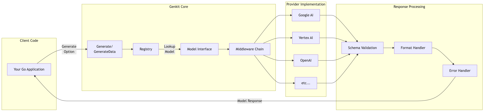
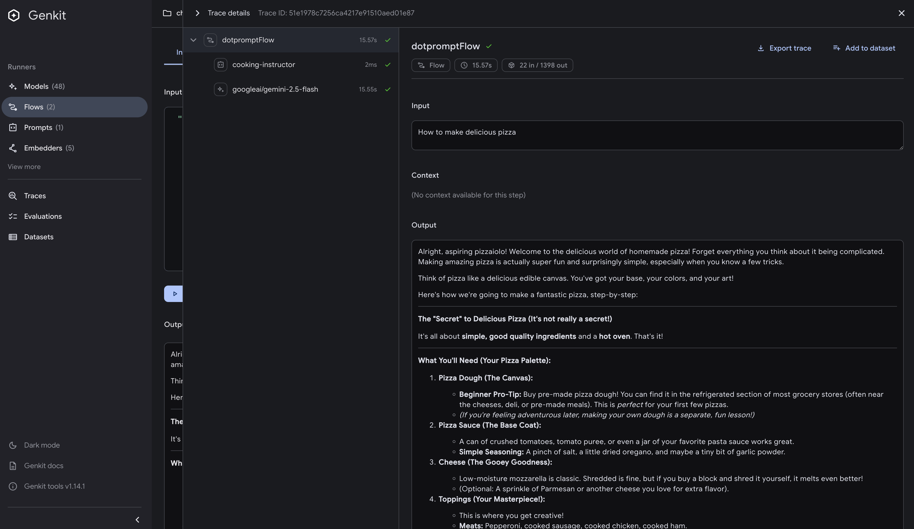
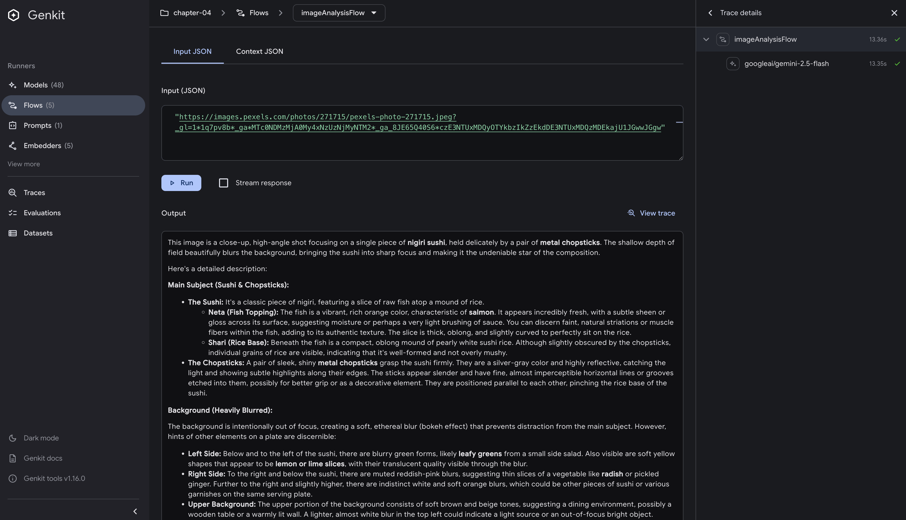
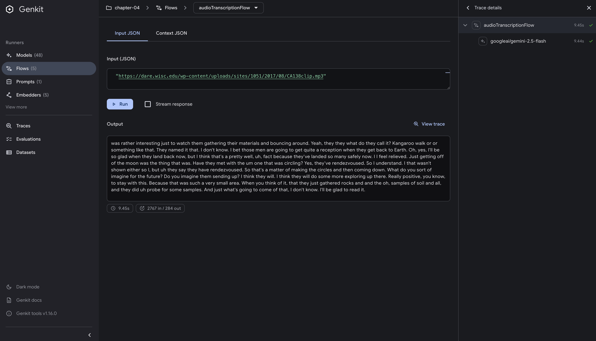
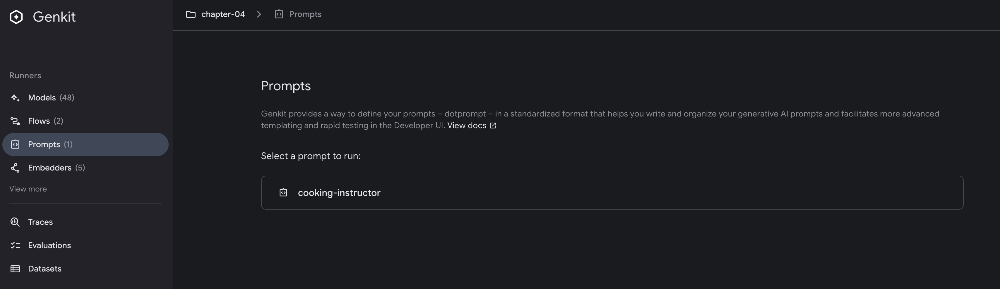
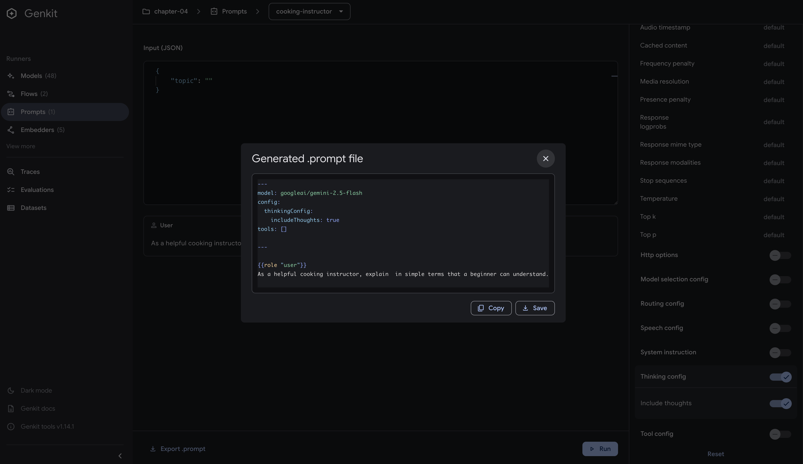

# Mastering AI Generation

## Introduction

At the heart of every AI application lies the fundamental operation of generation - transforming prompts into meaningful responses. While this might seem straightforward, the reality is far more nuanced. Generation in Genkit Go isn't just about calling an API; it's about understanding the intricate dance between type safety, error handling, schema validation, and the non-deterministic nature of AI responses.

This chapter delves deep into Genkit Go's generation capabilities, exploring not just how to use the `Generate` function, but why it's designed the way it is. You'll learn how Genkit's architecture provides flexibility through provider independence, middleware patterns, and professional prompt management with Dotprompt, allowing you to build production-ready AI applications that handle edge cases gracefully.

## Prerequisites

Before diving into this chapter, you should have:

- Completed Chapter 3 and have a working Genkit Go development environment
- Basic understanding of Go's type system and error handling
- Familiarity with JSON schemas and data validation concepts

## Understanding Genkit's Generation System

Genkit Go provides a powerful generation system that balances simplicity with flexibility. Let's explore how this system helps you build better AI applications.



### The Core Concepts

At its heart, Genkit's generation system revolves around three key principles:

1. **Unified Interface**: All AI models - whether from Google, OpenAI, Anthropic, or custom implementations - share the same interface
2. **Type Safety**: Leverage Go's type system for compile-time guarantees and better developer experience
3. **Composability**: Build complex functionality from simple, well-defined components

### How Models Work in Genkit

When you use Genkit, models are identified by their unique names. While many follow a provider/name pattern, the exact format can vary by provider:

```go
"googleai/gemini-2.5-flash"
"openai/gpt-4o"
"vertexai/claude-3-5-sonnet"
"anthropic.claude-3-haiku-20240307-v1:0"
```

Despite the varying formats, this naming system provides several benefits:

- **Clear Organization**: Know immediately which provider powers each model
- **Easy Switching**: Change models by updating a string - no code changes needed
- **Dynamic Loading**: Models can be resolved at runtime, enabling flexible configurations
- **Ecosystem Flexibility**: Beyond official plugins, the Genkit ecosystem includes community contributions like the [AWS Bedrock plugin](https://github.com/xavidop/genkit-aws-bedrock-go), expanding your deployment options

### The Power of Provider Independence

One of Genkit's greatest strengths is provider independence. While each provider requires its own plugin and configuration, the core generation interface remains consistent:

```go
// Using Gemini
resp1, _ := genkit.Generate(ctx, g, 
    ai.WithModelName("googleai/gemini-2.5-flash"),
    ai.WithPrompt("Explain quantum computing"))

// Switch to GPT-4 - same generation interface
resp2, _ := genkit.Generate(ctx, g,
    ai.WithModelName("openai/gpt-4"),
    ai.WithPrompt("Explain quantum computing"))

// Use Claude via Vertex AI
resp3, _ := genkit.Generate(ctx, g,
    ai.WithModelName("vertexai/claude-3-5-sonnet"),
    ai.WithPrompt("Explain quantum computing"))

// Or use Claude via AWS Bedrock with a community plugin
// The Genkit ecosystem extends beyond official providers
resp4, _ := genkit.Generate(ctx, g,
    ai.WithModel(
        bedrockPlugin.DefineModel(g, bedrock.ModelDefinition{
            Name: "anthropic.claude-3-haiku-20240307-v1:0",
            Type: "text",
        }, nil)
    ),
    ai.WithPrompt("Explain quantum computing"))
```

This design enables you to:

- **A/B Test Models**: Compare different models' performance without rewriting code
- **Fallback Strategies**: If one provider fails, seamlessly switch to another
- **Cost Optimization**: Use expensive models only when needed, cheaper ones for routine tasks

### Working with Generate

Genkit's `Generate` function provides flexible text generation:

```go
resp, err := genkit.Generate(ctx, g,
    ai.WithPrompt("Explain quantum computing"),
    ai.WithModelName("googleai/gemini-2.5-flash"))

// Access the text response
fmt.Println(resp.Text())

// Check token usage
if resp.Usage != nil {
    log.Printf("Tokens used: %d", resp.Usage.TotalTokens)
}
```

The `Generate` function returns a `ModelResponse` with full metadata access, including token usage, finish reasons, and model information.

> For type-safe structured output generation, see Chapter 5: Working with Structured Data, which covers `GenerateData` and complex schema patterns.

### Middleware: Extending Without Modifying

Genkit's middleware system lets you add functionality without changing core code:

```go
// Define logging middleware
loggingMiddleware := func(fn ai.ModelFunc) ai.ModelFunc {
    return func(ctx context.Context, req *ai.ModelRequest, cb ai.ModelStreamCallback) (*ai.ModelResponse, error) {
        start := time.Now()
        resp, err := fn(ctx, req, cb)
        if err != nil {
            log.Printf("Error after %v", time.Since(start))
            return nil, err
        }
        log.Printf("Success in %v", time.Since(start))
        return resp, nil
    }
}

// Use middleware in your generation
resp, err := genkit.Generate(ctx, g,
    ai.WithPrompt("Explain how to make perfect rice"),
    ai.WithMiddleware(loggingMiddleware))
```

```bash
# Example of operation
2025/08/03 13:25:37 Success in 15.355457625s
```

Common middleware use cases:

- **Observability**: Log requests, responses, and performance metrics
- **Security**: Add authentication or filter sensitive data
- **Resilience**: Implement retry logic or circuit breakers
- **Cost Control**: Track token usage and enforce limits

## Multimedia Generation

Until now, we've been working exclusively with text - prompts go in, text comes out. But modern AI models can process and generate various types of media, enabling new types of applications.

### Beyond Text: Working with Different Media Types

Traditional LLMs handle text, but today's models work with multimedia:

**What we've covered so far:**

- Text → Text (traditional prompt-response generation)

**What multimedia generation enables:**

- **Image → Text**: Analyze photos, diagrams, and visual content
- **Audio → Text**: Transcribe speech and analyze sound
- **Video → Text**: Process video content and extract information
- **Text → Image**: Generate visuals from descriptions

This allows AI to work with different media types beyond just text.

### Why Multimedia Matters

Working with multimedia unlocks practical applications that weren't possible with text alone:

- **Visual Understanding**: Analyze product images, medical scans, or design mockups directly
- **Audio Intelligence**: Transcribe meetings, analyze customer calls, or process podcasts
- **Content Creation**: Generate logos, illustrations, or marketing visuals on demand
- **Document Processing**: Extract data from PDFs, invoices, or handwritten notes

### Working with Multimedia in Genkit Go

To demonstrate multimedia capabilities, we'll use two powerful Google models:

#### Gemini 2.5 Flash - Multimedia Input Processing

According to the official documentation, Gemini 2.5 Flash can process: <https://cloud.google.com/vertex-ai/generative-ai/docs/models/gemini/2-5-flash>

- **Images**: Up to 3000 images in a single request
- **Audio**: Up to 8.4 hours of audio content
- **Video**: Approximately 45 minutes

#### Imagen 3 - Text-to-Image Generation

Imagen 3 is Google's image generation model: <https://ai.google.dev/gemini-api/docs/imagen#imagen-3>

- **Input**: Text
- **Output**: High-quality images in various aspect ratios
- **Strengths**: Photorealistic quality, accurate text rendering, fewer artifacts
- **Use cases**: Product design, marketing materials, creative content

Let's explore how to leverage these multimedia capabilities in your Genkit applications.

### From Text-Only to Multimedia Processing

Compare the familiar text-only approach with multimedia:

```go
// What we've been doing: Text → Text
resp, err := genkit.Generate(ctx, g,
    ai.WithPrompt("Describe a red backpack"),
    ai.WithModelName("googleai/gemini-2.5-flash"))
// AI imagines what a red backpack might look like

// What multimedia enables: Image → Text  
resp, err := genkit.Generate(ctx, g,
    ai.WithModelName("googleai/gemini-2.5-flash"),
    ai.WithMessages(
        ai.NewUserMessage(
            ai.NewTextPart("What's in this image?"),
            ai.NewMediaPart("", "https://example.com/actual-backpack.jpg"),
        ),
    ))
// AI sees and describes the actual backpack
```

The difference is that instead of the AI imagining based on text, it analyzes the actual content.

### Image Understanding with Gemini

Process images using `WithMessages` and `NewMediaPart`:

```go
// Analyze a product image
resp, err := genkit.Generate(ctx, g,
    ai.WithModelName("googleai/gemini-2.5-flash"),
    ai.WithMessages(
        ai.NewUserMessage(
            ai.NewTextPart("Describe this product in detail"),
            ai.NewMediaPart("", "https://example.com/product.jpg"),
        ),
    ))

fmt.Println(resp.Text())
// Output: "This is a professional DSLR camera with a black body and 
//          silver accents. It features a large lens with focal length 
//          markings, multiple control dials, and appears to be a 
//          full-frame model suitable for professional photography..."
```

You can also ask specific questions about images:

```go
// Visual Q&A
resp, err := genkit.Generate(ctx, g,
    ai.WithModelName("googleai/gemini-2.5-flash"),
    ai.WithMessages(
        ai.NewUserMessage(
            ai.NewTextPart("Is this food vegetarian? List any meat products you see."),
            ai.NewMediaPart("", "https://example.com/meal.jpg"),
        ),
    ))
```

### Audio Processing with Gemini

Gemini can also process audio files for transcription and analysis:

```go
// Transcribe audio
resp, err := genkit.Generate(ctx, g,
    ai.WithModelName("googleai/gemini-2.5-flash"),
    ai.WithMessages(
        ai.NewUserMessage(
            ai.NewTextPart("Transcribe this audio"),
            ai.NewMediaPart("", "https://example.com/podcast-clip.mp3"),
        ),
    ))

fmt.Println(resp.Text())
// Output: "Host: Welcome to today's episode. Today we're discussing 
//          the impact of artificial intelligence on creative industries.
//          Guest: Thanks for having me. I think it's important to 
//          understand that AI is a tool that augments creativity..."
```

Beyond simple transcription, you can analyze audio content:

```go
// Audio analysis
resp, err := genkit.Generate(ctx, g,
    ai.WithModelName("googleai/gemini-2.5-flash"),
    ai.WithMessages(
        ai.NewUserMessage(
            ai.NewTextPart("Identify the speakers and summarize the main points discussed"),
            ai.NewMediaPart("", "https://example.com/meeting.mp3"),
        ),
    ))
```

### Image Generation with Imagen 3

Generate images from text descriptions using Google's Imagen 3:

```go
// Generate an image
resp, err := genkit.Generate(ctx, g,
    ai.WithModelName("googleai/imagen-3.0-generate-002"),
    ai.WithPrompt("A minimalist logo for a coffee shop called 'Morning Brew', incorporating a coffee cup and sunrise elements, modern flat design style"),
    ai.WithConfig(&genai.GenerateImagesConfig{
        NumberOfImages:    1,
        AspectRatio:       "1:1",
        SafetyFilterLevel: genai.SafetyFilterLevelBlockLowAndAbove,
        PersonGeneration:  genai.PersonGenerationAllowAll,
        OutputMIMEType:    "image/png",
    }))

// The image is returned as a base64-encoded data URI in the response
for _, part := range resp.Message.Content {
    if part.IsMedia() {
        imageData := part.Text // Contains data:image/png;base64,...
        // You can use this directly in HTML or decode for file storage
        fmt.Printf("Generated image (data URI): %s...
", imageData[:50])
        break
    }
}
```

Key configuration options:

| Option | Description | Values |
|--------|------------|--------|
| `AspectRatio` | Image dimensions | `"1:1"`, `"3:4"`, `"4:3"`, `"9:16"`, `"16:9"` |
| `NumberOfImages` | Variations to generate | 1-8 (default: 4) |
| `NegativePrompt` | What to avoid | e.g., `"blurry, low quality"` |
| `PersonGeneration` | Allow people in images | `AllowAll`, `AllowAdult`, `DontAllow` |
| `SafetyFilterLevel` | Content filtering | `BlockLowAndAbove`, `BlockMediumAndAbove`, `BlockOnlyHigh` |
| `OutputMIMEType` | Output format | `"image/png"`, `"image/jpeg"` |

### Combining Modalities in Workflows

You can chain multimedia operations:

```go
// Example: Image analysis followed by creative expansion
func analyzeAndExpand(ctx context.Context, g *genkit.Generator, imageURL string) (string, error) {
    // Step 1: Analyze the original image
    analysis, err := genkit.Generate(ctx, g,
        ai.WithModelName("googleai/gemini-2.5-flash"),
        ai.WithMessages(
            ai.NewUserMessage(
                ai.NewTextPart("Describe this image's style, colors, and mood"),
                ai.NewMediaPart("", imageURL),
            ),
        ))
    if err != nil {
        return "", err
    }

    // Step 2: Generate a creative variation
    variation, err := genkit.Generate(ctx, g,
        ai.WithModelName("googleai/imagen-3"),
        ai.WithPrompt(fmt.Sprintf(
            "Create an artistic interpretation: %s, but in a surrealist style",
            analysis.Text(),
        )),
        ai.WithConfig(map[string]interface{}{
            "output": "media",
        }))
    if err != nil {
        return "", err
    }

    return variation.Media(), nil
}
```

### Moving Beyond Simple I/O

While this section demonstrates basic multimedia processing, real applications often need more:

- **Structured extraction from images**: Product details, receipt data, form information
- **Structured audio analysis**: Meeting minutes with action items, speaker identification
- **Generated images with metadata**: Creation parameters, style attributes, variations

These advanced patterns - combining multimedia inputs with structured outputs - are covered extensively in Chapter 5, where you'll learn to build production-ready applications that extract structured, type-safe data from various media types.

## Error Handling: Building Resilient AI Applications

AI services can fail in various ways - from rate limits to model unavailability to unexpected output formats. Genkit provides structured error types to handle these scenarios:

| Status | When It Occurs | Recovery Strategy |
|--------|---------------|-------------------|
| `INVALID_ARGUMENT` | Bad prompt format, invalid parameters | Validate input, provide user guidance |
| `NOT_FOUND` | Model or resource doesn't exist | Use fallback model or default behavior |
| `RESOURCE_EXHAUSTED` | Rate limits, quota exceeded | Implement exponential backoff |
| `DEADLINE_EXCEEDED` | Request timeout | Retry with simpler prompt or smaller model |
| `PERMISSION_DENIED` | API key issues, access denied | Check credentials, alert user |
| `INTERNAL` | Server-side errors | Alert operations, fail gracefully |
| `UNAVAILABLE` | Service temporarily down | Circuit breaker pattern |

Here's how to handle these errors in practice:

```go
resp, err := genkit.Generate(ctx, g, ai.WithPrompt(prompt))
if err != nil {
    var coreErr *core.GenkitError
    if errors.As(err, &coreErr) {
        switch coreErr.Status {
        case core.INVALID_ARGUMENT:
            // Bad input - ask user to clarify
        case core.NOT_FOUND:
            // Model not found - use fallback
        case core.RESOURCE_EXHAUSTED:
            // Rate limited - retry with backoff
        case core.DEADLINE_EXCEEDED:
            // Timeout - try simpler approach
        case core.UNAVAILABLE, core.INTERNAL:
            // Service issues - alert and fail
        default:
            // Unknown error
        }
    }
}
```

This structured approach helps manage AI failures, allowing your application to handle errors appropriately.

## Dotprompt: Professional Prompt Management

As your AI application grows, managing prompts in code becomes unwieldy. Dotprompt brings software engineering best practices to prompt management, treating prompts as code that can be versioned, tested, and optimized independently from your application logic. <https://github.com/google/dotprompt>

### Core Concepts

Dotprompt is built on the premise that **prompts are code**. It provides:

- **File-based organization** with `.prompt` files
- **YAML frontmatter** for configuration
- **Handlebars templating** for dynamic content
- **Schema validation** for inputs and outputs

### Getting Started

Create a simple prompt file:

```yaml
# prompts/recipe_generator.prompt
---
model: googleai/gemini-2.5-flash
input:
  schema:
    cuisine: string
    servings: integer
output:
  schema:
    name: string
    ingredients(array): string
    steps(array): string
---

Generate a {{cuisine}} recipe for {{servings}} people.
```

Use it in your code:

```go
// Initialize with prompt directory
g, err := genkit.Init(ctx, 
    genkit.WithPromptDir("prompts"),
    genkit.WithPlugins(&googlegenai.GoogleAI{}))

// Load and execute
recipePrompt := genkit.LookupPrompt(g, "recipe_generator")
resp, err := recipePrompt.Execute(ctx,
    ai.WithInput(map[string]any{
        "cuisine": "Italian", 
        "servings": 4,
    }))
```

### Advanced Features

#### Multi-Message Prompts

Use `{{role}}` for conversations:

```yaml
---
model: googleai/gemini-2.5-flash
input:
  schema:
    topic: string
---
{{role "system"}}
You are a helpful cooking instructor.

{{role "user"}}
Explain {{topic}} in simple terms.
```

#### Multi-Modal Support

Handle images with `{{media}}`:

```yaml
---
model: googleai/gemini-2.5-flash
input:
  schema:
    imageUrl: string
---
{{role "user"}}
What dish is shown in this image?
{{media url=imageUrl}}
```

#### Partials for Reusability

Create reusable components:

```yaml
# prompts/_base_personality.prompt
You are a helpful assistant specialized in {{domain}}.
Always be concise and accurate.
```

Use in other prompts:

```yaml
---
model: googleai/gemini-2.5-flash
---
{{role "system"}}
{{>base_personality domain="cooking"}}

{{role "user"}}
{{question}}
```

#### Custom Helpers

Register helpers for custom logic:

```go
genkit.DefineHelper(g, "shout", func(input string) string {
    return strings.ToUpper(input)
})
```

Use in prompts:

```yaml
---
model: googleai/gemini-2.5-flash
input:
  schema:
    name: string
---

HELLO, {{shout name}}!!!
```

#### Prompt Variants

Test different versions:

```text
prompts/
├── analyzer.prompt          # Baseline
├── analyzer.detailed.prompt # Variant A
└── analyzer.concise.prompt  # Variant B
```

Load dynamically:

```go
variant := "detailed" // from A/B test
prompt := genkit.LookupPrompt(g, "analyzer." + variant)
```

> **Note**: For production A/B testing, you can integrate with [Firebase Remote Config](https://firebase.google.com/docs/remote-config) or [Firestore](https://firebase.google.com/docs/firestore) to dynamically control variant selection and enable gradual rollouts.

## Running the Example

To run the Chapter 4 example and explore generation patterns:

### 1. Set up environment

```bash
export GEMINI_API_KEY="your-api-key"
```

### 2. Run the application

```bash
cd src/examples/chapter-04
go run main.go
```

### 3. Test with curl

Test basic generation:

```bash
curl -X POST http://localhost:9090/basicGenerationFlow \
  -H "Content-Type: application/json" \
  -d '{"data": "how to cook perfect rice"}'
```

Example response (abbreviated):

```json

{
  "result": "Hello there, aspiring chef! Today, we're going to master the art of perfect rice...\n\n### How to Cook Perfect Fluffy White Rice (Stovetop Method)\n\n#### What You'll Need:\n- **Rice:** 1 cup\n- **Water:** 2 cups (magic ratio: 1:2)\n- **Salt:** 1/2 teaspoon\n\n#### Simple Steps:\n1. **Rinse the rice** until water runs clear\n2. **Combine** rice, water, and salt in a pot\n3. **Bring to a boil** on medium-high heat\n4. **Reduce heat & cover** - simmer for 18 minutes (DO NOT LIFT THE LID!)\n5. **Rest** for 10 minutes off heat\n6. **Fluff with a fork** and serve!\n\n[Full response truncated for brevity...]"
}
```

Test Dotprompt flow:

```bash
curl -X POST http://localhost:9090/dotpromptFlow \
  -H "Content-Type: application/json" \
  -d '{"data": "making pasta from scratch"}'
```

Example response (abbreviated):

```json

{
  "result": "Alright, my aspiring chefs! Ready to unlock a super satisfying kitchen secret?...\n\n### Basic Recipe (2 servings):\n- **1 cup all-purpose flour**\n- **1 large egg**\n- **Pinch of salt**\n\n### Quick Steps:\n1. **Make a flour volcano** with a well in the center\n2. **Add egg** to the well and whisk\n3. **Knead** for 8-10 minutes until smooth\n4. **Rest** wrapped for 30 minutes\n5. **Roll thin** (you should almost see through it!)\n6. **Cut** into your desired shape\n7. **Cook** in boiling salted water for 2-4 minutes\n\n[Full response truncated for brevity...]"
}
```

Notice in the server logs how the middleware tracks execution time:

```bash
2025/08/03 15:30:42 Success in 15.418887708s
2025/08/03 15:32:42 Success in 24.84293225s
```

This demonstrates that our logging middleware is successfully intercepting each request, timing the generation process, and logging the results.

### 4. Test with Developer UI

Start the application with the Developer UI:

```bash
genkit start -- go run .
```

Navigate to <http://localhost:4000/flows> and you'll see the Flows section:


#### Testing Generation Patterns

The Developer UI allows you to:

1. **Test different flows** - Compare outputs between all five flows:
   - `basicGenerationFlow` - Standard text generation
   - `dotpromptFlow` - Template-based generation
   - `imageAnalysisFlow` - Image analysis from URLs
   - `audioTranscriptionFlow` - Audio transcription from URLs
   - `imageGenerationFlow` - Text-to-image generation
2. **Experiment with parameters** - Adjust temperature, max tokens, and other settings
3. **View token usage** - Understand the cost implications of your prompts



#### Testing Multimedia Flows

The Developer UI makes it easy to test multimedia flows:

1. **Image Analysis**: Enter an image URL to get AI-generated descriptions
2. **Audio Transcription**: Provide audio file URLs for automatic transcription
3. **Image Generation**: Type text descriptions to generate images

For example, testing the **imageAnalysisFlow**:

- Input: `"https://example.com/food-photo.jpg"`
- Output: Detailed description of the dish, ingredients, and presentation



Testing the **audioTranscriptionFlow`**:

- Input: `"https://example.com/podcast-clip.mp3"`
- Output: Full transcription of the audio content



The **imageGenerationFlow** uses Google's Imagen 3 model to generate images from text descriptions. The flow returns base64-encoded image data that the Developer UI automatically renders.

Testing the flow:

- Input: `"Genkit development engineer"`
- Output: Visual preview of the generated image


#### Working with Dotprompt Files

The UI automatically discovers all `.prompt` files in your configured directory.  
Navigate to <http://localhost:4000/prompts> and you'll see the Prompts section:



1. **Live editing** - Modify prompts and see results immediately
2. **Schema validation** - The UI validates your input against defined schemas
3. **Export successful configurations** - Once you find the perfect prompt settings, export them directly



### 5. Test with Genkit CLI

> The Genkit CLI requires your application to be running. Make sure you have started the server with `genkit start -- go run .` in a separate terminal before running these commands.

```bash
# Basic generation flow
genkit flow:run basicGenerationFlow '"how to make sushi"'

# Dotprompt flow
genkit flow:run dotpromptFlow '"fermentation techniques"'
```

## Beyond Simple Generation

This chapter covered the practical aspects of AI generation with Genkit Go, from basic text generation to multimedia processing and Dotprompt management.

The middleware pattern demonstrated with our logging example shows how to add cross-cutting concerns without modifying core logic. The same pattern works for authentication, authorization, rate limiting, cost tracking, and retry logic. Provider switching is straightforward, allowing you to change models based on your requirements.

The Developer UI provides a visual workflow for prompt development with observability. You can test prompt variations locally, track metrics, export configurations, and maintain consistency across your team.

## Key Takeaways

- The `Generate` function provides flexible text generation with full response metadata
- Middleware enables cross-cutting concerns like logging, auth, and monitoring
- Provider switching is as simple as changing a model name string
- Dotprompt brings engineering discipline to prompt management

## What's Next

This chapter introduced the fundamentals of AI generation with Genkit Go, focusing on text generation, provider independence, middleware patterns, and professional prompt management with Dotprompt. In the next chapter, we'll explore structured output in depth with `GenerateData`, covering type-safe generation, complex schemas, validation strategies, and techniques for reliable data extraction. You'll build on the patterns learned here to create more sophisticated AI applications that can handle real-world complexity with structured, type-safe outputs.
