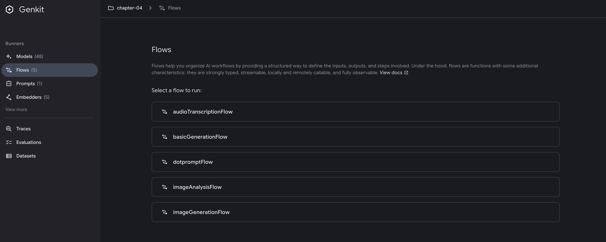

# Mastering AI Generation

## Introduction

At the heart of every AI application lies the fundamental operation of generation - transforming prompts into meaningful responses. While this might seem straightforward, the reality is far more nuanced. Generation in Genkit Go isn't just about calling an API; it's about understanding the intricate dance between type safety, error handling, schema validation, and the non-deterministic nature of AI responses.

This chapter delves deep into Genkit Go's generation capabilities, exploring not just how to use `Generate` and `GenerateData`, but why they're designed the way they are. You'll learn how Genkit's architecture provides both flexibility and safety, allowing you to build production-ready AI applications that handle edge cases gracefully.

## Prerequisites

Before diving into this chapter, you should have:

- Completed Chapter 3 and have a working Genkit Go development environment
- Basic understanding of Go's type system and error handling
- Familiarity with JSON schemas and data validation concepts

## Understanding Genkit's Generation System

Genkit Go provides a powerful generation system that balances simplicity with flexibility. Let's explore how this system helps you build better AI applications.


### The Core Concepts

At its heart, Genkit's generation system revolves around three key principles:

1. **Unified Interface**: All AI models - whether from Google, OpenAI, Anthropic, or custom implementations - share the same interface
2. **Type Safety**: Leverage Go's type system for compile-time guarantees and better developer experience
3. **Composability**: Build complex functionality from simple, well-defined components

### How Models Work in Genkit

When you use Genkit, models are identified by their unique names. While many follow a provider/name pattern, the exact format can vary by provider:

```go
"googleai/gemini-2.5-flash"
"openai/gpt-4o"
"vertexai/claude-3-5-sonnet"
"anthropic.claude-3-haiku-20240307-v1:0"
```

Despite the varying formats, this naming system provides several benefits:

- **Clear Organization**: Know immediately which provider powers each model
- **Easy Switching**: Change models by updating a string - no code changes needed
- **Dynamic Loading**: Models can be resolved at runtime, enabling flexible configurations
- **Ecosystem Flexibility**: Beyond official plugins, the Genkit ecosystem includes community contributions like the [AWS Bedrock plugin](https://github.com/xavidop/genkit-aws-bedrock-go), expanding your deployment options

### The Power of Provider Independence

One of Genkit's greatest strengths is provider independence. While each provider requires its own plugin and configuration, the core generation interface remains consistent:

```go
// Using Gemini
resp1, _ := genkit.Generate(ctx, g, 
    ai.WithModelName("googleai/gemini-2.5-flash"),
    ai.WithPrompt("Explain quantum computing"))

// Switch to GPT-4 - same generation interface
resp2, _ := genkit.Generate(ctx, g,
    ai.WithModelName("openai/gpt-4"),
    ai.WithPrompt("Explain quantum computing"))

// Use Claude via Vertex AI
resp3, _ := genkit.Generate(ctx, g,
    ai.WithModelName("vertexai/claude-3-5-sonnet"),
    ai.WithPrompt("Explain quantum computing"))

// Or use Claude via AWS Bedrock with a community plugin
// The Genkit ecosystem extends beyond official providers
resp4, _ := genkit.Generate(ctx, g,
    ai.WithModel(
        bedrockPlugin.DefineModel(g, bedrock.ModelDefinition{
            Name: "anthropic.claude-3-haiku-20240307-v1:0",
            Type: "text",
        }, nil)
    ),
    ai.WithPrompt("Explain quantum computing"))
```

This design enables you to:

- **A/B Test Models**: Compare different models' performance without rewriting code
- **Fallback Strategies**: If one provider fails, seamlessly switch to another
- **Cost Optimization**: Use expensive models only when needed, cheaper ones for routine tasks

### Type Safety with Go

Genkit Go leverages Go's type system to provide compile-time safety and better developer experience:

```go
// Define your expected output structure
type Recipe struct {
    Name        string   `json:"name"`
    PrepTime    int      `json:"prep_time_minutes"`
    Ingredients []string `json:"ingredients"`
    Steps       []string `json:"steps"`
}

// Genkit automatically:
// 1. Generates JSON schema from your struct
// 2. Instructs the model to follow this schema
// 3. Validates the response
// 4. Unmarshals into your type
recipe, _, err := genkit.GenerateData[Recipe](ctx, g,
    ai.WithPrompt("Create a healthy breakfast recipe"))

// Use the result with full type safety
fmt.Printf("Recipe: %s (Prep time: %d minutes)\n", 
    recipe.Name, recipe.PrepTime)
```

This approach prevents common issues:

- **No Runtime Surprises**: Malformed responses are caught immediately
- **Clear Contracts**: The expected structure is explicit in your code
- **Refactoring Safety**: Change your struct, and the compiler tells you what to update

### Middleware: Extending Without Modifying

Genkit's middleware system lets you add functionality without changing core code:

```go
// Define logging middleware
loggingMiddleware := func(fn ai.ModelFunc) ai.ModelFunc {
    return func(ctx context.Context, req *ai.ModelRequest, cb ai.ModelStreamCallback) (*ai.ModelResponse, error) {
        start := time.Now()
        resp, err := fn(ctx, req, cb)
        if err != nil {
            log.Printf("Error after %v", time.Since(start))
            return nil, err
        }
        log.Printf("Success in %v", time.Since(start))
        return resp, nil
    }
}

// Use middleware in your generation
resp, err := genkit.Generate(ctx, g,
    ai.WithPrompt("Explain how to make perfect rice"),
    ai.WithMiddleware(loggingMiddleware))
```

```bash
# Example of operation
2025/08/03 13:25:37 Success in 15.355457625s
```

Common middleware use cases:

- **Observability**: Log requests, responses, and performance metrics
- **Security**: Add authentication or filter sensitive data
- **Resilience**: Implement retry logic or circuit breakers
- **Cost Control**: Track token usage and enforce limits

### Generate vs GenerateData: Choosing the Right Tool

Genkit Go provides two primary generation functions, each optimized for different use cases.

#### Generate: Plain Text Responses

Use `Generate` when you need simple text output:

```go
resp, err := genkit.Generate(ctx, g,
    ai.WithPrompt("Suggest healthy breakfast recipes using Japanese ingredients"),
    ai.WithModelName("googleai/gemini-2.5-flash"))

// Access the response
fmt.Println(resp.Text())

// Check token usage
if resp.Usage != nil {
    log.Printf("Tokens used: %d", resp.Usage.TotalTokens)
}
```

#### GenerateData: Type-Safe Structured Output

Use `GenerateData` when you need structured data:

```go
type Recipe struct {
    Name        string   `json:"name"`
    PrepTime    int      `json:"prep_time_minutes"`
    Ingredients []string `json:"ingredients"`
    Steps       []string `json:"steps"`
    Nutrition   struct {
        Calories int `json:"calories"`
        Protein  int `json:"protein_grams"`
    } `json:"nutrition"`
}

// Generate with automatic schema validation
recipe, _, err := genkit.GenerateData[Recipe](ctx, g,
    ai.WithPrompt("Create a healthy breakfast recipe under 300 calories"))

// Use the typed result directly
fmt.Printf("%s (Prep: %d min, Calories: %d)\n", 
    recipe.Name, recipe.PrepTime, recipe.Nutrition.Calories)
```

> `GenerateData` is a convenience wrapper that automatically applies `WithOutputType()` for you. If you need more control, you can use `Generate` with `WithOutputType()` directly:
>
> ```go
> resp, err := genkit.Generate(ctx, g,
>     ai.WithPrompt("Create a healthy breakfast recipe"),
>     ai.WithOutputType(Recipe{}))
> 
> // Manual unmarshaling required
> var recipe Recipe
> if err := resp.Output(&recipe); err != nil {
>     return err
> }
> ```
>
> While `GenerateData` handles the unmarshaling automatically, using `WithOutputType()` gives you access to the full response metadata and allows for custom error handling before unmarshaling.

### Comparison Guide

Choose the right approach based on your needs:

| Use Case | Recommended Approach | Why |
|----------|---------------------|-----|
| **Simple text generation** | `Generate` with `WithPrompt` | No structure needed, maximum flexibility |
| **Structured data with convenience** | `GenerateData[T]` | Automatic type handling, less boilerplate |
| **Structured data with metadata access** | `Generate` with `WithOutputType` | Access to token usage, finish reason, etc. |
| **API responses** | `GenerateData[T]` | Type safety and automatic validation |
| **When you need response metadata** | `Generate` (with or without `WithOutputType`) | Full `ModelResponse` access |

## Error Handling: Building Resilient AI Applications

AI introduces unique challenges that Genkit Go helps you handle systematically. Unlike traditional APIs, AI services can fail in unpredictable ways - from rate limits to model unavailability to unexpected output formats. Genkit provides structured error types:

| Status | When It Occurs | Recovery Strategy |
|--------|---------------|-------------------|
| `INVALID_ARGUMENT` | Bad prompt format, invalid parameters | Validate input, provide user guidance |
| `NOT_FOUND` | Model or resource doesn't exist | Use fallback model or default behavior |
| `RESOURCE_EXHAUSTED` | Rate limits, quota exceeded | Implement exponential backoff |
| `DEADLINE_EXCEEDED` | Request timeout | Retry with simpler prompt or smaller model |
| `PERMISSION_DENIED` | API key issues, access denied | Check credentials, alert user |
| `INTERNAL` | Server-side errors | Alert operations, fail gracefully |
| `UNAVAILABLE` | Service temporarily down | Circuit breaker pattern |

Here's how to handle these errors in practice:

```go
resp, err := genkit.Generate(ctx, g, ai.WithPrompt(prompt))
if err != nil {
    var coreErr *core.GenkitError
    if errors.As(err, &coreErr) {
        switch coreErr.Status {
        case core.INVALID_ARGUMENT:
            // Bad input - ask user to clarify
        case core.NOT_FOUND:
            // Model not found - use fallback
        case core.RESOURCE_EXHAUSTED:
            // Rate limited - retry with backoff
        case core.DEADLINE_EXCEEDED:
            // Timeout - try simpler approach
        case core.UNAVAILABLE, core.INTERNAL:
            // Service issues - alert and fail
        default:
            // Unknown error
        }
    }
}
```

This structured approach transforms unpredictable AI failures into manageable scenarios, enabling your application to degrade gracefully rather than crash unexpectedly.

## Dotprompt: Professional Prompt Management

As your AI application grows, managing prompts in code becomes unwieldy. Dotprompt brings software engineering best practices to prompt management, treating prompts as code that can be versioned, tested, and optimized independently from your application logic. <https://github.com/google/dotprompt>

### Core Concepts

Dotprompt is built on the premise that **prompts are code**. It provides:

- **File-based organization** with `.prompt` files
- **YAML frontmatter** for configuration
- **Handlebars templating** for dynamic content
- **Schema validation** for inputs and outputs

### Getting Started

Create a simple prompt file:

```yaml
# prompts/recipe_generator.prompt
---
model: googleai/gemini-2.5-flash
input:
  schema:
    cuisine: string
    servings: integer
output:
  schema:
    name: string
    ingredients(array): string
    steps(array): string
---

Generate a {{cuisine}} recipe for {{servings}} people.
```

Use it in your code:

```go
// Initialize with prompt directory
g, err := genkit.Init(ctx, 
    genkit.WithPromptDir("prompts"),
    genkit.WithPlugins(&googlegenai.GoogleAI{}))

// Load and execute
recipePrompt := genkit.LookupPrompt(g, "recipe_generator")
resp, err := recipePrompt.Execute(ctx,
    ai.WithInput(map[string]any{
        "cuisine": "Italian", 
        "servings": 4,
    }))
```

### Advanced Features

#### Multi-Message Prompts

Use `{{role}}` for conversations:

```yaml
---
model: googleai/gemini-2.5-flash
input:
  schema:
    topic: string
---
{{role "system"}}
You are a helpful cooking instructor.

{{role "user"}}
Explain {{topic}} in simple terms.
```

#### Multi-Modal Support

Handle images with `{{media}}`:

```yaml
---
model: googleai/gemini-2.5-flash
input:
  schema:
    imageUrl: string
---
{{role "user"}}
What dish is shown in this image?
{{media url=imageUrl}}
```

#### Partials for Reusability

Create reusable components:

```yaml
# prompts/_base_personality.prompt
You are a helpful assistant specialized in {{domain}}.
Always be concise and accurate.
```

Use in other prompts:

```yaml
---
model: googleai/gemini-2.5-flash
---
{{role "system"}}
{{>base_personality domain="cooking"}}

{{role "user"}}
{{question}}
```

#### Custom Helpers

Register helpers for custom logic:

```go
genkit.DefineHelper(g, "shout", func(input string) string {
    return strings.ToUpper(input)
})
```

Use in prompts:

```yaml
---
model: googleai/gemini-2.5-flash
input:
  schema:
    name: string
---

HELLO, {{shout name}}!!!
```

#### Prompt Variants

Test different versions:

```text
prompts/
├── analyzer.prompt          # Baseline
├── analyzer.detailed.prompt # Variant A
└── analyzer.concise.prompt  # Variant B
```

Load dynamically:

```go
variant := "detailed" // from A/B test
prompt := genkit.LookupPrompt(g, "analyzer." + variant)
```

> **Note**: For production A/B testing, you can integrate with [Firebase Remote Config](https://firebase.google.com/docs/remote-config) or [Firestore](https://firebase.google.com/docs/firestore) to dynamically control variant selection and enable gradual rollouts.

## Running the Example

To run the Chapter 4 example and explore generation patterns:

### 1. Set up environment

```bash
export GEMINI_API_KEY="your-api-key"
```

### 2. Run the application

```bash
cd src/examples/chapter-04
go run main.go
```

### 3. Test with curl

Test basic generation:

```bash
curl -X POST http://localhost:9090/basicGenerationFlow \
  -H "Content-Type: application/json" \
  -d '{"data": "how to cook perfect rice"}'
```

Example response (abbreviated):

```json

{
  "result": "Hello there, aspiring chef! Today, we're going to master the art of perfect rice...\n\n### How to Cook Perfect Fluffy White Rice (Stovetop Method)\n\n#### What You'll Need:\n- **Rice:** 1 cup\n- **Water:** 2 cups (magic ratio: 1:2)\n- **Salt:** 1/2 teaspoon\n\n#### Simple Steps:\n1. **Rinse the rice** until water runs clear\n2. **Combine** rice, water, and salt in a pot\n3. **Bring to a boil** on medium-high heat\n4. **Reduce heat & cover** - simmer for 18 minutes (DO NOT LIFT THE LID!)\n5. **Rest** for 10 minutes off heat\n6. **Fluff with a fork** and serve!\n\n[Full response truncated for brevity...]"
}
```

Test Dotprompt flow:

```bash
curl -X POST http://localhost:9090/dotpromptFlow \
  -H "Content-Type: application/json" \
  -d '{"data": "making pasta from scratch"}'
```

Example response (abbreviated):

```json

{
  "result": "Alright, my aspiring chefs! Ready to unlock a super satisfying kitchen secret?...\n\n### Basic Recipe (2 servings):\n- **1 cup all-purpose flour**\n- **1 large egg**\n- **Pinch of salt**\n\n### Quick Steps:\n1. **Make a flour volcano** with a well in the center\n2. **Add egg** to the well and whisk\n3. **Knead** for 8-10 minutes until smooth\n4. **Rest** wrapped for 30 minutes\n5. **Roll thin** (you should almost see through it!)\n6. **Cut** into your desired shape\n7. **Cook** in boiling salted water for 2-4 minutes\n\n[Full response truncated for brevity...]"
}
```

Notice in the server logs how the middleware tracks execution time:

```bash
2025/08/03 15:30:42 Success in 15.418887708s
2025/08/03 15:32:42 Success in 24.84293225s
```

This demonstrates that our logging middleware is successfully intercepting each request, timing the generation process, and logging the results.

### 4. Test with Developer UI

Start the application with the Developer UI:

```bash
genkit start -- go run .
```

Navigate to <http://localhost:4000/flows> and you'll see the Flows section:



#### Testing Generation Patterns

The Developer UI allows you to:

1. **Test different flows** - Compare outputs between basicGenerationFlow and dotpromptFlow
2. **Experiment with parameters** - Adjust temperature, max tokens, and other settings
3. **View token usage** - Understand the cost implications of your prompts


#### Working with Dotprompt Files

The UI automatically discovers all `.prompt` files in your configured directory.  
Navigate to <http://localhost:4000/prompts> and you'll see the Prompts section:


1. **Live editing** - Modify prompts and see results immediately
2. **Schema validation** - The UI validates your input against defined schemas
3. **Export successful configurations** - Once you find the perfect prompt settings, export them directly


### 5. Test with Genkit CLI

> The Genkit CLI requires your application to be running. Make sure you have started the server with `genkit start -- go run .` in a separate terminal before running these commands.

```bash
# Basic generation flow
genkit flow:run basicGenerationFlow '"how to make sushi"'

# Dotprompt flow
genkit flow:run dotpromptFlow '"fermentation techniques"'
```

## Beyond Simple Generation

This chapter has taken you through the practical aspects of AI generation with Genkit Go. From basic text generation to type-safe structured output, from simple prompts to sophisticated Dotprompt management, you've seen how Genkit provides the tools needed for production AI applications.

The middleware pattern demonstrated with our logging example shows how Genkit enables cross-cutting concerns without modifying core logic. While we focused on logging here, the same pattern enables authentication, authorization, rate limiting, cost tracking, and retry logic - essential capabilities for production AI applications. The seamless switching between providers means you're never locked into a single vendor, giving you the flexibility to optimize for cost, performance, or capabilities as your needs evolve.

Perhaps most importantly, the Developer UI represents a significant step toward practical LLMOps. It transforms the traditionally opaque process of prompt engineering into a visual, iterative workflow with full observability. Instead of deploying to production to test each prompt variation, you can refine locally, track performance metrics, export successful configurations, and maintain consistency across your team - laying the foundation for systematic prompt management and continuous improvement.

## Key Takeaways

- Generation in Genkit Go offers two approaches: `Generate` for text and `GenerateData` for structured output
- Middleware enables cross-cutting concerns like logging, auth, and monitoring
- Provider switching is as simple as changing a model name string
- Dotprompt brings engineering discipline to prompt management

## What's Next

This chapter introduced the fundamentals of AI generation with Genkit Go. In the next chapter, we'll explore structured output in depth, covering complex schemas, validation strategies, and techniques for reliable data extraction. You'll build on the patterns learned here to create more sophisticated AI applications that can handle real-world complexity.
