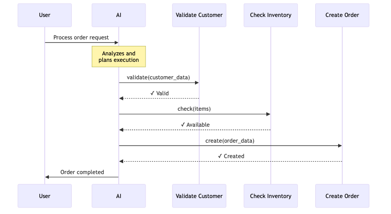
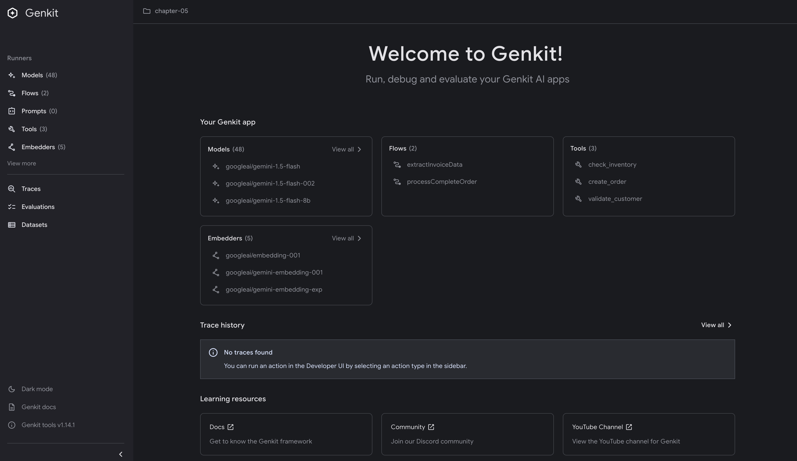
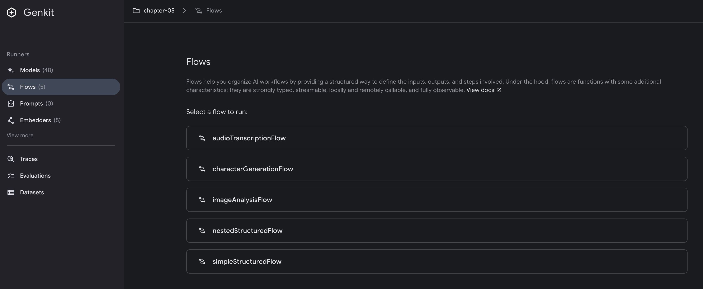
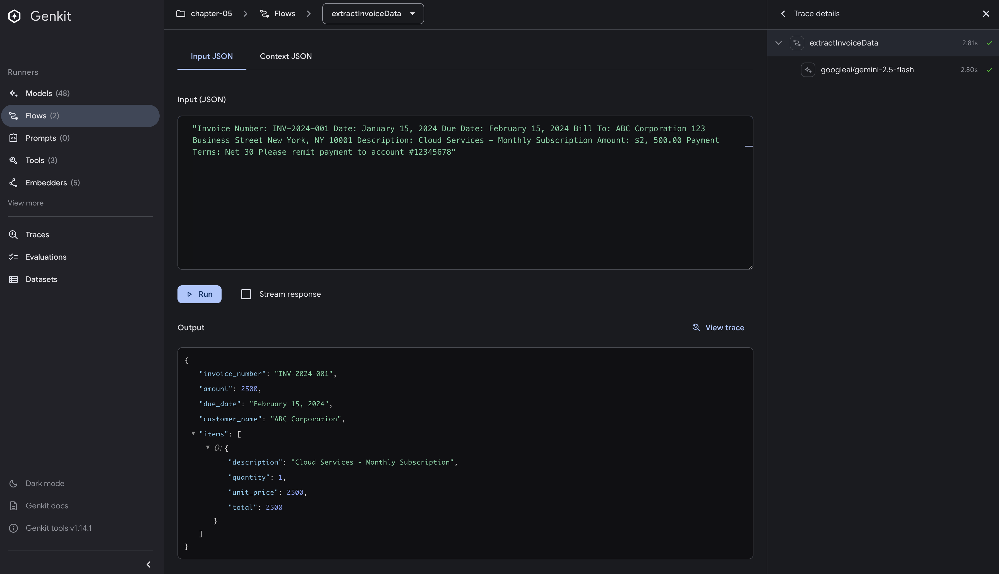
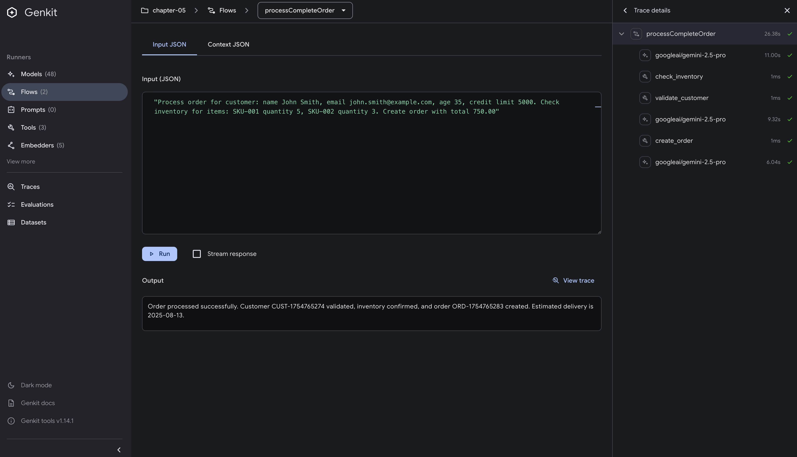
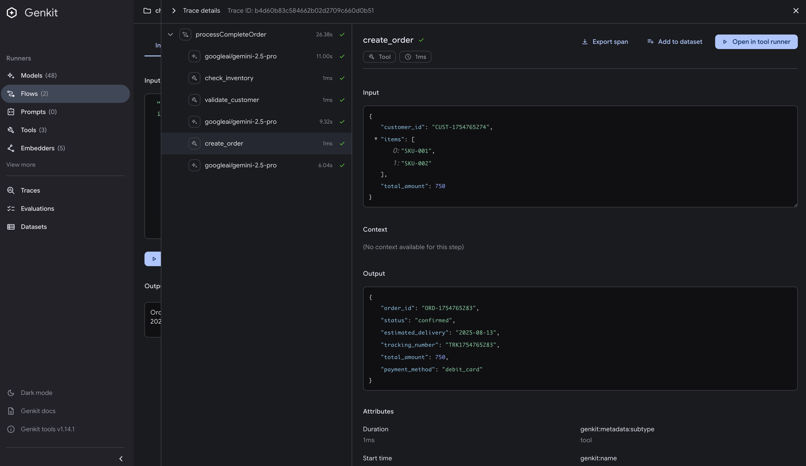

# Working with Structured Data

## Introduction

In the world of AI applications, the gap between unstructured text generation and structured data processing has long been a source of frustration. You've likely experienced this: your LLM generates brilliant insights, but extracting that information into your application's data structures feels like parsing HTML with regex - possible, but painful and error-prone.

This chapter explores how Genkit Go bridges this gap through advanced structured output patterns. While Chapter 4 introduced you to the basics of `GenerateData`, we're now diving deep into production-ready patterns that handle complex scenarios. We'll explore both `GenerateData` for direct structured output and a powerful pattern using Tool definitions to manage complex structured data interactions.

> **Note**: This chapter introduces Tools from a structured data perspective. For a comprehensive guide to Tool functionality, external system integration, and advanced Tool patterns, see Chapter 8: Tool Calling.

## Prerequisites

Before diving into this chapter, you should have:

- Completed Chapter 4 and understand basic `Generate` and `GenerateData` functions
- Solid understanding of Go's struct types and interfaces
- Familiarity with JSON tags and Go's reflection basics

## Advanced Structured Data with Tools

The true power of structured data in Genkit emerges when you move beyond simple `GenerateData` calls to Tool definitions. This pattern transforms how AI systems interact with complex business logic.

### The Tool Definition Pattern

Tools provide a different approach to structured data - instead of generating data directly, they allow the AI to call functions with structured inputs. Let's start with an example:

```go
// Define structured output type
type UserProfile struct {
    ProfileID        string   `json:"profile_id"`
    ValidationStatus string   `json:"validation_status"`
    RiskScore        int      `json:"risk_score"`
    Recommendations  []string `json:"recommendations"`
}

// Define a tool for processing complex user data
userProcessingTool := genkit.DefineTool(g, "process_user_data",
    "Process and validate user profile data with business rules",
    func(ctx *ai.ToolContext, input struct {
        Name             string   `json:"name"`
        Email            string   `json:"email"`
        Age              float64  `json:"age"`
        Interests        []string `json:"interests"`
        SubscriptionType string   `json:"subscription_type"`
    }) (UserProfile, error) {
        result := UserProfile{}
        
        // Business logic validation
        if input.Age < 18 {
            return result, fmt.Errorf("user must be 18 or older")
        }
        
        if !isValidEmail(input.Email) {
            return result, fmt.Errorf("invalid email format")
        }
        
        // Process and return structured data
        result.ProfileID = fmt.Sprintf("PROF-%d", time.Now().Unix())
        result.ValidationStatus = "approved"
        result.RiskScore = calculateRiskScore(input.Age, len(input.Interests))
        result.Recommendations = generateRecommendations(input.Interests)
        
        return result, nil
    })
```

This pattern offers several advantages over simple `GenerateData`:

1. **Type-safe input validation** at compile time
2. **Business logic encapsulation** within the tool
3. **Clear error boundaries** between AI and application logic
4. **Composability** with other tools
5. **Testability** - business logic can be tested with standard Go unit tests

### Multi-Tool Orchestration

When dealing with complex structured data that spans multiple domains (customer data, inventory, orders), you can compose multiple tools together. Each tool handles its own structured input/output, and the AI orchestrates the data flow between them:



```go
// Define structured output types
type CustomerValidationResult struct {
    CustomerID   string `json:"customer_id"`
    IsValid      bool   `json:"is_valid"`
    CreditScore  int    `json:"credit_score"`
    AccountTier  string `json:"account_tier"`
}

type InventoryCheckResult struct {
    Available      bool              `json:"available"`
    ItemsInStock   map[string]int    `json:"items_in_stock"`
    ReservedUntil  string           `json:"reserved_until"`
}

type OrderResult struct {
    OrderID        string           `json:"order_id"`
    Status         string           `json:"status"`
    EstimatedDelivery string        `json:"estimated_delivery"`
    TrackingNumber string           `json:"tracking_number"`
}

// Define multiple tools with structured outputs
validateCustomerTool := genkit.DefineTool(g, "validate_customer",
    "Validate customer and return detailed status",
    func(ctx *ai.ToolContext, input struct {
        Name  string `json:"name"`
        Email string `json:"email"`
        Age   int    `json:"age"`
    }) (CustomerValidationResult, error) {
        result := CustomerValidationResult{}
        
        // Validation logic
        if input.Age < 18 {
            return result, fmt.Errorf("customer must be 18 or older")
        }
        
        if !strings.Contains(input.Email, "@") {
            return result, fmt.Errorf("invalid email format")
        }
        
        // Return structured data
        result.CustomerID = fmt.Sprintf("CUST-%d", time.Now().Unix())
        result.IsValid = true
        result.CreditScore = 750 // Simulated
        result.AccountTier = "Premium"
        
        return result, nil
    })

checkInventoryTool := genkit.DefineTool(g, "check_inventory",
    "Check inventory and return detailed availability",
    func(ctx *ai.ToolContext, input struct {
        Items    []string `json:"items"`
        Quantity int      `json:"quantity"`
    }) (InventoryCheckResult, error) {
        result := InventoryCheckResult{
            ItemsInStock: make(map[string]int),
        }
        
        // Validation
        if input.Quantity <= 0 {
            return result, fmt.Errorf("quantity must be positive")
        }
        
        // Check each item's availability
        for _, item := range input.Items {
            result.ItemsInStock[item] = 100 // Simulated stock
        }
        
        result.Available = true
        result.ReservedUntil = time.Now().Add(15 * time.Minute).Format(time.RFC3339)
        
        return result, nil
    })

createOrderTool := genkit.DefineTool(g, "create_order",
    "Create order and return order details",
    func(ctx *ai.ToolContext, input struct {
        CustomerID string  `json:"customer_id"`
        Items      []string `json:"items"`
        Total      float64 `json:"total"`
    }) (OrderResult, error) {
        result := OrderResult{}
        
        // Validation
        if input.Total <= 0 {
            return result, fmt.Errorf("order total must be positive")
        }
        
        if input.Total > 10000 {
            return result, fmt.Errorf("order exceeds maximum amount")
        }
        
        // Create order with structured response
        result.OrderID = fmt.Sprintf("ORD-%d", time.Now().Unix())
        result.Status = "confirmed"
        result.EstimatedDelivery = time.Now().AddDate(0, 0, 3).Format("2006-01-02")
        result.TrackingNumber = fmt.Sprintf("TRK%d", time.Now().Unix())
        
        return result, nil
    })

// Use all three tools together
response, err := genkit.Generate(ctx, g,
    ai.WithSystem(`You are an order processing assistant. Use the available tools to:
1. validate_customer - when customer information is provided
2. check_inventory - for product availability
3. create_order - after validation succeeds`),
    ai.WithPrompt("Process this order: %s", orderRequest),
    ai.WithTools(validateCustomerTool, checkInventoryTool, createOrderTool))
```

The AI will intelligently decide which tools to call and in what order, managing the data flow between them.

> **Note**: Some LLMs may require explicit instructions in the system prompt to use multiple tools in sequence. Always test your specific model's capabilities with tool orchestration.

### When to Use Tools vs GenerateData

Understanding when to use each approach is crucial for building effective AI applications. Here's a comprehensive comparison:

| Scenario | Use GenerateData | Use Tools | Why |
|----------|-----------------|-----------|-----|
| **Simple data extraction** | **Yes** | No | GenerateData is simpler and more direct |
| **Fixed business workflow** | **Yes** | No | You want guaranteed execution, not AI judgment |
| **Required validation steps** | **Yes** | No | Critical checks should always run, not be optional |
| **AI needs to decide what to do** | No | **Yes** | Tools let AI choose based on context |
| **Multi-step reasoning** | No | **Yes** | AI can chain tools together dynamically |
| **Error recovery needed** | No | **Yes** | AI can retry with different approaches |
| **Exploring data iteratively** | No | **Yes** | AI can call tools multiple times to gather info |

Let's look at concrete examples:

#### When to Use GenerateData

Use GenerateData for fixed extraction with known structure:

```go
type InvoiceData struct {
    InvoiceNumber string  `json:"invoice_number"`
    Amount        float64 `json:"amount"`
    DueDate       string  `json:"due_date"`
}

// You ALWAYS want this exact structure extracted
invoice, _, err := genkit.GenerateData[InvoiceData](ctx, g,
    ai.WithPrompt("Extract invoice data from: " + documentText))

// Then ALWAYS validate it
if err := validateInvoice(invoice); err != nil {
    return err  // Validation is mandatory, not optional
}
```

#### When to Use Tools

Use Tools when AI needs to decide what information to gather:

```go
customerInfoTool := genkit.DefineTool(g, "get_customer_info",
    "Retrieve customer information if needed",
    func(ctx *ai.ToolContext, input struct {
        CustomerID string `json:"customer_id"`
    }) (CustomerInfo, error) {
        return fetchCustomerInfo(input.CustomerID)
    })

orderHistoryTool := genkit.DefineTool(g, "get_order_history",
    "Retrieve order history if relevant",
    func(ctx *ai.ToolContext, input struct {
        CustomerID string `json:"customer_id"`
        Days       int    `json:"days"`
    }) ([]Order, error) {
        return fetchOrderHistory(input.CustomerID, input.Days)
    })

// AI decides: "Does this support request need customer info? Order history?"
response, err := genkit.Generate(ctx, g,
    ai.WithTools(customerInfoTool, orderHistoryTool),
    ai.WithPrompt("Handle this support request: " + request))
```

### The Key Distinction

The fundamental difference is about **control**:

- **GenerateData**: YOU control the flow - "Generate this structure, then I'll process it"
- **Tools**: AI controls the flow - "Here are tools you can use if you think they're needed"

Tools provide a richer interaction model where the AI can:

1. Make multiple function calls in sequence
2. Use the output of one tool as context for another  
3. Retry with different parameters if validation fails
4. Skip tools that aren't relevant to the current context

This is fundamentally different from `GenerateData`, which is a deterministic, one-shot operation.

## Understanding GenerateData Limitations

While tools are powerful for complex scenarios, understanding `GenerateData`'s conceptual model helps you make informed decisions about when to use each approach.

`GenerateData` essentially works by:

1. **Schema Creation**: Converting your Go type into a JSON schema
2. **Constrained Generation**: Instructing the LLM to follow that schema
3. **Response Unmarshaling**: Parsing the LLM's response back into your Go type

This approach has inherent limitations:

1. **Single-shot generation**: No ability to retry or refine
2. **Schema size impacts tokens**: Large schemas consume significant input tokens
3. **No intermediate validation**: Errors only surface after generation

## Schema Design Patterns

### Handling Business Entities

When modeling complex business logic, structure your schemas to reflect domain boundaries:

```go
type OrderProcessingContext struct {
    Customer    CustomerProfile   `json:"customer"`
    Order       OrderDetails      `json:"order"`
    Inventory   []InventoryItem   `json:"inventory"`
    Pricing     PricingRules      `json:"pricing"`
    Validation  ValidationResult  `json:"validation"`
}

type CustomerProfile struct {
    ID               string           `json:"id"`
    Name             string           `json:"name"`
    Email            string           `json:"email"`
    LoyaltyTier      string           `json:"loyalty_tier"`
    PurchaseHistory  []PurchaseRecord `json:"purchase_history"`
    Preferences      map[string]string `json:"preferences"`
}

type ValidationResult struct {
    IsValid      bool     `json:"is_valid"`
    Errors       []string `json:"errors"`
    Warnings     []string `json:"warnings"`
    ProcessedAt  string   `json:"processed_at"`
}
```

This structure provides several benefits:

- **Clear domain boundaries** make the schema self-documenting
- **Explicit field definitions** ensure all fields are properly handled
- **Nested validation** allows for complex business rules
- **Type safety** catches errors at compile time

### Managing Hierarchical Data

When dealing with deeply nested structures, balance complexity with LLM comprehension:

```go
// Good: Clear hierarchy with limited depth
type RecipeEvaluation struct {
    Recipe      Recipe       `json:"recipe"`
    Scores      ScoreCard    `json:"scores"`
    Feedback    []Comment    `json:"feedback"`
}

// Avoid: Excessive nesting that confuses LLMs
type OverlyNested struct {
    Level1 struct {
        Level2 struct {
            Level3 struct {
                Level4 struct {
                    Data string `json:"data"`
                } `json:"level4"`
            } `json:"level3"`
        } `json:"level2"`
    } `json:"level1"`
}
```

A good rule of thumb: keep nesting to 3 levels or less. Beyond that, consider flattening or splitting into multiple tool calls.

### Handling Multiple Response Types

When your application needs to handle different types of responses, use a type discriminator pattern:

```go
// Use specific types with a type discriminator
type TypedResponse struct {
    Type string `json:"type"` // "user", "order", "product"
    User *UserData `json:"user"`
    Order *OrderData `json:"order"`
    Product *ProductData `json:"product"`
}

// The AI generates the appropriate type based on context
response, _, err := genkit.GenerateData[TypedResponse](ctx, g,
    ai.WithPrompt("Process this request and identify if it's about a user, order, or product"))

// Type-safe handling
switch response.Type {
case "user":
    if response.User != nil {
        processUser(response.User)
    }
case "order":
    if response.Order != nil {
        processOrder(response.Order)
    }
case "product":
    if response.Product != nil {
        processProduct(response.Product)
    }
}
```

This approach maintains type safety while providing the flexibility to handle different response types.

## Testing Business Logic in Tools

One of the most significant advantages of encapsulating business logic in tools rather than prompts is **testability**. When your business rules live in Go functions, you can test them with standard Go unit tests, eliminating AI uncertainty and ensuring consistent behavior.

### Why Testability Matters

When business logic is embedded in prompts:

- You can't test it deterministically
- AI responses may vary
- Edge cases are hard to verify
- Specification bugs hide in natural language

When business logic is in tool functions:

- Standard `go test` works perfectly
- 100% deterministic results
- All edge cases can be covered
- Specifications are code-verified

### Example: Testing Order Validation Logic

Here's how you can test the business logic from our order processing tool:

```go
package tools

import (
    "fmt"
    "testing"
    
    // testify is a popular testing toolkit that makes assertions cleaner
    "github.com/stretchr/testify/assert"
)

// Extract business logic into a testable function
func validateOrderAmount(amount float64) error {
    if amount > 10000 {
        return fmt.Errorf("order amount exceeds maximum limit")
    }
    if amount < 0 {
        return fmt.Errorf("order amount cannot be negative")
    }
    return nil
}

// Simple, focused unit tests with testify/assert
func TestValidateOrderAmount(t *testing.T) {
    // Test valid amounts
    assert.NoError(t, validateOrderAmount(500.00))
    assert.NoError(t, validateOrderAmount(0))
    assert.NoError(t, validateOrderAmount(10000.00))
    
    // Test amount over limit
    err := validateOrderAmount(10000.01)
    assert.Error(t, err)
    assert.Contains(t, err.Error(), "exceeds maximum limit")
    
    // Test negative amount
    err = validateOrderAmount(-1.00)
    assert.Error(t, err)
    assert.Contains(t, err.Error(), "cannot be negative")
}
```

This simple example demonstrates the key benefit: your business logic (`validateOrderAmount`) is a pure Go function that can be tested easily. We're using `testify/assert` here - a popular Go testing library that provides cleaner assertions and better error messages than the standard library. No AI, no uncertainty - just deterministic, fast unit tests.

### Running Tests

With business logic in pure Go functions, testing is straightforward:

```bash
# Run tests
go test ./...
```

Example output:

```bash
 go test ./...       
ok      examples/chapter-05/internal/flows
ok      examples/chapter-05/internal/tools
```

### Benefits of This Approach

1. **Specification Verification**: Your tests prove the business logic works as specified
2. **Regression Prevention**: Changes that break business rules fail immediately
3. **CI/CD Integration**: Tests run in your pipeline, catching issues before deployment
4. **Fast Feedback**: No need to invoke AI to test business logic changes
5. **No AI Uncertainty**: Business logic execution is 100% predictable

This separation of concerns - AI for decision making, code for business logic - gives you the best of both worlds: AI flexibility where needed, and deterministic execution where required.

## Example: E-commerce Order Processing

Let's put it all together with a complete example that demonstrates the power of structured data with tools:

```go
package main

import (
    "context"
    "fmt"
    "github.com/firebase/genkit/go/ai"
    "github.com/firebase/genkit/go/genkit"
)

// Define input models
type CustomerValidationInput struct {
    Name         string  `json:"name"`
    Email        string  `json:"email"`
    CreditLimit  float64 `json:"credit_limit"`
}

type InventoryCheckInput struct {
    ProductID    string  `json:"product_id"`
    Quantity     int     `json:"quantity"`
}

type OrderCreationInput struct {
    CustomerID   string  `json:"customer_id"`
    Items        []Item  `json:"items"`
    TotalAmount  float64 `json:"total_amount"`
}

// Define output models for structured responses
type ValidationResult struct {
    CustomerID   string `json:"customer_id"`
    IsApproved   bool   `json:"is_approved"`
    CreditScore  int    `json:"credit_score"`
    Restrictions []string `json:"restrictions,omitempty"`
}

type InventoryResult struct {
    Available    bool             `json:"available"`
    InStock      int              `json:"in_stock"`
    Reserved     int              `json:"reserved"`
    Warehouse    string           `json:"warehouse"`
}

type OrderConfirmation struct {
    OrderID          string    `json:"order_id"`
    Status           string    `json:"status"`
    EstimatedDelivery string   `json:"estimated_delivery"`
    TotalAmount      float64   `json:"total_amount"`
    PaymentMethod    string    `json:"payment_method"`
}

func setupOrderProcessingSystem(g *genkit.Genkit) {
    // Tool 1: Validate customer with structured output
    validateCustomerTool := genkit.DefineTool(g, "validate_customer",
        "Validate customer eligibility for order",
        func(ctx *ai.ToolContext, input CustomerValidationInput) (ValidationResult, error) {
            result := ValidationResult{}
            
            if input.CreditLimit < 0 {
                return result, fmt.Errorf("customer has exceeded credit limit")
            }
            
            // Return structured validation result
            result.CustomerID = fmt.Sprintf("CUST-%d", time.Now().Unix())
            result.IsApproved = true
            result.CreditScore = 750
            if input.CreditLimit < 1000 {
                result.Restrictions = []string{"low_credit_limit"}
            }
            
            return result, nil
        })
    
    // Tool 2: Check inventory with structured output
    checkInventoryTool := genkit.DefineTool(g, "check_inventory",
        "Verify product availability",
        func(ctx *ai.ToolContext, input InventoryCheckInput) (InventoryResult, error) {
            result := InventoryResult{}
            
            // Simulate inventory check with structured response
            result.InStock = 100  // Simulated
            result.Reserved = 10
            result.Available = input.Quantity <= (result.InStock - result.Reserved)
            result.Warehouse = "EAST-1"
            
            if !result.Available {
                return result, fmt.Errorf("insufficient inventory")
            }
            
            return result, nil
        })
    
    // Tool 3: Create order with structured output
    createOrderTool := genkit.DefineTool(g, "create_order",
        "Create and process the order",
        func(ctx *ai.ToolContext, input OrderCreationInput) (OrderConfirmation, error) {
            result := OrderConfirmation{}
            
            // Apply business rules
            if input.TotalAmount > 10000 {
                return result, fmt.Errorf("order amount exceeds maximum limit")
            }
            
            // Create order with structured confirmation
            result.OrderID = fmt.Sprintf("ORD-%d", time.Now().Unix())
            result.Status = "confirmed"
            result.EstimatedDelivery = time.Now().AddDate(0, 0, 3).Format("2006-01-02")
            result.TotalAmount = input.TotalAmount
            result.PaymentMethod = "credit_card"
            
            return result, nil
        })
    
    // Define the complete flow
    genkit.DefineFlow(g, "processCompleteOrder",
        func(ctx context.Context, request string) (string, error) {
            response, err := genkit.Generate(ctx, g,
                ai.WithSystem(`You are an order processing assistant. Use the available tools to:
                1. validate_customer - validates customer eligibility
                2. check_inventory - checks product availability
                3. create_order - creates the final order
                Process requests step by step.`),
                ai.WithPrompt("Process this order request: %s", request),
                ai.WithTools(validateCustomerTool, checkInventoryTool, createOrderTool),
                ai.WithConfig(map[string]interface{}{
                    "temperature": 0.2,
                }),
            )
            
            if err != nil {
                return "", fmt.Errorf("order processing failed: %w", err)
            }
            
            return response.Text(), nil
        })
}
```

This example demonstrates:

1. **Clear separation of concerns**: Each tool handles one aspect
2. **Type-safe business logic**: Compile-time checking of data structures
3. **Error propagation**: Business rule violations bubble up appropriately
4. **Composability**: Tools work together to complete complex workflows

## Best Practices and Anti-patterns

### Do's

**Encapsulate business logic in tools** rather than prompts:

```go
// Good: Business logic in tool
genkit.DefineTool(g, "validate_age",
    "Validate user age",
    func(ctx *ai.ToolContext, input struct {
        Age int `json:"age"`
    }) (bool, error) {
        return input.Age >= 18, nil
    })

// Bad: Business logic in prompt
ai.WithPrompt("Check if the age is 18 or older and return true/false")
```

**Use incremental processing for complex structures**:

```go
// Good: Build complex data step by step
sections := []Section{}
for _, sectionType := range requiredSections {
    section := generateSection(sectionType)
    sections = append(sections, section)
}
```

**Implement proper error handling and validation**:

```go
// Good: Comprehensive validation
if err := validateInput(input); err != nil {
    return nil, fmt.Errorf("validation failed: %w", err)
}
```

### Don'ts

**Don't push overly complex structures into GenerateData**:

```go
// Bad: Too complex for single GenerateData call
type MassiveSchema struct {
    // 100+ fields across 5+ nesting levels
}
```

**Don't ignore error handling in structured output**:

```go
// Bad: No error handling
result, _, _ := genkit.GenerateData[ComplexType](ctx, g, opts...)
// What if unmarshaling fails?
```

**Don't ignore LLM context limits**:

```go
// Bad: Schema that consumes most of the context window
type GiantSchema struct {
    // Schema definition takes 3000+ tokens
}
```

## Running the Example

To explore the structured data patterns in action, let's run the Chapter 5 example using Genkit Developer UI.

### 1. Set up environment

First, ensure you have your Google AI API key configured:

```bash
export GOOGLE_GENAI_API_KEY="your-api-key"
```

### 2. Start with Developer UI

Navigate to the example directory and start the application with Developer UI:

```bash
cd src/examples/chapter-05
genkit start -- go run .
```

This will start:

- Your application on port 9090
- Developer UI on <http://localhost:4000>



### 3. Explore Flows in Developer UI

Open <http://localhost:4000> in your browser. You'll see two flows:



### 4. Test ExtractInvoiceData Flow

Click on `extractInvoiceData` flow. This flow demonstrates `GenerateData` for structured extraction.

**Input example:**

```text
"Invoice Number: INV-2024-001 Date: January 15, 2024 Due Date: February 15, 2024 Bill To: ABC Corporation 123 Business Street New York, NY 10001 Description: Cloud Services - Monthly Subscription Amount: $2, 500.00 Payment Terms: Net 30 Please remit payment to account #12345678"
```

Click "Run" and observe the structured output:



The output will be a properly structured JSON object with all invoice fields extracted and validated.

### 5. Test ProcessCompleteOrder Flow

Navigate back and click on `processCompleteOrder` flow. This demonstrates multi-tool orchestration with structured inputs and outputs.

**Input example:**

```text
"Process order for customer: name John Smith, email john.smith@example.com, age 35, credit limit 5000. Check inventory for items: SKU-001 quantity 5, SKU-002 quantity 3. Create order with total 750.00"
```

Click "Run" and watch the tool orchestration:



The trace view shows:

1. Customer validation returning structured validation result
2. Inventory check returning structured availability data
3. Order creation returning structured confirmation

Each tool returns structured data, not just strings, demonstrating the power of typed tool definitions.

### 6. Inspect Tool Calls

Click on any tool call in the trace to see the structured input and output:



Notice how each tool:

- Receives typed, structured input
- Performs business logic validation
- Returns structured, typed output
- Maintains type safety throughout

## Key Takeaways

- **Tool definitions enable complex structured data patterns** that go far beyond simple `GenerateData` calls
- **The choice between GenerateData and Tools** depends on complexity, validation needs, and business logic requirements
- **Business logic** is best expressed through typed tool definitions with clear error boundaries
- **Structured data patterns** provide the foundation for building robust AI applications

## Next Steps

With a solid understanding of structured data patterns, you're ready to explore how these concepts integrate with Genkit's Flow system in Chapter 6. You'll learn how to compose these structured data operations into reusable, testable workflows that form the backbone of production AI applications.

The patterns you've learned here - especially the tool-based approach to complex structured data - will be essential as we move into more advanced topics. Chapter 8 will expand on tool calling patterns, but you now have the foundation to understand why tools are so powerful for managing structured data in AI applications.
