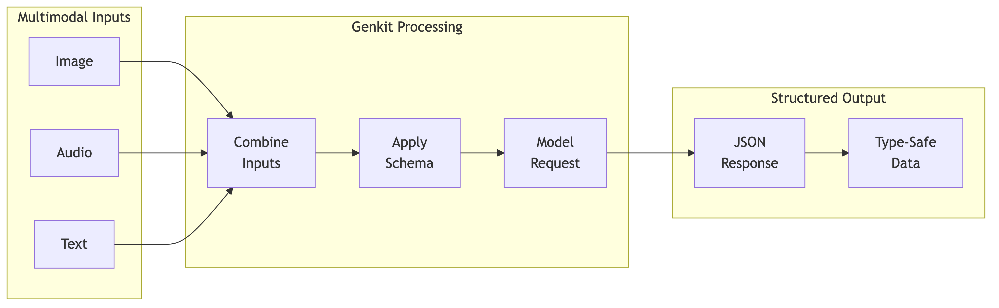
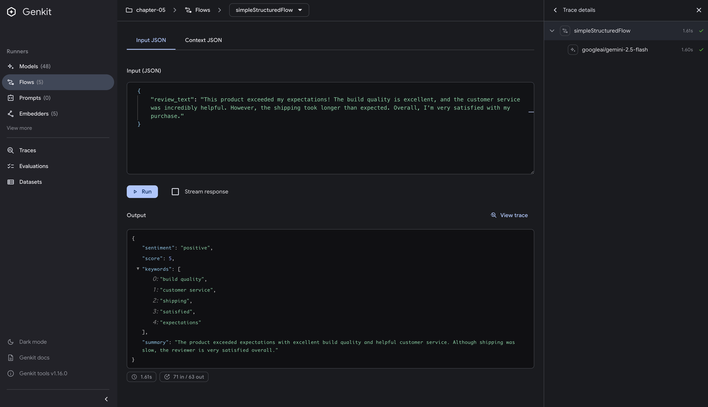
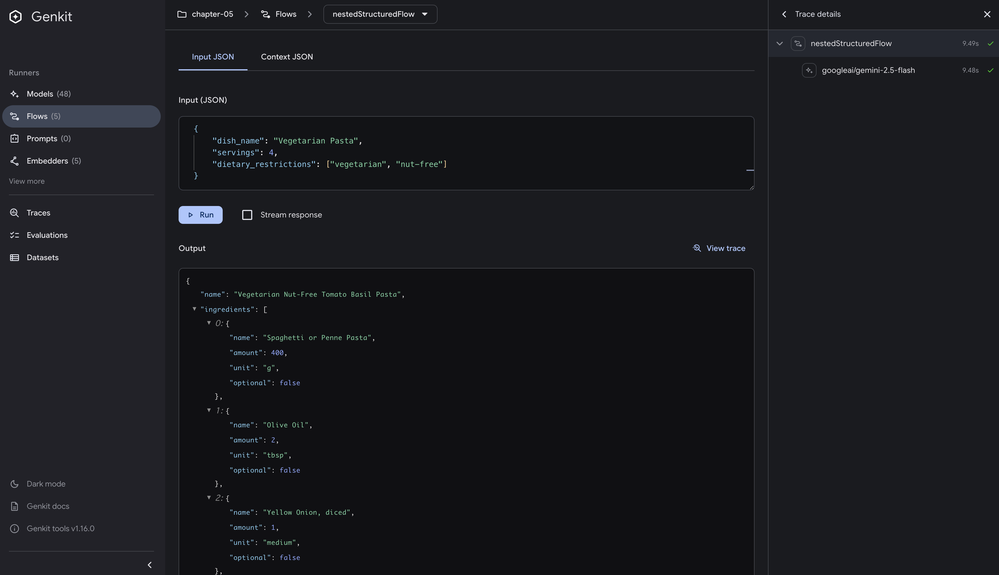
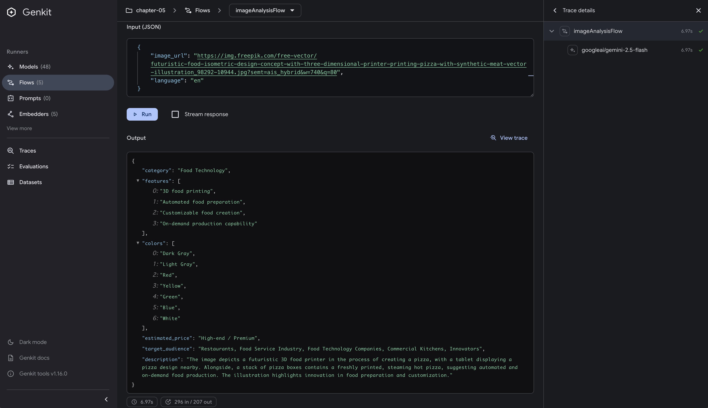
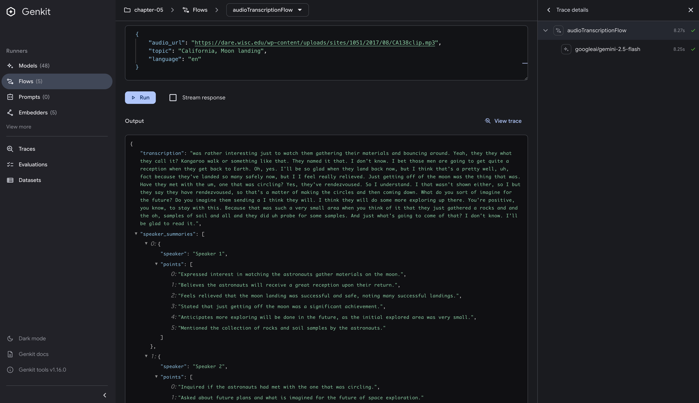
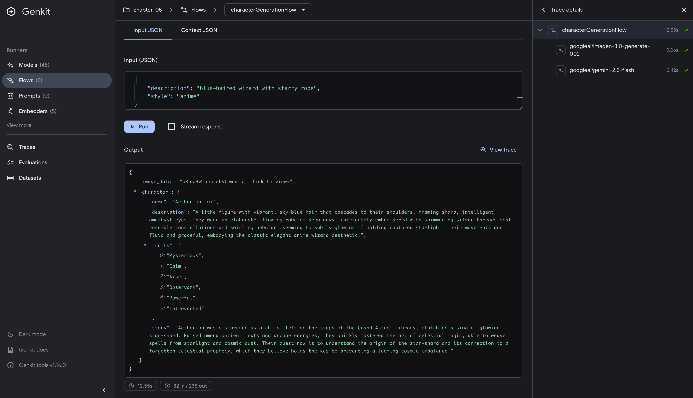

# Working with Structured Data

## Introduction

In the world of AI applications, bridging the gap between unstructured text generation and structured data processing presents unique challenges. While LLMs excel at generating insights and creative content, extracting that information into application data structures requires careful design and implementation.

This chapter explores how Genkit Go bridges this gap through structured output patterns. While Chapter 4 introduced the basics of `Generate` and `GenerateData` with simple multimodal examples, here we dive deep into the complex structured data patterns required in production environments.

We'll explore the combination of multimodal inputs (images, audio) with structured outputs, and the integration of multimodal outputs (image generation) with structured metadata. These patterns go beyond simple text structuring to form the foundation of AI applications that handle diverse media types.

## Prerequisites

Before diving into this chapter, you should have:

- Completed Chapter 4 and understand basic `Generate` and `GenerateData` functions
- Solid understanding of Go's struct types and interfaces
- Familiarity with JSON tags and basic Go reflection

## Understanding Structured Output in Genkit Go

Structured output is a key feature of Genkit Go for production AI applications. By leveraging Go's type system, Genkit transforms the traditionally unpredictable nature of LLM responses into reliable, type-safe data structures.

### The Evolution from Generate to GenerateData

In Chapter 4, we introduced the basic distinction between `Generate` and `GenerateData`. Now let's understand the deeper implications of this design choice.

#### Generate: The Foundation

The `Generate` function provides maximum flexibility when working with AI models:

```go
resp, err := genkit.Generate(ctx, g,
    ai.WithPrompt("Suggest healthy breakfast recipes using Japanese ingredients"),
    ai.WithModelName("googleai/gemini-2.5-flash"))

// Access the response
fmt.Println(resp.Text())

// Check token usage
if resp.Usage != nil {
    log.Printf("Tokens used: %d", resp.Usage.TotalTokens)
}
```

This approach works well for creative tasks, content generation, and scenarios where the exact output format isn't critical. However, when building production systems that need to integrate AI responses into existing data pipelines, we need more structure.

#### GenerateData: Type-Safe Structured Output

`GenerateData` provides a straightforward way to get structured output from AI models:

```go
type Recipe struct {
    Name        string   `json:"name"`
    PrepTime    int      `json:"prep_time_minutes"`
    Ingredients []string `json:"ingredients"`
    Steps       []string `json:"steps"`
    Nutrition   struct {
        Calories int `json:"calories"`
        Protein  int `json:"protein_grams"`
    } `json:"nutrition"`
}

// Generate with automatic schema validation
recipe, _, err := genkit.GenerateData[Recipe](ctx, g,
    ai.WithPrompt("Create a healthy breakfast recipe under 300 calories"))

// Use the typed result directly
fmt.Printf("%s (Prep: %d min, Calories: %d)\n", 
    recipe.Name, recipe.PrepTime, recipe.Nutrition.Calories)
```

> `GenerateData` is a convenience wrapper that automatically applies `WithOutputType()` for you. If you need more control, you can use `Generate` with `WithOutputType()` directly:
>
> ```go
> resp, err := genkit.Generate(ctx, g,
>     ai.WithPrompt("Create a healthy breakfast recipe"),
>     ai.WithOutputType(Recipe{}))
> 
> // Manual unmarshaling required
> var recipe Recipe
> if err := resp.Output(&recipe); err != nil {
>     return err
> }
> ```

### Choosing the Right Tool

Here's a practical guide for selecting the appropriate approach:

| Use Case | Recommended Approach | Why |
|----------|---------------------|-----|
| **Simple text generation** | `Generate` with `WithPrompt` | No structure needed, maximum flexibility |
| **Structured data with convenience** | `GenerateData[T]` | Automatic type handling, less boilerplate |
| **Structured data with metadata access** | `Generate` with `WithOutputType` | Access to token usage, finish reason, etc. |
| **API responses** | `GenerateData[T]` | Type safety and automatic validation |
| **When you need response metadata** | `Generate` (with or without `WithOutputType`) | Full `ModelResponse` access |

### Type Safety Benefits

Genkit Go leverages Go's type system to provide compile-time safety and excellent developer experience.

This approach prevents common issues:

- **No Runtime Surprises**: Malformed responses are caught immediately
- **Clear Contracts**: The expected structure is explicit in your code
- **Refactoring Safety**: Change your struct, and the compiler tells you what to update

## Structured Data Design Best Practices

A key point about AI application development with Genkit Go is that **structured data design principles don't fundamentally change**. The same best practices you've learned from traditional software development apply when building AI-powered systems.

### Structured Data Design Remains Unchanged

Whether you're building a traditional CRUD application or an AI-powered system with Genkit Go, good structured data design follows the same principles:

```go
// Real-world entities are modeled the same way
type Customer struct {
    ID        string    `json:"id"`
    Name      string    `json:"name"`
    Email     string    `json:"email"`
    CreatedAt time.Time `json:"created_at"`
}

// Business events maintain their structure
type OrderPlaced struct {
    OrderID    string    `json:"order_id"`
    CustomerID string    `json:"customer_id"`
    Items      []Item    `json:"items"`
    Total      float64   `json:"total"`
    PlacedAt   time.Time `json:"placed_at"`
}

// Value objects express immutability
type Money struct {
    Amount   float64 `json:"amount"`
    Currency string  `json:"currency"`
}
```

Genkit Go works with these structures to map real-world information appropriately. By using the same schemas as your existing systems, you achieve seamless integration with your business logic.

### Maintaining Clear Domain Boundaries

When designing structured data, it's helpful to reflect your business domains in the structure:

```go
// Good: Clear domain separation
type OrderProcessingContext struct {
    Customer   CustomerProfile  `json:"customer"`
    Order      OrderDetails     `json:"order"`
    Inventory  []InventoryItem  `json:"inventory"`
    Validation ValidationResult `json:"validation"`
}

// Avoid: Overly flat structures
type EverythingFlat struct {
    CustomerName  string `json:"customer_name"`
    CustomerEmail string `json:"customer_email"`
    OrderID       string `json:"order_id"`
    // ... dozens of fields continue
}
```

Structured schemas help Genkit Go process relationships between domains, leading to more accurate data generation.

The key insight is that AI application development with Genkit Go doesn't require learning new structured data design patterns. The principles of real-world modeling, domain boundary clarification, and proper abstraction that you've developed over years of software engineering remain just as valuable. Proper structuring enables smooth integration between AI and existing systems while maintaining clear boundaries with business logic.

## Basic Structured Output Patterns

Let's start with fundamental patterns that form the building blocks of more complex structures.

### Simple Structured Extraction

A common pattern involves extracting structured data from unstructured text:

```go
// Define the structure
type ReviewAnalysis struct {
    Sentiment string   `json:"sentiment"` // "positive", "negative", "neutral"
    Score     int      `json:"score"`     // 1-5
    Keywords  []string `json:"keywords"`  // Key topics/features
    Summary   string   `json:"summary"`   // Brief summary
}

// Extract structured data
result, _, err := genkit.GenerateData[ReviewAnalysis](ctx, g,
    ai.WithSystem(`Analyze the review and extract: sentiment (positive/negative/neutral), 
                   score (1-5), keywords, and summary`),
    ai.WithPrompt("Analyze this review: %s", reviewText),
    ai.WithConfig(map[string]interface{}{
        "temperature": 0.3, // Lower temperature for consistent analysis
    }),
)
```

This pattern provides several advantages:

1. **Compile-time type safety** - Struct definitions prevent type mismatches
2. **Automatic JSON marshaling** - No manual conversion needed
3. **Clear data contracts** - Schema documents expected output
4. **Simplified error handling** - Structured errors are handled automatically

### Handling Nested Structures

Real-world applications often require complex, nested data structures. For example, a recipe management system needs to represent multiple related entities in a hierarchical structure:

```text
Recipe
├── Name (string)
├── Ingredients ([]Ingredient)
│   ├── Name (string)
│   ├── Amount (float64)
│   ├── Unit (string)
│   └── Optional (bool)
├── Steps ([]CookingStep)
│   ├── Number (int)
│   ├── Instruction (string)
│   ├── Duration (int)
│   └── Tips (string, omitempty)
├── Nutrition (Nutrition)
│   ├── Calories (float64)
│   ├── Protein (float64)
│   ├── Carbs (float64)
│   ├── Fat (float64)
│   └── Fiber (float64)
├── PrepTime (int)
├── CookTime (int)
└── Difficulty (string)
```

This hierarchy translates directly into Go structs:

```go
// Complete recipe definition
type Recipe struct {
    Name        string        `json:"name"`
    Ingredients []Ingredient  `json:"ingredients"`
    Steps       []CookingStep `json:"steps"`
    Nutrition   Nutrition     `json:"nutrition"`
    PrepTime    int          `json:"prep_time"`  // minutes
    CookTime    int          `json:"cook_time"`  // minutes
    Difficulty  string       `json:"difficulty"` // easy, medium, hard
}

// Ingredient definition
type Ingredient struct {
    Name     string  `json:"name"`
    Amount   float64 `json:"amount"`
    Unit     string  `json:"unit"`
    Optional bool    `json:"optional"`
}

// Cooking step definition
type CookingStep struct {
    Number      int    `json:"number"`
    Instruction string `json:"instruction"`
    Duration    int    `json:"duration"` // minutes
    Tips        string `json:"tips,omitempty"`
}

// Nutrition information
type Nutrition struct {
    Calories float64 `json:"calories"`
    Protein  float64 `json:"protein"` // grams
    Carbs    float64 `json:"carbs"`   // grams
    Fat      float64 `json:"fat"`     // grams
    Fiber    float64 `json:"fiber"`   // grams
}
```

This structure maintains complex data relationships while providing type-safe access to deeply nested information.

## Multimodal Input with Structured Output

A valuable feature of Genkit Go is combining multimodal inputs with structured outputs. This enables sophisticated applications that process diverse media types while maintaining data structure integrity.



### Image Analysis with Structured Data

Let's explore how to extract structured information from visual content:

```go
// Image analysis request
type ImageAnalysisRequest struct {
    ImageURL string `json:"image_url"`
    Language string `json:"language"`
}

// Structured product information output
type ProductInfo struct {
    Category       string   `json:"category"`
    Features       []string `json:"features"`
    Colors         []string `json:"colors"`
    PriceRange     string   `json:"price_range"`
    TargetAudience string   `json:"target_audience"`
    Description    string   `json:"description"`
}

// Using GenerateData with image URL
result, _, err := genkit.GenerateData[ProductInfo](ctx, g,
    ai.WithSystem(fmt.Sprintf(`Analyze the product image and extract: category, 
                                features, colors, price range, target audience, and description.
                                Output language: %s`, language)),
    ai.WithMessages(
        ai.NewUserMessage(
            ai.NewTextPart("Analyze this product image and provide structured information."),
            ai.NewMediaPart("", imageURL), // Direct URL usage
        ),
    ),
    ai.WithConfig(map[string]interface{}{
        "temperature": 0.4, // Lower temperature for factual analysis
    }),
)
```

This pattern is valuable for e-commerce cataloging, inventory management, visual quality control, and other applications requiring visual data extraction.

### Audio Transcription with Structured Output

Audio inputs can similarly be combined with structured outputs, enabling applications like meeting recording, customer service analysis, and voice-based data entry:

```go
// Audio transcription request
type AudioTranscriptionRequest struct {
    AudioURL string `json:"audio_url"`
    Language string `json:"language"`
}

// Structured meeting minutes output
type MeetingMinutes struct {
    Date         string        `json:"date"`
    Participants []string      `json:"participants"`
    Summary      string        `json:"summary"`
    ActionItems  []ActionItem  `json:"action_items"`
    Decisions    []string      `json:"decisions"`
    NextMeeting  string        `json:"next_meeting,omitempty"`
}

type ActionItem struct {
    Task     string `json:"task"`
    Assignee string `json:"assignee"`
    Deadline string `json:"deadline"`
    Priority string `json:"priority"` // high, medium, low
}
```

This structure automatically generates actionable structured data from audio content.

### Image Generation with Structured Metadata

When generating images, combining structured metadata makes the generated content manageable and searchable:

```go
// Character generation request
type CharacterGenerationRequest struct {
    Name        string   `json:"name"`
    Description string   `json:"description"`
    Style       string   `json:"style"`
    Traits      []string `json:"traits"`
}

// Generation result with structured metadata
type CharacterResult struct {
    CharacterID  string            `json:"character_id"`
    ImageURL     string            `json:"image_url"`
    Prompt       string            `json:"prompt"`
    Tags         []string          `json:"tags"`
    ColorPalette []string          `json:"color_palette"`
    Metadata     map[string]string `json:"metadata"`
}
```

## Implementing the Five Structured Data Flows

Our sample code demonstrates five independent flows that showcase different structured data patterns you'll encounter in production environments. The complete implementation is available at: <https://github.com/mastering-genkit/mastering-genkit-go/tree/main/src/examples/chapter-05>

### Flow 1: simpleStructuredFlow - Basic Structured Output

This flow demonstrates the fundamental pattern of extracting structured data from text using `GenerateData`.

**Input:**

```go
type ReviewInput struct {
    ReviewText string `json:"review_text"`
}
```

**Output:**

```go
type ReviewAnalysis struct {
    Sentiment string   `json:"sentiment"` // "positive", "negative", "neutral"
    Score     int      `json:"score"`     // 1-5
    Keywords  []string `json:"keywords"`  
    Summary   string   `json:"summary"`   
}
```

**Key implementation:**

```go
result, _, err := genkit.GenerateData[ReviewAnalysis](ctx, g,
    ai.WithSystem(`Analyze the review and extract: sentiment, score, keywords, and summary.`),
    ai.WithPrompt("Analyze this review: %s", input.ReviewText),
    ai.WithConfig(map[string]interface{}{
        "temperature": 0.3,  // Lower temperature for consistent analysis
    }),
)
```

Key features:

- Type-safe output with `ReviewAnalysis` struct
- Low temperature setting for consistent results
- Direct extraction of sentiment, score, and keywords

### Flow 2: nestedStructuredFlow - Complex Nested Structures

Building on the Recipe structure defined earlier, this flow handles complex nested data generation.

**Input:**

```go
type RecipeRequest struct {
    DishName            string   `json:"dish_name"`
    Servings            int      `json:"servings"`
    DietaryRestrictions []string `json:"dietary_restrictions"`
}
```

**Output:** Uses the `Recipe` structure with nested `Ingredient`, `CookingStep`, and `Nutrition` types defined in the [Handling Nested Structures](#handling-nested-structures) section.

**Key implementation:**

```go
result, _, err := genkit.GenerateData[Recipe](ctx, g,
    ai.WithSystem(`Create a detailed recipe with ingredients, steps, nutrition info, and cooking times.`),
    ai.WithPrompt(`Create a recipe for: %s
Servings: %d
Dietary restrictions: %v`, 
        input.DishName, input.Servings, input.DietaryRestrictions),
    ai.WithConfig(map[string]interface{}{
        "temperature": 0.5,
    }),
)
```

Key features:

- Handles nested arrays (`[]Ingredient`, `[]CookingStep`)
- Multiple levels of nesting (Recipe → Nutrition)
- Dynamic input parameters for customization

### Flow 3: imageAnalysisFlow - Image Input with Structured Output

The key pattern for multimodal input is using `WithMessages` and `NewMediaPart`.

**Input:**

```go
type ImageAnalysisRequest struct {
    ImageURL string `json:"image_url"`
    Language string `json:"language"`
}
```

**Output:**

```go
type ProductInfo struct {
    Category       string   `json:"category"`
    Features       []string `json:"features"`
    Colors         []string `json:"colors"`
    EstimatedPrice string   `json:"estimated_price"`
    TargetAudience string   `json:"target_audience"`
    Description    string   `json:"description"`
}
```

**Key implementation:**

```go
result, _, err := genkit.GenerateData[ProductInfo](ctx, g,
    ai.WithSystem(fmt.Sprintf(`Analyze the product image and extract structured information.
Output language: %s`, input.Language)),
    ai.WithMessages(
        ai.NewUserMessage(
            ai.NewTextPart("Analyze this product image."),
            ai.NewMediaPart("", input.ImageURL),  // Image URL input
        ),
    ),
    ai.WithConfig(map[string]interface{}{
        "temperature": 0.4,
    }),
)
```

Key features:

- `NewMediaPart` for image input via URL
- Language-specific output control
- Structured extraction from visual content

### Flow 4: audioTranscriptionFlow - Audio Input with Structured Output

Similar to image processing, audio files use `NewMediaPart` for multimodal input.

**Input:**

```go
type AudioRequest struct {
    AudioURL string `json:"audio_url"`
    Topic    string `json:"topic"`
    Language string `json:"language"`
}
```

**Output:**

```go
type MeetingMinutes struct {
    Transcription    string           `json:"transcription"`
    SpeakerSummaries []SpeakerSummary `json:"speaker_summaries"`
    Decisions        []string         `json:"decisions"`
    ActionItems      []ActionItem     `json:"action_items"`
    Keywords         []string         `json:"keywords"`
}
```

**Key implementation:**

```go
result, _, err := genkit.GenerateData[MeetingMinutes](ctx, g,
    ai.WithSystem(`Transcribe the audio and extract structured meeting minutes.`),
    ai.WithMessages(
        ai.NewUserMessage(
            ai.NewTextPart(fmt.Sprintf("Meeting topic: %s", input.Topic)),
            ai.NewMediaPart("", input.AudioURL),  // Audio URL input
        ),
    ),
    ai.WithConfig(map[string]interface{}{
        "temperature": 0.3,  // Low temperature for accurate transcription
    }),
)
```

Key features:

- Audio processing through URL input
- Structured extraction of action items and decisions
- Speaker identification and summarization

### Flow 5: characterGenerationFlow - Image Generation with Structured Metadata

This flow combines image generation with structured metadata creation.

**Input:**

```go
type CharacterRequest struct {
    Description string `json:"description"`
    Style       string `json:"style"`
}
```

**Output:**

```go
type CharacterResult struct {
    ImageData string    `json:"image_data"` // base64 encoded
    Character Character `json:"character"`   
}

type Character struct {
    Name        string   `json:"name"`
    Description string   `json:"description"`
    Traits      []string `json:"traits"`
    Story       string   `json:"story"`
}
```

**Key implementation:**

```go
// Generate image
imageResponse, err := g.Generate(ctx,
    ai.WithPrompt(fmt.Sprintf("Generate character: %s in %s style", 
        input.Description, input.Style)),
    ai.WithConfig(map[string]interface{}{
        "output": "media",  // Image generation mode
    }),
)

// Generate structured metadata
metadata, _, err := genkit.GenerateData[Character](ctx, g,
    ai.WithSystem(`Create character details based on the description.`),
    ai.WithPrompt("Character: %s", input.Description),
    ai.WithConfig(map[string]interface{}{
        "temperature": 0.7,  // Higher temperature for creative content
    }),
)
```

Key features:

- Parallel generation of visual and structured content
- `"output": "media"` configuration for image generation
- Combining `Generate` for media and `GenerateData` for metadata

## Testing with Developer UI

Let's run our five structured data flows through the Genkit Developer UI to see them in action.


### Setting Up and Starting Developer UI

```bash
# Set your Google AI API key
export GOOGLE_GENAI_API_KEY="your-api-key"

# Navigate to sample directory and start Developer UI
cd src/examples/chapter-05
genkit start -- go run .
```

Open your browser to <http://localhost:4000/flows> to see all five flows displayed.

### Testing Flow 1: simpleStructuredFlow - Review Analysis

This demonstrates the basic structured output pattern.

**Input Example:**

```json
{
  "review_text": "This product exceeded my expectations! The build quality is excellent, and the customer service was incredibly helpful. However, the shipping took longer than expected. Overall, I'm very satisfied with my purchase."
}
```

**Expected Output:**

```json
{
  "sentiment": "positive",
  "score": 5,
  "keywords": ["build quality", "customer service", "shipping", "satisfied", "expectations"],
  "summary": "The product exceeded expectations with excellent build quality and helpful customer service. Although shipping was slow, the reviewer is very satisfied overall."
}
```



Running this flow in the Developer UI extracts structured sentiment analysis from the review text.

### Testing Flow 2: nestedStructuredFlow - Recipe Generation

This flow handles complex nested structures.

**Input Example:**

```json
{
  "dish_name": "Vegetarian Pasta",
  "servings": 4,
  "dietary_restrictions": ["vegetarian", "nut-free"]
}
```

**Expected Output (excerpt):**

```json
{
  "name": "Vegetarian Nut-Free Tomato Basil Pasta",
  "ingredients": [
    {
      "name": "Spaghetti or Penne Pasta",
      "amount": 400,
      "unit": "g",
      "optional": false
    },
    {
      "name": "Olive Oil",
      "amount": 2,
      "unit": "tbsp",
      "optional": false
    },
    {
      "name": "Yellow Onion, diced",
      "amount": 1,
      "unit": "medium",
      "optional": false
    },
    {
      "name": "Garlic Cloves, minced",
      "amount": 4,
      "unit": "cloves",
      "optional": false
    },
    {
      "name": "Canned Crushed Tomatoes",
      "amount": 800,
      "unit": "g",
      "optional": false
    },
    {
      "name": "Vegetable Broth (nut-free)",
      "amount": 120,
      "unit": "ml",
      "optional": false
    },
    {
      "name": "Fresh Basil, chopped",
      "amount": 0.5,
      "unit": "cup",
      "optional": false
    },
    {
      "name": "Salt",
      "amount": 1,
      "unit": "tsp",
      "optional": false
    },
    {
      "name": "Black Pepper",
      "amount": 0.5,
      "unit": "tsp",
      "optional": false
    },
    {
      "name": "Cherry Tomatoes, halved",
      "amount": 1,
      "unit": "cup",
      "optional": true
    },
    {
      "name": "Baby Spinach",
      "amount": 2,
      "unit": "cups",
      "optional": true
    },
    {
      "name": "Nutritional Yeast (optional, for cheesy flavor)",
      "amount": 2,
      "unit": "tbsp",
      "optional": true
    }
  ],
  "steps": [
    {
      "number": 1,
      "instruction": "Bring a large pot of salted water to a boil. Add the pasta and cook according to package directions until al dente. Reserve 1/2 cup of pasta water before draining.",
      "duration": 10
    },
    {
      "number": 2,
      "instruction": "While the pasta cooks, heat olive oil in a large skillet or pot over medium heat. Add diced onion and cook until softened, about 5 minutes.",
      "duration": 5,
      "tips": "Cook onions until translucent for best flavor."
    },
    {
      "number": 3,
      "instruction": "Add minced garlic to the skillet and cook for another minute until fragrant, being careful not to burn it.",
      "duration": 1
    },
    {
      "number": 4,
      "instruction": "Pour in the crushed tomatoes and vegetable broth. Season with salt and black pepper. Bring to a simmer, then reduce heat to low and let it gently simmer for 10-15 minutes, allowing the flavors to meld.",
      "duration": 10,
      "tips": "A longer simmer will deepen the tomato flavor."
    },
    {
      "number": 5,
      "instruction": "If using, stir in the halved cherry tomatoes and baby spinach during the last 2 minutes of simmering until spinach wilts.",
      "duration": 2
    },
    {
      "number": 6,
      "instruction": "Add the drained pasta to the sauce. Stir well to coat. If the sauce is too thick, add a splash of the reserved pasta water until desired consistency is reached.",
      "duration": 2,
      "tips": "The starch in the pasta water helps the sauce cling to the pasta."
    },
    {
      "number": 7,
      "instruction": "Remove from heat. Stir in the fresh chopped basil and nutritional yeast (if using). Serve immediately.",
      "duration": 1,
      "tips": "Adding basil at the end preserves its fresh aroma and flavor."
    }
  ],
  "nutrition": {
    "calories": 450,
    "protein": 15,
    "carbs": 70,
    "fat": 12,
    "fiber": 8
  },
  "prep_time": 15,
  "cook_time": 25,
  "difficulty": "Easy"
}
```



### Testing Flow 3: imageAnalysisFlow - Image Analysis

This demonstrates multimodal input (image) with structured data extraction.

**Input Example:**

```json
{
  "image_url": "https://example.com/product-image.jpg",
  "language": "en"
}
```

**Expected Output:**

```json
{
  "category": "Food Technology",
  "features": [
    "3D food printing",
    "Automated food preparation",
    "Customizable food creation",
    "On-demand production capability"
  ],
  "colors": [
    "Dark Gray",
    "Light Gray",
    "Red",
    "Yellow",
    "Green",
    "Blue",
    "White"
  ],
  "estimated_price": "High-end / Premium",
  "target_audience": "Restaurants, Food Service Industry, Food Technology Companies, Commercial Kitchens, Innovators",
  "description": "The image depicts a futuristic 3D food printer in the process of creating a pizza, with a tablet displaying a pizza design nearby. Alongside, a stack of pizza boxes contains a freshly printed, steaming hot pizza, suggesting automated and on-demand food production. The illustration highlights innovation in food preparation and customization."
}
```



By specifying an image URL, the flow extracts product features in a structured format. The language parameter controls the output language.

### Testing Flow 4: audioTranscriptionFlow - Audio Processing

This flow generates structured meeting minutes from audio files.

**Input Example:**

```json
{
  "audio_url": "https://example.com/meeting-audio.mp3",
  "topic": "Q4 Product Planning",
  "language": "en"
}
```

**Expected Output:**

```json
{
  "transcription": "was rather interesting just to watch them gathering their materials and bouncing around. Yeah, they they what they call it? Kangaroo walk or something like that. They named it that. I don't know. I bet those men are going to get quite a reception when they get back to Earth. Oh, yes. I'll be so glad when they land back now, but I think that's a pretty well, uh, fact because they've landed so many safely now, but I I feel really relieved. Just getting off of the moon was the thing that was. Have they met with the um, one that was circling? Yes, they've rendezvoused. So I understand. I that wasn't shown either, so I but they say they have rendezvoused, so that's a matter of making the circles and then coming down. What do you sort of imagine for the future? Do you imagine them sending a I think they will. I think they will do some more exploring up there. You're positive, you know, to stay with this. Because that was such a very small area when you think of it that they just gathered a rocks and and the oh, samples of soil and all and they did uh probe for some samples. And just what's going to come of that? I don't know. I'll be glad to read it.",
  "speaker_summaries": [
    {
      "speaker": "Speaker 1",
      "points": [
        "Expressed interest in watching the astronauts gather materials on the moon.",
        "Believes the astronauts will receive a great reception upon their return.",
        "Feels relieved that the moon landing was successful and safe, noting many successful landings.",
        "Stated that just getting off the moon was a significant achievement.",
        "Anticipates more exploring will be done in the future, as the initial explored area was very small.",
        "Mentioned the collection of rocks and soil samples by the astronauts."
      ]
    },
    {
      "speaker": "Speaker 2",
      "points": [
        "Inquired if the astronauts had met with the one that was circling.",
        "Asked about future plans and what is imagined for the future of space exploration."
      ]
    }
  ],
  "decisions": [],
  "action_items": [],
  "keywords": [
    "moon landing",
    "astronauts",
    "samples",
    "rocks",
    "soil",
    "exploring",
    "rendezvous"
  ]
}
```



### Testing Flow 5: characterGenerationFlow - Image Generation with Metadata

This flow generates images while creating structured metadata.

**Input Example:**

```json
{
  "description": "blue-haired wizard with starry robe",
  "style": "anime"
}
```

**Expected Output:**

```json
{
  "image_data": "data:image/png;base64,iVBOR.......",
  "character": {
    "name": "Aetherion Lux",
    "description": "A lithe figure with vibrant, sky-blue hair that cascades to their shoulders, framing sharp, intelligent amethyst eyes. They wear an elaborate, flowing robe of deep navy, intricately embroidered with shimmering silver threads that resemble constellations and swirling nebulae, seeming to subtly glow as if holding captured starlight. Their movements are fluid and graceful, embodying the classic elegant anime wizard aesthetic.",
    "traits": [
      "Mysterious",
      "Calm",
      "Wise",
      "Observant",
      "Powerful",
      "Introverted"
    ],
    "story": "Aetherion was discovered as a child, left on the steps of the Grand Astral Library, clutching a single, glowing star-shard. Raised among ancient texts and arcane energies, they quickly mastered the art of celestial magic, able to weave spells from starlight and cosmic dust. Their quest now is to understand the origin of the star-shard and its connection to a forgotten celestial prophecy, which they believe holds the key to preventing a looming cosmic imbalance."
  }
}
```




This flow generates both an image (base64 encoded) and structured character metadata simultaneously.

## Key Takeaways

- **GenerateData provides type-safe structured output** - Automatic JSON schema generation and validation
- **Nested structures are fully supported** - Express complex business entities naturally
- **Multimodal inputs combine with structured outputs** - Images and audio integrate seamlessly with structured data
- **Structured data design principles remain unchanged** - Traditional software engineering practices apply to AI development with Genkit Go
- **Five distinct patterns cover common use cases** - From simple extraction to multimodal generation with metadata

## What's Next

With structured data patterns mastered, Chapter 6 dives into the heart of Genkit Go - Flows. You'll learn how flows manage the entire lifecycle of AI operations, from error propagation to state management. More importantly, you'll discover how to orchestrate multiple flows into complex pipelines, building sophisticated AI applications that combine the structured data patterns you've learned here.

The journey from single flows to orchestrated pipelines represents the transition from simple AI features to production-ready systems. By combining structured data with flow orchestration, you'll be able to build AI applications that not only process data reliably but also coordinate complex, multi-step operations.
