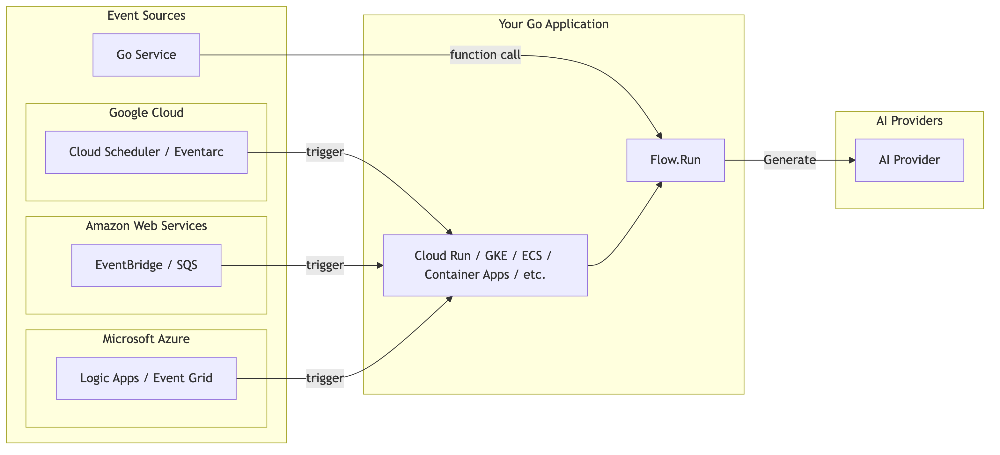

# Building Flows with Genkit Go

In Chapter 4, we explored Generate functions - the nucleus of every AI-powered application in Genkit. But real-world applications rarely consist of isolated AI calls. They require orchestration, error handling, observability, and often need to expose their functionality as HTTP endpoints. This is where Flows come in - Genkit's answer to building production-ready AI workflows that go beyond simple function calls.

## What is a Flow?

At its core, a Flow in Genkit is a specialized type of Action. Actions are Genkit's fundamental abstraction for traceable operations - any function that needs observability, monitoring, and debugging capabilities.

Looking at Genkit's internal implementation, we can see that a Flow is defined as:

```go
type Flow[In, Out, Stream any] ActionDef[In, Out, Stream]
```

This type definition shows that Flows are actually a type alias for `ActionDef` - Genkit's core primitive for traceable operations. The three generic type parameters provide flexibility:

- `In`: The input type your Flow accepts (e.g., `string`, `struct`, or any serializable type)
- `Out`: The output type your Flow returns
- `Stream`: For streaming responses (we'll cover this in Chapter 7)

By building Flows on top of the Action system, every Flow automatically gains powerful capabilities:

- **Developer UI Integration**: Test and monitor your Flows visually
- **Registry Management**: Flows are discoverable and reusable across your application
- **Type Safety**: Compile-time checking of inputs and outputs
- **HTTP Ready**: Can be exposed as endpoints with a single line of code

## How Flows Work Internally

To truly understand Flows, we first need to see where they fit within Genkit's overall architecture. In Chapter 4, we explored the core architecture of Genkit:


Looking at this architecture, Flows occupy a unique position. They're not shown explicitly in this diagram because Flows are actually a higher-level abstraction built on top of these core components. Specifically:

- **Flows are registered in the Registry**: When you define a Flow, it's stored in the same Registry that manages models, prompts, and other Genkit components
- **Flows internally use Generate**: Your Flow functions typically call the Generate/GenerateData functions to interact with AI models
- **Flows are exposed through HTTP**: The Flow becomes accessible as an HTTP endpoint, handling the complete request-response cycle

Now let's dive deeper into how a Flow actually works when it's executed:


This diagram shows how Flows connect different layers of your application:

- **Client**: Your frontend application or API consumer
- **Go Server**: Your application code (`main.go`) with HTTP server
- **Genkit**: The framework's Registry and Flow execution engine
- **AI Providers**: Various AI services (Google AI, Vertex AI, OpenAI, Claude, etc.)

The flow is straightforward:

1. **Setup**: `DefineFlow` registers your Flow in the Registry
2. **Request**: Client sends POST request to your Go server
3. **Execution**: Server calls `RunJSON`, which executes the Flow
4. **AI Call**: Flow uses Generate to call the configured AI provider
5. **Response**: Result returns as JSON to the client

This clean separation between registration and execution is what makes Flows so powerful - they're discoverable, reusable, and can be exposed as HTTP endpoints with minimal code.

Building on what we learned in previous chapters about Generate and Genkit's architecture, a minimal Flow looks like this:

```go
// Setup Phase: Define and register the Flow
greetingFlow := genkit.DefineFlow(g, "greetingFlow", 
    func(ctx context.Context, name string) (string, error) {
        // Flow Function: Process the request
        resp, err := genkit.Generate(ctx, g,
            ai.WithPrompt(fmt.Sprintf("Greet %s warmly", name)),
        )
        if err != nil {
            return "", err
        }
        return resp.Text(), nil
    })

// HTTP Setup: Expose as endpoint
mux.HandleFunc("POST /greetingFlow", genkit.Handler(greetingFlow))
```

When a client calls `POST /greetingFlow` with `{"data": "Nozomi"}`, the flow executes exactly as shown in the diagram above.

## Flow Execution Patterns

Now that we understand the basic Flow structure, let's explore different execution patterns you'll encounter in production applications. These patterns showcase how Flows adapt to various real-world scenarios.

### HTTP Handler vs Direct Execution

Flows can be executed in two primary ways, each serving different use cases:

#### Pattern 1: HTTP Handler

```go
// HTTP handler for external clients
mux.HandleFunc("POST /greetingFlow", genkit.Handler(greetingFlow))
```


HTTP handlers are perfect for:

- Frontend applications calling your AI backend
- REST API endpoints
- Webhook receivers
- Public-facing APIs

#### Pattern 2: Direct Execution

```go
// Direct execution in Go code
result, err := greetingFlow.Run(ctx, "Nozomi")
```



Direct execution is ideal for:

- Calling Flows from other Go code
- Testing and debugging
- Background jobs and scheduled tasks (e.g., Cloud Scheduler → Cloud Run jobs)
- Event-driven processing (e.g., Eventarc → Cloud Run → Flow)
- Internal service-to-service communication
