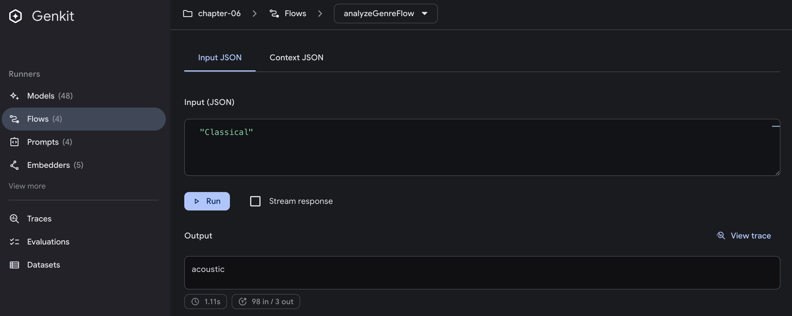

# Building Flows

## Introduction

In Chapter 4, we explored Generate functions - the nucleus of every AI-powered application in Genkit. But real-world applications rarely consist of isolated AI calls. They require orchestration, error handling, observability, and often need to expose their functionality as HTTP endpoints. This is where Flows come in - Genkit's answer to building production-ready AI workflows that go beyond simple function calls.

Flows transform disconnected AI operations into cohesive, observable, and maintainable workflows. They provide the scaffolding needed to build complex AI applications while maintaining the simplicity that Go developers expect. Whether you're building a simple chatbot or a sophisticated multi-step AI pipeline, Flows give you the tools to do it right.

## Prerequisites

Before diving into this chapter, you should have:

- Completed Chapter 4 and understand basic `Generate` and `GenerateData` functions
- Familiarity with HTTP handlers in Go (`net/http` package)
- Basic understanding of context propagation in Go
- Knowledge of error handling patterns in Go
- Access to the Developer UI (covered in Chapter 3)

## What is a Flow?

At its core, a Flow in Genkit is a specialized type of Action. Actions are Genkit's fundamental abstraction for traceable operations - any function that needs observability, monitoring, and debugging capabilities.

Looking at Genkit's internal implementation, we can see that a Flow is defined as:

```go
type Flow[In, Out, Stream any] ActionDef[In, Out, Stream]
```

This type definition shows that Flows are actually a type alias for `ActionDef` - Genkit's core primitive for traceable operations. The three generic type parameters provide flexibility:

- `In`: The input type your Flow accepts (e.g., `string`, `struct`, or any serializable type)
- `Out`: The output type your Flow returns
- `Stream`: For streaming responses (we'll cover this in Chapter 7)

By building Flows on top of the Action system, every Flow automatically gains:

- Developer UI integration for visual testing and monitoring
- Registry management making Flows discoverable and reusable
- Type safety with compile-time checking of inputs and outputs
- HTTP exposure as endpoints with a single line of code

## How Flows Work Internally

To truly understand Flows, we first need to see where they fit within Genkit's overall architecture. In Chapter 4, we explored the core architecture of Genkit:


Looking at this architecture, Flows occupy a unique position. They're not shown explicitly in this diagram because Flows are actually a higher-level abstraction built on top of these core components. Specifically:

- Flows are registered in the Registry alongside models, prompts, and other Genkit components
- Flows internally use Generate/GenerateData functions to interact with AI models
- Flows are exposed through HTTP endpoints, handling the complete request-response cycle

Now let's dive deeper into how a Flow actually works when it's executed:


This diagram shows how Flows connect different layers of your application:

- Client: Your frontend application or API consumer
- Go Server: Your application code (`main.go`) with HTTP server
- Genkit: The framework's Registry and Flow execution engine
- AI Providers: Various AI services (Google AI, Vertex AI, OpenAI, Claude, etc.)

The flow is straightforward:

1. Setup: `DefineFlow` registers your Flow in the Registry
2. Request: Client sends POST request to your Go server
3. Execution: Handler internally calls `RunJSON` (from `core.Action` interface), which executes the Flow
4. AI Call: Flow uses Generate to call the configured AI provider
5. Response: Result returns as JSON to the client

This clean separation between registration and execution makes Flows discoverable, reusable, and easy to expose as HTTP endpoints with minimal code.

Building on what we learned in previous chapters about Generate and Genkit's architecture, a minimal Flow looks like this:

```go
// Setup Phase: Define and register the Flow
greetingFlow := genkit.DefineFlow(g, "greetingFlow", 
    func(ctx context.Context, name string) (string, error) {
        // Flow Function: Process the request
        resp, err := genkit.Generate(ctx, g,
            ai.WithPrompt(fmt.Sprintf("Greet %s warmly", name)),
        )
        if err != nil {
            return "", err
        }
        return resp.Text(), nil
    })

// HTTP Setup: Expose as endpoint
mux.HandleFunc("POST /greetingFlow", genkit.Handler(greetingFlow))
```

When a client calls `POST /greetingFlow` with `{"data": "Nozomi"}`, the flow executes exactly as shown in the diagram above.

## Flow Execution Patterns

Now that we understand the basic Flow structure, let's explore different execution patterns you'll encounter in production applications. These patterns showcase how Flows adapt to various real-world scenarios.

### HTTP Handler vs Direct Execution

Flows can be executed in two primary ways, each serving different use cases:

#### Pattern 1: HTTP Handler

```go
// HTTP handler for external clients
mux.HandleFunc("POST /greetingFlow", genkit.Handler(greetingFlow))
```


HTTP handlers are perfect for:

- Frontend applications calling your AI backend
- REST API endpoints
- Webhook receivers
- Public-facing APIs

#### Pattern 2: Direct Execution

```go
// Direct execution in Go code
result, err := greetingFlow.Run(ctx, "Nozomi")
```


Direct execution is ideal for:

- Calling Flows from other Go code
- Testing and debugging
- Background jobs and scheduled tasks (e.g., Cloud Scheduler → Cloud Run jobs -> Flow)
- Event-driven processing (e.g., Eventarc → Cloud Run → Flow)
- Internal service-to-service communication

## Choosing the Right Execution Pattern

When building Flows, choosing between HTTP handlers and direct execution is a crucial architectural decision. Let's examine when to use each pattern:

| Pattern | Use Case | Benefits | Considerations |
|---------|----------|----------|----------------|
| **HTTP Handler** | Public APIs, Webhooks, Frontend integration | Standard REST interface, Easy testing with curl, Built-in request/response handling | Network overhead, Serialization cost, Authentication needed |
| **Direct Execution** | Internal orchestration, Scheduled jobs, Event processing | No network overhead, Type-safe calls, Direct error handling | Tighter coupling, Not externally accessible |

The beauty of Genkit is that you define your Flow once and can expose it both ways:

```go
// Define once
musicFlow := genkit.DefineFlow(g, "musicFlow", func(ctx context.Context, genre string) (string, error) {
    // Flow logic here
})

// Expose as HTTP
mux.HandleFunc("POST /musicFlow", genkit.Handler(musicFlow))

// Call directly
result, err := musicFlow.Run(ctx, "jazz")
```

## Flow Orchestration

With Flows, you can implement orchestration patterns - composing multiple Flows into sophisticated workflows. This approach enables clean separation of concerns, reusability, and maintainable code architecture.

### Understanding Flow Orchestration

Flow orchestration is about creating higher-level Flows that coordinate multiple child Flows. Think of it as conducting an orchestra where each Flow is an instrument playing its part in a larger symphony.


The orchestrator pattern provides:

- Modularity: Each Flow has a single responsibility
- Reusability: Child Flows can be used in multiple orchestrations
- Testability: Individual Flows can be tested in isolation
- Observability: Complete execution traces through all Flows

### Building an Orchestrator Flow

Let's explore a real-world example: a music instrument recommendation system that orchestrates multiple Flows to deliver personalized recommendations. This example, available in `src/examples/chapter-06/`, demonstrates the key concepts of Flow orchestration.


```go
// NewRecommendationFlow creates an orchestrator flow that coordinates multiple flows
func NewRecommendationFlow(
    g *genkit.Genkit,
    analyzeFlow *core.Flow[string, string, struct{}],
    acousticFlow *core.Flow[string, string, struct{}],
    electronicFlow *core.Flow[string, string, struct{}],
) *core.Flow[structs.RecommendationInput, structs.RecommendationOutput, struct{}] {
    return genkit.DefineFlow(g, "recommendationFlow", 
        func(ctx context.Context, input structs.RecommendationInput) (structs.RecommendationOutput, error) {
            // Step 1: Analyze the genre using Flow_A
            genreCategory, err := analyzeFlow.Run(ctx, input.Genre)
            if err != nil {
                return structs.RecommendationOutput{}, fmt.Errorf("failed to analyze genre: %w", err)
            }

            // Step 2: Get instrument based on category (Flow_B or Flow_C)
            var instrument string
            if genreCategory == "acoustic" {
                instrument, err = acousticFlow.Run(ctx, input.Genre)
            } else {
                instrument, err = electronicFlow.Run(ctx, input.Genre)
            }
            if err != nil {
                return structs.RecommendationOutput{}, 
                    fmt.Errorf("failed to get instrument: %w", err)
            }

            // Step 3: Generate detailed recommendation with Dotprompt
            detailsPrompt := genkit.LookupPrompt(g, "recommendation-details")
            resp, err := detailsPrompt.Execute(ctx,
                ai.WithInput(map[string]any{
                    "genre":      input.Genre,
                    "category":   genreCategory,
                    "instrument": instrument,
                    "experience": input.Experience,
                }))
            
            // Extract structured output
            var output structs.RecommendationOutput
            if err := resp.Output(&output); err != nil {
                return structs.RecommendationOutput{}, err
            }
            
            return output, nil
        })
}
```

This orchestrator demonstrates three patterns:

1. Sequential Execution: Each step depends on the previous one
2. Conditional Branching: Different Flows execute based on intermediate results
3. Error Propagation: Failures bubble up with context

### Orchestration Patterns

#### Pattern 1: Sequential Pipeline

When each Flow's output feeds into the next:

```go
// Pipeline: Input → Transform → Enhance → Output
result1, err := flowA.Run(ctx, input)
if err != nil {
    return err
}

result2, err := flowB.Run(ctx, result1)
if err != nil {
    return err
}

return flowC.Run(ctx, result2)
```

#### Pattern 2: Conditional Routing

When different Flows execute based on conditions:

```go
// Route based on input characteristics
if shouldUseFlowA(input) {
    return flowA.Run(ctx, input)
} else if shouldUseFlowB(input) {
    return flowB.Run(ctx, input)
} else {
    return flowDefault.Run(ctx, input)
}
```

#### Pattern 3: Aggregation

When multiple Flows contribute to a final result:

```go
// Gather data from multiple sources
userData, err := userFlow.Run(ctx, userID)
productData, err := productFlow.Run(ctx, productID)
recommendations, err := recommendFlow.Run(ctx, preferences)

// Combine results
return combineResults(userData, productData, recommendations)
```

## Observability and Debugging

The Developer UI provides visibility into orchestrated Flows. When you execute an orchestrated Flow, you can observe:

### Execution Traces

The trace view shows the complete execution path:


### Data Flow Inspection

At each step, you can inspect:

- Input parameters
- Output values
- Execution duration
- Error details (if any)

## Practical Example: Music Recommendation System

The complete example in `src/examples/chapter-06/` demonstrates Flow orchestration in action with real-world patterns and production considerations.

### Running the Example

First, set up your environment:

```bash
# Set your Google AI API key
export GOOGLE_GENAI_API_KEY="your-api-key"

# Start the application with Developer UI
cd src/examples/chapter-06
genkit start -- go run .
```

Then test the complete system using multiple methods:

```bash
# Using cURL
curl -X POST http://localhost:9090/recommendationFlow \
  -H "Content-Type: application/json" \
  -d '{
    "data": {
      "genre": "jazz",
      "experience": "beginner"
    }
  }'
```

```bash
# Using Genkit CLI
genkit flow:run recommendationFlow '{"genre":"edm","experience":"intermediate"}'
```

### Expected Response

```json
{
  "instrument": "Acoustic Guitar",
  "why": "The acoustic guitar is perfect for jazz beginners...",
  "starter_items": [
    "Guitar picks",
    "Digital tuner",
    "Gig bag"
  ]
}
```

### Testing with Developer UI

The Developer UI offers a better testing experience than command-line tools. Navigate to <http://localhost:4000/flows> to access the visual testing interface.

#### Testing Individual Flows

Click on `analyzeGenreFlow` to test genre categorization:



Try different genres to see the categorization:

- Jazz, Folk, Classical → "acoustic"
- EDM, Techno, Synthwave → "electronic"

#### Testing the Orchestrator Flow

Click on `recommendationFlow` to test the complete orchestration:


After execution, click "View trace" to see the orchestration in action.

## Key Takeaways

- Dual Execution Patterns: Choose between HTTP handlers for external access and direct execution for internal use
- Orchestration: Compose multiple Flows to build complex, maintainable workflows
- Built-in Observability: Developer UI provides complete visibility into Flow execution and debugging

## What's Next

You've now mastered the orchestration patterns that transform isolated AI calls into production-ready systems. The music recommendation example showed how multiple Flows can work together intelligently, but this is just the beginning of what's possible with Genkit's advanced features.

In **Chapter 7: Streaming**, you'll discover how to break free from request-response patterns. Instead of waiting for complete responses, you'll build real-time experiences where users see AI outputs as they're generated - imagine a music composition assistant that streams musical notation in real-time, or a code generator that shows its thinking process progressively. You'll learn the critical difference between `Stream` type parameters and streaming execution, and why this distinction matters for building responsive applications.

The streaming patterns you'll learn aren't just about user experience - they fundamentally change how you architect AI applications, enabling use cases like real-time transcription, progressive content generation, and interactive AI conversations that feel truly conversational rather than transactional.

By combining the orchestration patterns from this chapter with streaming capabilities, you'll be able to build sophisticated AI systems that not only coordinate complex workflows but do so with real-time feedback and progressive enhancement - the hallmark of modern AI applications.
