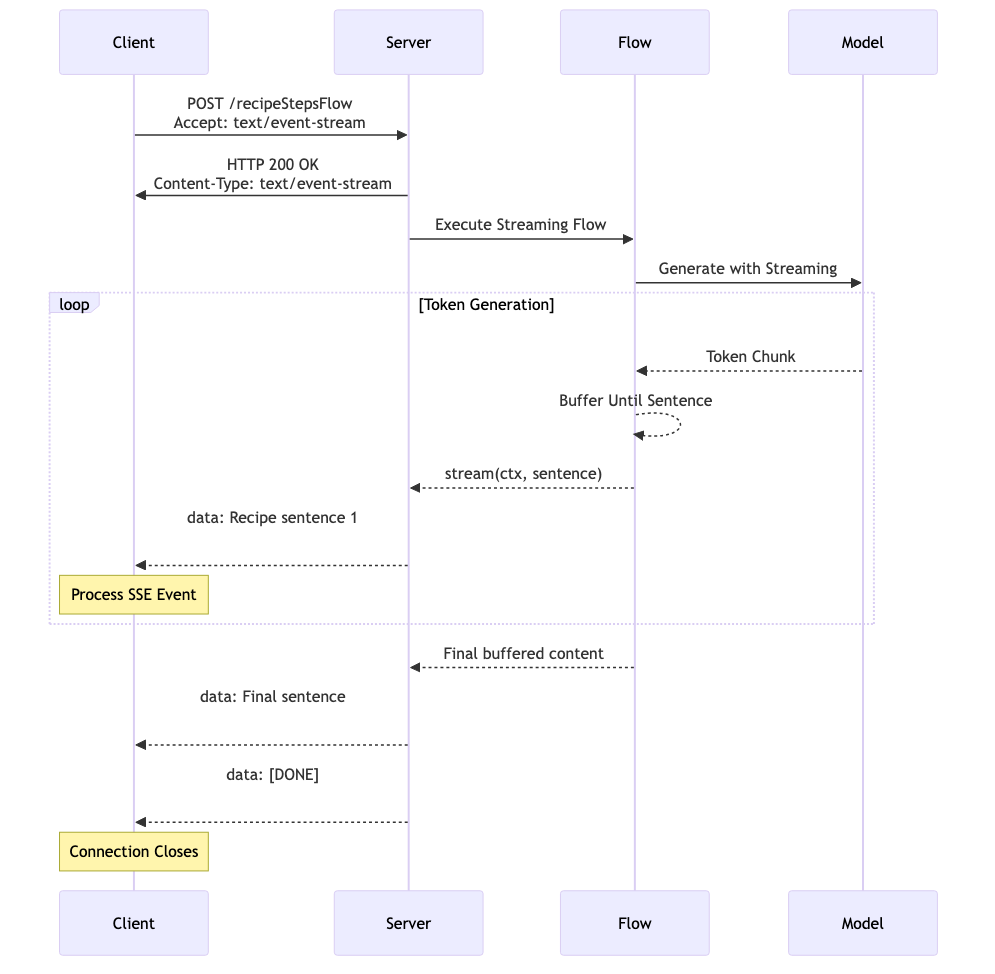
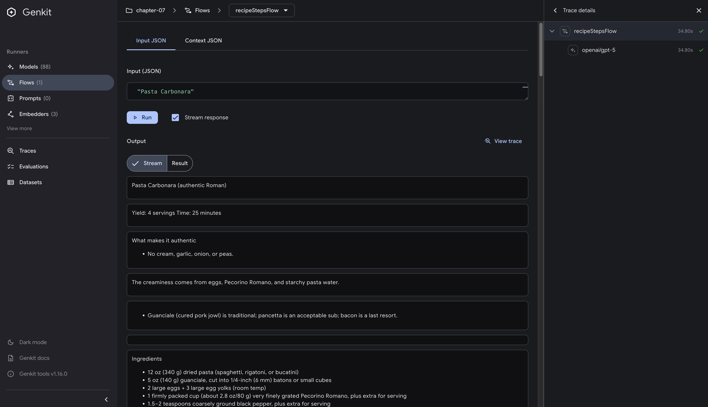

# Streaming Flows

## Introduction

The transformation from batch to streaming represents one of the most fundamental shifts in how we design interactive systems. Consider the difference between watching a master craftsman work versus simply receiving the finished product. There's something deeply human about understanding through observation of process, not just outcomes. We learn by watching the steps unfold, seeing the decisions being made, understanding the reasoning as it happens. This principle applies directly to AI systems - users don't just want answers, they want to witness the thinking unfold.

Streaming transforms AI interactions from transactional to conversational. Instead of waiting for complete responses, users see thoughts forming in real-time, creating a sense of collaboration rather than computation. This shift has profound implications for system architecture, resource management, and user experience design.

This chapter explores streaming through multiple lenses:

- The cognitive and perceptual foundations of why streaming improves user experience
- Deep architectural analysis of streaming protocols and their trade-offs
- Internal implementation details of Genkit's streaming architecture

## Prerequisites

Before diving into streaming, you should be comfortable with:

- Building basic Flows (Chapter 6)
- Understanding Genkit's generation patterns (Chapter 4)
- HTTP server implementation in Go

## The Psychology of Progressive Disclosure

The effectiveness of streaming isn't accidental - it taps into fundamental aspects of human cognition and perception. Research in cognitive psychology reveals that humans process information more efficiently when it arrives in progressive chunks rather than all at once, a phenomenon related to the concept of "chunking" in working memory.

Consider the difference between reading a book page by page versus having the entire contents dumped into your mind instantly. The sequential, progressive nature of streaming aligns with how we naturally process complex information. This isn't just about perceived performance - though that matters enormously - it's about cognitive compatibility.

Furthermore, streaming provides users with agency. The ability to stop, redirect, or modify a request mid-stream transforms the interaction from a passive waiting experience into an active dialogue. This psychological shift from "waiting for results" to "participating in generation" fundamentally changes user engagement patterns.

## Implementing Streaming Flows in Genkit

Genkit provides streaming capabilities through `DefineStreamingFlow`, which extends the standard Flow pattern with real-time data delivery. The key difference is the addition of a stream callback that sends partial results as they become available.

```go
genkit.DefineStreamingFlow(g, "streamingFlow",
    func(ctx context.Context, request string, stream func(context.Context, string) error) (string, error) {
        // Input: what we're processing
        // Stream: incremental results sent via callback
        // Output: final complete result
    })
```

The three type parameters serve distinct purposes:

- **Input Type**: What the flow receives from the client
- **Stream Type**: The format of incremental chunks sent during processing
- **Output Type**: The complete final response

This design allows flexibility - clients can choose to consume the stream for real-time updates or wait for the complete response. The stream callback sends data immediately while the function continues processing, enabling responsive user interfaces without sacrificing the ability to get complete results.

### A Basic StreamingFlow Example

Let's start with the simplest possible streaming implementation to understand the core concepts:

```go
func NewRecipeFlow(g *genkit.Genkit) *core.Flow[string, string, string] {
    return genkit.DefineStreamingFlow(g, "recipeStepsFlow",
        func(ctx context.Context, dish string, stream func(context.Context, string) error) (string, error) {
            // Generate with real-time streaming
            final, err := genkit.Generate(ctx, g,
                ai.WithSystem("You are a professional chef creating detailed, easy-to-follow cooking instructions."),
                ai.WithPrompt(fmt.Sprintf(`Create a detailed recipe for "%s".`, dish)),
                ai.WithStreaming(func(ctx context.Context, chunk *ai.ModelResponseChunk) error {
                    // Forward each chunk immediately to the client
                    for _, content := range chunk.Content {
                        if err := stream(ctx, content.Text); err != nil {
                            return err
                        }
                    }
                    return nil
                }),
            )

            if err != nil {
                return "", fmt.Errorf("failed to generate recipe: %w", err)
            }

            return final.Text(), nil
        })
}
```

This simple implementation demonstrates the two essential components:

1. **`DefineStreamingFlow`**: Creates a flow that can send incremental results via the `stream` callback
2. **`ai.WithStreaming`**: Receives chunks from the model and decides when to forward them to clients

Each token from the model is immediately forwarded to the client, creating real-time streaming. For production use, you might want to buffer content to send more meaningful chunks (like complete sentences), but this basic pattern shows the core streaming mechanics clearly.

### Adding Smart Buffering

Here's a slightly enhanced version that buffers content until it has complete sentences, providing better user experience:

```go
func NewRecipeFlow(g *genkit.Genkit) *core.Flow[string, string, string] {
    return genkit.DefineStreamingFlow(g, "recipeStepsFlow",
        func(ctx context.Context, dish string, stream func(context.Context, string) error) (string, error) {
            var buffer string
            
            final, err := genkit.Generate(ctx, g,
                ai.WithSystem("You are a professional chef creating detailed, easy-to-follow cooking instructions."),
                ai.WithPrompt(fmt.Sprintf(`Create a detailed recipe for "%s".`, dish)),
                ai.WithStreaming(func(ctx context.Context, chunk *ai.ModelResponseChunk) error {
                    // Add new content to buffer
                    for _, content := range chunk.Content {
                        buffer += content.Text
                    }
                    
                    // Send complete sentences
                    for strings.Contains(buffer, ". ") {
                        idx := strings.Index(buffer, ". ") + 2  // Include ". "
                        sentence := buffer[:idx]
                        buffer = buffer[idx:]
                        
                        if err := stream(ctx, sentence); err != nil {
                            return err
                        }
                    }
                    return nil
                }),
            )

            if err != nil {
                return "", err
            }
            
            // Send any remaining content
            if buffer != "" {
                stream(ctx, buffer)
            }

            return final.Text(), nil
        })
}
```

This approach strikes a balance between responsiveness and readability - clients receive meaningful chunks while still getting real-time updates as content is generated.

## Understanding Server-Sent Events (SSE)

Genkit uses Server-Sent Events (SSE) for streaming responses. While WebSockets might seem like an obvious choice for real-time communication, SSE is actually better suited for AI text generation where data flows in one direction: from server to client.

### WebSocket vs SSE: A Detailed Comparison

| Aspect | WebSocket | Server-Sent Events (SSE) |
|--------|-----------|--------------------------|
| **Communication** | Bidirectional (full-duplex) | Unidirectional (server → client) |
| **Protocol** | Custom protocol over TCP | Standard HTTP |
| **Data Format** | Text and binary | Text only |
| **Complexity** | Higher (state management) | Lower (stateless) |
| **Use Case** | Real-time bidirectional | Server push notifications |
| **Memory Usage** | 2-3x higher | Baseline |
| **Infrastructure** | Special handling required | Standard HTTP infra |

For AI streaming, SSE's simplicity and unidirectional nature align perfectly with the use case: the client sends a prompt, and the server streams back a response.

### Why SSE Works Better for AI

Looking at modern LLM chat applications like ChatGPT, Claude, and Gemini, we can observe how streaming responses have become the standard for AI interactions. Their real-time text generation demonstrates why SSE is particularly effective for AI chat applications:

**Perfect Fit for the Use Case**: AI text generation is unidirectional - the client sends a prompt, the server streams back a response. WebSocket's bidirectional capabilities add complexity without providing value for this specific pattern.

**Proven Pattern**: The widespread adoption of streaming in AI chat applications shows its effectiveness for user experience. Users can read and process responses as they're generated, rather than waiting for complete responses.

**Infrastructure Compatibility**: SSE works seamlessly with existing HTTP infrastructure - CDNs, load balancers, and proxies all handle it without special configuration. This matters when deploying globally distributed AI services.

### The SSE Response Format

SSE defines a precise text format that might seem primitive compared to WebSocket's flexibility, but this simplicity is actually its strength. Each event follows a consistent pattern:

```text
data: Step 1: Boil water.

data: Step 2: Add noodles to the boiling water.

data: Step 3: Cook for 3-4 minutes, stirring occasionally.
```

The double newline after each `data:` line isn't optional - it's the event boundary marker that tells clients one event has ended and another may begin. This format works reliably across all HTTP infrastructure because it's just UTF-8 text with specific line endings.

### How Genkit Formats Streaming Data

In practice, Genkit's streaming endpoints send data in a specific JSON structure. Each chunk arrives as a separate SSE event containing either incremental content or the final result:

```json
data: {"message": "Step 1: Prepare"}

data: {"message": " the ingredients"}

data: {"message": " and equipment."}

data: {"result": "Step 1: Prepare the ingredients and equipment."}

```

The `message` field contains incremental chunks as they're generated. Notice how the text accumulates - each chunk contains only the new portion, not the full text so far. The final `result` field provides the complete assembled response, allowing clients to either process chunks incrementally or wait for the complete result.

This structure gives clients flexibility in how they consume the stream. A simple client might ignore the incremental messages and only use the final result, while a sophisticated UI could display text as it arrives, creating that familiar "typing" effect users have come to expect from AI interactions.

When errors occur during streaming, Genkit sends them through the same SSE channel:

```json
data: {"message": "Processing your"}

data: {"error": {"message": "Model rate limit exceeded"}}

```

This in-band error handling ensures clients receive error information even when the stream is partially complete, allowing for graceful error recovery and user feedback.

### Complete SSE Streaming Flow

The following diagram illustrates the complete flow from client request to model generation and back through SSE streaming:



This diagram shows how all the pieces work together: the client sends a POST request with `Accept: text/event-stream`, the server executes the streaming flow, the model generates tokens that get buffered into sentences, and the client receives properly formatted SSE events. Notice how the buffering strategy we discussed earlier fits into the complete flow - tokens from the model are accumulated until complete sentences are ready to send.

## Client-Side SSE Processing

Now that we understand how Genkit implements streaming flows and the SSE protocol, let's examine how clients consume these streams. Most SSE examples in documentation demonstrate simple GET requests, which work well for notifications or monitoring dashboards. However, AI generation presents different requirements: we need to send complex input data (prompts, configuration, context) to the server.

### Why POST for AI Streaming

The choice of POST over GET for SSE in AI applications isn't arbitrary - it reflects the nature of what we're building. AI generation isn't simply data retrieval; it's a computational process that transforms complex input into new content. The input might be a simple string, or it could be structured configuration:

```json
{
  "ingredients": ["noodles", "eggs", "vegetables"],
  "style": "Japanese",
  "difficulty": "beginner"
}
```

This payload naturally fits in a request body, not URL parameters. While technically possible to encode this in a GET request, doing so would violate HTTP semantics and create practical problems with URL length limits and caching behavior.

### Making Requests to Streaming Flows

When implementing SSE with POST, the client signals its expectation through headers while providing input through the body:

```bash
curl -N -X POST http://127.0.0.1:9090/recipeStepsFlow \
  -H "Accept: text/event-stream" \
  -H "Content-Type: application/json" \
  -d '{"data":"Ramen"}'
```

The `Accept: text/event-stream` header tells the server we expect SSE formatting, not a traditional JSON response. Genkit handlers expect the input wrapped under a `data` field, so even for a simple string input, the request body should be `{ "data": "..." }`. The `-N` flag disables curl's buffering so events appear as they are sent.

### Production Client Implementation

For production clients, this pattern translates across programming languages. Here's how you might implement SSE streaming in Dart:

```dart
// Request setup for streaming
final request = http.Request('POST', uri);
request.headers['Accept'] = 'text/event-stream';
request.headers['Content-Type'] = 'application/json';
request.body = jsonEncode({'data': input});

final streamedResponse = await httpClient.send(request);

// Process SSE stream
streamedResponse.stream
  .transform(utf8.decoder)
  .listen((chunk) {
    buffer += chunk;
    while (buffer.contains('\n\n')) {  // SSE event boundary
      final endOfChunk = buffer.indexOf('\n\n');
      final eventData = buffer.substring(0, endOfChunk);
      buffer = buffer.substring(endOfChunk + 2);
      
      if (eventData.startsWith('data: ')) {
        final jsonData = eventData.substring(6);  // Remove 'data: '
        final parsed = jsonDecode(jsonData);
        
        if (parsed['message'] != null) {
          // Handle incremental chunk
          onStreamChunk(parsed['message']);
        } else if (parsed['result'] != null) {
          // Handle final result
          onComplete(parsed['result']);
        }
      }
    }
  });
```

This implementation demonstrates the essential pattern that any SSE client must follow:

1. **Request Setup**: POST with proper headers (`Accept: text/event-stream`)
2. **Stream Processing**: Handle incoming text chunks by buffering and parsing events
3. **Event Parsing**: Extract `data:` lines and parse the JSON content
4. **Message Routing**: Handle different message types (`message` vs `result`)

The key insight is that SSE processing requires maintaining state (the buffer) because events can arrive fragmented across multiple chunks. The `\n\n` delimiter marks complete events, allowing clients to process them atomically.

## Testing the Streaming Flow

Let's put our streaming implementation to the test. The example in `src/examples/chapter-07/` provides a complete working streaming flow that you can run and experiment with.

### Running the Server

First, start the streaming flow server:

```bash
cd src/examples/chapter-07
export OPENAI_API_KEY=your_openai_api_key_here
go run .
```

The server will start on port 9090 and expose the `recipeStepsFlow` endpoint we implemented earlier.

### Testing with curl

Test the streaming flow using curl to see SSE in action:

```bash
curl -N -X POST http://127.0.0.1:9090/recipeStepsFlow \
  -H "Accept: text/event-stream" \
  -H "Content-Type: application/json" \
  -d '{"data":"Ramen"}'
```

You should see streaming output like this:

```text
data: {"message": "\n- Make tare: 1/4 cup soy, 2 tbsp mirin, 2 tbsp sake, 1/4 cup stock; heat 2 minutes, optional pinch sugar; strain."}

data: {"message": "\n- Aroma oil: Gently sizzle 2 tbsp oil with 1 smashed garlic clove and a few scallion whites 3 minutes; strain."}

data: {"message": "\n- Cook fresh ramen noodles; assemble using 1–1.5 tbsp tare and 1 tsp oil per bowl."}

data: {"message": " Top with rotisserie chicken slices, soft-boiled eggs, scallions, and nori."}

data: {"result": "Complete recipe content..."}
```

Notice how the content arrives in meaningful chunks (thanks to our buffering strategy) rather than individual tokens, making it much more readable for users.

### Using the Developer UI

Alternatively, you can test the streaming flow through Genkit's Developer UI:

1. With the server running, visit `http://localhost:4000/flows/recipeStepsFlow`
2. **Important**: Check the `Stream response` checkbox before running
3. Enter a dish name like "Pasta Carbonara"
4. Click `Run` to start the streaming test
5. Watch the response stream in real-time in the UI



The screenshot above shows the Developer UI in action. Notice how the streaming content appears in separate chunks in the output area, with clear separation between each piece of the recipe. The `Stream` tab is automatically selected when you enable streaming, allowing you to see the incremental updates as they arrive.

The Developer UI provides a great way to visualize how streaming works and experiment with different inputs without writing client code.

### Testing with Genkit CLI

You can also test streaming flows using the Genkit CLI tool:

> The Genkit CLI requires your application to be running. Make sure you have started the server with `genkit start -- go run .` before running these commands.

```bash
cd src/examples/chapter-07
genkit flow:run recipeStepsFlow '"Ramen"' -s
```

The `-s` flag enables streaming output to the console, allowing you to see the incremental chunks as they arrive. You'll see output like:

```text
Running '/flow/recipeStepsFlow' (stream=true)...
- Make tare: 1/4 cup soy, 2 tbsp mirin, 2 tbsp sake, 1/4 cup stock; heat 2 minutes, optional pinch sugar; strain.
- Aroma oil: Gently sizzle 2 tbsp oil with 1 smashed garlic clove and a few scallion whites 3 minutes; strain.
- Cook fresh ramen noodles; assemble using 1–1.5 tbsp tare and 1 tsp oil per bowl. Top with rotisserie chicken slices, soft-boiled eggs, scallions, and nori.
```

This demonstrates the actual streaming behavior and is particularly useful for testing streaming flows from the command line during development.

### Client-Side Implementation Example

As an example of programmatic client implementation, here's how you can consume streaming responses using Dart. This same pattern applies to other programming languages with appropriate HTTP libraries:

```dart
import 'dart:async';
import 'dart:convert';
import 'package:http/http.dart' as http;

Future<void> main() async {
  final client = http.Client();
  
  try {
    final request = http.Request('POST', Uri.parse('http://127.0.0.1:9090/recipeStepsFlow'));
    request.headers['Accept'] = 'text/event-stream';
    request.headers['Content-Type'] = 'application/json';
    request.body = jsonEncode({'data': 'Ramen'});

    final response = await client.send(request);
    
    if (response.statusCode == 200) {
      var buffer = '';
      
      await response.stream.transform(utf8.decoder).listen((chunk) {
        buffer += chunk;
        
        while (buffer.contains('\n\n')) {
          final eventEnd = buffer.indexOf('\n\n');
          final event = buffer.substring(0, eventEnd);
          buffer = buffer.substring(eventEnd + 2);
          
          if (event.startsWith('data: ')) {
            final jsonData = event.substring(6);
            final parsed = jsonDecode(jsonData);
            
            if (parsed['message'] != null) {
              print('Streaming chunk: ${parsed['message']}');
            } else if (parsed['result'] != null) {
              print('Final result: ${parsed['result']}');
            }
          }
        }
      }).asFuture();
    }
  } finally {
    client.close();
  }
}
```

To run this Dart client:

```bash
dart pub get
dart run client/bin/streaming_client.dart
```

Running this Dart client produces output like:

```text
Streaming chunk: 
- Make tare: 1/4 cup soy, 2 tbsp mirin, 2 tbsp sake, 1/4 cup stock; heat 2 minutes, optional pinch sugar; strain.
Streaming chunk: 
- Aroma oil: Gently sizzle 2 tbsp oil with 1 smashed garlic clove and a few scallion whites 3 minutes; strain.
Streaming chunk: 
- Cook fresh ramen noodles; assemble using 1–1.5 tbsp tare and 1 tsp oil per bowl.
Streaming chunk:  Top with rotisserie chicken slices, soft-boiled eggs, scallions, and nori.
```

This demonstrates how to implement the SSE client pattern we discussed earlier, showing real streaming behavior in a production-like environment.

## Key Takeaways

- **DefineStreamingFlow enables real-time AI interactions** - Transform batch processes into progressive experiences where users see outputs as they're generated
- **SSE is the optimal choice for AI streaming** - Unidirectional data flow, HTTP compatibility, and infrastructure simplicity make SSE superior to WebSockets for LLM applications
- **Smart buffering improves user experience** - Balance between immediate token streaming and meaningful chunk delivery using sentence-boundary detection
- **Multiple testing approaches serve different needs** - curl for protocol understanding, Developer UI for visualization, CLI for development workflows, and programmatic clients for production integration
- **Client-side SSE processing follows universal patterns** - Buffer management, event parsing, and state handling techniques apply across all programming languages

## What's Next

You've mastered streaming to create responsive, real-time AI experiences, but AI applications become truly powerful when they can interact with external systems. In **Chapter 8: Tools**, you'll discover how to extend AI capabilities beyond text generation by giving models the ability to call functions, query databases, interact with APIs, and manipulate external resources.

Imagine combining the streaming patterns you've learned with tool-enabled AI: a streaming flow that not only generates a recipe in real-time but also simultaneously checks ingredient availability in your local grocery store, calculates nutritional information, and adjusts portions based on dietary restrictions - all while streaming the results progressively to create a seamless user experience.

The streaming foundation you've built becomes even more valuable when AI can take actions in the real world. You'll learn how to define tools that models can discover and use autonomously, creating AI systems that don't just respond to queries but actively solve problems by leveraging external capabilities.

By combining streaming responsiveness with tool-enabled functionality, you'll be able to build AI applications that are both interactive and intelligent - systems that think out loud while taking meaningful actions in your digital ecosystem.
