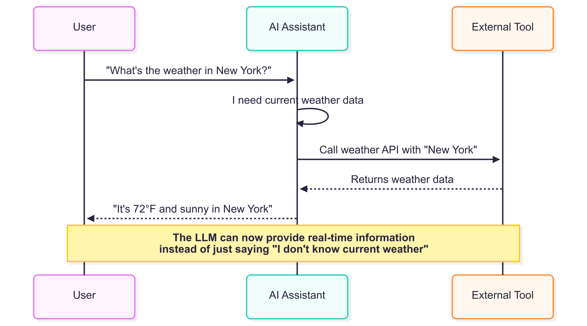

# Tool Calling

## Introduction

One of the most powerful features of Genkit Go is the ability to extend AI capabilities through tool calling. Tools allow your AI models to interact with external systems, perform computations, retrieve data, and execute actions beyond simple text generation. This chapter will explore how to create, integrate, and use tools effectively in your Genkit Go applications.

## Prerequisites

Before diving into this chapter, you should have:

- Completed the previous chapters and have a working Genkit Go development environment
- Basic understanding of Go's type system and error handling
- Having an OpenAI API key set up in your environment since we will use the OpenAI plugin for tool calling
- Familiarity with JSON schemas and data validation concepts
- Familiarity with Go's type system and error handling

## What is Tool Calling?

Tool calling, also known as function calling, is a mechanism that allows AI models to invoke predefined functions during their generation process. Instead of being limited to generating text responses, AI models can:

- Call external APIs
- Perform calculations
- Access databases
- Manipulate files and directories
- Retrieve real-time information
- Execute system commands

The AI model can intelligently decide when and how to use these tools based on the user's request, making your applications more dynamic and capable. It is important to know that is not the model the one that executes the tools, but rather the Genkit framework that manages tool execution and integrates results into the AI's response. When a tool execution is required, the Genkit framework will call the appropriate tool function with the provided parameters, and then integrate the result into the AI's response.

## How Tool Calling Works



The tool calling process follows this workflow:

1. **Tool Definition**: You define tools with specific schemas and implementation functions
2. **Registration**: Tools are registered with your Genkit instance when using `genkit.DefineTool()` method
3. **Context Provision**: Tools are provided to the AI model during generation with the method `ai.WithTools()`
4. **Model Decision**: The AI model decides whether to call tools based on the user's request
5. **Tool Execution**: If needed, the model calls the appropriate tool with parameters
6. **Response Integration**: Tool results are integrated into the final response

## Key Components of a Tool

A tool in Genkit Go is defined by several key components. the method `genkit.DefineTool()` is used to create a tool, which takes the following parameters:

```go
DefineTool(
    genkitClient *genkit.Genkit,
    name string,
    description string,
    implementation func(ctx *ai.ToolContext, input InputType) (OutputType, error),
)
```

When defining a tool, you need to specify:

1. **Input Structure**: Define a struct that represents the tool's input parameters
2. **Name**: A unique identifier for the tool
3. **Description**: Clear documentation that helps the AI understand when and how to use the tool
4. **Implementation**: The actual function that performs the tool's work
5. **Tool Function**: Use `genkit.DefineTool()` to create the tool

The description should be concise and provide enough context for the AI model to understand when to use the tool. The implementation function should handle the input, perform the necessary operations, and return the result. Same as the input and output structures, the implementation function should be well-defined to ensure clarity and maintainability. Why? because it helps the AI model understand the tool's purpose and how to use it effectively.

## Best Practices for Tool Implementation

When implementing tools, consider the following best practices to ensure they are effective and easy to use:

1. **Clear Input Structures**: Use descriptive field names and JSON schema annotations
2. **Comprehensive Error Handling**: Return meaningful error messages
3. **Logging**: Add logging for debugging and monitoring
4. **Validation**: Validate input parameters before processing
5. **Descriptions**: Provide clear descriptions that help the AI understand the tool's purpose

## Examples of Tool Definitions

### Creating Your First Tool: Getting the Current Date

Let's start with a simple example, a tool that gets the current date and time. In our example project, we have implemented this in `internal/tools/date.go`:

```go
package tools

import (
    "fmt"
    "log"
    "time"

    "github.com/firebase/genkit/go/ai"
    "github.com/firebase/genkit/go/genkit"
)

// DateRequest represents the input structure for the date tool
type DateRequest struct {
    Format string `json:"format" jsonschema_description:"Date format to use"` // Optional format string
}

// NewGetCurrentDate creates a tool that returns the current date in a specified format
func NewGetCurrentDate(genkitClient *genkit.Genkit) ai.Tool {
    return genkit.DefineTool(
        genkitClient,
        "getCurrentDate",
        "Gets the current date and time in a specified format. Accepts a string with an optional 'format' field. Common formats: 'RFC3339' (default), 'Kitchen', 'Stamp', 'DateTime', or custom Go time format like '2006-01-02 15:04:05'.",
        func(ctx *ai.ToolContext, input DateRequest) (string, error) {
            log.Printf("Tool 'getCurrentDate' called with input: %s", input)

            // Set default format if none provided
            if input.Format == "" {
                input.Format = time.RFC3339
            }

            now := time.Now()
            var formattedDate string

            // Handle common named formats
            switch input.Format {
            case "RFC3339":
                formattedDate = now.Format(time.RFC3339)
            case "Kitchen":
                formattedDate = now.Format(time.Kitchen)
            case "Stamp":
                formattedDate = now.Format(time.Stamp)
            case "DateTime":
                formattedDate = now.Format(time.DateTime)
            case "DateOnly":
                formattedDate = now.Format(time.DateOnly)
            case "TimeOnly":
                formattedDate = now.Format(time.TimeOnly)
            case "RFC822":
                formattedDate = now.Format(time.RFC822)
            case "RFC1123":
                formattedDate = now.Format(time.RFC1123)
            default:
                // Treat as custom format
                formattedDate = now.Format(input.Format)
            }

            result := fmt.Sprintf("Current date and time: %s (format: %s)", formattedDate, input.Format)
            log.Printf("Returning formatted date: %s", result)

            return result, nil
        })
}
```

In the example above, we define a tool called `getCurrentDate` that accepts an optional format string. If no format is provided, it defaults to `RFC3339`. The tool formats the current date and time according to the specified format and returns it as a string. It has a simple input structure but it showcases how to define a tool using a structured input and a clear implementation function. It is also important to note the property `jsonschema_description` in the input structure, which provides a description for the AI model to understand how to use the tool effectively.

One important thing that it is worth noting is how easy it is to create tools using Genkit Go. It is as simple as defining a struct for the input parameters, implementing the tool function using `genkit.DefineTool()`, and providing a clear description. The code that you will write it is simple and straightforward and follows a consistent pattern, making it easy to maintain and extend.

### Building Directory Management Tools

Let's examine more complex tools that interact with the file system. Our example includes tools for listing and creating directories. Lets tackle first the `listDirectories` tool that lists all directories in the current working directory. This tool is defined in `internal/tools/directories.go`:

```go
package tools

import (
    "fmt"
    "log"
    "os"

    "github.com/firebase/genkit/go/ai"
    "github.com/firebase/genkit/go/genkit"
)

type ListDirectoryInput struct {
    Directory string `json:"directory" jsonschema_description:"Directory to list contents of"`
}

// NewListDirectories creates a tool that lists directories
func NewListDirectories(genkitClient *genkit.Genkit) ai.Tool {
    return genkit.DefineTool(
        genkitClient,
        "listDirectories",
        "Lists all directories in the current working directory.",
        func(ctx *ai.ToolContext, input ListDirectoryInput) ([]string, error) {
            log.Printf("Tool 'listDirectories' called with input: %s", input)

            // Read directory entries
            entries, err := os.ReadDir(input.Directory)
            if err != nil {
                log.Printf("Error reading directory: %v", err)
                return nil, fmt.Errorf("Error reading directory '%s': %v", input.Directory, err)
            }

            // Filter for directories only
            var directories []string
            for _, entry := range entries {
                if entry.IsDir() {
                    directories = append(directories, entry.Name())
                }
            }

            if len(directories) == 0 {
                return nil, fmt.Errorf("No directories found in current working directory")
            }

            return directories, nil
        })
}
```

In this example, you saw how easy is to create a tool that lists directories in the current working directory. The `listDirectories` tool accepts an input structure with a `directory` field, which specifies the directory to list. It reads the directory entries using `os.ReadDir()`, filters for directories, and returns a slice of directory names.

Let's also create a tool that creates a directory. This tool is defined in `internal/tools/directories.go` as well:

```go
package tools

import (
    "fmt"
    "log"
    "os"

    "github.com/firebase/genkit/go/ai"
    "github.com/firebase/genkit/go/genkit"
)

type CreateDirectoryInput struct {
    Directory string `json:"directory" jsonschema_description:"Directory to create"`
}

// NewCreateDirectory creates a tool that creates a new directory.
func NewCreateDirectory(genkitClient *genkit.Genkit) ai.Tool {
    return genkit.DefineTool(
        genkitClient,
        "createDirectory",
        "Creates a new directory with the specified name. Input should be the directory name or path.",
        func(ctx *ai.ToolContext, input CreateDirectoryInput) (string, error) {
            log.Printf("Tool 'createDirectory' called with input: %s", input)

            if input.Directory == "" {
                return "Error: Directory name cannot be empty", nil
            }

            // Create the directory
            err := os.MkdirAll(input.Directory, 0755)
            if err != nil {
                log.Printf("Error creating directory '%s': %v", input.Directory, err)
                return "Error: Could not create directory '" + input.Directory + "': " + err.Error(), nil
            }

            log.Printf("Successfully created directory: %s", input.Directory)
            return "Successfully created directory: " + input.Directory, nil
        })
}
```

This `createDirectory` tool accepts a `directory` field in its input structure, which specifies the name of the directory to create. It uses `os.MkdirAll()` to create the directory and returns a success message or an error if the operation fails.

## Creating Flows with Tools

Tools become powerful when integrated into flows. Here's how our example creates a flow that uses multiple tools:

```go
package flows

import (
    "context"
    "fmt"

    "github.com/firebase/genkit/go/ai"
    "github.com/firebase/genkit/go/core"
    "github.com/firebase/genkit/go/genkit"
)

// NewOperatingSystemFlow creates a flow that interacts with the operating system
func NewOperatingSystemFlow(g *genkit.Genkit, tools []ai.ToolRef) *core.Flow[string, string, struct{}] {
    return genkit.DefineFlow(g, "operatingSystemFlow", func(ctx context.Context, userRequest string) (string, error) {
        resp, err := genkit.Generate(ctx, g,
            ai.WithSystem("You are an AI assistant that can interact with the operating system. Use the available tools to perform tasks."),
            ai.WithPrompt(`The user wants to: %s`, userRequest),
            ai.WithTools(tools...),
        )
        if err != nil {
            return "", fmt.Errorf("failed to generate response: %w", err)
        }

        return resp.Text(), nil
    })
}
```

This flow, `operatingSystemFlow`, uses the tools we defined earlier to handle user requests related to operating system operations. It provides a structured way to interact with the AI model and execute tools based on user input.

## Integrating Tools in Your Application

In your main application, you'll initialize tools and register them with flows. The following code snippet shows how to set up the Genkit application with the tools we created and puts everything together:

```go
package main

import (
    "context"
    "log"
    "mastering-genkit-go/example/chapter-08/internal/flows"
    "mastering-genkit-go/example/chapter-08/internal/tools"
    "net/http"
    "os"

    "github.com/firebase/genkit/go/ai"
    "github.com/firebase/genkit/go/genkit"
    "github.com/firebase/genkit/go/plugins/compat_oai/openai"
    "github.com/firebase/genkit/go/plugins/server"
)

func main() {
    ctx := context.Background()

    // Initialize Genkit with OpenAI plugin
    g, err := genkit.Init(ctx,
        genkit.WithPlugins(&openai.OpenAI{
            APIKey: os.Getenv("OPENAI_API_KEY"),
        }),
        genkit.WithDefaultModel("openai/gpt-4o"),
    )
    if err != nil {
        log.Fatalf("could not initialize Genkit: %v", err)
    }

    // Create tools
    operatingSystemFlow := flows.NewOperatingSystemFlow(g, []ai.ToolRef{
        tools.NewListDirectories(g),
        tools.NewCreateDirectory(g),
        tools.NewGetCurrentDate(g),
    })

    // Set up HTTP handlers
    mux := http.NewServeMux()
    mux.HandleFunc("POST /operatingSystemFlow", genkit.Handler(operatingSystemFlow))

    // Start server
    port := os.Getenv("PORT")
    if port == "" {
        port = "9090"
    }

    log.Printf("Starting server on 127.0.0.1:%s", port)
    log.Fatal(server.Start(ctx, "0.0.0.0:"+port, mux))
}
```

As you can see, we define a flow that uses the tools we created. The flow is registered with an HTTP handler available at `/operatingSystemFlow`, allowing users to interact with it via API requests:

1. **Initialize Genkit**: Set up the Genkit instance with the OpenAI plugin
2. **Create Tools**: Instantiate the tools we defined earlier
3. **Define Flow**: Create a flow that uses the tools to handle user requests
4. **HTTP Handler**: Register the flow with an HTTP handler for easy access

## Tool Calling in Action

When you run the example application, you can send requests like:

- "What time is it?"
- "List all directories in the current folder"
- "Create a directory called 'test-folder'"
- "Show me the current date in a readable format"
- "Get system information in JSON format"
- "Show me my environment variables HOME and PATH"
- "Get a summary of system info including hostname and current user"

The AI model will automatically decide which tools to call based on your request. For example:

1. **Time request**: The model calls `getCurrentDate` tool
2. **Directory listing**: The model calls `listDirectories` tool
3. **Directory creation**: The model calls `createDirectory` tool
4. **System information**: The model calls `systemInfo` tool with complex parameters


## Testing Your Tools in the UI

As you develop tools, it's important to test them thoroughly. When you are running the Genkit UI using the Genkit CLI locally, you can test your tools directly in the UI.


The UI provides a simple interface to interact with your tools, allowing you to send requests and see responses in real-time:


## Advanced Tool Patterns

### Chaining Tools


Tools can be chained together to accomplish complex tasks. The AI model can call multiple tools in sequence:

```bash
User: "Create a backup directory with the current date"
1. AI calls getCurrentDate() 
2. AI calls createDirectory("backup")
3. AI combines results in response
```

Here you can see an example with this prompt:

```bash
Create a directory with the name my_folder_{current_date} where {current_date} is the current date in RFC3339 format
```


Here you can see the trace of the tool calls in the UI:


### Complex Input Structures

Tools can accept complex input structures with multiple parameters, validation rules, and nested data. This allows for more sophisticated tool behavior and fine-grained control over tool execution. Here's an example of the `systemInfo` tool that demonstrates a complex input pattern:

```go
// NewSystemInfo creates a tool that gathers system information based on complex criteria.
func NewSystemInfo(genkitClient *genkit.Genkit) ai.Tool {
    return genkit.DefineTool(
        genkitClient,
        "systemInfo",
        "Gathers system information based on specified criteria and formatting options",
        func(ctx *ai.ToolContext, input struct {
            InfoTypes    []string `json:"info_types" jsonschema_description:"Types of info to gather: 'env', 'workdir', 'hostname', 'user'"`
            EnvVars      []string `json:"env_vars" jsonschema_description:"Specific environment variables to retrieve"`
            Format       string   `json:"format" jsonschema_description:"Output format: 'json', 'text', or 'summary'"`
            IncludeEmpty bool     `json:"include_empty" jsonschema_description:"Whether to include empty/unset values"`
            MaxLength    int      `json:"max_length" jsonschema_description:"Maximum length for each value (0 for no limit)"`
        }) (string, error) {
            log.Printf("Tool 'systemInfo' called with types: %v, format: %s", input.InfoTypes, input.Format)

            if len(input.InfoTypes) == 0 {
                return "Error: At least one info type must be specified", nil
            }

            var results []string

            for _, infoType := range input.InfoTypes {
                switch infoType {
                case "env":
                    envInfo := "Environment Variables:\n"
                    if len(input.EnvVars) > 0 {
                        // Get specific environment variables
                        for _, envVar := range input.EnvVars {
                            value := os.Getenv(envVar)
                            if !input.IncludeEmpty && value == "" {
                                continue
                            }
                            if input.MaxLength > 0 && len(value) > input.MaxLength {
                                value = value[:input.MaxLength] + "..."
                            }
                            envInfo += fmt.Sprintf("  %s=%s\n", envVar, value)
                        }
                    } else {
                        // Get common environment variables
                        commonVars := []string{"HOME", "USER", "PATH", "SHELL", "PWD"}
                        for _, envVar := range commonVars {
                            value := os.Getenv(envVar)
                            if !input.IncludeEmpty && value == "" {
                                continue
                            }
                            if input.MaxLength > 0 && len(value) > input.MaxLength {
                                value = value[:input.MaxLength] + "..."
                            }
                            envInfo += fmt.Sprintf("  %s=%s\n", envVar, value)
                        }
                    }
                    results = append(results, envInfo)

                case "workdir":
                    workdir, err := os.Getwd()
                    if err != nil {
                        results = append(results, fmt.Sprintf("Working Directory: Error - %v\n", err))
                    } else {
                        if input.MaxLength > 0 && len(workdir) > input.MaxLength {
                            workdir = workdir[:input.MaxLength] + "..."
                        }
                        results = append(results, fmt.Sprintf("Working Directory: %s\n", workdir))
                    }

                case "hostname":
                    hostname, err := os.Hostname()
                    if err != nil {
                        results = append(results, fmt.Sprintf("Hostname: Error - %v\n", err))
                    } else {
                        results = append(results, fmt.Sprintf("Hostname: %s\n", hostname))
                    }

                case "user":
                    user := os.Getenv("USER")
                    if user == "" {
                        user = os.Getenv("USERNAME") // Windows fallback
                    }
                    if !input.IncludeEmpty && user == "" {
                        continue
                    }
                    results = append(results, fmt.Sprintf("Current User: %s\n", user))

                default:
                    results = append(results, fmt.Sprintf("Unknown info type: %s\n", infoType))
                }
            }

            // Format output based on requested format
            output := ""
            switch input.Format {
            case "json":
                output = "{\n"
                for i, result := range results {
                    output += fmt.Sprintf("  \"result_%d\": %q", i+1, result)
                    if i < len(results)-1 {
                        output += ","
                    }
                    output += "\n"
                }
                output += "}"
            case "summary":
                output = fmt.Sprintf("System Information Summary (%d items):\n", len(results))
                for _, result := range results {
                    output += result
                }
            default: // "text" or any other value
                for _, result := range results {
                    output += result
                }
            }

            return output, nil
        })
}
```

In the example above, the `systemInfo` tool accepts a complex input structure that allows users to specify:

- `info_types`: Types of information to gather (e.g., environment variables, working directory, hostname, user). It is an array of strings, allowing multiple types to be requested at once.
- `env_vars`: Specific environment variables to retrieve.
- `format`: Output format (e.g., JSON, text, summary).
- `include_empty`: Whether to include empty or unset values.
- `max_length`: Maximum length for each value (0 means no limit).

Example usage scenarios:

```bash
User: "Show me system information in JSON format"
AI calls: systemInfo({
  "info_types": ["env", "workdir", "hostname", "user"],
  "format": "json",
  "include_empty": false
})
```

Here is another example:

```bash
User: "Get the HOME and PATH environment variables, limit each to 50 characters"
AI calls: systemInfo({
  "info_types": ["env"],
  "env_vars": ["HOME", "PATH"],
  "format": "text",
  "max_length": 50,
  "include_empty": false
})
```

This pattern is particularly useful when you need tools that can adapt their behavior based on detailed user requirements, providing flexibility while maintaining type safety and clear documentation through JSON schema descriptions.

Here is an example of how the tool can be used in the UI, in the trace you can see the tool being called with complex parameters being filled in by the AI model thanks to the JSON schema description, the prompt was `give me information about the current user in json format`:


## Running the Example

To run the Chapter 08 example:

1. **Set up environment**:

    ```bash
    export OPENAI_API_KEY="your-api-key"
    ```

2. **Run the application**:

    ```bash
    cd src/examples/chapter-08
    go run main.go
    ```

3. **Test with curl**:

    ```bash
    curl -X POST http://localhost:9090/operatingSystemFlow \
        -H "Content-Type: application/json" \
        -d '{"data": "What time is it right now?"}'
    ```

4. **Invoke with Genkit CLI**:

To invoke the flow using the Genkit CLI, you have to make sure that you are running the command from the correct directory. and you have running your server using `genkit start -- go run .`. Once the server is running, you can use the following command to invoke the flow in a separate terminal:

```bash
cd src/examples/chapter-08
genkit flow:run operatingSystemFlow '"List all directories in folder /"'
```

## Key takeaways

- Tool calling allows AI models to invoke external functions and APIs during generation
- Tools can be simple or complex, with structured input and output
- Tools can be chained together to perform multi-step operations

## What's Next

This chapter has introduced you to the powerful concept of tool calling in Genkit Go.This is the foundation for building sophisticated AI applications that can interact with the real world. In the next chapter, we'll explore Model Context Protocol or RAG systems, which allow you to enhance your AI models with external knowledge bases and data sources. We'll cover how to set up RAG systems, manage context effectively, and integrate them with tool calling for even more powerful AI applications.

Tool calling opens up endless possibilities for your AI applications. By mastering these concepts, you can create sophisticated systems that combine the reasoning capabilities of AI with the practical power of custom functions and external services.
