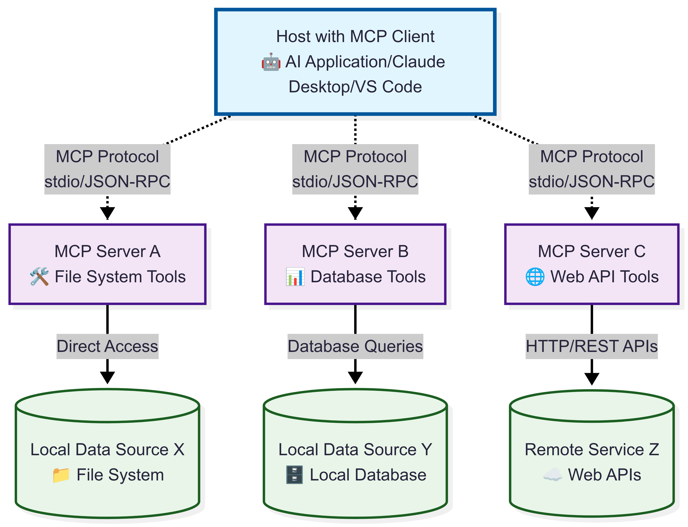
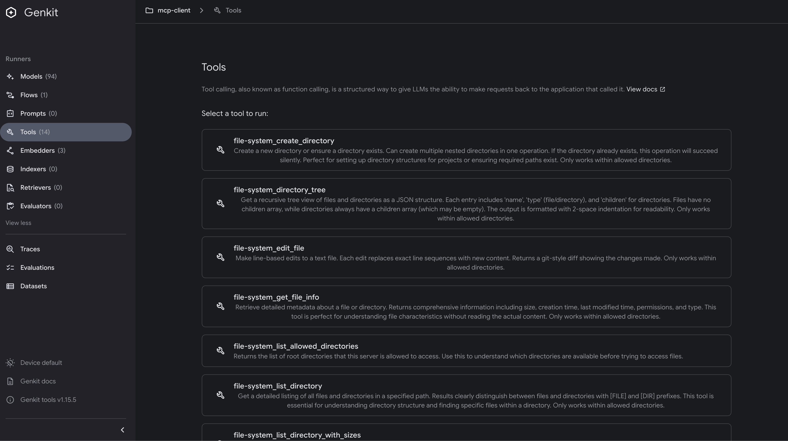
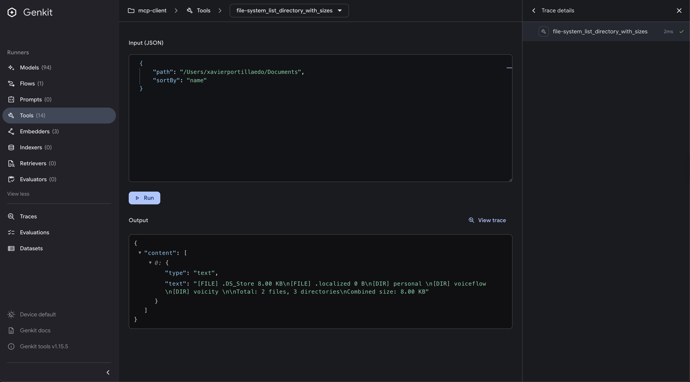
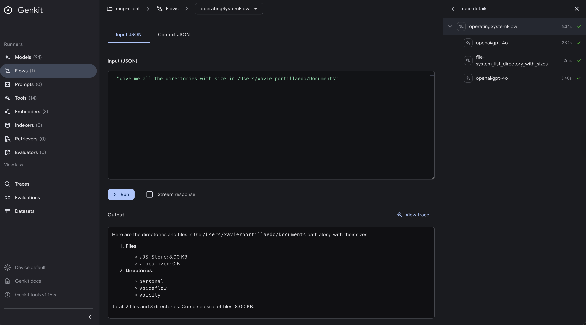
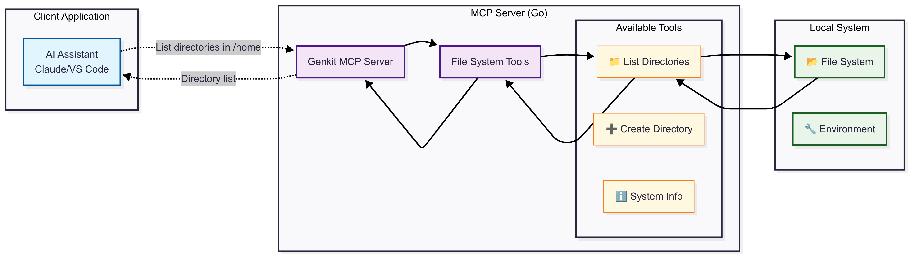
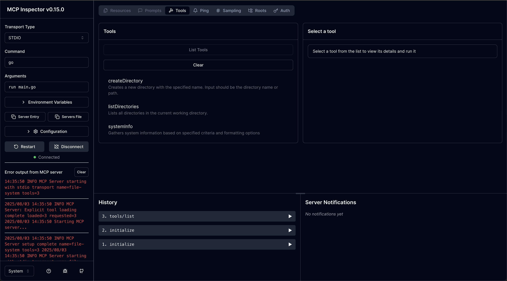
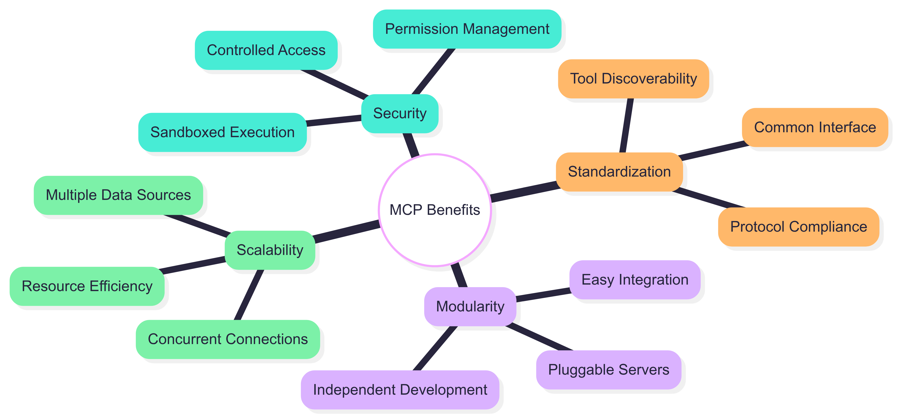

# Model Context Protocol (MCP)

The Model Context Protocol (MCP) is an open standard that enables secure, controlled communication between AI applications and external tools and data sources. Developed by Anthropic, MCP provides a standardized way for language models to interact with tools, APIs, databases, file systems, and other external resources in a safe and predictable manner.

In this chapter, we'll explore how to use MCP with Genkit Go in two key scenarios:

1. **Building MCP clients** that connect to existing MCP servers to access their tools
2. **Creating MCP servers** that expose your custom tools to MCP-compatible clients

## Prerequisites

Before diving into MCP, make sure you have the following prerequisites:

1. A basic understanding of Genkit Go and how to create AI applications
2. Familiarity with Go programming language
3. An MCP server to connect to (we'll use the filesystem MCP server in our example)
4. OpenAI API key for AI interactions (if using OpenAI plugin)
5. Node.js installed for MCP inspector tool and MCP filesystem server

## Understanding MCP



MCP acts as a bridge between AI applications and external systems, providing several key benefits:

- **Standardization**: A common protocol for tool integration across different AI platforms
- **Security**: Controlled access to external resources with proper boundaries
- **Interoperability**: Tools can be shared across different AI applications
- **Flexibility**: Support for various transport mechanisms (stdio, SSE)

### MCP Architecture

The MCP architecture consists of three main components:

1. **MCP Clients**: Applications that want to access tools (like your Genkit app)
2. **MCP Servers**: Services that expose tools and capabilities
3. **Transport Layer**: Communication mechanism between clients and servers

## Connecting to MCP Servers (Client side)

Let's start by building a Genkit application that connects to an existing MCP server. In our example, we'll connect to the filesystem MCP server to enable AI-powered file operations. The filesystem MCP server is an npm package that implements the Model Context Protocol. It is available at `@modelcontextprotocol/server-filesystem` developed by Anthropic.

### Setting Up the MCP Client

Our client application will connect to the filesystem MCP server and use its tools to perform file operations through AI assistance.

These are the main steps to set up the MCP client:

1. **Initialize Genkit with the OpenAI plugin** to handle AI interactions.
2. **Configure the MCP filesystem server** to expose file system operations.
3. **Create an MCP manager** that manages the MCP servers and retrieves available tools.
4. **Use the tools from the MCP server** in a Genkit flow to perform file operations.
5. **Create a Genkit flow** that uses the tools provided by the MCP server.

Here's the main structure of our AI Application that connects to the MCP server. It is important to note that we are reusing the flow `OperatingSystemFlow` from the previous chapter but instead of using the tools directly, we are using the tools provided by the MCP server:

```go
package main

import (
    "context"
    "log"
    "mastering-genkit-go/example/chapter-09/mcp-client/internal/flows"
    "mastering-genkit-go/example/chapter-09/mcp-client/internal/tools"

    mcpinternal "mastering-genkit-go/example/chapter-09/mcp-client/internal/mcp"
    "net/http"
    "os"

    "github.com/firebase/genkit/go/genkit"
    "github.com/firebase/genkit/go/plugins/compat_oai/openai"
    "github.com/firebase/genkit/go/plugins/mcp"
    "github.com/firebase/genkit/go/plugins/server"
)

func main() {
    ctx := context.Background()

    // Initialize Genkit with OpenAI plugin
    g := genkit.Init(ctx,
        genkit.WithPlugins(&openai.OpenAI{
            APIKey: os.Getenv("OPENAI_API_KEY"),
        }),
        genkit.WithDefaultModel("openai/gpt-4o"),
    )

    // Configure MCP filesystem server
    mcpFileSystem := mcpinternal.NewFilesystemServerConfig("file-system", "./")

    // Create MCP manager with filesystem server
    manager, err := mcpinternal.NewMCPManagerWrapper("my-manager", "1.0.0", []mcp.MCPServerConfig{
        mcpFileSystem,
    })
    if err != nil {
        log.Fatalf("Failed to create MCP manager: %v", err)
    }

    // Get all available tools from MCP servers
    toolList, err := manager.GetActiveTools(ctx, g)
    if err != nil {
        log.Fatalf("Failed to get active tools: %v", err)
    }

    // Create a flow that uses MCP tools
    operatingSystemFlow := flows.NewOperatingSystemFlow(g, tools.ConvertToolsToToolRefs(toolList))

    // Set up HTTP server
    mux := http.NewServeMux()
    mux.HandleFunc("POST /operatingSystemFlow", genkit.Handler(operatingSystemFlow))

    port := os.Getenv("PORT")
    if port == "" {
        port = "9090"
    }

    log.Printf("Starting server on 127.0.0.1:%s", port)
    log.Fatal(server.Start(ctx, "0.0.0.0:"+port, mux))
}
```

The structure of our AI Application that connects to the MCP server is as follows:

```bash
main.go
├── internal
│   ├── flows
│   │   └── os.go
│   ├── mcp
│   │   ├── manager.go
│   │   └── clients.go
│   └── tools
│       └── utils.go
└── go.mod
```

understanding the structure:

- `main.go`: The entry point of the application that initializes Genkit, configures the MCP server, and starts the HTTP server.
- `internal/flows/os.go`: Contains the Genkit flow that uses the MCP tools for file operations.
- `internal/mcp/manager.go`: Contains the MCP manager wrapper that simplifies MCP server management.
- `internal/mcp/clients.go`: Contains helper functions to configure MCP servers.
- `internal/tools/utils.go`: Contains utility functions to convert Genkit `Tool` to Genkit `ToolRef`.

Let's break down the helper functions and configurations used in this example in the following sections.

### Creating MCP Manager Wrapper

To simplify MCP integration from the main application, we create a wrapper that handles server configuration:

```go
package mcp

import (
    "fmt"
    "log"

    "github.com/firebase/genkit/go/plugins/mcp"
)

func NewMCPManagerWrapper(name string, version string, mcpServers []mcp.MCPServerConfig) (*mcp.MCPManager, error) {
    if version == "" {
        version = "1.0.0"
    }

    options := mcp.MCPManagerOptions{
        Name:       name,
        Version:    version,
        MCPServers: mcpServers,
    }

    manager, err := mcp.NewMCPManager(options)
    if err != nil {
        return nil, fmt.Errorf("failed to create MCP manager: %w", err)
    }

    log.Printf("Successfully created MCP manager '%s' (v%s) with %d servers", name, version, len(mcpServers))
    return manager, nil
}
```

As You can see above, we create a `NewMCPManagerWrapper` function that initializes the MCP manager with the provided servers. This allows us to easily manage multiple MCP servers in our application. It needs:

1. A name for the manager
2. A version string (defaulting to "1.0.0")
3. A list of MCP server configurations

### Configuring MCP Servers

The filesystem server configuration is handled by a helper function:

```go
package mcp

import (
    "github.com/firebase/genkit/go/plugins/mcp"
)

func NewFilesystemServerConfig(name string, allowedDirs ...string) mcp.MCPServerConfig {
    args := []string{"-y", "@modelcontextprotocol/server-filesystem"}
    args = append(args, allowedDirs...)

    return mcp.MCPServerConfig{
        Name: name,
        Config: mcp.MCPClientOptions{
            Name: name,
            Stdio: &mcp.StdioConfig{
                Command: "npx",
                Args:    args,
            },
        },
    }
}
```

This wrapper function creates a configuration for the filesystem MCP server, allowing us to specify which directories are accessible. It uses `npx` to run the MCP filesystem server package. Make it easier and more flexible to configure the MCP server in our application.


### Debugging the tools exposed by the MCP server

Thanks to the Genkit UI, you can easily inspect the tools exposed by the MCP server that we are connecting to. This allows you to see the available tools, their schemas, and test them interactively.



And you can go further and debug the tools from the MCP server directly from the UI. This is very useful to understand how the tools work, what parameters they accept, and how to use them effectively in your AI application.




### Testing the AI Application

Once your AI application is running, you can invoke the Genkit flow and test it with various file operations:

```bash
# Read a file
curl -X POST http://127.0.0.1:9090/operatingSystemFlow \
  -H "Content-Type: application/json" \
  -d '{"data":"Read the contents of README.md and summarize it"}'
```

```bash
# Create a file
curl -X POST http://127.0.0.1:9090/operatingSystemFlow \
  -H "Content-Type: application/json" \
  -d '{"data":"Create a file called test.txt with the content Hello from MCP!"}'
```

```bash
# List directories
curl -X POST http://127.0.0.1:9090/operatingSystemFlow \
  -H "Content-Type: application/json" \
  -d '{"data":"List all directories in the current folder"}'
```

Or just using the Genkit CLI, to run the flow directly make sure you are running your AI Application in another terminal with `genkit start -- go run .`:

```bash
cd src/examples/chapter-09/mcp-client
genkit flow:run operatingSystemFlow "\"give me all the directories with size in /\""
```

Here is a full example of how we can interact the flow and invoking the tools from the MCP server from the UI:



## Building MCP Servers

Now let's explore how to create your own MCP server that exposes custom tools to MCP clients. This is useful when you want to share your tools with other AI applications or when building specialized tool suites.



### MCP Server Structure

Our MCP server will expose three main tools, we are going to reuse the tools from the previous chapter. Here's the main server implementation:

- Directory listing
- Directory creation  
- System information gathering

The structure of this MCP server is as follows:

```bash
main.go
├── internal
│   ├── mcp
│   │   └── server.go
│   └── tools
│       └── directories.go
└── go.mod
```

Let's break down each file and its purpose:

- `main.go`: The entry point of the application that initializes Genkit, creates the MCP server, and starts it.
- `internal/mcp/server.go`: Contains the MCP server wrapper that simplifies MCP server creation.
- `internal/tools/directories.go`: Contains the implementation of the tools that are going to be exposed by the MCP server.

```go
package main

import (
    "context"
    "log"
    mcpinternal "mastering-genkit-go/example/chapter-09/mcp-server/internal/mcp"
    "mastering-genkit-go/example/chapter-09/mcp-server/internal/tools"

    "github.com/firebase/genkit/go/ai"
    "github.com/firebase/genkit/go/genkit"
)

func main() {
    ctx := context.Background()

    // Initialize Genkit
    g := genkit.Init(ctx)

    // Create MCP server with custom tools
    mcpServer := mcpinternal.NewMCPServer(g, "file-system", "1.0.0", []ai.Tool{
        tools.NewListDirectories(g),
        tools.NewCreateDirectory(g),
        tools.NewSystemInfo(g),
    })

    // Start the MCP server
    log.Println("Starting MCP server...")
    err := mcpServer.ServeStdio(ctx)
    if err != nil {
        log.Fatalf("could not start MCP server: %v", err)
    }
}
```

Our MCP server uses the `genkit.Init` function to initialize the Genkit application and then creates an MCP server with custom tools. The tools are defined in the `tools` package, which we will implement next. In this cases we are exposing our MCP Server using the `ServeStdio` method, which allows it to communicate over standard input/output. This is a common transport mechanism for MCP servers.

If you want to expose your MCP server over HTTP streaming using Server-Sent Events (SSE), you can use the `ServeSSE` method instead:

```go
err := mcpServer.ServeSSE(ctx, "http://localhost:3000/sse")
if err != nil {
    log.Fatalf("could not start MCP server: %v", err)
}
```

### MCP Server Wrapper

We create a simplified wrapper for MCP server creation:

```go
package mcp

import (
    "github.com/firebase/genkit/go/ai"
    "github.com/firebase/genkit/go/genkit"
    "github.com/firebase/genkit/go/plugins/mcp"
)

func NewMCPServer(g *genkit.Genkit, name string, version string, tools []ai.Tool) *mcp.GenkitMCPServer {
    if version == "" {
        version = "1.0.0"
    }

    options := mcp.MCPServerOptions{
        Name:    name,
        Version: version,
    }

    if tools != nil {
        options.Tools = tools
    }

    return mcp.NewMCPServer(g, options)
}
```

This simplifies the MCP server creation process by calling `mcp.NewMCPServer`, allowing you to easily configure the server with a name, version, and list of tools.

### Testing Your MCP Server

To test your MCP server, you can use the MCP inspector tool from Anthropic:

```bash
npx @modelcontextprotocol/inspector go run main.go
```

This opens a web interface where you can:

- View available tools and their schemas
- Test tool execution interactively
- Debug MCP protocol communications
- Validate server compliance



### Integrating with MCP Clients

Once your server is running, you can integrate it with various MCP clients for example Claude Desktop or Gemini CLI.

#### Claude Desktop Integration

Add to your Claude Desktop configuration file (`claude_desktop_config.json`):

```json
{
  "mcpServers": {
    "genkit-file-system": {
      "command": "go",
      "args": ["run", "main.go"],
      "cwd": "/path/to/your/mcp-server"
    }
  }
}
```

#### Gemini CLI Integration

Add to your Gemini CLI configuration file (`~/.gemini/settings.json`):

```json
{
  "theme": "Default",
  "selectedAuthType": "oauth-personal",
  "mcpServers": {
    "genkit-file-system": {
      "command": "go",
      "args": ["run", "main.go", "/path/to/your/mcp-server"],
    }
  }
}
```

## Security Considerations

1. **Validate Inputs**: Always validate tool inputs to prevent malicious usage
2. **Limit Access**: Restrict file system access to specific directories
3. **Sanitize Paths**: Prevent directory traversal attacks
4. **Rate Limiting**: Implement rate limiting for resource-intensive operations
5. **Authentication**: Use secure authentication mechanisms for MCP servers


## Conclusion



The Model Context Protocol provides a standardized way to integrate AI applications with external tools and services. With Genkit Go's MCP support, you can:

1. **Connect to existing MCP servers** to leverage pre-built tools and capabilities
2. **Build custom MCP servers** to expose your specialized tools to the MCP ecosystem
3. **Create secure, interoperable AI applications** that can work with various MCP clients

Whether you're building AI-powered development tools, automation systems, or custom integrations, MCP provides the foundation for safe, standardized tool sharing across the AI ecosystem.

In our examples, we've seen how to create both MCP clients that consume tools from external servers and MCP servers that expose custom functionality. This dual capability makes Genkit Go applications both consumers and providers in the MCP ecosystem, enabling rich, interconnected AI tool networks.
