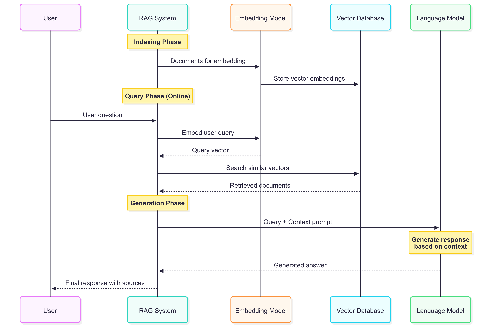
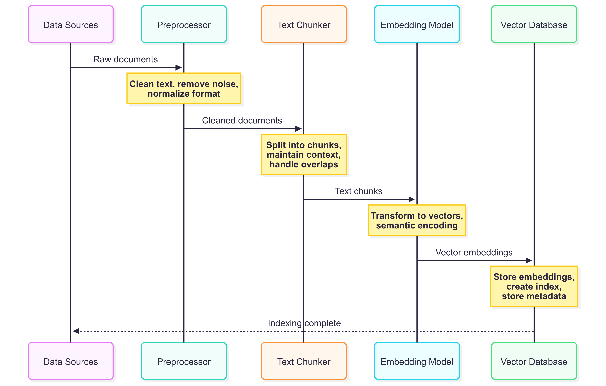
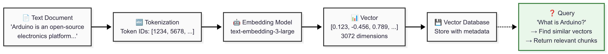
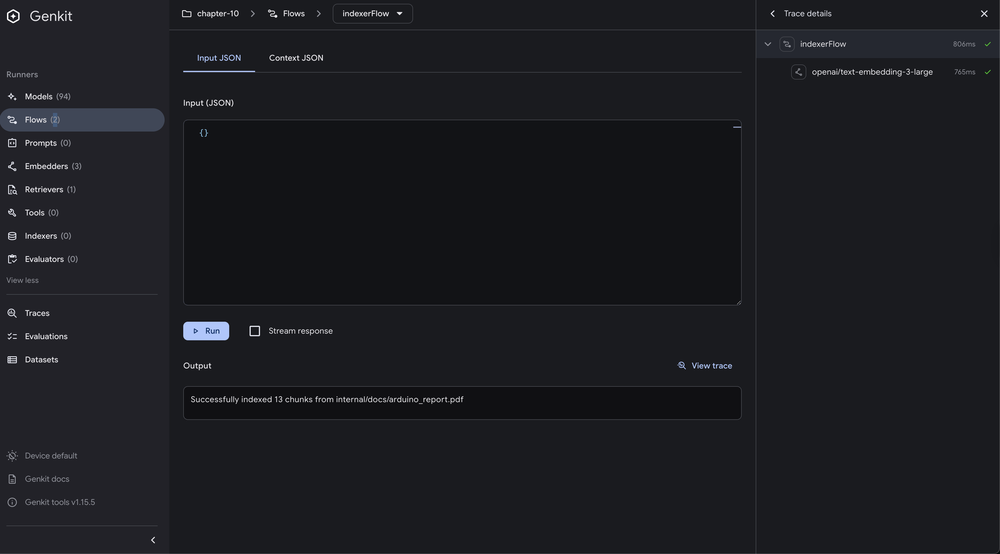
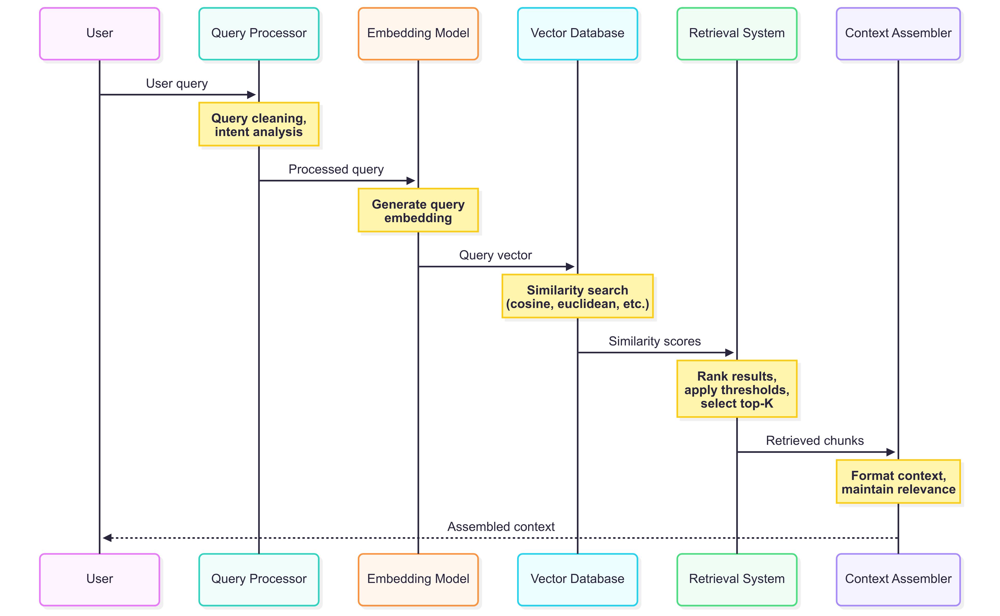
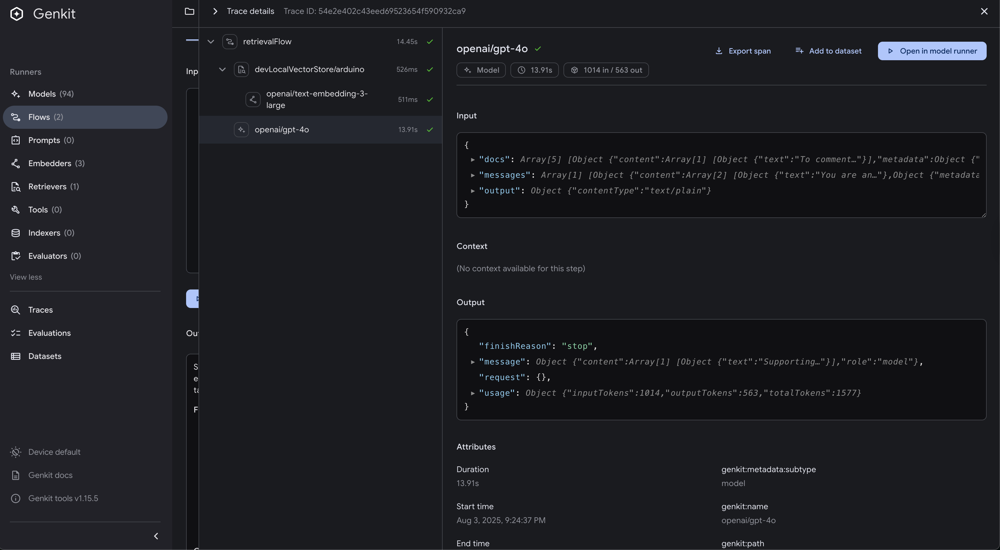

# Retrieval Augmented Generation (RAG)

Retrieval Augmented Generation (RAG) is a powerful technique that combines the knowledge retrieval capabilities of search systems with the natural language generation abilities of Large Language Models (LLMs). Instead of relying solely on the model's training data, RAG allows you to provide relevant, up-to-date information as context for generating responses.

In this chapter, we'll explore how to implement a complete RAG system using Genkit Go, covering both the indexing and retrieval phases with practical examples. The example we'll build will allow users to query an indexed document (the Arduino Open Source Report) and receive informed responses based on the content of that document.

## Prerequisites and Setup

Navigate to the chapter 10 example directory:

```bash
cd src/examples/chapter-10
```

Set your OpenAI API key:

```bash
export OPENAI_API_KEY="your-openai-api-key-here"
```

Install dependencies:

```bash
go mod download
```

## What is RAG?

RAG addresses one of the fundamental limitations of language models: their knowledge cutoff. While LLMs are trained on vast amounts of data, they have a specific knowledge cutoff date and cannot access real-time or domain-specific information that wasn't in their training data.

### Understanding the RAG Process

RAG works by augmenting the language model's responses with relevant external information retrieved from a knowledge base. This approach combines the generative capabilities of LLMs with the precision of information retrieval systems.

RAG solves this by implementing three distinct phases:

1. **Indexing Phase**: Converting documents into searchable vector embeddings
   - Documents are processed and split into manageable chunks
   - Each chunk is converted into a high-dimensional vector using an embedding model
   - These vectors capture the semantic meaning of the text
   - Vectors are stored in a searchable database

2. **Retrieval Phase**: Finding relevant documents based on user queries
   - User queries are converted into the same vector space as the documents
   - Similarity search finds the most relevant document chunks
   - The system ranks and selects the top-k most relevant pieces of information

3. **Generation Phase**: Using retrieved context to generate informed responses
   - Retrieved documents are provided as context to the language model
   - The LLM generates responses based on both its training and the provided context
   - This ensures responses are grounded in factual, relevant information

The overall RAG process can be visualized as follows:




## The Indexing Flow

The indexing flow is responsible for processing documents and creating searchable vector representations. This phase is crucial for the success of your RAG system as it determines how well your documents will be retrieved later.

### Understanding Vector Embeddings

Before diving into the implementation, it's essential to understand what vector embeddings are and why they're fundamental to RAG systems.

**Vector embeddings** are numerical representations of text that capture semantic meaning in a high-dimensional space. Unlike traditional keyword-based search, embeddings understand context and meaning. For example:

- "car" and "automobile" would have similar embeddings despite being different words
- "bank" (financial institution) and "bank" (river edge) would have different embeddings based on context
- Sentences with similar meanings have similar vector representations

**Embedding models** are neural networks trained to convert text into these vector representations.

The indexing process typically involves several coordinated steps:



### Document Processing

The first step involves extracting and cleaning text from various document formats. Document processing is critical because the quality of your indexed content directly impacts retrieval accuracy.

In our example, we focus on PDF processing, which presents unique challenges:

- PDFs may contain complex layouts with multiple columns
- Text extraction can include unwanted formatting artifacts
- Page boundaries might split important information

Here's our PDF processing implementation:

```go
// ParsePDFToChunks reads a PDF file and returns it as chunks of documents
func ParsePDFToChunks(filePath string, maxChunkSize int) ([]*ai.Document, error) {
    // Open the PDF file
    f, r, err := pdf.Open(filePath)
    if err != nil {
        return nil, fmt.Errorf("failed to open PDF: %w", err)
    }
    defer f.Close()

    var allText strings.Builder

    // Extract text from all pages
    for pageIndex := 1; pageIndex <= r.NumPage(); pageIndex++ {
        page := r.Page(pageIndex)
        if page.V.IsNull() {
            continue
        }

        text, err := page.GetPlainText(nil)
        if err != nil {
            return nil, fmt.Errorf("failed to extract text from page %d: %w", pageIndex, err)
        }

        allText.WriteString(text)
        allText.WriteString("\n\n")
    }

    // Split the text into chunks
    fullText := allText.String()
    chunks := chunkText(fullText, maxChunkSize)

    // Convert chunks to AI documents
    var documents []*ai.Document
    for i, chunk := range chunks {
        doc := ai.DocumentFromText(chunk, map[string]any{
            "source":     filePath,
            "chunk_id":   i,
            "chunk_size": len(chunk),
        })
        documents = append(documents, doc)
    }

    return documents, nil
}
```

**This parsing implementation does the following:**

1. **Page-by-page processing**: Iterates through each PDF page to extract text content
2. **Text assembly**: Combines all pages into a continuous text with proper spacing
3. **Metadata preservation**: Tracks source file, chunk IDs, and sizes for debugging and analysis
4. **Structured output**: Converts text chunks into Genkit's `ai.Document` format

### Text Chunking Strategy

Proper text chunking is crucial for effective RAG because it determines how information is segmented and retrieved. The goal is to create chunks that are:

- **Semantically coherent**: Each chunk should contain related information
- **Appropriately sized**: Large enough for context, small enough for relevance
- **Boundary-aware**: Avoid splitting sentences or important concepts

**Why chunking matters:**

1. **Embedding model limitations**: Most embedding models have token limits (e.g., 8,191 tokens for `text-embedding-3-large`)
2. **Retrieval precision**: Smaller chunks allow more precise retrieval of relevant information
3. **Context windows**: LLMs have limited context windows, so retrieved chunks must fit within these constraints
4. **Computational efficiency**: Smaller chunks mean faster embedding generation and similarity searches

Our implementation uses a sentence-aware chunking strategy that tries to preserve semantic boundaries while respecting size constraints:

```go
// chunkText splits text into chunks of approximately maxChunkSize characters
// while trying to preserve sentence boundaries
func chunkText(text string, maxChunkSize int) []string {
    if len(text) <= maxChunkSize {
        return []string{text}
    }

    var chunks []string
    sentences := strings.Split(text, ". ")

    var currentChunk strings.Builder

    for _, sentence := range sentences {
        // Add the period back except for the last sentence
        if !strings.HasSuffix(sentence, ".") && !strings.HasSuffix(sentence, "!") && !strings.HasSuffix(sentence, "?") {
            sentence += "."
        }

        // Check if adding this sentence would exceed the chunk size
        if currentChunk.Len()+len(sentence)+1 > maxChunkSize && currentChunk.Len() > 0 {
            chunks = append(chunks, strings.TrimSpace(currentChunk.String()))
            currentChunk.Reset()
        }

        if currentChunk.Len() > 0 {
            currentChunk.WriteString(" ")
        }
        currentChunk.WriteString(sentence)
    }

    // Add the last chunk if it has content
    if currentChunk.Len() > 0 {
        chunks = append(chunks, strings.TrimSpace(currentChunk.String()))
    }

    return chunks
}
```

This is just one example of a chunking strategy that balances size and semantic coherence. There are many other approaches you can take depending on your specific use case and document types. There are also several Golang libraries available that can help with text chunking, such as `langchain`.

**Alternative chunking strategies you might consider:**

- **Fixed-size chunks**: Simple character or token-based splitting
- **Paragraph-based**: Split on paragraph boundaries for topic coherence  
- **Semantic chunking**: Use NLP techniques to identify topic shifts
- **Overlapping chunks**: Include overlap between chunks to preserve context
- **Hierarchical chunking**: Create chunks at multiple granularity levels

As a recap, here there is a simplified graphical representation of the entire process:



### Indexer Flow Implementation

The indexer flow coordinates the entire indexing process, orchestrating document processing, chunking, embedding generation, and storage. This flow represents the phase of RAG where you prepare your knowledge base.

**The indexing process involves these steps:**

1. **Document loading**: Read and validate the input document
2. **Text extraction**: Convert document format to plain text
3. **Chunking**: Split text into semantically meaningful pieces
4. **Embedding generation**: Convert each chunk into a vector representation using an embedding model
5. **Storage**: Save vectors and metadata to a searchable index

Here's our complete indexer flow implementation:

```go
// IndexerRequest represents the input for the indexer flow
type IndexerRequest struct {
    PDFPath string `json:"pdfPath,omitempty"`
}

// NewIndexerFlow creates a flow that reads PDF documents, creates embeddings, and stores them in localvec.
func NewIndexerFlow(g *genkit.Genkit, tools []ai.ToolRef, docStore *localvec.DocStore) *core.Flow[IndexerRequest, string, struct{}] {
    return genkit.DefineFlow(g, "indexerFlow", func(ctx context.Context, req IndexerRequest) (string, error) {
        // Default PDF path if not provided
        pdfPath := req.PDFPath
        if pdfPath == "" {
            // Use absolute path to the Arduino report
            pdfPath = "internal/docs/arduino_report.pdf"
        }

        // Make path absolute
        absPath, err := filepath.Abs(pdfPath)
        if err != nil {
            return "", fmt.Errorf("failed to get absolute path: %w", err)
        }

        // Parse PDF into chunks
        chunks, err := rag.ParsePDFToChunks(absPath, 1000) // 1000 character chunks
        if err != nil {
            return "", fmt.Errorf("failed to parse PDF: %w", err)
        }

        // Index the documents
        err = localvec.Index(ctx, chunks, docStore)
        if err != nil {
            return "", fmt.Errorf("failed to index documents: %w", err)
        }

        return fmt.Sprintf("Successfully indexed %d chunks from %s", len(chunks), pdfPath), nil
    })
}
```

**What happens during `localvec.Index()`:**

Behind the scenes, this function:

- Takes each text chunk and converts it to a vector using the configured embedding model
- Stores the vectors along with the original text and metadata in the local vector database
- Creates search indexes for efficient similarity queries
- Persists data to disk for future retrieval operations under `.genkit/indexes`


### Testing the Indexer Flow

You can test the indexer flow using the developer UI or curl:



```bash
# Index the default Arduino report
curl -X POST http://localhost:9090/indexerFlow \
  -H "Content-Type: application/json" \
  -d '{"data":{}}'
```

```bash
# Index a custom PDF
curl -X POST http://localhost:9090/indexerFlow \
  -H "Content-Type: application/json" \
  -d '{"data":{"pdfPath": "path/to/your/document.pdf"}}'
```

Or using the Genkit CLI. Make sure you have your app running in a separate terminal with `genkit start -- go run .`:

```bash
cd src/examples/chapter-10
genkit flow:run indexerFlow '{}'
```

## The Retrieval Flow

The retrieval flow handles user queries by finding relevant documents and generating contextual responses. This happens in real-time and represents the phase of RAG where users interact with your knowledge base.

### Understanding Semantic Search

The retrieval process relies on semantic search, which works fundamentally differently from traditional keyword search:

**Traditional keyword search:**

- Looks for exact word matches
- Uses techniques like TF-IDF (Term Frequency-Inverse Document Frequency)
- Misses synonyms and related concepts
- Example: "car" won't match "automobile"

**Semantic search with embeddings:**

- Converts queries and documents to the same vector space
- Finds similar meanings regardless of exact words
- Understands context and relationships
- Example: "car maintenance" will match "automobile repair" and "vehicle servicing"

**The semantic search process:**

1. **Query embedding**: Convert the user's question into a vector using the same embedding model used for indexing
2. **Similarity calculation**: Compute similarity scores (usually cosine similarity) between the query vector and all document vectors
3. **Ranking**: Sort documents by similarity score
4. **Top-k selection**: Return the most relevant documents
5. **Context assembly**: Combine retrieved documents into context for the language model



### Query Processing and Retrieval

The retrieval flow starts by converting the user's query into a vector embedding and searching for similar documents. Here's how our implementation handles this complex process:

```go
// RetrievalRequest represents the input for the retrieval flow
type RetrievalRequest struct {
    Query string `json:"query"`
    K     int    `json:"k,omitempty"` // number of results to return
}

// NewRetrievalFlow creates a flow that searches the indexed documents using the query.
func NewRetrievalFlow(g *genkit.Genkit, tools []ai.ToolRef, retriever ai.Retriever) *core.Flow[RetrievalRequest, string, struct{}] {
    return genkit.DefineFlow(g, "retrievalFlow", func(ctx context.Context, req RetrievalRequest) (string, error) {
        // Default K to 5 if not provided
        k := req.K
        if k == 0 {
            k = 5
        }

        // Create a document from the query text
        queryDoc := ai.DocumentFromText(req.Query, nil)

        // Retrieve similar documents
        retrieverOptions := &localvec.RetrieverOptions{
            K: k,
        }

        retrieverReq := &ai.RetrieverRequest{
            Query:   queryDoc,
            Options: retrieverOptions,
        }

        retrieverResp, err := retriever.Retrieve(ctx, retrieverReq)
        if err != nil {
            return "", fmt.Errorf("failed to retrieve documents: %w", err)
        }

        // Use the retrieved documents with Generate to provide expert Arduino assistance
        prompt := fmt.Sprintf(`You are an Arduino expert and analyst with deep knowledge of the Arduino ecosystem, open source hardware, and the Arduino community. 
You have access to the annual Arduino Open Source Report and can provide insights based on this documentation.

Based on the provided Arduino Open Source Report documentation, please answer the following question: %s

Please provide an answer that includes:
- Specific data and insights from the Arduino Open Source Report
- Trends and developments in the Arduino ecosystem
- Community statistics and growth metrics if mentioned
- Key findings and recommendations from the report
- Relevant comparisons or benchmarks discussed in the report

If the question is not directly answered in the report, please provide a reasoned analysis based on the available data. Do not make assumptions beyond the provided documentation.

Question: %s`, req.Query, req.Query)

        // Use the Genkit Generate function with the retrieved documents as context
        generateResp, err := genkit.Generate(ctx, g,
            ai.WithPrompt(prompt),
            ai.WithDocs(retrieverResp.Documents...))
        if err != nil {
            return "", fmt.Errorf("failed to generate response: %w", err)
        }

        return generateResp.Text(), nil
    })
}
```

**Detailed breakdown of the retrieval process:**

1. **Input validation and defaults**: Sets default values (K=5) to ensure robust operation
2. **Query conversion**: Transforms the user's text query into a `Document` object that can be processed by the embedding model
3. **Similarity search**: The `retriever.Retrieve()` call performs the core semantic search:
   - Embeds the query using the same model used for indexing
   - Computes cosine similarity with all stored document vectors
   - Returns the top-k most similar documents with their similarity scores
4. **Context preparation**: Combines retrieved documents with a specialized prompt
5. **Response generation**: Uses Genkit's `Generate` function with both the prompt and retrieved documents as context using the method `ai.WithDocs()`


Notice how our prompt is carefully crafted to establish the AI's role and expertise domain, provide clear instructions about how to use the retrieved context, set expectations for response format and content, include guidance about handling cases where information isn't available, and prevent hallucination by emphasizing staying within the provided documentation.

### Testing the Retrieval Flow

Once documents are indexed, you can query the system:



```bash
# Ask questions about the indexed content
curl -X POST http://localhost:9090/retrievalFlow \
  -H "Content-Type: application/json" \
  -d '{"data": {"query": "What are the key features of Arduino?", "k": 3}}'
```

```bash
# Query with default K value (5 results)
curl -X POST http://localhost:9090/retrievalFlow \
  -H "Content-Type: application/json" \
  -d '{"data": {"query": "How does Arduino work?"}}'
```

Or using the Genkit CLI. Make sure you have your app running in a separate terminal with `genkit start -- go run .`:

```bash
cd src/examples/chapter-10
genkit flow:run retrievalFlow "{\"query\":\"how can we support the Arduino project?\"}"
```

## Setting Up the Complete RAG System

Let's walk through setting up and running the complete RAG system using our example code.

### System Architecture

The complete RAG system integrates multiple components that work together to provide intelligent document querying capabilities. Understanding this architecture is crucial for building robust and scalable RAG applications.

The system consists of several components working in harmony:

```go
func main() {
    ctx := context.Background()

    // Initialize Genkit with OpenAI plugin and default model using GPT-4o.
    g, err := genkit.Init(ctx,
        genkit.WithPlugins(
            &openai.OpenAI{
                APIKey: os.Getenv("OPENAI_API_KEY"),
            },
        ),
        genkit.WithDefaultModel("openai/gpt-4o"),
    )
    if err != nil {
        log.Fatalf("could not initialize Genkit: %v", err)
    }

    // Initialize localvec plugin
    err = localvec.Init()
    if err != nil {
        log.Fatalf("could not initialize localvec: %v", err)
    }

    // Get OpenAI embedder (text-embedding-3-large) using LookupEmbedder
    embedder := genkit.LookupEmbedder(g, "openai", "text-embedding-3-large")
    if embedder == nil {
        log.Println("failed to get text-embedding-3-large embedder")
    }

    // Define retriever with localvec
    docStore, _, err := localvec.DefineRetriever(
        g,
        "arduino",
        localvec.Config{
            Embedder: embedder,
            Dir:      ".genkit/indexes", // use the .genkit/indexes directory for localvec
        },
    )

    indexerFlow := flows.NewIndexerFlow(g, []ai.ToolRef{}, docStore)

    // Get the retriever
    retriever := localvec.Retriever(g, "arduino")
    if retriever == nil {
        fmt.Println("retriever 'arduino' not found. Make sure to run the indexer first")
    }

    retrievalFlow := flows.NewRetrievalFlow(g, []ai.ToolRef{}, retriever)

    mux := http.NewServeMux()
    mux.HandleFunc("POST /indexerFlow", genkit.Handler(indexerFlow))
    mux.HandleFunc("POST /retrievalFlow", genkit.Handler(retrievalFlow))

    port := os.Getenv("PORT")
    if port == "" {
        port = "9090"
    }

    log.Printf("Starting server on 127.0.0.1:%s", port)
    log.Fatal(server.Start(ctx, "0.0.0.0:"+port, mux))
}
```

**Detailed explanation of each component:**

1. **Genkit Initialization**:
   - Sets up the core framework with OpenAI integration
   - Configures GPT-4o as the default generation model
   - Establishes the foundation for all AI operations

2. **LocalVec Plugin Setup**:
   - Initializes the local vector database system
   - Provides in-memory and persistent storage for embeddings
   - Enables fast similarity search capabilities

3. **Embedding Model Configuration**:
   - Retrieves OpenAI's `text-embedding-3-large` model
   - This model converts text to 3072-dimensional vectors
   - Optimized for retrieval tasks with high semantic accuracy

4. **Retriever Definition**:
   - Creates a named retriever ("arduino") for our specific use case
   - Links the embedding model with the storage system
   - Configures storage directory for persistence across restarts

5. **Flow Creation**:
   - **Indexer Flow**: Handles document processing and storage
   - **Retrieval Flow**: Manages queries and response generation
   - Both flows are integrated with the same embedding model and storage

6. **HTTP Server Setup**:
   - Exposes RESTful endpoints for external access
   - Uses Genkit's built-in HTTP handlers for seamless integration
   - Provides standardized request/response formats

### Running the System

Start the RAG server:

```bash
go run main.go
```

You should see output similar to:

```bash
Starting server on 127.0.0.1:9090
```

### Complete Workflow Example

#### Step 1: Index Documents

First, run the indexer to process and store your documents:

```bash
curl -X POST http://localhost:9090/indexerFlow \
  -H "Content-Type: application/json" \
  -d '{"data":{}}'
```

Expected response:

```bash
"Successfully indexed 45 chunks from internal/docs/arduino_report.pdf"
```

#### Step 2: Query the System

Once indexing is complete, you can query the system:

```bash
curl -X POST http://localhost:9090/retrievalFlow \
  -H "Content-Type: application/json" \
  -d '{"data":{"query": "What are the main growth trends in the Arduino ecosystem?"}}'
```

The system will:

1. Convert your query into a vector embedding
2. Search the indexed documents for similar content
3. Retrieve the most relevant chunks
4. Generate a response based on the retrieved context


## Embedding Model Selection

The choice of embedding model is one of the most critical decisions in building a RAG system, as it directly impacts the quality of both indexing and retrieval operations.

**Characteristics of quality embedding models:**

1. **Dimensionality**: Higher dimensions can capture more nuanced relationships but require more storage and computation
2. **Context length**: Longer context windows allow processing of larger text chunks
3. **Training data**: Models trained on diverse, high-quality data perform better across domains
4. **Fine-tuning**: Some models are specifically optimized for retrieval tasks

Our example uses OpenAI's `text-embedding-3-large` model but there are many other options available depending on your needs:

- **Cohere embed-v4.0**: Optimized for English text with excellent retrieval performance
- **Azure OpenAI**: Same models as OpenAI but with enterprise features
- **Google Gemini Embedding model**: Good multilingual capabilities
- **Amazon Bedrock**: Offers various embedding models with different strengths

## Vector Storage Selection

In this example we have use `localvec` plugin provides a complete vector database solution optimized for development and small-to-medium scale deployments. The local indexer includes some advantages including local storage with no external dependencies for development where data stays on your machine, efficient similarity search through optimized algorithms for fast vector operations, persistence with embeddings automatically stored in the `.genkit/indexes` directory, and zero configuration that works out of the box with minimal setup.

This combination of features makes it an ideal solution for developers who want to implement vector search capabilities without the complexity of external services or extensive configuration requirements.

However, for production systems or larger-scale applications, you may need to consider more robust vector storage solutions that can handle higher loads and provide additional features. Here are some production-ready alternatives:

- **Pinecone**: Managed vector database with excellent performance and scaling
- **Qdrant**: Open-source vector database with advanced filtering capabilities
- **PGVector**: PostgreSQL extension for vectors, good for existing PostgreSQL infrastructure
- **Weaviate**: GraphQL-based vector database with built-in ML capabilities
- **Milvus**: Open-source vector database designed for massive scale


## Advanced RAG Techniques

Once you have a basic RAG system working, there are several techniques you can explore to improve its performance:

**Hybrid Search**: Combine vector similarity search with traditional keyword search to get the best of both approaches. Vector search finds semantically similar content, while keyword search catches exact terms and rare words.

**Query Expansion**: Enhance user queries by adding synonyms or expanding abbreviations before searching. This helps find more relevant documents that might use different terminology.

**Result Re-ranking**: After retrieving documents, re-rank them using additional factors like keyword overlap, document freshness, or source authority to improve relevance.

**Context Management**: As your documents grow larger, you may need to summarize or truncate retrieved content to fit within the language model's context window.

These advanced techniques can improve your RAG system's accuracy, but they also add complexity. Start with the basic implementation from this chapter and add these enhancements gradually as your needs grow.

## Summary

In this chapter, we've built a complete RAG system using Genkit Go that shows the full lifecycle of retrieval-augmented generation.

We started with document indexing, learning how to process PDFs, create meaningful text chunks, and generate vector embeddings that capture semantic meaning. We then explored vector storage using the `localvec` plugin, which provides similarity search capabilities for development and small-to-medium scale deployments.

The retrieval phase showed us how to convert user queries into vectors and retrieve relevant context from our indexed documents. We have implemented a query processing system that uses semantic search to find the most relevant information.

Finally, the response generation component shows how to combine retrieved documents with prompts to produce accurate, contextual responses.

To sum up this chapter, RAG represents a powerful paradigm for enhancing AI applications with domain-specific knowledge, and Genkit Go provides the tools needed to implement sophisticated retrieval-augmented systems efficiently.
