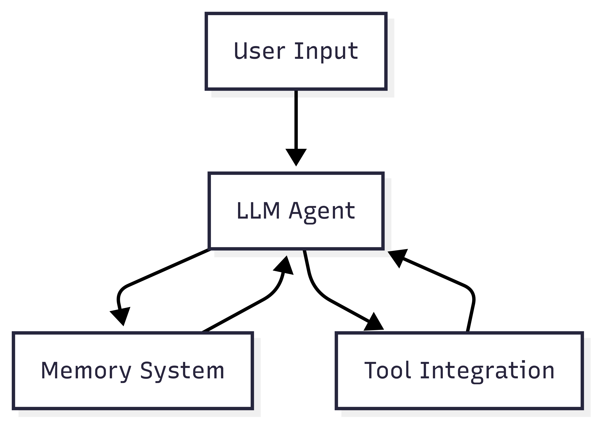
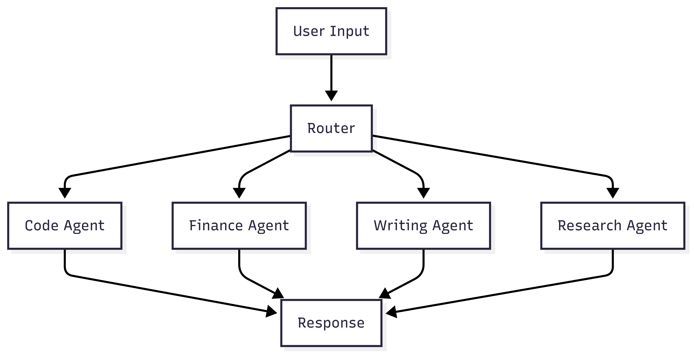
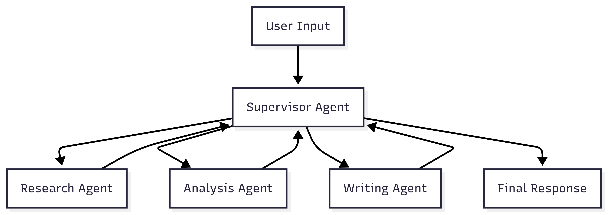
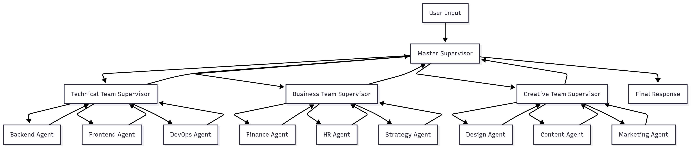
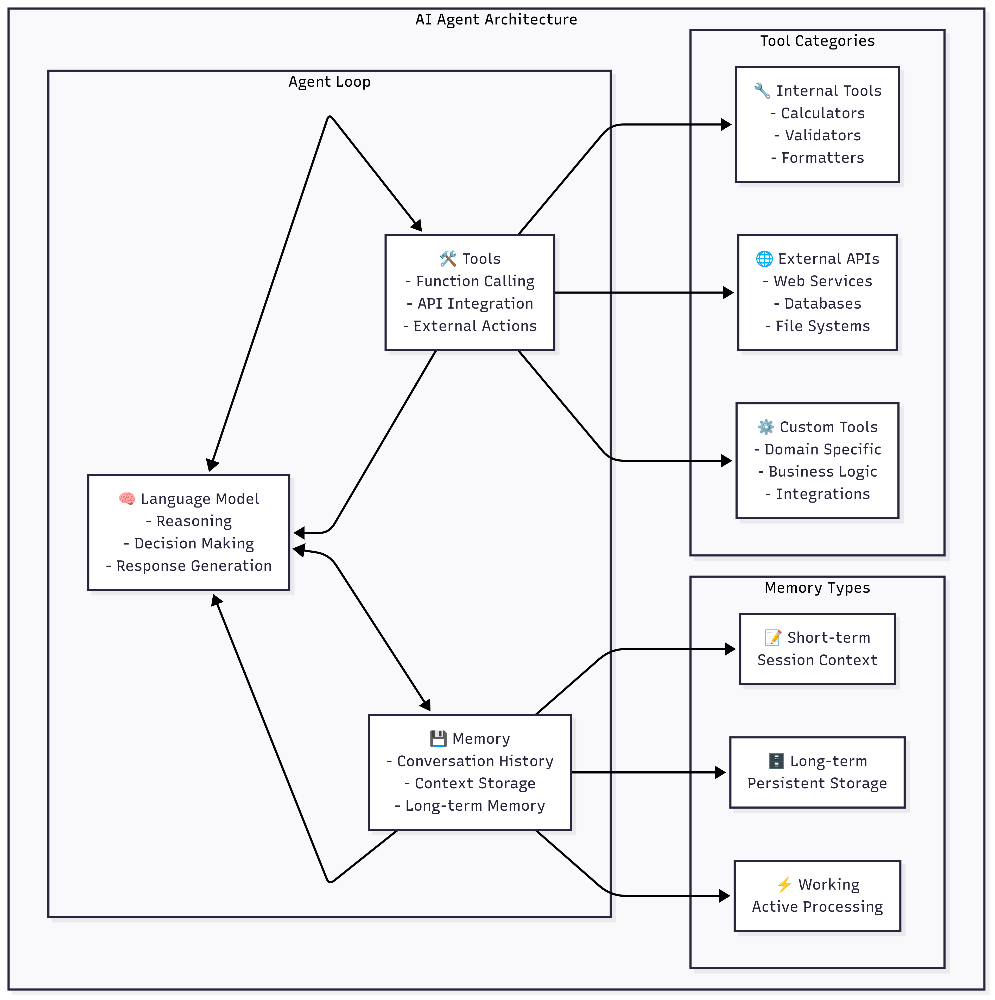
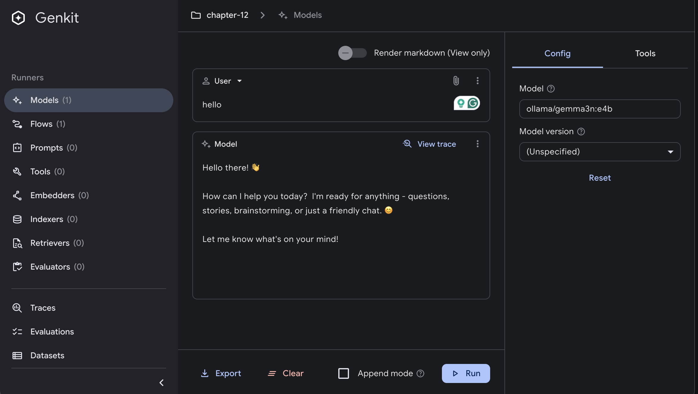
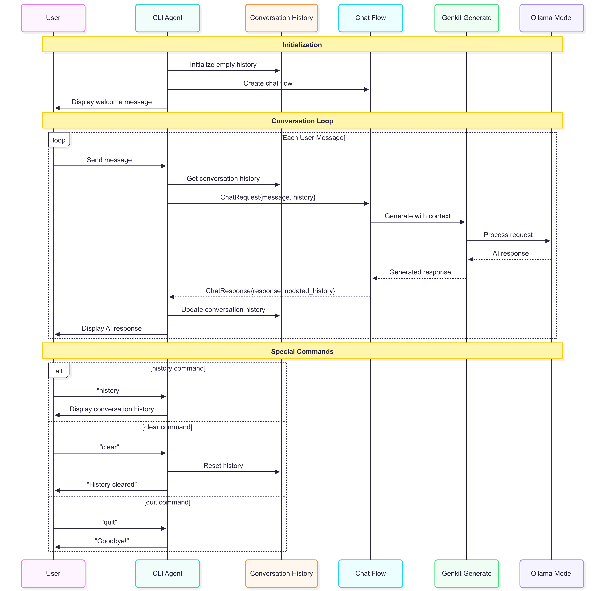

# Building AI Agents with Genkit Go

## Introduction

AI agents represent the next evolution in artificial intelligence applications, moving beyond simple question-and-answer interactions to create autonomous, context-aware systems that can maintain conversations, remember previous interactions, and perform complex tasks. While Genkit Go doesn't provide native AI agent support yet, this chapter shows how to build AI agents using Genkit Go's powerful flows capabilities.

An AI agent is an intelligent and autonomous system that can perceive its environment, maintain internal state, make decisions, and take actions to achieve specific goals. Unlike traditional chatbots that respond to individual queries in isolation, AI agents maintain context across interactions, learn from previous conversations, and can adapt their behavior based on accumulated knowledge. Most importantly, AI agents understand natural language, allowing users to interact with them in a conversational manner.

Since ChatGPT's release in 2022, the AI agent paradigm has gained significant traction, with many companies and developers exploring how to build intelligent systems that can interact naturally with users, learn from conversations, and perform tasks autonomously.

## Prerequisites

Before diving into this chapter, you should have:

- Completed the previous chapters and have a working Genkit Go development environment
- Basic familiarity with command-line interface development
- **Ollama** installed and running locally with the `gemma3n:e4b` model
- Understanding of Genkit flows and model integration from previous chapters
- Basic knowledge of conversation state management concepts

## AI Agent Design Patterns

As AI agents become more complex, different architectural patterns have emerged to handle various complexity levels and use cases. Understanding these patterns helps you choose the right approach for your specific needs and scale your agent systems effectively.

### 1. LLM Augmented Agent

The LLM Augmented Agent is the foundational pattern where a single Language Model is enhanced with additional capabilities through memory, tools, and context management. This is the pattern we implement in this chapter.



We will cover this pattern in detail, including its implementation and use cases below.

### 2. Network Agent (Router-Based)

The Network Agent pattern uses a router component to direct tasks to specialized agents based on the task type or domain. Each agent is optimized for specific capabilities.




### 3. Supervisor Agent

The Supervisor Agent pattern introduces a coordinating agent that orchestrates multiple specialized agents, enabling more complex workflows and inter-agent communication.



### 4. Hierarchical Agent (Mega Agents)

The Hierarchical Agent pattern extends the supervisor model by organizing agents into teams, with supervisors managing teams rather than individual agents. This creates a tree-like organizational structure.



### Choosing the Right Pattern

| Pattern | Complexity | Scalability | Use Case |
|---------|------------|-------------|----------|
| LLM Augmented | Low | Limited | Single domain, personal assistants |
| Network Agent | Medium | High | Multi-domain applications |
| Supervisor Agent | High | Medium | Complex workflows, task orchestration |
| Hierarchical Agent | Very High | Very High | Enterprise-scale, complex organizations |

The choice of pattern depends on your application's complexity, performance requirements, and the sophistication of tasks you need to handle. Start with simpler patterns and evolve to more complex architectures as your needs grow.

## AI Agent Common Architecture

Modern AI agents follow a common architectural pattern that combines three core components: **Language Model (LLM)**, **Memory**, and **Tools**. This architecture enables agents to process natural language, maintain context, and perform actions in their environment.

### Core Components Architecture



### 1. Language Model (LLM) - The Brain

The Language Model serves as the cognitive core of the AI agent, responsible for:

**Primary Functions**:

- **Natural Language Understanding**: Parsing and interpreting user inputs
- **Reasoning and Planning**: Making decisions about what actions to take
- **Response Generation**: Creating appropriate responses in natural language
- **Context Integration**: Combining information from memory and tools

**In Genkit Go Implementation**:

```go
// The LLM component processes requests with context
resp, err := genkit.Generate(ctx, g,
    ai.WithSystem("You're a helpful AI assistant..."),
    ai.WithMessages(conversationHistory...),
    ai.WithTools(availableTools...),
    ai.WithModel(modelRef),
)
```

### 2. Memory - The Context Keeper

Memory systems in AI agents manage different types of information:

**Memory Types**:

- **Short-term Memory (Session Context)**:
  - Stores current conversation
  - Maintains immediate context
  - Typically volatile (lost on restart)

- **Long-term Memory (Persistent Storage)**:
  - User preferences and profiles
  - Historical interactions
  - Learned patterns and behaviors

- **Working Memory (Active Processing)**:
  - Current task state
  - Temporary calculations
  - Active reasoning chains

**Implementation Pattern**:

```go
type AgentMemory struct {
    conversationHistory []*ai.Message  // Short-term
    userProfile        UserProfile     // Long-term
    currentTask        TaskState       // Working
}
```

### 3. Tools - The Action Layer

Tools extend the agent's capabilities beyond text generation as we have seen in chapter 9:

**Tool Categories**:

- **Internal Tools**: Built-in functions like calculators, validators, and formatters
- **External APIs**: Web services, databases, and third-party integrations
- **Custom Tools**: Domain-specific functions and business logic

**Genkit Go Tool Integration**:

```go
// Define tools that the agent can use
tools := []ai.ToolRef{
    calculatorTool,
    databaseQueryTool,
    apiCallTool,
}

// Make tools available to the LLM
genkit.Generate(ctx, g,
    ai.WithTools(tools...),
    // ... other options
)
```

### Agent Decision Flow

The agent follows this decision-making process:

1. **Input Processing**: Receive and parse user input
2. **Context Retrieval**: Load relevant context from memory
3. **Route Decision**: Determine if simple response or complex processing needed
4. **Tool Selection**: Choose appropriate tools if actions are required
5. **Response Generation**: Create response using LLM with full context
6. **Memory Update**: Store new information and conversation state

## Setting Up Ollama

For this chapter, we'll use Ollama to run a local AI model, providing privacy and offline operation capabilities:

1. **Install Ollama** from [https://ollama.ai](https://ollama.ai)
2. **Start Ollama** (it typically runs on http://localhost:11434)
3. **Download the required model**:

   ```bash
   ollama pull gemma3n:e4b
   ```

4. **Verify the model is available**:

   ```bash
   ollama list
   ```

We are going to use the `gemma3n:e4b` model, which is an open model from Google DeepMind and it is optimized to run with a single CPU. This model is suitable for our AI agent implementation, providing a good balance of performance and capabilities.

### Local AI Integration with Ollama and Genkit UI

You can interact with Ollama to run the AI model locally with the Genkit UI:



## Building an AI Agent with Genkit Go

Since Genkit Go doesn't have native agent support, we'll implement our own agent architecture using the framework's core components. Our implementation will showcase:

- Conversation state management
- Interactive CLI interface
- Integration with local AI models through Ollama

### Project Structure and Architecture

Our AI agent implementation follows this structure:

```bash
├── main.go                    # Entry point and Genkit initialization
├── internal/
│   ├── cli/
│   │   └── agent.go          # CLI interface and user interaction
│   └── flows/
│       └── chat.go           # Genkit flow for message processing
├── go.mod                    # Go module dependencies
└── README.md                 # Documentation
```

The architecture designed for this example enables the AI agent to process user input, maintain context, and generate appropriate responses:



### Main Application Setup

The main application serves as the entry point for our AI agent:

```go
package main

import (
    "context"
    "log"
    "mastering-genkit-go/example/chapter-12/internal/cli"
    "mastering-genkit-go/example/chapter-12/internal/flows"

    "github.com/firebase/genkit/go/plugins/ollama"
    "github.com/firebase/genkit/go/ai"
    "github.com/firebase/genkit/go/genkit"
)

func main() {
    ctx := context.Background()

    // Create the Ollama instance and define the model
    ollamaPlugin := &ollama.Ollama{
        ServerAddress: "http://localhost:11434",
    }

    // Initialize Genkit with Ollama plugin
    g, err := genkit.Init(ctx,
        genkit.WithPlugins(ollamaPlugin),
    )
    if err != nil {
        log.Fatalf("could not initialize Genkit: %v", err)
    }

    // Define the local model with capabilities
    model := ollamaPlugin.DefineModel(g,
        ollama.ModelDefinition{
            Name: "gemma3n:e4b",
            Type: "chat",
        },
        &ai.ModelInfo{
            Supports: &ai.ModelSupports{
                Media:      false,
                Multiturn:  true,
                Tools:      true,
                Context:    true,
                ToolChoice: true,
            },
        },
    )

    // Create the chat flow and start the agent
    chatFlow := flows.NewChatFlow(g, []ai.ToolRef{}, ai.NewModelRef(model.Name(), nil))
    agent := cli.NewAgent(chatFlow)
    
    if err := agent.Run(ctx); err != nil {
        log.Fatalf("AI agent error: %v", err)
    }
}
```

Let's break down each component:

1. **Ollama Plugin Configuration**: The `ollama.Ollama` struct configures the connection to the local Ollama server. The `ServerAddress` points to the default Ollama endpoint (`http://localhost:11434`), where our local AI model is running.

2. **Genkit Initialization**: `genkit.Init()` sets up the Genkit framework with the Ollama plugin. This establishes the foundation for all AI operations and ensures the plugin is properly registered with the framework.

3. **Model Definition**: `DefineModel()` creates a reference to our specific AI model (`gemma3n:e4b`) and declares its capabilities:
   - `Media: false` - The model doesn't support image/video inputs
   - `Multiturn: true` - Enables conversation history support
   - `Tools: true` - Allows the model to call external functions
   - `Context: true` - Can maintain context across interactions

4. **Flow and Agent Setup**: We create a chat flow (which handles message processing) and initialize the AI agent that provides the user interface. The empty `[]ai.ToolRef{}` array indicates we're not using any tools initially, but this can be extended later.

### Chat Flow Implementation

The chat flow is the core component that processes messages and maintains conversation context. It handles the critical task of preserving conversation history and generating contextually appropriate responses:

```go
package flows

import (
    "context"
    "fmt"

    "github.com/firebase/genkit/go/ai"
    "github.com/firebase/genkit/go/core"
    "github.com/firebase/genkit/go/genkit"
)

type ChatRequest struct {
    Message string        `json:"message,omitempty"`
    History []*ai.Message `json:"history,omitempty"`
}

type ChatResponse struct {
    Response string        `json:"response"`
    History  []*ai.Message `json:"history"`
}

func NewChatFlow(g *genkit.Genkit, tools []ai.ToolRef, model ai.ModelRef) *core.Flow[ChatRequest, ChatResponse, struct{}] {
    return genkit.DefineFlow(g, "chatFlow", func(ctx context.Context, req ChatRequest) (ChatResponse, error) {
        // Prepare conversation with history
        messages := make([]*ai.Message, len(req.History))
        copy(messages, req.History)

        // Add new user message
        userMessage := &ai.Message{
            Content: []*ai.Part{ai.NewTextPart(req.Message)},
            Role:    ai.RoleUser,
        }
        messages = append(messages, userMessage)

        // Generate response with context
        resp, err := genkit.Generate(ctx, g,
            ai.WithSystem("You're a helpful AI assistant. Respond to the user's message in a helpful manner."),
            ai.WithMessages(messages...),
            ai.WithTools(tools...),
            ai.WithModel(model),
        )
        if err != nil {
            return ChatResponse{}, fmt.Errorf("failed to generate response: %w", err)
        }

        // Add assistant response to history
        assistantMessage := &ai.Message{
            Content: []*ai.Part{ai.NewTextPart(resp.Text())},
            Role:    ai.RoleModel,
        }
        messages = append(messages, assistantMessage)

        return ChatResponse{
            Response: resp.Text(),
            History:  messages,
        }, nil
    })
}
```

**Genkit Flow Architecture Breakdown:**

1. **Data Structures**:

   - `ChatRequest` contains the incoming user message and conversation history
   - `ChatResponse` returns both the AI's response and the updated conversation history
   - Both use JSON tags for potential serialization/API use

2. **Message History Management**:
   - The flow appends the new user message to the existing conversation history and after the generation, it appends the model's response to the history as well.

3. **User Message Construction**:
   - Each message has `Content` (array of parts, here just text) and a `Role` (User, Model, or System)
   - `ai.NewTextPart()` creates a text-based message part
   - `ai.RoleUser` identifies this as a user message for the AI model

4. **AI Generation Process**:
   - `genkit.Generate()` is the core function that sends the conversation to the AI model
   - `ai.WithSystem()` provides a system prompt that sets the AI's behavior and personality
   - `ai.WithMessages()` sends the entire conversation history for context
   - `ai.WithTools()` makes external tools available (empty in our basic implementation)
   - `ai.WithModel()` specifies which AI model to use

5. **AI Response Processing**:
   - The AI's response is extracted using `resp.Text()`
   - A new message is created with `ai.RoleModel` to represent the AI's response
   - This response is appended to the conversation history for future context

**Why This Design Matters**: This implementation ensures that each conversation turn builds upon previous interactions, allowing the AI to maintain context, refer to earlier topics, and provide more relevant responses. The conversation history grows with each exchange, creating a persistent memory for the agent.


### CLI Interface of our AI Agent

The AI agent provides an interactive command-line interface that manages user interaction, processes commands, and coordinates with the chat flow:

```go
package cli

import (
    "bufio"
    "context"
    "fmt"
    "os"
    "strings"

    "github.com/firebase/genkit/go/ai"
    "github.com/firebase/genkit/go/core"
)

type Agent struct {
    chatFlow *core.Flow[flows.ChatRequest, flows.ChatResponse, struct{}]
    history  []*ai.Message
}

func NewAgent(chatFlow *core.Flow[flows.ChatRequest, flows.ChatResponse, struct{}]) *Agent {
    return &Agent{
        chatFlow: chatFlow,
        history:  make([]*ai.Message, 0),
    }
}

func (a *Agent) Run(ctx context.Context) error {
    fmt.Println("🤖 AI Agent")
    fmt.Println("Type your message and press Enter. Type 'quit', 'exit', or 'bye' to exit.")
    fmt.Println("Type 'clear' to clear conversation history.")
    fmt.Println("Type 'history' to see the conversation history.")
    fmt.Println()

    scanner := bufio.NewScanner(os.Stdin)

    for {
        fmt.Print("You: ")
        
        if !scanner.Scan() {
            break
        }

        input := strings.TrimSpace(scanner.Text())

        // Handle commands
        switch strings.ToLower(input) {
        case "quit", "exit", "bye":
            fmt.Println("Goodbye! 👋")
            return nil
        case "clear":
            a.clearHistory()
            fmt.Println("✅ Conversation history cleared.")
            continue
        case "history":
            a.showHistory()
            continue
        case "":
            continue
        }

        // Process message through chat flow
        response, err := a.processMessage(ctx, input)
        if err != nil {
            fmt.Printf("❌ Error: %v\n", err)
            continue
        }

        fmt.Printf("🤖 AI: %s", response.Response)
        a.history = response.History
    }

    return nil
}
```

**AI Agent Architecture Explained:**

1. **Agent Structure**:
   - `chatFlow`: Reference to the Genkit flow that processes messages
   - `history`: Local storage of conversation messages for the current session
   - The agent acts as a state manager, maintaining conversation context between interactions

2. **Input Processing Loop**:
   - The infinite `for` loop keeps the agent responsive until explicitly terminated

3. **Command System**:
   - `switch strings.ToLower()` provides case-insensitive command matching
   - Special commands (`quit`, `clear`, `history`) are handled immediately without AI processing
   - The `continue` statements skip the AI processing for command-only inputs

4. **Message Processing Flow**:
   - Regular user input is passed to `processMessage()` which calls the Genkit chat flow
   - Error handling ensures the agent remains responsive even if AI processing fails
   - Updates the local conversation state with the latest exchanges

The agent we just have built supports several built-in commands:

- **`quit`**, **`exit`**, **`bye`**: Terminate the session
- **`clear`**: Reset conversation history
- **`history`**: Display conversation timeline
- **Regular messages**: Process through the AI model

Here is the output of the agent when you run it:

```bash
🤖 AI Agent
Type your message and press Enter. Type 'quit', 'exit', or 'bye' to exit.
Type 'clear' to clear conversation history.
Type 'history' to see the conversation history.

You: my name is xavi
🤖 AI: Hi Xavi! It's nice to meet you. How can I help you today? 😊 

Whether you have a question, need some information, want to brainstorm ideas, or just want to chat, feel free to ask! I'm here to assist.

You: what is my name?
🤖 AI: Your name is Xavi! 😊 

I know that because you just told me! 😉 

Is there anything else I can help you with, Xavi?
```


And here is the output of the agent when you request the history:

```bash
You: history
📝 Conversation History:
--------------------------------------------------
1. You: my name is xavi
2. 🤖 AI: Hi Xavi! It's nice to meet you. How can I help you today? 😊 

Whether you have a question, need some information, want to brainstorm ideas, or just want to chat, feel free to ask! I'm here to assist.


3. You: what is my name?
4. 🤖 AI: Your name is Xavi! 😊 

I know that because you just told me! 😉 

Is there anything else I can help you with, Xavi?


--------------------------------------------------
```

And here is the output when you clear the history:

```bash
You: clear
✅ Conversation history cleared.
```

### Running the Agent

To run the AI agent example:

1. **Navigate to the project**:

   ```bash
   cd src/examples/chapter-12
   ```

2. **Install dependencies**:

   ```bash
   go mod tidy
   ```

3. **Run the agent**:

   ```bash
   go run .
   ```


## Memory Management in AI Agents

When building applications that involve extended conversations with LLMs, it's important to manage the conversation history effectively to maintain optimal performance. For lengthy interactions, you should limit the history size by implementing a truncation strategy that removes older messages when the conversation exceeds a certain threshold. This prevents potential memory issues and keeps your application running smoothly, while still maintaining enough context for the model to provide coherent responses. It is also very common to summarize or compress older messages to retain essential context without overwhelming the model with too much data.

In production environments, you'll want to move beyond storing conversation data in temporary memory and instead implement persistent storage solutions. Consider integrating a database system to store conversation history, which allows for better data management, recovery capabilities, and the ability to maintain conversations across different sessions or application restarts.

For applications serving multiple users simultaneously, implementing proper user session management becomes crucial. You'll need to develop a user identification system that can distinguish between different conversations and maintain separate context for each user. This ensures that conversations remain private and that model's responses are appropriately contextualized for each individual user rather than mixing contexts between different sessions.

## Conclusion

Building AI agents with Genkit Go shows the framework's flexibility and power. While native agent support may come in future versions, the current implementation shows how to create sophisticated, context-aware AI applications using flows, models, and state management.

The agent pattern opens up possibilities for building more complex AI applications, from customer service bots to personal assistants and specialized domain experts. As you build your own agents, remember to focus on user experience, and scalability to create robust, production-ready systems.

This implementation serves as a foundation that you can extend with additional features like tool calling, multi-modal inputs, persistent storage, and advanced conversation management strategies.
