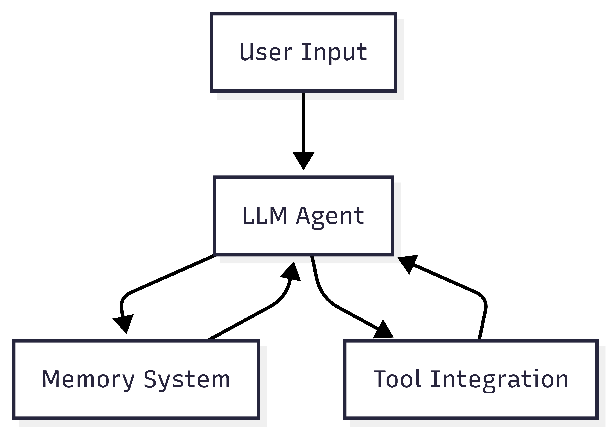
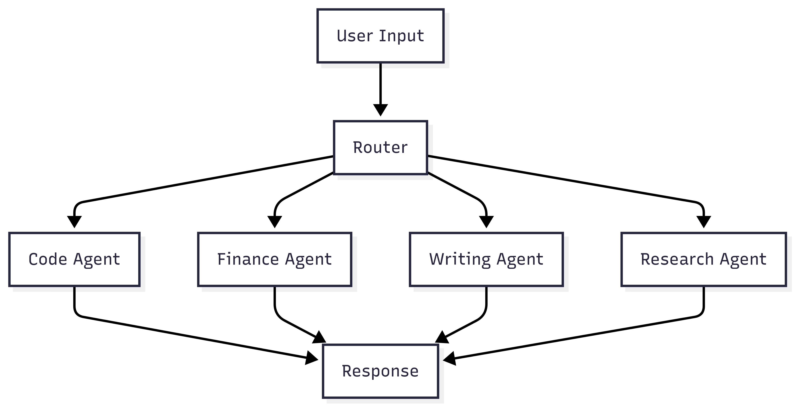
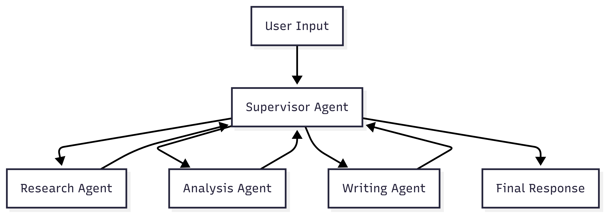
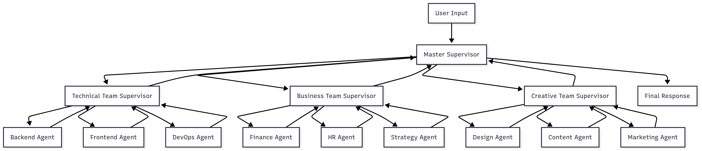
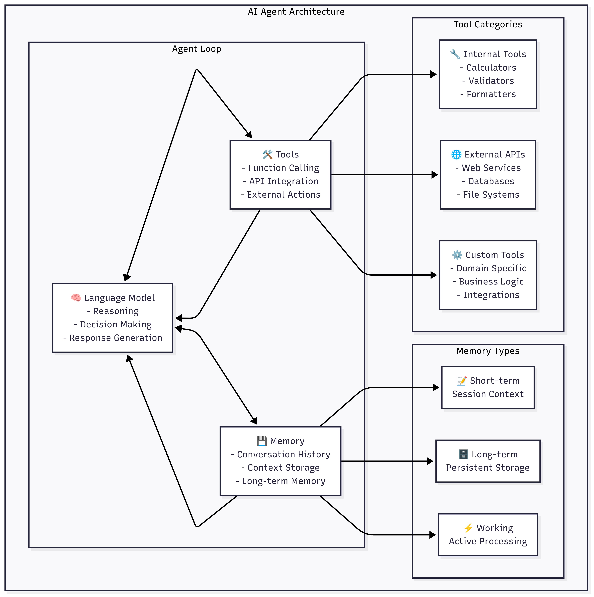
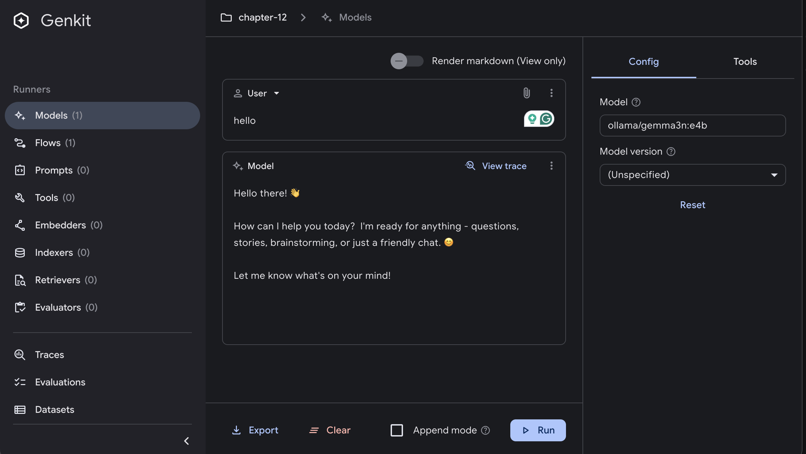
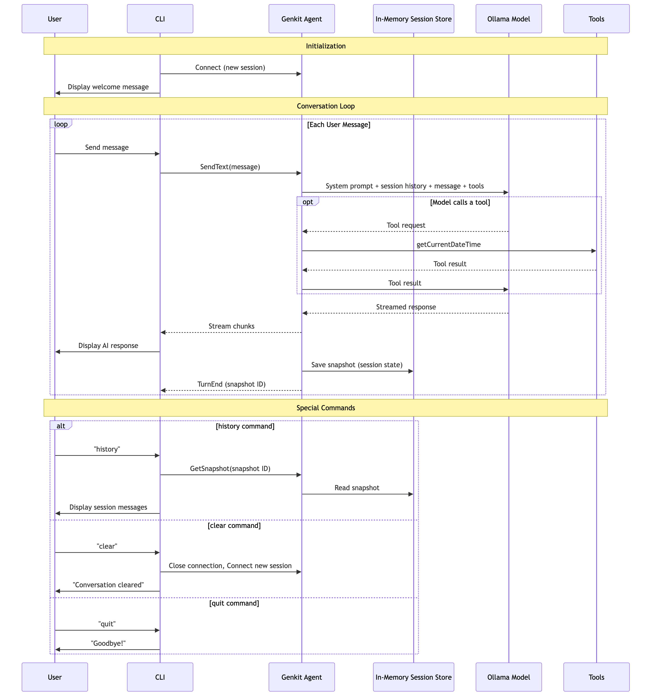

# Building AI Agents with Genkit Go

## Introduction

AI agents represent the next evolution in artificial intelligence applications, moving beyond simple question-and-answer interactions to create autonomous, context-aware systems that can maintain conversations, remember previous interactions, and perform complex tasks. Genkit Go ships a built-in **Agents API** that combines the model loop, message history, tool calls, streaming, and persistence behind a single abstraction, and this chapter shows how to build an AI agent with it.

An AI agent is an intelligent and autonomous system that can perceive its environment, maintain internal state, make decisions, and take actions to achieve specific goals. Unlike traditional chatbots that respond to individual queries in isolation, AI agents maintain context across interactions, learn from previous conversations, and can adapt their behavior based on accumulated knowledge. Most importantly, AI agents understand natural language, allowing users to interact with them in a conversational manner.

Since ChatGPT's release in 2022, the AI agent paradigm has gained significant traction, with many companies and developers exploring how to build intelligent systems that can interact naturally with users, learn from conversations, and perform tasks autonomously.

## Prerequisites

Before diving into this chapter, you should have:

- Completed the previous chapters and have a working Genkit Go development environment
- Genkit Go **v1.10.0 or later** (the Agents API was introduced in v1.10.0; the examples use v1.13.1)
- Basic familiarity with command-line interface development
- **Ollama** installed and running locally with the `gemma4:e4b` model
- Understanding of Genkit flows, tools, and model integration from previous chapters
- Basic knowledge of conversation state management concepts

## AI Agent Design Patterns

As AI agents become more complex, different architectural patterns have emerged to handle various complexity levels and use cases. Understanding these patterns helps you choose the right approach for your specific needs and scale your agent systems effectively.

### 1. LLM Augmented Agent

The LLM Augmented Agent is the foundational pattern where a single Language Model is enhanced with additional capabilities through memory, tools, and context management. This is the pattern we implement in this chapter.



We will cover this pattern in detail, including its implementation and use cases below.

### 2. Network Agent (Router-Based)

The Network Agent pattern uses a router component to direct tasks to specialized agents based on the task type or domain. Each agent is optimized for specific capabilities.




### 3. Supervisor Agent

The Supervisor Agent pattern introduces a coordinating agent that orchestrates multiple specialized agents, enabling more complex workflows and inter-agent communication.



### 4. Hierarchical Agent (Mega Agents)

The Hierarchical Agent pattern extends the supervisor model by organizing agents into teams, with supervisors managing teams rather than individual agents. This creates a tree-like organizational structure.



### Choosing the Right Pattern

| Pattern | Complexity | Scalability | Use Case |
|---------|------------|-------------|----------|
| LLM Augmented | Low | Limited | Single domain, personal assistants |
| Network Agent | Medium | High | Multi-domain applications |
| Supervisor Agent | High | Medium | Complex workflows, task orchestration |
| Hierarchical Agent | Very High | Very High | Enterprise-scale, complex organizations |

The choice of pattern depends on your application's complexity, performance requirements, and the sophistication of tasks you need to handle. Start with simpler patterns and evolve to more complex architectures as your needs grow.

## AI Agent Common Architecture

Modern AI agents follow a common architectural pattern that combines three core components: **Language Model (LLM)**, **Memory**, and **Tools**. This architecture enables agents to process natural language, maintain context, and perform actions in their environment.

### Core Components Architecture



### 1. Language Model (LLM) - The Brain

The Language Model serves as the cognitive core of the AI agent, responsible for:

**Primary Functions**:

- **Natural Language Understanding**: Parsing and interpreting user inputs
- **Reasoning and Planning**: Making decisions about what actions to take
- **Response Generation**: Creating appropriate responses in natural language
- **Context Integration**: Combining information from memory and tools

**In Genkit Go Implementation**:

An agent's model, instructions, and tools are declared once, as an *inline prompt*. Genkit renders that prompt on every turn and sends it to the model together with the conversation so far:

```go
aix.InlinePrompt{
    ai.WithModelName("ollama/gemma4:e4b"),
    ai.WithSystem("You're a helpful AI assistant..."),
    ai.WithTools(availableTools...),
}
```

### 2. Memory - The Context Keeper

Memory systems in AI agents manage different types of information:

**Memory Types**:

- **Short-term Memory (Session Context)**:
  - Stores current conversation
  - Maintains immediate context
  - Typically volatile (lost on restart)

- **Long-term Memory (Persistent Storage)**:
  - User preferences and profiles
  - Historical interactions
  - Learned patterns and behaviors

- **Working Memory (Active Processing)**:
  - Current task state
  - Temporary calculations
  - Active reasoning chains

**In Genkit Go Implementation**:

Genkit agents manage memory for you. Every agent conversation is a **session**, and its state is a `SessionState`:

```go
type SessionState[State any] struct {
    Artifacts []*aix.Artifact `json:"artifacts,omitempty"`
    Custom    State           `json:"custom,omitempty"`   // your own typed state
    Messages  []*ai.Message   `json:"messages,omitempty"` // the conversation history
    SessionID string          `json:"sessionId,omitempty"`
}
```

At the end of every turn, the agent saves a **snapshot** of this state in a **session store**. Whether that memory is short-term or long-term depends on the store you choose: an in-memory store, a file-backed store, or a Firestore store for production deployments.

### 3. Tools - The Action Layer

Tools extend the agent's capabilities beyond text generation as we have seen in chapter 8:

**Tool Categories**:

- **Internal Tools**: Built-in functions like calculators, validators, and formatters
- **External APIs**: Web services, databases, and third-party integrations
- **Custom Tools**: Domain-specific functions and business logic

**Genkit Go Tool Integration**:

```go
// Define tools that the agent can use
tools := []ai.ToolRef{
    calculatorTool,
    databaseQueryTool,
    apiCallTool,
}

// Make tools available to the agent's model
aix.InlinePrompt{
    ai.WithTools(tools...),
    // ... other options
}
```

### Agent Decision Flow

The agent follows this decision-making process:

1. **Input Processing**: Receive and parse user input
2. **Context Retrieval**: Load relevant context from memory
3. **Route Decision**: Determine if simple response or complex processing needed
4. **Tool Selection**: Choose appropriate tools if actions are required
5. **Response Generation**: Create response using LLM with full context
6. **Memory Update**: Store new information and conversation state

With Genkit's Agents API, steps 2, 4 and 6 are handled by the framework: it loads the session state, runs the tool-calling loop, and saves a new snapshot after each turn.

## Setting Up Ollama

For this chapter, we'll use Ollama to run a local AI model, providing privacy and offline operation capabilities:

1. **Install Ollama** from [https://ollama.com](https://ollama.com)
2. **Start Ollama** (it typically runs on http://localhost:11434)
3. **Download the required model**:

   ```bash
   ollama pull gemma4:e4b
   ```

4. **Verify the model is available**:

   ```bash
   ollama list
   ```

We are going to use the `gemma4:e4b` model, an open model from Google DeepMind optimized to run on-device. It supports **tool calling**, which our agent needs, and provides a good balance of performance and capabilities for a local agent.

### Local AI Integration with Ollama and Genkit UI

You can interact with Ollama to run the AI model locally with the Genkit UI:



## Genkit Agents API

Genkit agents are *actions with conversation state*. On each turn a standard agent renders its prompt, appends the conversation history, calls the model (running any tool calls), streams the response, updates its session state, and optionally persists a snapshot.

The Agents API lives in Genkit's experimental packages:

```go
import (
    aix "github.com/firebase/genkit/go/ai/exp"         // agent types and options
    genkitx "github.com/firebase/genkit/go/genkit/exp" // agent and tool constructors
    "github.com/firebase/genkit/go/ai/exp/localstore"  // built-in session stores
)
```

Because these APIs are still in Beta, you must opt in when initializing Genkit with `genkit.WithExperimental()`; otherwise the constructors panic with a message explaining how to enable them.

Genkit provides three agent constructors:

| Constructor | Use it when |
|-------------|-------------|
| `genkitx.DefineAgent` | You want to declare the prompt (model, system instructions, tools) inline next to the agent |
| `genkitx.DefinePromptAgent` | You want to wrap a prompt that is already registered, such as a Dotprompt `.prompt` file |
| `genkitx.DefineCustomAgent` | You need full control over the per-turn loop |

Every agent is generic over a `State` type: the typed custom state stored in its session next to the messages. Agents that only need the conversation history use `any`.

You can call an agent in two ways:

- **`RunText` / `Run`**: one turn per call. The call returns an `AgentOutput` with the model's message, the `SessionID`, and the `SnapshotID`. To continue the conversation, pass `aix.WithSessionID(out.SessionID)` on the next call.
- **`Connect`**: opens a bidirectional streaming connection. You send messages with `SendText`, read streamed chunks with `Receive`, and close it with `Output`. All the turns sent through one connection belong to the same session.

## Building an AI Agent with Genkit Go

Our implementation will showcase:

- An agent defined with `genkitx.DefineAgent`
- A tool the agent can call
- Conversation memory backed by Genkit's built-in in-memory session store
- An interactive CLI that streams responses through a bidirectional connection
- Integration with local AI models through Ollama

### Project Structure and Architecture

Our AI agent implementation follows this structure:

```bash
├── main.go                    # Entry point and Genkit initialization
├── internal/
│   ├── agent/
│   │   └── assistant.go      # Agent definition and tools
│   └── cli/
│       └── cli.go            # CLI interface and user interaction
├── go.mod                    # Go module dependencies
└── README.md                 # Documentation
```

The architecture designed for this example enables the AI agent to process user input, maintain context, call tools, and generate appropriate responses:



### Main Application Setup

The main application serves as the entry point for our AI agent:

```go
package main

import (
    "context"
    "log"
    "mastering-genkit-go/example/chapter-12/internal/agent"
    "mastering-genkit-go/example/chapter-12/internal/cli"

    "github.com/firebase/genkit/go/ai/exp/localstore"
    "github.com/firebase/genkit/go/genkit"
    "github.com/firebase/genkit/go/plugins/ollama"
)

func main() {
    ctx := context.Background()

    // Create the Ollama plugin pointing to the local Ollama server
    ollamaPlugin := &ollama.Ollama{
        ServerAddress: "http://localhost:11434",
        Timeout:       300, // local models can take a while to load
    }

    // Initialize Genkit with the Ollama plugin. Agents are part of Genkit's
    // experimental API, so we have to opt in with WithExperimental.
    g := genkit.Init(ctx,
        genkit.WithPlugins(ollamaPlugin),
        genkit.WithExperimental(),
    )

    // Keep session snapshots (the conversation state) in memory
    store := localstore.NewInMemorySessionStore[any]()

    // Define the agent. Ollama resolves any locally installed model by name.
    assistant := agent.NewAssistantAgent(g, "ollama/gemma4:e4b", store)
    log.Println("Genkit initialized with agent:", assistant.Name())

    // Start the interactive CLI
    if err := cli.New(assistant).Run(ctx); err != nil {
        log.Fatalf("AI agent error: %v", err)
    }
}
```

Let's break down each component:

1. **Ollama Plugin Configuration**: The `ollama.Ollama` struct configures the connection to the local Ollama server. The `ServerAddress` points to the default Ollama endpoint (`http://localhost:11434`), and `Timeout` gives the local model enough time (in seconds) to load and answer.

2. **Genkit Initialization**: `genkit.Init()` sets up the Genkit framework with the Ollama plugin. `genkit.WithExperimental()` opts in to the experimental APIs, which is required to define agents.

3. **Session Store**: `localstore.NewInMemorySessionStore[any]()` is Genkit's built-in in-memory store. The type parameter is the agent's custom state type; we use `any` because our agent only needs the conversation history that Genkit already tracks. Snapshots live in the process memory, which is ideal for local development and tests.

4. **Model Reference**: We don't need to define the model upfront. The Ollama plugin resolves any locally installed model on demand, so `"ollama/gemma4:e4b"` is enough. The plugin also asks Ollama which capabilities (such as tool calling) the model supports.

5. **Agent and CLI Setup**: We define the agent and hand it to the CLI, which provides the user interface.

### Agent Definition

The agent is defined with `genkitx.DefineAgent`, which takes the prompt inline:

```go
package agent

import (
    "context"
    "time"

    "github.com/firebase/genkit/go/ai"
    aix "github.com/firebase/genkit/go/ai/exp"
    "github.com/firebase/genkit/go/genkit"
    genkitx "github.com/firebase/genkit/go/genkit/exp"
)

// DateTimeInput is the (empty) input of the getCurrentDateTime tool.
type DateTimeInput struct{}

// NewAssistantAgent registers the assistant's tools and the agent itself.
// The agent keeps no custom state (State is any): its memory is the
// conversation history that Genkit stores in every session snapshot.
func NewAssistantAgent(g *genkit.Genkit, model string, store aix.SessionStore[any]) *aix.Agent[any] {
    // A tool the model can call to answer questions about the current time
    getCurrentDateTime := genkitx.DefineTool(g, "getCurrentDateTime",
        "Returns the current local date and time.",
        func(ctx context.Context, _ DateTimeInput) (string, error) {
            return time.Now().Format(time.RFC1123), nil
        })

    return genkitx.DefineAgent(g, "assistant",
        aix.InlinePrompt{
            ai.WithModelName(model),
            ai.WithSystem("You're a helpful AI assistant. Respond to the user's message in a helpful and concise manner. " +
                "When the user asks about the current date or time, call getCurrentDateTime."),
            ai.WithTools(getCurrentDateTime),
            // Cap the tool-calling loop of a single turn
            ai.WithMaxTurns(5),
        },
        aix.WithSessionStore(store),
        aix.WithDescription[any]("Helpful assistant with conversation memory"),
    )
}
```

**Agent Definition Breakdown:**

1. **Tool Definition**:
   - `genkitx.DefineTool` is the experimental counterpart of `genkit.DefineTool` from chapter 8. Its function receives a plain `context.Context` instead of an `*ai.ToolContext`.
   - Through that context a tool can also reach the live session with `aix.SessionFromContext`, which is how tools read or update an agent's custom state.

2. **Inline Prompt**:
   - `aix.InlinePrompt` is a list of the same prompt options you already know from `genkit.Generate` and `genkit.DefinePrompt`.
   - `ai.WithModelName()` selects the model, `ai.WithSystem()` sets the agent's instructions, and `ai.WithTools()` makes tools available.
   - `ai.WithMaxTurns()` bounds the tool-calling loop of a single turn, so a misbehaving model cannot call tools forever.

3. **Agent Options**:
   - `aix.WithSessionStore()` enables **server-managed state**: the agent saves a snapshot to the store after every turn, and callers continue a conversation by its session ID.
   - `aix.WithDescription()` adds a human-readable description that shows up in tooling such as the Genkit Developer UI.

4. **Turn Composition**: On every turn the runtime builds the model request in this order: the system message, the conversation stored in the session, and then the new user message. We never touch the history ourselves.

**Why This Design Matters**: Compare this with a hand-written chat flow. There is no request/response struct carrying the history back and forth and no code to append user and model messages. The agent owns its conversation, so each turn builds on previous interactions automatically, including the tool calls and tool results the model made along the way.

### CLI Interface of our AI Agent

The CLI opens a bidirectional streaming connection to the agent with `Connect`, sends each user message, and prints the response as it streams:

```go
// runSession opens a bidirectional connection to the agent and exchanges
// turns until the user clears the conversation (nil) or quits (errQuit).
func (c *CLI) runSession(ctx context.Context) error {
    // Connect without a session ID starts a brand-new session
    conn, err := c.agent.Connect(ctx)
    if err != nil {
        return fmt.Errorf("connect to agent: %w", err)
    }

    var (
        lastSnapshot string // snapshot saved at the end of the last turn
        result       error
    )
loop:
    for {
        fmt.Print("You: ")
        if !c.scanner.Scan() {
            result = errQuit
            break
        }
        input := strings.TrimSpace(c.scanner.Text())

        // Handle special commands
        switch strings.ToLower(input) {
        case "quit", "exit", "bye":
            result = errQuit
            break loop
        case "clear":
            break loop
        case "history":
            c.showHistory(ctx, lastSnapshot)
            continue
        case "":
            continue
        }

        // Send the user message and stream the agent's reply
        if err := conn.SendText(input); err != nil {
            result = fmt.Errorf("send message: %w", err)
            break
        }
        end, err := streamTurn(conn)
        if err != nil {
            result = err
            break
        }
        if end.SnapshotID != "" {
            lastSnapshot = end.SnapshotID
        }
        if end.FinishReason == aix.AgentFinishReasonFailed {
            // A failed turn ends the invocation; Output reports the error.
            break
        }
    }

    // Output closes the connection and waits for the final result.
    out, err := conn.Output()
    if err != nil && !errors.Is(err, context.Canceled) {
        fmt.Printf("❌ Error: %v\n", err)
    }
    if out != nil && out.Error != nil {
        fmt.Printf("❌ Agent failed (%s): %s\n", out.Error.Status, out.Error.Message)
    }
    return result
}
```

The `Run` method wraps `runSession` in a loop: when the user types `clear`, the current connection is closed and a new one is opened. Since `Connect` is called without `aix.WithSessionID`, the agent starts a brand-new session with an empty history.

Each turn is streamed by `streamTurn`:

```go
// streamTurn prints the agent's reply as it streams, including the tools it
// calls, and returns once the turn has ended.
func streamTurn(conn *aix.AgentConnection[any]) (*aix.TurnEnd, error) {
    fmt.Print("🤖 AI: ")
    for chunk, err := range conn.Receive() {
        if err != nil {
            return nil, fmt.Errorf("stream turn: %w", err)
        }
        if mc := chunk.ModelChunk; mc != nil {
            fmt.Print(mc.Text())
            for _, p := range mc.Content {
                if p.IsToolRequest() && !p.ToolRequest.Partial {
                    fmt.Printf("\n   🔧 %s %s\n", p.ToolRequest.Name, toJSON(p.ToolRequest.Input))
                }
            }
        }
        if chunk.TurnEnd != nil {
            fmt.Print("\n\n")
            return chunk.TurnEnd, nil
        }
    }
    return nil, errors.New("connection closed before the turn ended")
}
```

Finally, the `history` command reads the conversation back from the session store instead of keeping a copy in the CLI:

```go
// showHistory prints the conversation stored in a session snapshot.
func (c *CLI) showHistory(ctx context.Context, snapshotID string) {
    if snapshotID == "" {
        fmt.Println("📝 No conversation history yet.")
        return
    }
    snap, err := c.agent.GetSnapshot(ctx, snapshotID)
    if err != nil {
        fmt.Printf("❌ Error reading snapshot: %v\n", err)
        return
    }

    fmt.Println("📝 Conversation History:")
    fmt.Println(strings.Repeat("-", 50))
    for i, msg := range snap.State.Messages {
        switch msg.Role {
        case ai.RoleUser:
            fmt.Printf("%d. You: %s\n", i+1, msg.Text())
        case ai.RoleModel:
            for _, p := range msg.Content {
                if p.IsToolRequest() {
                    fmt.Printf("%d. 🔧 Tool call: %s %s\n", i+1, p.ToolRequest.Name, toJSON(p.ToolRequest.Input))
                }
            }
            if text := msg.Text(); text != "" {
                fmt.Printf("%d. 🤖 AI: %s\n", i+1, text)
            }
        case ai.RoleTool:
            for _, p := range msg.Content {
                if p.IsToolResponse() {
                    fmt.Printf("%d. 🔧 Tool result: %s %s\n", i+1, p.ToolResponse.Name, toJSON(p.ToolResponse.Output))
                }
            }
        }
    }
    fmt.Println(strings.Repeat("-", 50))
}
```

**AI Agent CLI Explained:**

1. **Connection Lifecycle**:
   - `agent.Connect()` opens a bidirectional connection; every message sent through it belongs to the same session.
   - `conn.SendText()` sends a user message and starts a turn.
   - `conn.Output()` closes the input side, drains any remaining chunks, and returns the final `AgentOutput`, including the `SessionID`, the last `SnapshotID`, and an `Error` when the invocation failed.

2. **Streaming**:
   - `conn.Receive()` returns an iterator of `AgentStreamChunk` values. A chunk can carry a `ModelChunk` (text and tool requests streamed by the model), an `Artifact`, a `CustomPatch` (changes to custom state), or a `TurnEnd`.
   - `TurnEnd` marks the end of a turn and carries the turn's `FinishReason` and the `SnapshotID` that was just persisted. After a `TurnEnd` we can send the next message and call `Receive` again on the same connection.
   - Tool requests are streamed too, so the CLI can show which tools the agent calls while it works.

3. **Command System**:
   - `switch strings.ToLower()` provides case-insensitive command matching
   - Special commands (`quit`, `clear`, `history`) are handled immediately without AI processing

4. **Reading Memory Back**:
   - `agent.GetSnapshot()` reads a snapshot from the session store. `snap.State.Messages` holds the full conversation, including tool calls and tool results.
   - `agent.GetLatestSnapshot()` returns the most recent snapshot of a session given its ID, which is useful when you only know the session.

5. **Error Handling**:
   - If a turn fails, its `TurnEnd` reports `AgentFinishReasonFailed`, the invocation ends, and `Output()` returns an `AgentOutput` whose `Error` is a `*status.Error`, so you can branch on its `Status` (see chapter 4).

The agent we just have built supports several built-in commands:

- **`quit`**, **`exit`**, **`bye`**: Terminate the session
- **`clear`**: Start a new session with an empty history
- **`history`**: Display the conversation stored in the session
- **Regular messages**: Process through the agent

Here is the output of the agent when you run it:

```bash
🤖 AI Agent
Type your message and press Enter. Type 'quit', 'exit', or 'bye' to exit.
Type 'clear' to start a new conversation.
Type 'history' to see the conversation history.

You: my name is xavi
🤖 AI: Hello Xavi! It's nice to meet you.

You: what is my name?
🤖 AI: Your name is Xavi.

You: What time is it?
🤖 AI: 
   🔧 getCurrentDateTime {}
It is currently Monday, October 5, 2026, at 17:47:30 CEST.
```

The agent remembers the name from the previous turn because the conversation is part of the session state, and it calls the `getCurrentDateTime` tool to answer the question about the time.

And here is the output of the agent when you request the history. Notice that tool calls and tool results are part of the stored conversation:

```bash
You: history
📝 Conversation History:
--------------------------------------------------
1. You: my name is xavi
2. 🤖 AI: Hello Xavi! It's nice to meet you.
3. You: what is my name?
4. 🤖 AI: Your name is Xavi.
5. You: What time is it?
6. 🔧 Tool call: getCurrentDateTime {}
7. 🔧 Tool result: getCurrentDateTime "Mon, 05 Oct 2026 17:47:30 CEST"
8. 🤖 AI: It is currently Monday, October 5, 2026, at 17:47:30 CEST.
--------------------------------------------------
```

And here is the output when you clear the history. The new session starts with an empty memory:

```bash
You: clear
✅ Conversation cleared. Starting a new session.
You: what is my name?
🤖 AI: I do not have access to your personal information, so I do not know your name.
```

### Running the Agent

To run the AI agent example:

1. **Navigate to the project**:

   ```bash
   cd src/examples/chapter-12
   ```

2. **Install dependencies**:

   ```bash
   go mod tidy
   ```

3. **Run the agent**:

   ```bash
   go run .
   ```

You can also run it with the Genkit Developer UI with `genkit start -- go run .`. The CLI keeps working in the terminal, and every agent turn, model call, and tool call appears in the traces.

## Memory Management in AI Agents

When building applications that involve extended conversations with LLMs, it's important to manage the conversation history effectively to maintain optimal performance. For lengthy interactions, you should limit the history size by implementing a truncation strategy that removes older messages when the conversation exceeds a certain threshold. It is also very common to summarize or compress older messages to retain essential context without overwhelming the model with too much data. With Genkit agents, you can do this with a custom agent (`genkitx.DefineCustomAgent`), which gives you access to the session's messages on every turn, or by controlling where the history goes in the prompt with `ai.WithMessagesFn`.

The in-memory store we used is lost when the process stops. In production environments, you'll want persistent storage, and Genkit provides it out of the box by swapping the session store:

- `localstore.NewFileSessionStore` persists snapshots on disk, for local development and single-host deployments.
- `firebasex.NewFirestoreSessionStore` (from `github.com/firebase/genkit/go/plugins/firebase/exp`) persists snapshots in Firestore, for production deployments with multiple instances.
- You can also implement the `aix.SessionStore` interface to use your own database.

With a persistent store, a conversation survives application restarts: you resume it with `aix.WithSessionID(sessionID)` (continue the latest snapshot) or `aix.WithSnapshotID(snapshotID)` (branch from a specific point in the conversation).

Beyond the conversation history, agents can keep **typed custom state**. If you define an agent as `Agent[MyState]`, tools and prompts can read and update that state through `aix.SessionFromContext[MyState](ctx)`, and it is saved in every snapshot next to the messages. This is the natural place for working memory such as a shopping cart, a task list, or user preferences.

For applications serving multiple users simultaneously, implementing proper user session management becomes crucial. Each conversation is a separate session with its own ID, so contexts never mix between users. Session stores also support scoping every read and write by tenant or user (for example, `WithSnapshotPathPrefix` on the file and Firestore stores), and you should never rely on snapshot IDs alone for authorization.

## Conclusion

Building AI agents with Genkit Go is now a first-class experience. The built-in Agents API handles the model loop, conversation history, tool calls, streaming, and persistence, so your code can focus on what makes your agent unique: its instructions, its tools, and its user experience.

The agent pattern opens up possibilities for building more complex AI applications, from customer service bots to personal assistants and specialized domain experts. As you build your own agents, remember to focus on user experience, and scalability to create robust, production-ready systems.

This implementation serves as a foundation that you can extend with the rest of the Agents API: persistent session stores, typed custom state, interruptible tools that pause a turn for human approval, background (detached) execution, serving agents over HTTP, and multi-agent systems where an orchestrator delegates work to specialized sub-agents.
