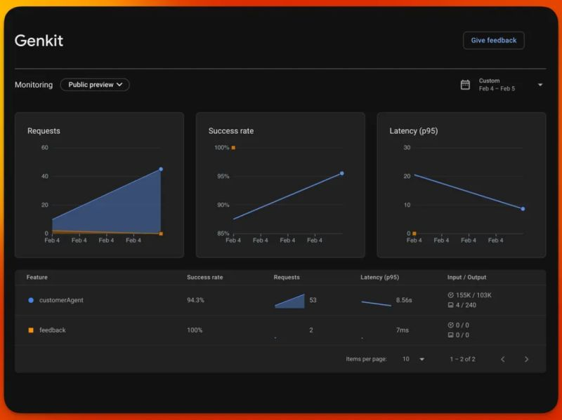

# Monitoring and Observability with Genkit Go

Genkit Go comes fully instrumented with metrics and traces out of the box, providing powerful observability capabilities for your AI applications. This chapter explores the various monitoring and observability options available, from development-time debugging to production monitoring across different platforms.

## What is OpenTelemetry?

OpenTelemetry (often abbreviated as OTel) is an open-source observability framework that provides a standardized way to collect, process, and export telemetry data (metrics, traces, and logs) from applications. It's vendor-neutral, meaning you can use it with any observability backend, and it has become the industry standard for application observability.

OpenTelemetry consists of:

- **APIs and SDKs** for instrumenting applications
- **Collectors** for receiving, processing, and exporting telemetry data
- **Exporters** for sending data to various observability backends
- **Instrumentation libraries** for popular frameworks and libraries

Genkit Go uses OpenTelemetry internally, which means you get automatic instrumentation of your AI flows, model calls, and other operations without additional configuration.

### OpenTelemetry Architecture

The following diagram illustrates how OpenTelemetry works within a Genkit Go application:


This architecture shows the flow from your Genkit Go application through the OpenTelemetry SDK to various observability backends, demonstrating the flexibility and vendor-neutral approach of OpenTelemetry.

## Prerequisites

Before diving into the examples, ensure you have the following prerequisites set up:

- **Go 1.24+**: Ensure you have Go installed and set up on your machine.
- **Genkit Go**: Understand the basics of Genkit Go and how to create AI applications.
- **OpenTelemetry**: Familiarize yourself with OpenTelemetry concepts and components.
- **AWS Credentials**: For examples using AWS Bedrock, ensure you have your AWS credentials configured.
- **Google Cloud Credentials**: For examples using Google Cloud monitoring, ensure you have your Google Cloud project set up and authenticated.

## Observability While Developing Using the Genkit UI

During development, Genkit provides a built-in developer UI that offers real-time visibility into your application's behavior. This UI is perfect for debugging flows, understanding model interactions, and optimizing performance.

### Accessing the Genkit UI

The Genkit UI is automatically available when you run your application in development mode by running `genkit start -- go run .`. Simply start your application and navigate to the Genkit UI URL [http://localhost:4000](http://localhost:4000).

This is what you can do with the Genkit UI in terms of observability:

- **Flow Execution Timeline**: Visual representation of flow execution with timing information
- **Trace Visualization**: Detailed view of spans, including model calls, tool usage, and custom operations
- **Request/Response Inspection**: Examine inputs and outputs at each step
- **Performance Metrics**: Latency, token usage, and other performance indicators

### Example: Using the Developer UI

```go
// Example from src/examples/chapter-13/otel/main.go
func main() {
    ctx := context.Background()

    // Initialize Genkit with OpenTelemetry support
    g, err := genkit.Init(ctx,
        genkit.WithPlugins(
            &bedrock.Bedrock{
                Region: "us-east-1",
                DefineCommonModels: true,
            },
        ),
    )
    
    // Your flows and handlers here...
}
```

When you run this example, the Genkit UI will show traces of all operations, making it easy to debug and optimize your flows during development:


You can also inspect any individual flow execution, view the trace spans, and see how long each operation took, including model calls and tool executions:


## Firebase AI Monitoring

Firebase offers an AI monitoring solution with built-in dashboards and performance tracking. While Firebase monitoring provides excellent integration with Google's ecosystem, **it is not currently supported in Genkit Go but will be available in future releases**.



### Required APIs for Firebase Integration

When Firebase monitoring becomes available for Genkit Go, you'll need to enable these APIs in your Google Cloud Console:

- **Cloud Logging API**: For centralized log collection and analysis
- **Cloud Trace API**: For distributed tracing across services
- **Cloud Monitoring API**: For metrics collection and alerting

## Google Cloud Monitoring

Google Cloud provides a robust monitoring and observability platform that integrates seamlessly with Genkit Go applications. This option is ideal for applications deployed on Google Cloud or those that need enterprise-grade monitoring capabilities.

### Setting Up Google Cloud Monitoring

To use Google Cloud monitoring with Genkit Go, you need to configure the Google Cloud plugin `googlecloud`:

```go
// Example from src/examples/chapter-13/cloud/main.go
import (
    "github.com/firebase/genkit/go/plugins/googlecloud"
)

func main() {
    ctx := context.Background()

    g, err := genkit.Init(ctx,
        genkit.WithPlugins(
            &googlecloud.GoogleCloud{
                ProjectID:      "my-project-id", // Replace with your project ID
                ForceExport:    true,           // Export even in dev environment
                MetricInterval: 60 * time.Second, // Metric export interval (default: 60s)
                LogLevel:       slog.LevelInfo,   // Minimum log level (default: Info)
            },
            // Other plugins...
        ),
    )
    // ... rest of initialization
}
```

The Google Cloud plugin uses specific Google Cloud exporters under the hood:

- **Trace Exporter**: Uses `github.com/GoogleCloudPlatform/opentelemetry-operations-go/exporter/trace` to send traces to Google Cloud Trace with automatic PII filtering
- **Metrics Exporter**: Uses `github.com/GoogleCloudPlatform/opentelemetry-operations-go/exporter/metric` to send metrics to Google Cloud Monitoring  
- **Logging Handler**: Uses `cloud.google.com/go/logging` with a custom slog handler to send structured logs to Google Cloud Logging

### Required Google Cloud APIs

Before using Google Cloud monitoring, ensure these APIs are enabled in your Google Cloud Console:

- **Cloud Logging API** (`logging.googleapis.com`): Enables centralized logging
- **Cloud Trace API** (`cloudtrace.googleapis.com`): Provides distributed tracing
- **Cloud Monitoring API** (`monitoring.googleapis.com`): Enables metrics and alerting

### Google Cloud Monitoring Features

**Cloud Trace**: Distributed tracing for understanding request flows


You can inspect each trace to see how requests propagate through your application, including model calls and tool executions:


**Cloud Logging**: Centralized log management with powerful search and filtering


**Cloud Monitoring**: Custom metrics, dashboards, and alerting


## OpenTelemetry: Open Source Monitoring

OpenTelemetry provides the most flexible monitoring solution, allowing you to use any compatible observability backend such as Prometheus, Jaeger, or commercial solutions.

### Configuring OpenTelemetry

Genkit Go includes built-in OpenTelemetry support through the opentelemetry plugin:

```go
import (
    opentelemetry "github.com/xavidop/genkit-opentelemetry-go"
)

func main() {
    ctx := context.Background()

    g, err := genkit.Init(ctx,
        genkit.WithPlugins(
            opentelemetry.NewWithPreset(opentelemetry.PresetOTLP, opentelemetry.Config{
                ServiceName:    "my-genkit-app",
                ForceExport:    true,
                MetricInterval: 15 * time.Second,
            }),
        ),
    )
}
```

The plugin is quite configurable, allowing you to set the service name, export intervals, and more:

```go
type Config struct {
    // Export even in the dev environment
    ForceExport bool

    // The interval for exporting metric data (default: 60s)
    MetricInterval time.Duration

    // The minimum level at which logs will be written (default: Info)
    LogLevel slog.Leveler

    // Custom trace span exporter (optional)
    TraceExporter trace.SpanExporter

    // Custom metric exporter (optional)
    MetricExporter metric.Exporter

    // Custom log handler (optional)
    LogHandler slog.Handler

    // OTLP endpoint (default: "localhost:4317")
    OTLPEndpoint string

    // Whether to use HTTP instead of gRPC for OTLP (default: false)
    OTLPUseHTTP bool

    // Headers to include in OTLP requests
    OTLPHeaders map[string]string

    // Service name for telemetry data (default: "genkit-service")
    ServiceName string

    // Service version for telemetry data
    ServiceVersion string

    // Additional resource attributes
    ResourceAttributes map[string]string
}
```

Thanks to this plugnin you can monitor your Genkit Go applications using open-source tools like Prometheus, Jaeger, and Grafana:

**Traces in Jaeger**:


**Metrics in Grafana from Prometheus**:


**Traces in Grafana from Jaeger**:


### OpenTelemetry Presets

The OpenTelemetry plugin supports several presets for common monitoring setups:

- **PresetOTLP**: For OpenTelemetry Collector (OTLP) exporters
- **PresetJaeger**: For Jaeger tracing backend
- **PresetPrometheus**: For Prometheus metrics collection
- **PresetConsole**: For console output (debugging)

### Custom OpenTelemetry Configuration

For advanced use cases, you can provide custom configuration:

```go
opentelemetry.New(opentelemetry.Config{
    ServiceName:    "my-service",
    ServiceVersion: "1.0.0",
    ForceExport:    true,
    MetricInterval: 30 * time.Second,
    TraceExporter:  customTraceExporter,
    MetricExporter: customMetricExporter,
})
```

## Other Vendors: Using OpenTelemetry Integration

Thanks to OpenTelemetry's vendor-neutral approach, you can integrate Genkit Go with any observability platform. Popular options include Datadog, New Relic, Grafana, and many others.

The [genkit-opentelemetry-go repository](https://github.com/xavidop/genkit-opentelemetry-go) provides examples for various vendor integrations:

- **Datadog**: Direct integration with Datadog APM
- **New Relic**: Sending traces and metrics to New Relic
- **Grafana Stack**: Using Grafana, Prometheus, and Jaeger
- **Elastic Stack**: Integration with Elasticsearch and Kibana

### Datadog

```go
import (
    "go.opentelemetry.io/otel/exporters/otlp/otlptrace/otlptracehttp"
)

func setupDatadog() {
    exporter, err := otlptracehttp.New(
        context.Background(),
        otlptracehttp.WithEndpoint("https://trace-intake.datadoghq.com"),
        otlptracehttp.WithHeaders(map[string]string{
            "DD-API-KEY": os.Getenv("DD_API_KEY"),
        }),
    )
    
    // Use with Genkit OpenTelemetry plugin
    opentelemetry.New(opentelemetry.Config{
        ServiceName:   "my-genkit-app",
        TraceExporter: exporter,
    })
}
```

### Honeycomb

```go
otelPlugin := opentelemetry.New(opentelemetry.Config{
    ServiceName:  "my-app",
    OTLPEndpoint: "https://api.honeycomb.io",
    OTLPUseHTTP:  true,
    OTLPHeaders: map[string]string{
        "x-honeycomb-team": os.Getenv("HONEYCOMB_API_KEY"),
    },
})
```

### New Relic

```go
otelPlugin := opentelemetry.New(opentelemetry.Config{
    ServiceName:  "my-app",
    OTLPEndpoint: "https://otlp.nr-data.net",
    OTLPUseHTTP:  true,
    OTLPHeaders: map[string]string{
        "api-key": os.Getenv("NEW_RELIC_LICENSE_KEY"),
    },
})
```


## Available Metrics and Traces

Genkit Go provides instrumentation covering all aspects of your AI application. For a complete list of available metrics and traces, refer to the [official documentation](https://genkit.dev/docs/observability/telemetry-collection/).

## Best Practices for Monitoring Genkit Go Applications

1. **Start with Development UI**: Use the built-in Genkit UI during development for immediate feedback
2. **Choose the Right Backend**: Select a monitoring solution that fits your deployment environment and requirements
3. **Set Up Alerting**: Configure alerts for critical metrics like error rates and latency
4. **Monitor Token Usage**: Track model token consumption for cost optimization
5. **Use Custom Metrics**: Add business-specific metrics to understand application behavior
6. **Implement Proper Logging**: Use structured logging with appropriate levels
7. **Regular Review**: Regularly review dashboards and metrics to identify optimization opportunities

## Conclusion

Genkit Go's observability features ensure you have full visibility into your AI applications, whether you're developing locally or running in production. The choice between Google Cloud monitoring, OpenTelemetry integration, or other vendor solutions depends on your specific requirements, deployment environment, and existing infrastructure.

The built-in instrumentation means you get immediate value without additional configuration, while the OpenTelemetry foundation provides flexibility to adapt to any monitoring strategy as your application grows and evolves.

