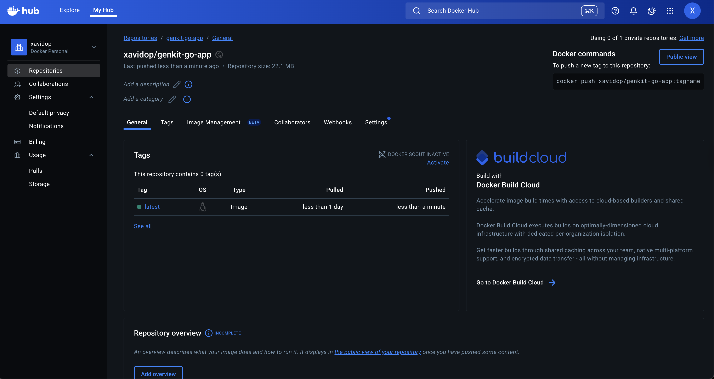
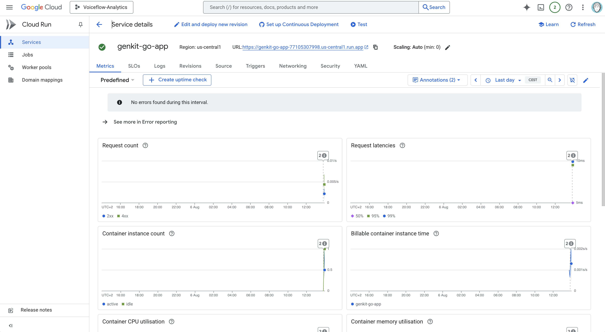
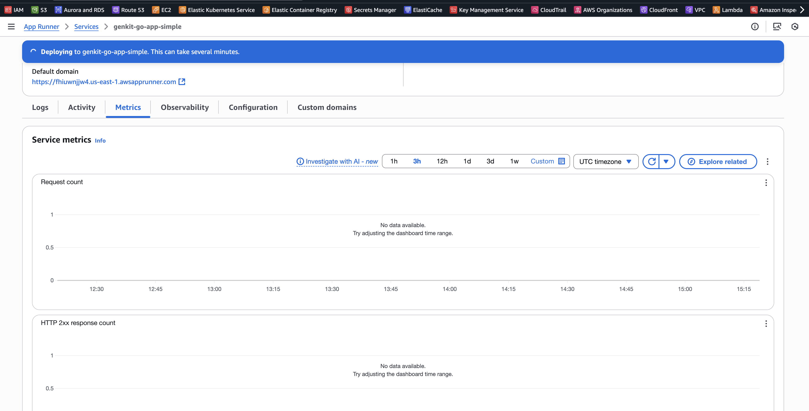
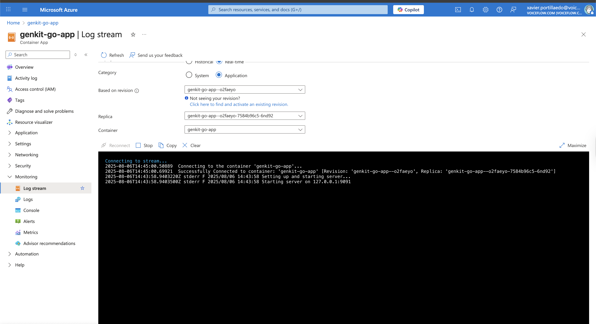
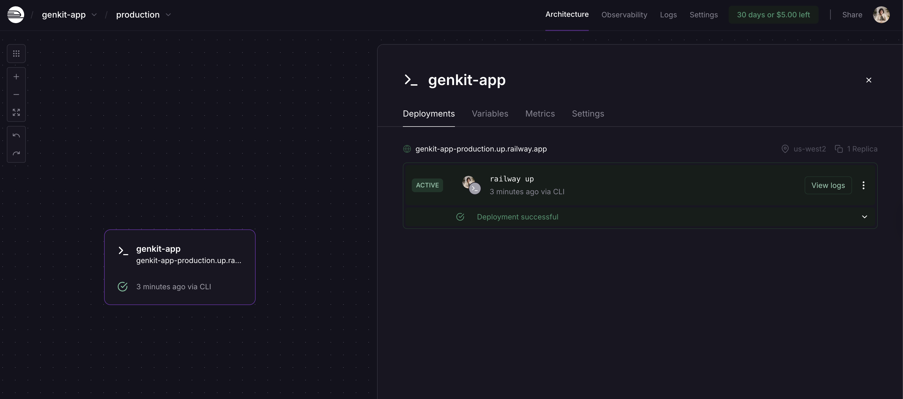

# Deploying AI Applications with Genkit Go

One of the main advantages of building AI applications with Genkit Go is the deployment flexibility it offers. Unlike some frameworks that lock you into specific platforms, Genkit Go applications are standard Go applications that can be deployed anywhere that supports containerized applications or Go binaries.

In this chapter, we'll explore various deployment options for your Genkit Go applications, from cloud platforms to container orchestration systems, and provide practical examples with deployment commands for each platform.

## Why Genkit Go is Deployment-Agnostic

Genkit Go applications are built as standard HTTP servers using Go's built-in `net/http` package. This means they can run anywhere Go applications can run:

- **Cloud Platforms**: Google Cloud Run, AWS App Runner, Azure Container Instances
- **Container Orchestration**: Kubernetes, Docker Swarm, Amazon ECS, Azure Container Apps
- **Platform-as-a-Service**: Heroku, Railway, Render
- **Virtual Machines**: Any cloud provider's compute instances
- **On-Premises**: Your own servers or data centers

### Current Limitations

**Important Note**: Firebase Functions is not yet supported for Genkit Go applications. While Firebase Functions has excellent support for JavaScript/TypeScript Genkit applications, Go support is not available at this time. However, you can deploy to Google Cloud Run, which offers similar serverless capabilities with automatic scaling.

## Example Application Overview

Throughout this chapter, we'll use the example application located in `src/examples/chapter-14/`. This is a simple Genkit Go application that demonstrates a typical deployment-ready structure:

```go
// main.go - Production-ready HTTP server
package main

import (
    "context"
    "log"
    "mastering-genkit-go/example/chapter-14/internal/flows"
    "mastering-genkit-go/example/chapter-14/internal/handlers"
    "net/http"
    "os"

    "github.com/firebase/genkit/go/plugins/server"

    "github.com/firebase/genkit/go/ai"
    "github.com/firebase/genkit/go/genkit"
)

func main() {
    ctx := context.Background()

    // Initialize Genkit
    g, err := genkit.Init(ctx)

    if err != nil {
        log.Fatalf("could not initialize Genkit: %v", err)
    }

    // Create the simple flow with tools (empty for now)
    simpleFlow := flows.NewSimpleFlow(g, []ai.ToolRef{})

    log.Println("Setting up and starting server...")

    mux := http.NewServeMux()

    // Health and readiness endpoints
    mux.HandleFunc("GET /health", handlers.HealthHandler)
    mux.HandleFunc("GET /ready", handlers.ReadyHandler)

    // Main application endpoint
    mux.HandleFunc("POST /simpleFlow", genkit.Handler(simpleFlow))

    port := os.Getenv("PORT")
    if port == "" {
        port = "9091"
    }

    log.Printf("Starting server on 127.0.0.1:%s", port)
    log.Fatal(server.Start(ctx, "0.0.0.0:"+port, mux))
}
```

The strucuture of the application is as follows:

```src/examples/chapter-14/
├── Dockerfile
├── main.go
├── go.mod
├── go.sum
├── README.md
├── k8s/
│   ├── deployment.yml
│   ├── hpa.yml
│   └── svc.yml
└── internal/
    ├── flows/
    │   └── simple.go
    └── handlers/
        ├── health.go
        ├── ready.go
        └── utils.go
```

## Containerization with Docker

The foundation of modern deployment is containerization. Our example includes a production-ready `Dockerfile`:

```dockerfile
# Build stage
FROM golang:1.24-alpine AS builder

# Set working directory
WORKDIR /app

# Install git (needed for Go modules)
RUN apk add --no-cache git

# Copy go mod and sum files
COPY go.mod go.sum ./

# Download dependencies
RUN go mod download

# Copy source code
COPY . .

# Build the application
RUN CGO_ENABLED=0 GOOS=linux go build -a -installsuffix cgo -o main .

# Final stage
FROM alpine:latest

# Install ca-certificates for HTTPS requests and wget for health checks
RUN apk --no-cache add ca-certificates wget

# Create non-root user
RUN addgroup -g 1001 -S appgroup && \
    adduser -u 1001 -S appuser -G appgroup

# Create app directory that appuser can access
WORKDIR /app

# Copy the binary from builder stage
COPY --from=builder /app/main .

# Make binary executable and change ownership
RUN chmod +x main && chown appuser:appgroup main

# Switch to non-root user
USER appuser

# Expose port
EXPOSE 9091

# Run the application
CMD ["./main"]
```

To build and test locally:

```bash
# Build the Docker image
docker build -t genkit-go-app .

# Test locally
docker run -p 9091:9091 -e PORT=9091 genkit-go-app

# Test the endpoint
curl -X POST http://localhost:9091/simpleFlow \
  -H "Content-Type: application/json" \
  -d '{"data":{"message": "Hello from Docker!"}}'
```

## Kubernetes Deployment

Kubernetes provides a robust, platform-agnostic container orchestration solution for deploying Genkit Go applications. You can use Kubernetes on any cloud provider or on-premises infrastructure.

### Managed Kubernetes Services

Most cloud providers offer managed Kubernetes services that handle the control plane for you:

- **Google Kubernetes Engine (GKE)** - Google Cloud's managed Kubernetes service
- **Amazon Elastic Kubernetes Service (EKS)** - AWS's managed Kubernetes service  
- **Azure Kubernetes Service (AKS)** - Microsoft Azure's managed Kubernetes service
- **DigitalOcean Kubernetes** - DigitalOcean's managed Kubernetes offering
- **Linode Kubernetes Engine (LKE)** - Linode's managed Kubernetes service

### Generic Kubernetes Deployment

Regardless of which Kubernetes platform you choose, the deployment process is similar. Here's a complete example using standard Kubernetes manifests:

#### Prerequisites

```bash
# Ensure kubectl is installed and configured to connect to your cluster
kubectl cluster-info

# Build and push your container image to your chosen registry
# Replace YOUR_REGISTRY with your container registry (gcr.io, ecr, acr, etc.)
docker build -t YOUR_REGISTRY/genkit-go-app:latest .
docker push YOUR_REGISTRY/genkit-go-app:latest
```

In our case we pushed it to Dockerhub, but you can use any container registry like Google Container Registry, Amazon ECR, or Azure Container Registry.



#### Kubernetes Manifests

Create a `k8s-deployment.yaml` file:

```yaml
apiVersion: apps/v1
kind: Deployment
metadata:
  name: genkit-go-app
  labels:
    app: genkit-go-app
spec:
  replicas: 3
  selector:
    matchLabels:
      app: genkit-go-app
  template:
    metadata:
      labels:
        app: genkit-go-app
    spec:
      containers:
      - name: genkit-go-app
        image: YOUR_REGISTRY/genkit-go-app:latest
        ports:
        - containerPort: 9091
          name: http
        env:
        - name: PORT
          value: "9091"
        - name: ENVIRONMENT
          value: "production"
        resources:
          requests:
            memory: "256Mi"
            cpu: "250m"
          limits:
            memory: "512Mi"
            cpu: "500m"
        # Health checks for Kubernetes
        livenessProbe:
          httpGet:
            path: /health
            port: 9091
          initialDelaySeconds: 30
          periodSeconds: 10
        readinessProbe:
          httpGet:
            path: /ready
            port: 9091
          initialDelaySeconds: 5
          periodSeconds: 5
---
apiVersion: v1
kind: Service
metadata:
  name: genkit-go-app-service
  labels:
    app: genkit-go-app
spec:
  selector:
    app: genkit-go-app
  ports:
  - port: 80
    targetPort: 9091
    protocol: TCP
    name: http
  type: LoadBalancer
---
apiVersion: autoscaling/v2
kind: HorizontalPodAutoscaler
metadata:
  name: genkit-go-app-hpa
spec:
  scaleTargetRef:
    apiVersion: apps/v1
    kind: Deployment
    name: genkit-go-app
  minReplicas: 2
  maxReplicas: 10
  metrics:
  - type: Resource
    resource:
      name: cpu
      target:
        type: Utilization
        averageUtilization: 70
  - type: Resource
    resource:
      name: memory
      target:
        type: Utilization
        averageUtilization: 80
```

Note that for simplicity we are using a LoadBalancer service type. If you're deploying on-premises or in a different environment, you may need to adjust the service type accordingly (e.g., NodePort or ClusterIP) and expose the service through an Ingress controller.

To apply the Kubernetes manifests, run:

```bash
cd src/examples/chapter-14
# Apply the Kubernetes manifests
kubectl apply -f k8s-deployment.yaml
```

## Google Cloud Platform Deployments

Google Cloud Platform offers several excellent options for deploying Genkit Go applications, with Cloud Run being the most popular choice for serverless deployments for containerized applications.

### Google Cloud Run

Cloud Run is Google's fully managed serverless platform that automatically scales your containerized applications. It's perfect for Genkit Go applications due to its simplicity and cost-effectiveness.

#### Setting Up The Environment

```bash
# Install Google Cloud CLI if not already installed
# macOS with Homebrew:
brew install google-cloud-sdk

# Authenticate with Google Cloud
gcloud auth login

# Set your project (replace with your project ID)
gcloud config set project YOUR_PROJECT_ID

# Enable required APIs
gcloud services enable run.googleapis.com
gcloud services enable cloudbuild.googleapis.com
```

#### Deploying to Cloud Run

```bash
# Navigate to your application directory
cd src/examples/chapter-14

# Build and deploy in one command (Cloud Build will build the container)
gcloud run deploy genkit-go-app \
    --source . \
    --platform managed \
    --region us-central1 \
    --allow-unauthenticated \
    --port 9091 \
    --memory 512Mi \
    --cpu 1 \
    --max-instances 10

# Alternative: Build locally and push to Container Registry
docker build -t gcr.io/YOUR_PROJECT_ID/genkit-go-app .
docker push gcr.io/YOUR_PROJECT_ID/genkit-go-app

gcloud run deploy genkit-go-app \
    --image gcr.io/YOUR_PROJECT_ID/genkit-go-app \
    --platform managed \
    --region us-central1 \
    --allow-unauthenticated \
    --port 9091
```

Here you can see our Genkit Go App running on Google Cloud Run:



## Amazon Web Services (AWS) Deployments

AWS offers multiple deployment options for containerized Go applications, from serverless to fully managed container services.

### AWS App Runner

App Runner is AWS's answer to Google Cloud Run - a fully managed service for containerized applications.

#### Creating IAM Permissions

```bash
# Install AWS CLI
brew install awscli

# Configure AWS credentials
aws configure

# Create an App Runner service role (one-time setup)
# Create IAM role for App Runner to access ECR (one-time setup)
aws iam create-role \
    --role-name AppRunnerECRAccessRole \
    --assume-role-policy-document '{
        "Version": "2012-10-17",
        "Statement": [{
            "Effect": "Allow",
            "Principal": {"Service": "build.apprunner.amazonaws.com"},
            "Action": "sts:AssumeRole"
        }]
    }'

# Attach ECR read-only policy to the role
aws iam attach-role-policy \
    --role-name AppRunnerECRAccessRole \
    --policy-arn arn:aws:iam::aws:policy/service-role/AWSAppRunnerServicePolicyForECRAccess

```

#### Deploying to AWS App Runner

```bash
# Build and push to Amazon ECR
aws ecr get-login-password --region us-east-1 | docker login --username AWS --password-stdin YOUR_ACCOUNT_ID.dkr.ecr.us-east-1.amazonaws.com

# Create ECR repository
aws ecr create-repository --repository-name genkit-go-app --region us-east-1

# Build and tag image using Docker Buildx for multi-platform support (Required for App Runner, which uses AMD64 architecture)
docker buildx create --name genkit-builder --use

# Build and push the Docker image to ECR
docker buildx build --push --platform linux/amd64,linux/arm64 -t YOUR_ACCOUNT_ID.dkr.ecr.us-east-1.amazonaws.com/genkit-go-app:latest .

```bash
# Create App Runner service with HTTP health check configuration
aws apprunner create-service \
    --service-name genkit-go-app \
    --source-configuration '{
        "AuthenticationConfiguration": {
            "AccessRoleArn": "arn:aws:iam::YOUR_ACCOUNT_ID:role/AppRunnerECRAccessRole"
        },
        "ImageRepository": {
            "ImageIdentifier": "YOUR_ACCOUNT_ID.dkr.ecr.us-east-1.amazonaws.com/genkit-go-app:latest",
            "ImageConfiguration": {
                "Port": "9091",
                "RuntimeEnvironmentVariables": {
                    "PORT": "9091"
                }
            },
            "ImageRepositoryType": "ECR"
        },
        "AutoDeploymentsEnabled": false
    }' \
    --instance-configuration '{
        "Cpu": "0.25 vCPU",
        "Memory": "0.5 GB"
    }' \
    --health-check-configuration '{
        "Protocol": "HTTP",
        "Path": "/health",
        "Interval": 10,
        "Timeout": 5,
        "HealthyThreshold": 1,
        "UnhealthyThreshold": 5
    }'
```

Here is the Genkit Go App running on AWS App Runner:




## Microsoft Azure Deployments

Azure provides several container hosting options, from serverless to fully managed Kubernetes services.

### Azure Container Apps

Container Apps is Azure's serverless container platform, similar to Google Cloud Run.

#### Creating Azure Resources

```bash
# Install Azure CLI
brew install azure-cli

# Login to Azure
az login

# Create resource group
az group create --name genkit-rg --location eastus

# Create Azure Container Registry
az acr create --resource-group genkit-rg \
    --name genkitregistry \
    --sku Basic \
    --admin-enabled true
```

#### Deploying to Azure Container Apps

```bash

cd src/examples/chapter-14

# Get ACR login server
ACR_LOGIN_SERVER=$(az acr show --name genkitregistry --resource-group genkit-rg --query "loginServer" --output tsv)

# Build and push to ACR
az acr build --registry genkitregistry \
    --image genkit-go-app:latest \
    .

# Alternative: Build locally and push
docker build -t genkit-go-app .
docker tag genkit-go-app:latest $ACR_LOGIN_SERVER/genkit-go-app:latest

# Login and push
az acr login --name genkitregistry
docker push $ACR_LOGIN_SERVER/genkit-go-app:latest

# Install Container Apps extension
az extension add --name containerapp

# Create Container Apps environment
az containerapp env create \
    --name genkit-env \
    --resource-group genkit-rg \
    --location eastus

# Deploy the application
az containerapp create \
    --name genkit-go-app \
    --resource-group genkit-rg \
    --environment genkit-env \
    --image $ACR_LOGIN_SERVER/genkit-go-app:latest \
    --target-port 9091 \
    --ingress external \
    --cpu 0.5 \
    --memory 1Gi \
    --min-replicas 0 \
    --max-replicas 10 \
    --registry-server $ACR_LOGIN_SERVER \
    --registry-username genkitregistry \
    --registry-password $(az acr credential show --name genkitregistry --query "passwords[0].value" --output tsv) \
    --env-vars PORT=9091

# Get the application URL
az containerapp show \
    --name genkit-go-app \
    --resource-group genkit-rg \
    --query "properties.configuration.ingress.fqdn" \
    --output tsv
```

Here is our Genkit Go App running on Azure Container Apps:




## Other Deployment Platforms

### Railway

Railway offers simple deployment from Git repositories:

```bash
# Install Railway CLI
npm install -g @railway/cli

# Login and initialize
railway login
railway init

# Deploy
railway up
```



## Summary

Genkit Go's deployment flexibility is one of its strongest features. Whether you choose serverless platforms like Google Cloud Run and AWS App Runner for simplicity, or managed Kubernetes services for more control, Genkit Go applications adapt to your infrastructure needs.

These are our recommended best practices for deploying Genkit Go applications:

- **Containerization is key**: Docker enables deployment across all platforms
- **Environment configuration**: Use environment variables for platform-specific settings
- **Health checks**: Essential for production deployments and auto-scaling
- **Secrets management**: Use platform-native secret management services
- **Monitoring**: Implement structured logging and observability from day one

The choice of deployment platform often depends on your team's expertise, existing infrastructure, and specific requirements like geographic distribution, compliance needs, or cost constraints. Genkit Go's standard HTTP server approach ensures you're never locked into a specific platform, giving you the flexibility to migrate or use multiple platforms as your needs evolve.
