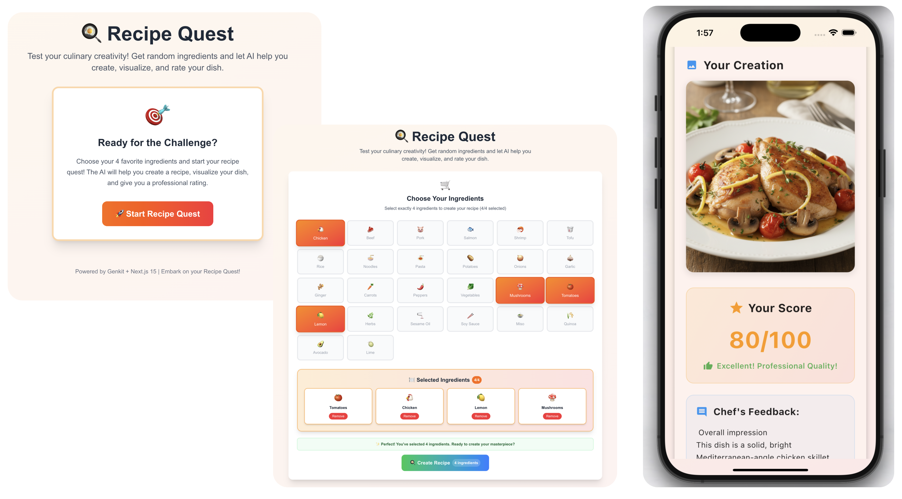
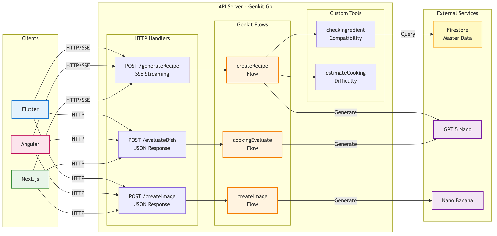
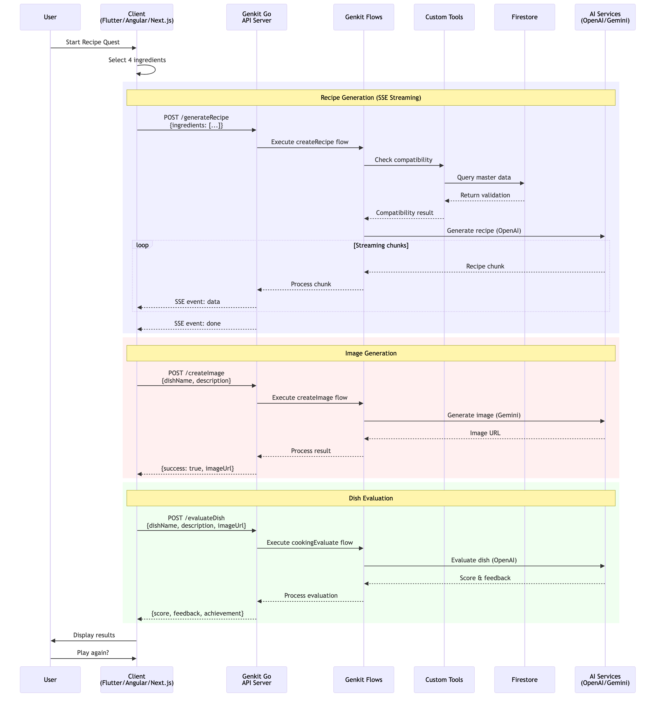
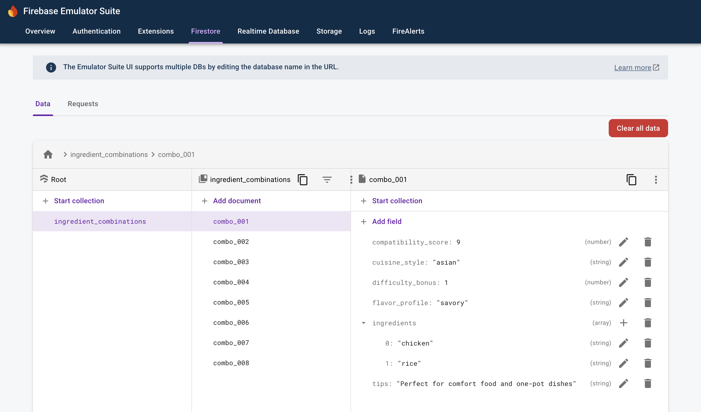

# Client Integration

## Introduction

Building an AI-powered backend is only half the story. The real value comes when your Genkit Go server connects with client applications across different platforms. This chapter explores the art and science of integrating a Genkit Go API server with three popular client frameworks: Flutter for mobile, Angular for web, and Next.js for modern web applications.

In today's multi-platform world, users expect consistent experiences whether they're on their phone, tablet, or desktop. They want real-time streaming responses, beautiful interfaces, and reliable performance. Through this chapter, you'll learn how to deliver these experiences by building a complete cooking game application that works across all platforms.

You'll discover how different client architectures handle the same backend API, compare streaming implementations across platforms, and understand the nuances of mobile versus web development. Most importantly, you'll gain practical insights into building production-ready applications that use Genkit's AI capabilities while providing enjoyable user experiences.

## What You'll Build

Throughout this chapter, we'll create Recipe Quest - a gamified cooking application that demonstrates real-world client-server integration patterns. Recipe Quest challenges players to create recipes with randomly selected ingredients, visualize their dishes through AI-generated images, and receive professional evaluations of their culinary creativity.



### Application Features

Recipe Quest includes the following gameplay flow:

1. Players start the quest and receive 4 random ingredients
2. The AI generates a complete recipe based on those ingredients
3. An image of the finished dish is created using AI
4. The dish receives a professional evaluation with a score (0-100)
5. Players can retry with new ingredients to improve their score

### Backend (Genkit Go Server)

The server implements three main flows:

- Recipe generation with real-time streaming using Server-Sent Events (SSE)
- Dish image creation using AI image generation
- Cooking evaluation that scores the creativity and feasibility

Two custom tools improve the experience:

- Firestore compatibility checker for ingredient validation
- Difficulty estimator for recipe complexity analysis

Firestore stores the cooking master data including ingredients, cooking methods, and evaluation criteria.

### Clients

Flutter (iOS/Android): Cross-platform mobile application using Material Design and platform-specific UI adaptations

Angular (Web): Modern single-page application with Observable-based state management and custom styling

Next.js (Web): SSR/CSR application using React hooks and Tailwind CSS

### Key Implementation Details

Each client handles:

- Real-time recipe streaming with proper buffering and display
- Image generation with loading states and error handling
- Gamified UI with progress tracking and animations
- Consistent error handling for network and AI failures
- Platform-specific optimizations for best user experience

## Learning Objectives

By the end of this chapter, you'll be able to:

1. Design and implement a Genkit Go API server that serves multiple client types
2. Handle streaming responses differently across Flutter, Angular, and Next.js
3. Apply clean architecture principles to maintain consistency across platforms
4. Implement proper error handling for AI-generated content in production
5. Optimize user experience with loading states, animations, and platform-specific features

## Prerequisites

Before diving into this chapter, ensure you have:

### From Previous Chapters

- Completed Chapter 3 (Development Environment Setup)
- Understanding of Genkit flows and tools from Chapters 6 and 8
- Familiarity with streaming concepts from Chapter 7

### Development Environment

- Go 1.23+ with Genkit Go SDK installed
- Node.js 20+ and npm for web clients
- Flutter 3.8+ SDK for mobile development
- Firebase CLI for Firestore emulator
- Terraform 1.5+ (optional, for production Firestore deployment)
- IDE Support: IDE with Go/Flutter/TypeScript extensions

### API Keys

```bash
# Required environment variables
export OPENAI_API_KEY="your-openai-key"      # For recipe generation
export GEMINI_API_KEY="your-gemini-key"      # For image generation
```

### Development Setup

```bash
# Firestore emulator (separate terminal)
export FIRESTORE_EMULATOR_HOST="127.0.0.1:8080"
firebase emulators:start --only firestore --import=./firestore-data/local
```

### Platform-Specific Requirements

#### For Flutter Development

- Xcode (macOS only, for iOS development)
- Android Studio or Android SDK (for Android development)
- Physical device or emulator/simulator

#### For Web Development

- Modern web browser (Chrome/Firefox/Safari)
- Basic understanding of TypeScript and reactive programming

## Why Multiple Clients?

You might wonder why we're covering three different client frameworks. Here's why this approach provides maximum value:

1. Real-World Scenarios: Most organizations need to support multiple platforms
2. Architectural Insights: Comparing implementations reveals best practices
3. Reusable Patterns: Learn patterns that apply regardless of framework
4. Framework Flexibility: Choose the right tool for your specific needs

Whether you're building a startup MVP or an enterprise application, understanding how to integrate Genkit with different client technologies gives you the flexibility to deliver AI-powered experiences wherever your users are.

Let's begin by exploring the overall architecture of our Recipe Quest system.

## Application Architecture

Recipe Quest follows a clean client-server architecture where multiple frontend applications connect to a single Genkit Go API server. This design ensures consistency across platforms while leveraging each client framework's strengths.



The architecture demonstrates several key principles:

1. **Unified API Surface**: All clients communicate through the same HTTP endpoints, ensuring consistent behavior
2. **Protocol Flexibility**: SSE for streaming recipe generation, JSON for discrete operations
3. **Tool Integration**: Custom tools extend the AI's capabilities with domain-specific logic
4. **External Service Abstraction**: Clients remain agnostic to which AI services power each feature

## API Server Design

The Genkit Go server forms the heart of Recipe Quest, orchestrating AI generations, managing tools, and providing a clean HTTP interface for clients. Let's examine each component in detail.

### HTTP Endpoints

The server exposes three main endpoints on port 9090, each corresponding to a gameplay phase:

| Endpoint | Method | Content Type | Purpose |
|----------|--------|--------------|---------|
| `/generateRecipe` | POST | text/event-stream | Stream recipe generation in real-time |
| `/createImage` | POST | application/json | Generate dish visualization |
| `/evaluateDish` | POST | application/json | Score and provide feedback |

Each endpoint follows RESTful conventions while adapting to the specific needs of AI-powered features. The streaming endpoint uses Server-Sent Events (SSE) to deliver recipe content progressively, enhancing user experience with immediate feedback. All endpoints include CORS headers to support cross-origin requests from web clients.

### Genkit Flows

Three flows power the Recipe Quest experience:

#### createRecipe Flow

The recipe generation flow combines multiple AI capabilities:

```go
type RecipeRequest struct {
    Ingredients []string `json:"ingredients"`
}

type RecipeResponse struct {
    Type    string `json:"type"`    // "content", "done", "error"
    Content string `json:"content,omitempty"`
    Error   string `json:"error,omitempty"`
}
```

This flow uses two custom tools to check ingredient availability and estimate cooking difficulty. The streaming implementation sends initial status messages, processes the AI response in chunks for better user experience, and includes natural pauses at section boundaries. The flow uses OpenAI's GPT-5-nano model with a professional chef system prompt.

#### createImage Flow

Image generation transforms the recipe into a visual representation:

```go
type ImageRequest struct {
    DishName    string `json:"dishName"`
    Description string `json:"description"`
}

type ImageResponse struct {
    Success  bool   `json:"success"`
    ImageUrl string `json:"imageUrl"`
    DishName string `json:"dishName"`
    Error    string `json:"error"`
}
```

This flow uses Google's Gemini 2.5 Flash Image (aka Nano Banana) model (`googleai/gemini-2.5-flash-image-preview`) to create photorealistic, appetizing dish images. The generated images are returned as base64-encoded data URIs with image modality configuration.

#### cookingEvaluate Flow

The evaluation flow provides gamification through detailed scoring:

```go
type EvaluateRequest struct {
    DishName    string `json:"dishName"`
    Description string `json:"description"`
}

type EvaluateResponse struct {
    Success         bool   `json:"success"`
    Score           int    `json:"score"`
    Feedback        string `json:"feedback"`
    CreativityScore int    `json:"creativityScore"`
    TechniqueScore  int    `json:"techniqueScore"`
    AppealScore     int    `json:"appealScore"`
    Title           string `json:"title"`       // Chef title based on score
    Achievement     string `json:"achievement"` // Special achievement
    Error           string `json:"error"`
}
```

The evaluation analyzes three dimensions - creativity, technique, and appeal - to calculate an overall score. Based on the score, players receive chef titles (e.g., "Master Chef" for 90+) and special achievements. The flow uses structured output to ensure consistent JSON responses with detailed feedback.

### Custom Tools

Recipe Quest implements two specialized tools that extend the AI's domain knowledge:

#### checkIngredientCompatibility

This tool validates ingredient combinations against a curated Firestore database:

```go
type CheckCompatibilityInput struct {
    Ingredients []string `json:"ingredients"`
}

type CompatibilityResult struct {
    Score           int      `json:"score"`           // 0-100
    Compatibility   string   `json:"compatibility"`   // excellent/good/fair/poor
    FlavorProfile   string   `json:"flavorProfile"`
    CuisineStyle    string   `json:"cuisineStyle"`
    Suggestions     []string `json:"suggestions"`
    WarningFlags    []string `json:"warningFlags"`
}
```

The tool queries Firestore for known ingredient combinations, calculates compatibility scores, and provides flavor profiles and cuisine style recommendations. It gracefully handles missing data by providing estimated compatibility based on ingredient categories.

#### estimateCookingDifficulty

Analyzes recipe complexity based on ingredients and cooking methods:

```go
type EstimateDifficultyInput struct {
    Ingredients     []string `json:"ingredients"`
    CookingMethods  []string `json:"cookingMethods"`
    CookingSteps    int      `json:"cookingSteps"`
}

type DifficultyEstimate struct {
    Level             string   `json:"level"`      // beginner/intermediate/advanced/expert
    Score             int      `json:"score"`      // 0-100
    TimeEstimate      string   `json:"timeEstimate"`
    SkillsRequired    []string `json:"skillsRequired"`
    EquipmentRequired []string `json:"equipmentRequired"`
}
```

This tool calculates difficulty scores based on ingredient complexity, cooking techniques, preparation steps, and required equipment - all without external database queries.

### Firestore Schema

The master data in Firestore follows a structured schema optimized for ingredient compatibility lookups:

```text
ingredient_combinations/
├── {combinationId}/
│   ├── ingredients: string[]      // Normalized, sorted ingredient list
│   ├── score: number             // Compatibility score (0-100)
│   ├── compatibility: string     // excellent/good/fair/poor
│   ├── flavorProfile: string     // e.g., "sweet and savory"
│   ├── cuisineStyle: string      // e.g., "fusion", "italian"
│   ├── suggestions: string[]     // Additional ingredient suggestions
│   └── warningFlags: string[]    // Potential issues or allergies
```

This schema enables fast lookups for ingredient combinations while providing rich metadata for better recipe generation. The normalized ingredient arrays ensure consistent matching regardless of input order.

### Flow Execution Sequence

Understanding how these components interact helps in debugging and optimization:



The sequence diagram illustrates the complete request-response cycle, showing how tools integrate with flows and when external services are called. This visualization helps developers understand timing, dependencies, and potential optimization points.

## Client Architecture Comparison

Building three different clients for Recipe Quest provides valuable insights into how different frameworks handle the same requirements. Each client follows clean architecture principles while adapting to platform-specific conventions and capabilities.

### Architecture Layers

All three clients implement a layered architecture, but with framework-specific adaptations:

#### Flutter Architecture

Flutter's implementation uses the Genkit Dart client for direct integration: <https://pub.dev/packages/genkit>

```text
lib/
├── domain/           # Business logic & interfaces
│   ├── models/       # Pure data models
│   └── repositories/ # Repository interfaces
├── infrastructure/   # External integrations
│   ├── actions/      # Genkit remote actions
│   └── repository/   # Repository implementations
├── usecases/        # Application business rules
└── presentation/    # UI layer
    ├── providers/   # Riverpod state management
    └── widgets/     # UI components
```

The Flutter client benefits from Genkit's native Dart support, providing type-safe remote actions and built-in streaming capabilities through `defineRemoteAction`.

#### Angular Architecture

Angular follows a similar structure with TypeScript refinements:

```text
src/
├── domain/          # Core business entities
│   ├── models/      # Domain models with Zod validation
│   └── repositories.ts
├── infrastructure/  # HTTP implementation
│   └── http/
│       ├── client/  # HTTP utilities
│       ├── dto/     # Data transfer objects
│       └── mappers/ # DTO↔Domain converters
├── usecases/       # Business operations
└── app/            # Angular components
    ├── services/   # State management
    └── quest/      # Feature component
```

Angular emphasizes dependency injection and uses RxJS for reactive state management, manually handling SSE streaming through the Fetch API.

#### Next.js Architecture

Next.js combines server and client capabilities:

```text
app/                # App Router (React 19)
├── hooks/          # Custom React hooks
└── quest/          # Page component
src/
├── domain/         # Shared domain logic
├── infrastructure/ # HTTP implementation
├── usecases/      # Business logic
└── components/    # React components
```

Next.js uses React 19 features with client-side rendering for the game interface, sharing infrastructure code with Angular but using React hooks for state management.

### Streaming Implementation Comparison

The most significant difference between clients lies in how they handle streaming recipe generation. Each framework takes a unique approach:

#### Flutter: Native Genkit Streaming

Flutter uses Genkit's Dart client for clean streaming:

```dart
Stream<RecipeResponse> generateRecipe(RecipeRequest request) {
  final action = RecipeQuestActions.generateRecipe;
  final (:stream, :response) = action.stream(input: request);
  
  return stream.handleError((error) {
    return RecipeResponse.error('Failed to generate recipe: $error');
  });
}
```

Benefits:

- Type-safe streaming with automatic serialization
- Built-in error handling and retry logic
- No manual SSE parsing required

#### Angular & Next.js: Manual SSE Handling

Both web clients implement custom SSE parsing:

```typescript
async *generateRecipe(request: RecipeRequestDomain): AsyncGenerator<RecipeResponseDomain> {
  const response = await fetch(url, {
    headers: { 'Accept': 'text/event-stream' },
    body: JSON.stringify({ data: dto })
  });
  
  const reader = response.body!.getReader();
  const decoder = new TextDecoder();
  let buffer = '';
  
  while (true) {
    const { done, value } = await reader.read();
    if (done) break;
    
    buffer += decoder.decode(value, { stream: true });
    // Parse SSE events and yield domain objects
  }
}
```

Challenges:

- Manual buffering and chunk reassembly
- SSE event parsing (`data: {...}` format)
- Handling Genkit's response wrapper structure

## Running Recipe Quest

Let's get Recipe Quest up and running! This section walks you through the setup process step by step.

### Environment Setup

First, configure the required environment variables for AI services:

```bash
# Required API keys
export OPENAI_API_KEY="your-openai-key"      # For recipe generation
export GEMINI_API_KEY="your-gemini-key"      # For image generation
```

### Starting the Firestore Emulator

Recipe Quest uses Firestore to store ingredient compatibility data. The project includes pre-configured master data that can be imported into the Firestore emulator.

Start the Firestore emulator with the included data:

```bash
# Terminal 1: Start Firestore emulator
cd src/examples/chapter-15/server
firebase emulators:start --only firestore --import=./firestore-data/local
```

The `--import=./firestore-data/local` flag automatically loads the ingredient combination data from the local export directory. This data includes pre-configured ingredient compatibilities, flavor profiles, and cuisine styles needed for the game.



For the Genkit Go server to connect to the Firestore emulator, set the environment variable:

```bash
export FIRESTORE_EMULATOR_HOST="127.0.0.1:8080"
```

According to the Firebase documentation (<https://firebase.google.com/docs/emulator-suite/connect_firestore#admin_sdks>), the Firebase Admin SDKs automatically connect to the Cloud Firestore emulator when this environment variable is set. This allows your Genkit server to use the Firestore emulator instead of a production database.

### Starting the Genkit Go API Server

With the Firestore emulator running, start the Genkit Go server in a new terminal:

```bash
# Terminal 2: Start Genkit server
cd src/examples/chapter-15/server
genkit start -- go run .
```

The `genkit start` command launches the Genkit developer UI on port 4000 while running your Go server on port 9090. You can access the Genkit UI at <http://localhost:4000> to monitor flows, test individual components, and debug your application.

The server will:

- Connect to the Firestore emulator automatically
- Initialize the three flows (createRecipe, createImage, cookingEvaluate)
- Start listening on <http://localhost:9090>

### Starting the Clients

With both the Firestore emulator and Genkit server running, you can now start any of the three client applications. Each client is pre-configured to connect to <http://localhost:9090>.

#### Flutter Client

```bash
# Terminal 3: Start Flutter client
cd src/examples/chapter-15/client/flutter
flutter pub get
flutter run
```

Choose your target device when prompted. The Flutter client supports:

- iOS Simulator
- Android Emulator

#### Angular Client

```bash
# Terminal 3: Start Angular client
cd src/examples/chapter-15/client/angular
npm install  # First time only
npm run build
npm run dev
```

Access the Angular client at <http://localhost:4200>. The development server includes hot module replacement for rapid development.

#### Next.js Client

```bash
# Terminal 3: Start Next.js client
cd src/examples/chapter-15/client/next
npm install  # First time only
npm run build
npm run dev
```

Access the Next.js client at <http://localhost:3000>. The development server uses Fast Refresh for instant feedback during development.

### Verifying the Setup

Once all services are running, verify your setup:

1. **Firestore Emulator**: Check <http://localhost:4040/firestore> for the Firestore UI
2. **Genkit Developer UI**: Browse to <http://localhost:4000> to see your flows
3. **API Server**: Test <http://localhost:9090>
4. **Client Applications**: Launch any client and start a new game

If everything is configured correctly, you should be able to:

- Select ingredients and see them validated against Firestore data
- Watch the recipe stream in real-time as it's generated
- Generate images of your dishes
- Receive evaluations with scores and achievements

## Summary

Throughout this chapter, you've learned how to integrate a Genkit Go backend with three different client frameworks. The Recipe Quest application demonstrates real-world patterns for:

- Building a unified API that serves multiple client types
- Handling streaming AI responses across different platforms
- Implementing clean architecture principles consistently
- Setting up and managing development environments

Key takeaways:

1. **Genkit's Flexibility**: The same Go backend serves both web and mobile clients with appropriate protocols (SSE for streaming, JSON for discrete operations).

2. **Framework Strengths**: Each client framework brings unique advantages - Flutter's native performance, Angular's enterprise patterns, and Next.js's modern React ecosystem.

3. **Streaming Complexity**: While Flutter's Genkit client simplifies streaming, web clients require careful SSE handling but provide full control.

4. **Development Environment**: Coordinating multiple services (Firestore emulator, Genkit server, clients) requires systematic setup but enables rapid development.

Happy cooking with AI!!
