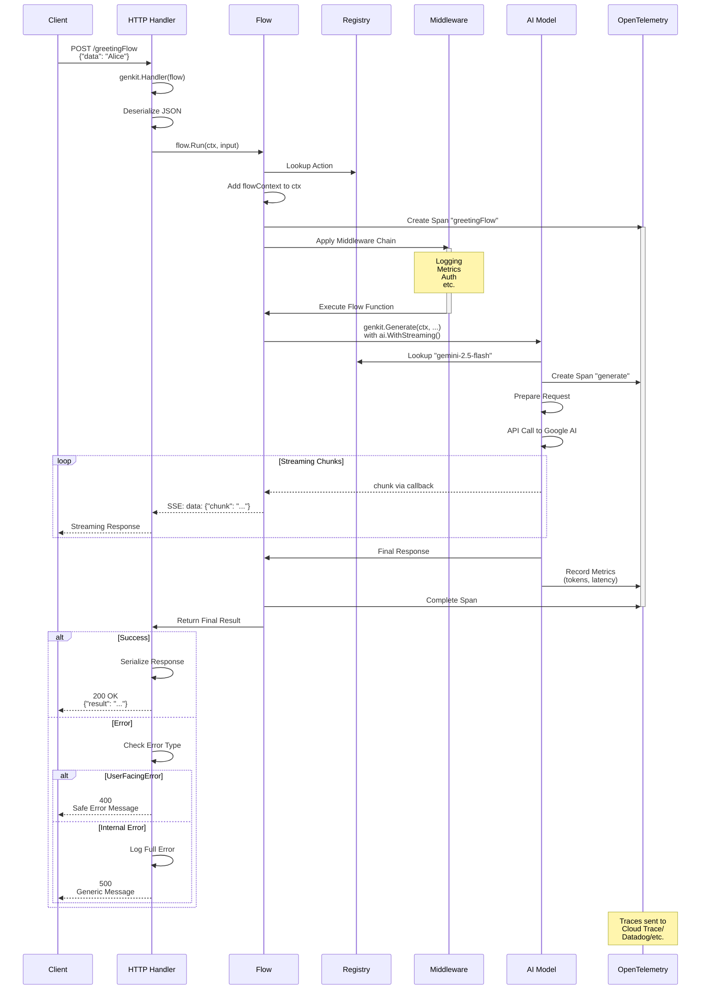

# HTTP Request to Flow Execution and Model Call Sequence

```mermaid
sequenceDiagram
    participant Client
    participant HTTP as HTTP Handler
    participant Flow
    participant Registry
    participant Middleware
    participant Model as AI Model
    participant Trace as OpenTelemetry
    
    Client->>HTTP: POST /greetingFlow<br/>{"data": "Alice"}
    
    HTTP->>HTTP: genkit.Handler(flow)
    HTTP->>HTTP: Deserialize JSON
    
    HTTP->>Flow: flow.Run(ctx, input)
    
    Flow->>Registry: Lookup Action
    Flow->>Flow: Add flowContext to ctx
    
    Flow->>Trace: Create Span "greetingFlow"
    activate Trace
    
    Flow->>Middleware: Apply Middleware Chain
    activate Middleware
    Note over Middleware: Logging<br/>Metrics<br/>Auth<br/>etc.
    
    Middleware->>Flow: Execute Flow Function
    deactivate Middleware
    
    Flow->>Model: genkit.Generate(ctx, ...)<br/>with ai.WithStreaming()
    
    Model->>Registry: Lookup "gemini-2.5-flash"
    Model->>Trace: Create Span "generate"
    
    Model->>Model: Prepare Request
    Model->>Model: API Call to Google AI
    
    loop Streaming Chunks
        Model-->>Flow: chunk via callback
        Flow-->>HTTP: SSE: data: {"chunk": "..."}
        HTTP-->>Client: Streaming Response
    end
    
    Model->>Flow: Final Response
    Model->>Trace: Record Metrics<br/>(tokens, latency)
    
    Flow->>Trace: Complete Span
    deactivate Trace
    
    Flow->>HTTP: Return Final Result
    
    alt Success
        HTTP->>HTTP: Serialize Response
        HTTP-->>Client: 200 OK<br/>{"result": "..."}
    else Error
        HTTP->>HTTP: Check Error Type
        alt UserFacingError
            HTTP-->>Client: 400<br/>Safe Error Message
        else Internal Error
            HTTP->>HTTP: Log Full Error
            HTTP-->>Client: 500<br/>Generic Message
        end
    end
    
    Note over Trace: Traces sent to<br/>Cloud Trace/<br/>Datadog/etc.
```