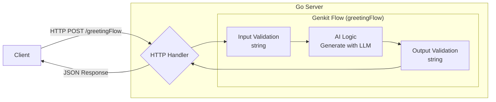

```mermaid
flowchart LR
    A[Client] -->|HTTP POST /greetingFlow| B{HTTP Handler}
    B --> C[Input Validation<br/>string]
    C --> D[AI Logic<br/>Generate with LLM]
    D --> E[Output Validation<br/>string]
    E --> B
    B -->|JSON Response| A
    
    subgraph Server["Go Server"]
        B
        subgraph Flow["Genkit Flow (greetingFlow)"]
            C
            D
            E
        end
    end
```
