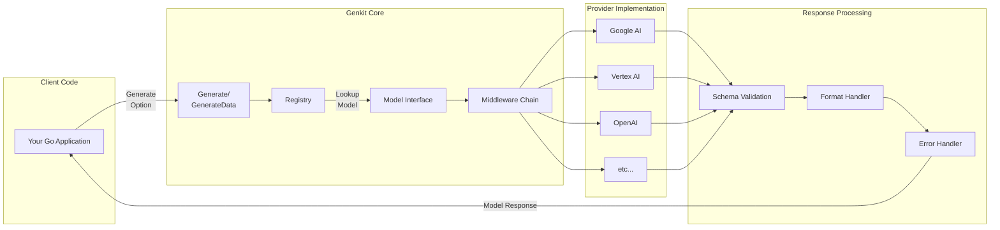

```mermaid
graph LR
    subgraph "Client Code"
        A[Your Go Application]
    end
    
    subgraph "Genkit Core"
        B[Generate/<br/>GenerateData]
        C[Registry]
        D[Model Interface]
        E[Middleware Chain]
        
        A -->|Generate<br/>Option| B
        B --> C
        C -->|Lookup<br/>Model| D
        D --> E
    end
    
    subgraph "Provider Implementation"
        F[Google AI]
        G[Vertex AI]
        H[OpenAI]
        I[etc...]
        
        E --> F
        E --> G
        E --> H
        E --> I
    end
    
    subgraph "Response Processing"
        J[Schema Validation]
        K[Format Handler]
        L[Error Handler]
        
        F --> J
        G --> J
        H --> J
        I --> J
        J --> K
        K --> L
    end
    
    L -->|Model Response| A
```
