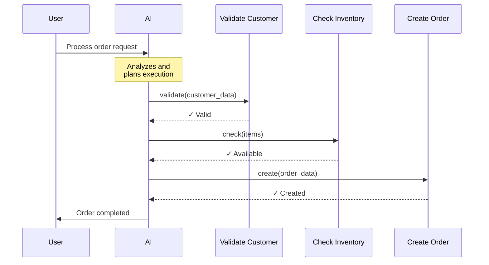

# Multi-Tool Orchestration Sequence

```mermaid
sequenceDiagram
    participant User
    participant AI
    participant CustomerTool as Validate Customer
    participant InventoryTool as Check Inventory
    participant OrderTool as Create Order
    
    User->>AI: Process order request
    
    Note over AI: Analyzes and<br/>plans execution
    
    AI->>CustomerTool: validate(customer_data)
    CustomerTool-->>AI: ✓ Valid
    
    AI->>InventoryTool: check(items)
    InventoryTool-->>AI: ✓ Available
    
    AI->>OrderTool: create(order_data)
    OrderTool-->>AI: ✓ Created
    
    AI->>User: Order completed
```
