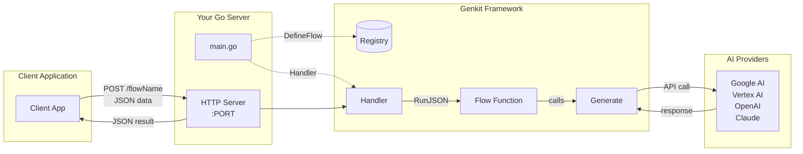

```mermaid
flowchart LR
    subgraph "Client Application"
        CLIENT[Client App]
    end
    
    subgraph "Your Go Server"
        MAIN[main.go]
        HTTP[HTTP Server<br/>:PORT]
    end
    
    subgraph "Genkit Framework"
        REG[(Registry)]
        HANDLER[Handler]
        FLOW[Flow Function]
        GEN[Generate]
    end
    
    subgraph "AI Providers"
        AI[Google AI<br/>Vertex AI<br/>OpenAI<br/>Claude]
    end
    
    %% Setup phase (dotted lines)
    MAIN -.->|DefineFlow| REG
    MAIN -.->|Handler| HANDLER
    
    %% Request flow (solid lines)
    CLIENT -->|POST /flowName<br/>JSON data| HTTP
    HTTP --> HANDLER
    HANDLER -->|RunJSON| FLOW
    FLOW -->|calls| GEN
    GEN -->|API call| AI
    AI -->|response| GEN
    HTTP -->|JSON result| CLIENT
```