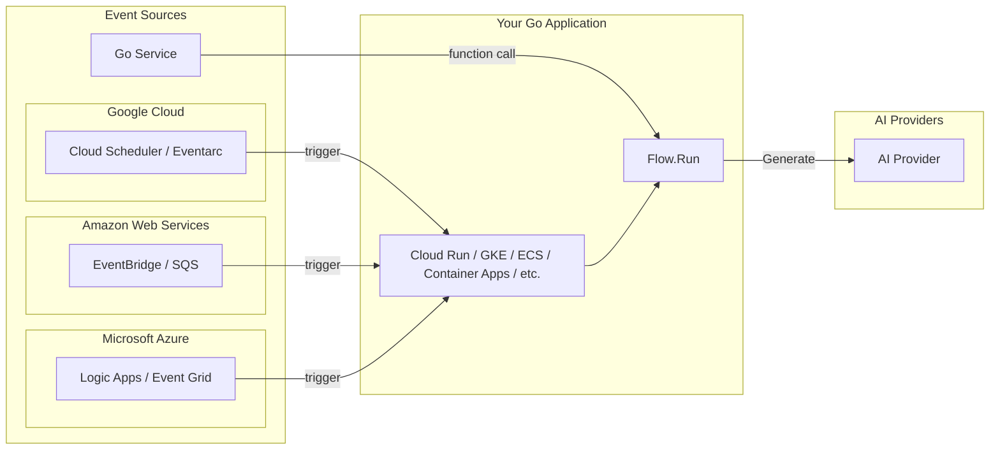

```mermaid
flowchart LR
    subgraph "Event Sources"
        subgraph "Google Cloud"
            GCP[Cloud Scheduler / Eventarc]
        end
        subgraph "Amazon Web Services"
            AWS[EventBridge / SQS]
        end
        subgraph "Microsoft Azure"
            AZ[Logic Apps / Event Grid]
        end
        SERVICE[Go Service]
    end
    
    subgraph "Your Go Application"
        COMPUTE[Cloud Run / GKE / ECS / Container Apps / etc.]
        FLOW[Flow.Run]
    end
    
    subgraph "AI Providers"
        PROVIDER1[AI Provider]
    end
    
    GCP -->|trigger| COMPUTE
    AWS -->|trigger| COMPUTE
    AZ -->|trigger| COMPUTE
    SERVICE -->|function call| FLOW
    COMPUTE --> FLOW
    FLOW -->|Generate| PROVIDER1
```