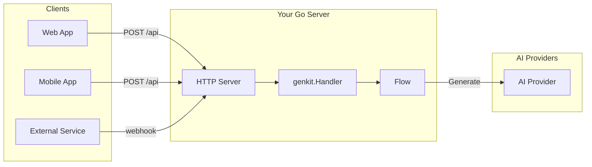

```mermaid
flowchart LR
    subgraph "Clients"
        WEB[Web App]
        MOBILE[Mobile App]
        WEBHOOK[External Service]
    end
    
    subgraph "Your Go Server"
        HTTP[HTTP Server]
        HANDLER[genkit.Handler]
        FLOW[Flow]
    end
    
    subgraph "AI Providers"
        PROVIDER2[AI Provider]
    end
    
    WEB -->|POST /api| HTTP
    MOBILE -->|POST /api| HTTP
    WEBHOOK -->|webhook| HTTP
    HTTP --> HANDLER
    HANDLER --> FLOW
    FLOW -->|Generate| PROVIDER2
```