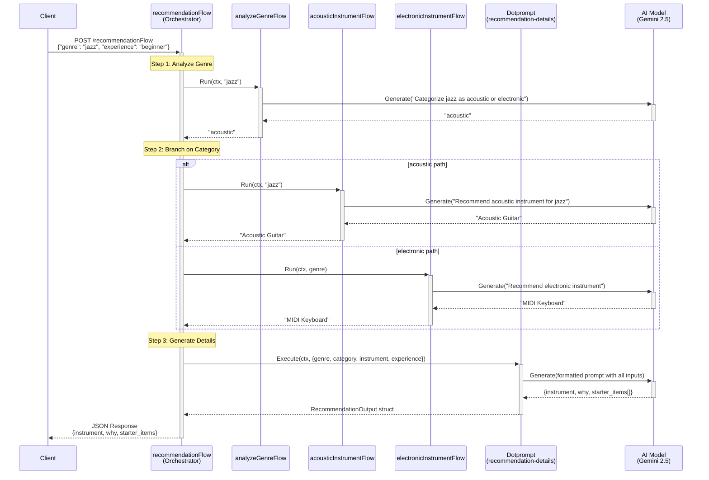

```mermaid
sequenceDiagram
    participant Client
    participant Orchestrator as recommendationFlow<br/>(Orchestrator)
    participant Analyze as analyzeGenreFlow
    participant Acoustic as acousticInstrumentFlow
    participant Electronic as electronicInstrumentFlow
    participant Prompt as Dotprompt<br/>(recommendation-details)
    participant AI as AI Model<br/>(Gemini 2.5)

    Client->>+Orchestrator: POST /recommendationFlow<br/>{"genre": "jazz", "experience": "beginner"}
    
    Note over Orchestrator: Step 1: Analyze Genre
    Orchestrator->>+Analyze: Run(ctx, "jazz")
    Analyze->>+AI: Generate("Categorize jazz as acoustic or electronic")
    AI-->>-Analyze: "acoustic"
    Analyze-->>-Orchestrator: "acoustic"
    
    Note over Orchestrator: Step 2: Branch on Category
    alt acoustic path
        Orchestrator->>+Acoustic: Run(ctx, "jazz")
        Acoustic->>+AI: Generate("Recommend acoustic instrument for jazz")
        AI-->>-Acoustic: "Acoustic Guitar"
        Acoustic-->>-Orchestrator: "Acoustic Guitar"
    else electronic path
        Orchestrator->>+Electronic: Run(ctx, genre)
        Electronic->>+AI: Generate("Recommend electronic instrument")
        AI-->>-Electronic: "MIDI Keyboard"
        Electronic-->>-Orchestrator: "MIDI Keyboard"
    end
    
    Note over Orchestrator: Step 3: Generate Details
    Orchestrator->>+Prompt: Execute(ctx, {genre, category, instrument, experience})
    Prompt->>+AI: Generate(formatted prompt with all inputs)
    AI-->>-Prompt: {instrument, why, starter_items[]}
    Prompt-->>-Orchestrator: RecommendationOutput struct
    
    Orchestrator-->>-Client: JSON Response<br/>{instrument, why, starter_items}
```
