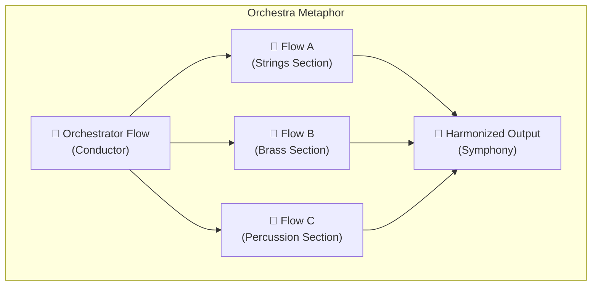

```mermaid
graph TB
    subgraph "Orchestra Metaphor"
        Conductor["🎼 Orchestrator Flow<br/>(Conductor)"]
        
        Conductor --> Section1["🎻 Flow A<br/>(Strings Section)"]
        Conductor --> Section2["🎺 Flow B<br/>(Brass Section)"]
        Conductor --> Section3["🥁 Flow C<br/>(Percussion Section)"]
        
        Section1 --> Performance["🎵 Harmonized Output<br/>(Symphony)"]
        Section2 --> Performance
        Section3 --> Performance
    end
```
