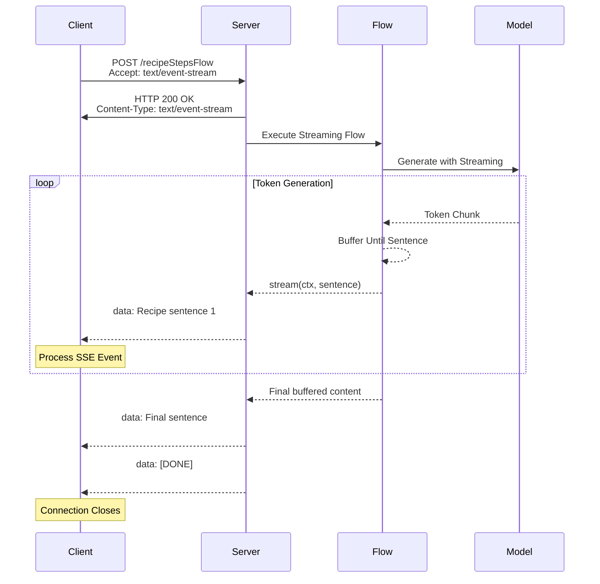

```mermaid
sequenceDiagram
    participant Client
    participant Server
    participant Flow
    participant Model

    Client->>Server: POST /recipeStepsFlow<br/>Accept: text/event-stream
    Server->>Client: HTTP 200 OK<br/>Content-Type: text/event-stream
    
    Server->>Flow: Execute Streaming Flow
    Flow->>Model: Generate with Streaming
    
    loop Token Generation
        Model-->>Flow: Token Chunk
        Flow-->>Flow: Buffer Until Sentence
        Flow-->>Server: stream(ctx, sentence)
        Server-->>Client: data: Recipe sentence 1<br/><br/>
        Note over Client: Process SSE Event
    end
    
    Flow-->>Server: Final buffered content
    Server-->>Client: data: Final sentence<br/><br/>
    Server-->>Client: data: [DONE]<br/><br/>
    
    Note over Client: Connection Closes
```