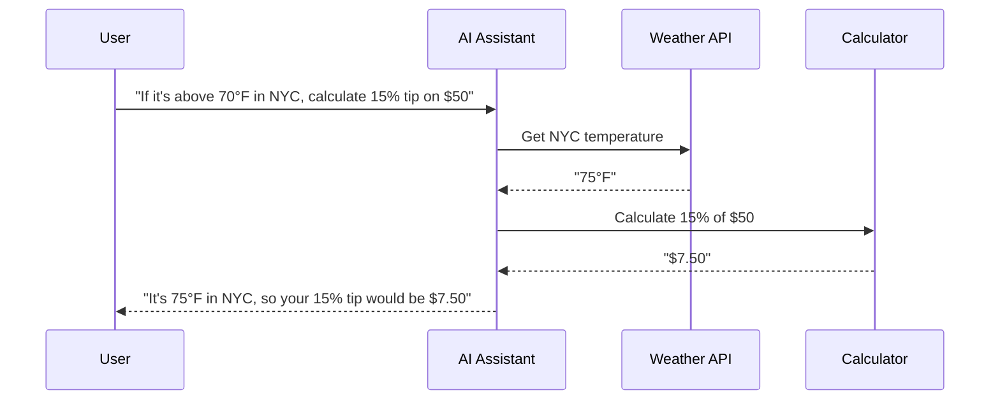

```mermaid
sequenceDiagram
    participant User  
    participant LLM as AI Assistant
    participant WeatherTool as Weather API
    participant CalcTool as Calculator

    User->>LLM: "If it's above 70°F in NYC, calculate 15% tip on $50"
    LLM->>WeatherTool: Get NYC temperature
    WeatherTool-->>LLM: "75°F"
    LLM->>CalcTool: Calculate 15% of $50  
    CalcTool-->>LLM: "$7.50"
    LLM-->>User: "It's 75°F in NYC, so your 15% tip would be $7.50"
```