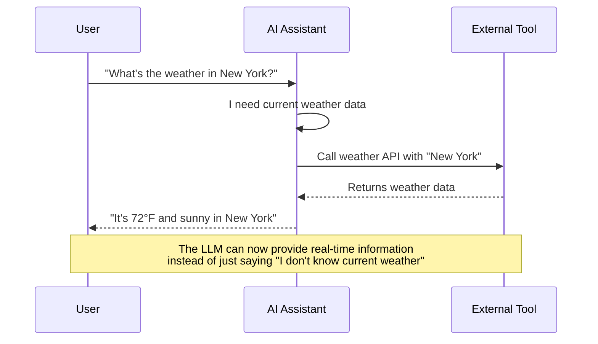

```mermaid
sequenceDiagram
    participant User
    participant LLM as AI Assistant
    participant Tool as External Tool

    User->>LLM: "What's the weather in New York?"
    LLM->>LLM: I need current weather data
    LLM->>Tool: Call weather API with "New York"
    Tool-->>LLM: Returns weather data
    LLM-->>User: "It's 72°F and sunny in New York"
    
    Note over User,Tool: The LLM can now provide real-time information<br/>instead of just saying "I don't know current weather"
```