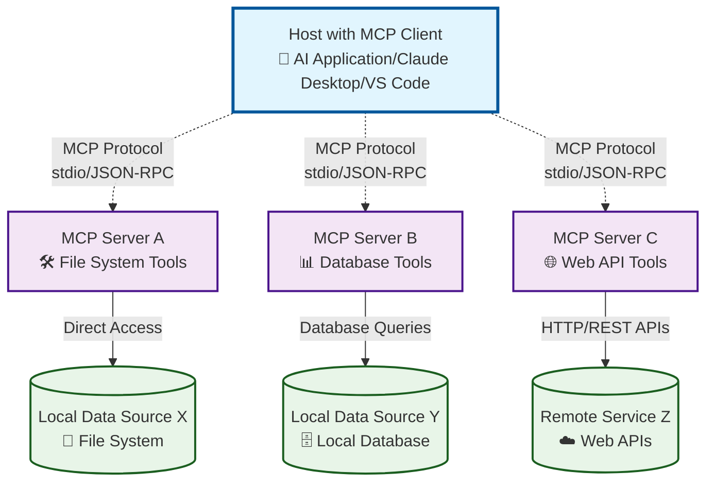

```mermaid
graph TB
    %% Client Side
    Client[Host with MCP Client<br/>🤖 AI Application/Claude Desktop/VS Code]
    
    %% MCP Servers
    ServerA[MCP Server A<br/>🛠️ File System Tools]
    ServerB[MCP Server B<br/>📊 Database Tools]
    ServerC[MCP Server C<br/>🌐 Web API Tools]
    
    %% Data Sources
    DataX[(Local Data Source X<br/>📁 File System)]
    DataY[(Local Data Source Y<br/>🗄️ Local Database)]
    ServiceZ[(Remote Service Z<br/>☁️ Web APIs)]
    
    %% Connections with Protocol Labels
    Client -.->|MCP Protocol<br/>stdio/JSON-RPC| ServerA
    Client -.->|MCP Protocol<br/>stdio/JSON-RPC| ServerB
    Client -.->|MCP Protocol<br/>stdio/JSON-RPC| ServerC
    
    %% Server to Data Source Connections
    ServerA -->|Direct Access| DataX
    ServerB -->|Database Queries| DataY
    ServerC -->|HTTP/REST APIs| ServiceZ
    
    %% Styling
    classDef client fill:#e1f5fe,stroke:#01579b,stroke-width:3px
    classDef server fill:#f3e5f5,stroke:#4a148c,stroke-width:2px
    classDef data fill:#e8f5e8,stroke:#1b5e20,stroke-width:2px
    classDef protocol fill:#fff3e0,stroke:#e65100,stroke-width:1px
    
    class Client client
    class ServerA,ServerB,ServerC server
    class DataX,DataY,ServiceZ data
```