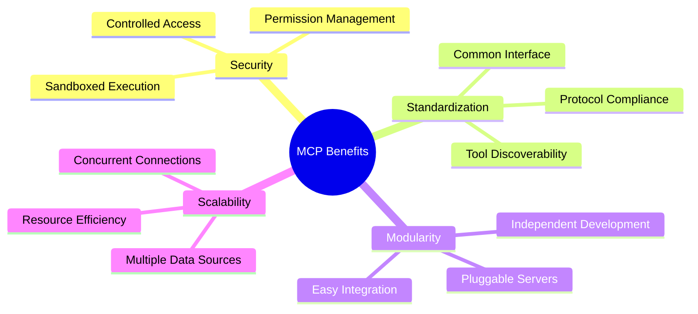

```mermaid
mindmap
  root((MCP Benefits))
    Security
      Controlled Access
      Permission Management
      Sandboxed Execution
    Standardization
      Common Interface
      Protocol Compliance
      Tool Discoverability
    Modularity
      Pluggable Servers
      Independent Development
      Easy Integration
    Scalability
      Multiple Data Sources
      Concurrent Connections
      Resource Efficiency
```