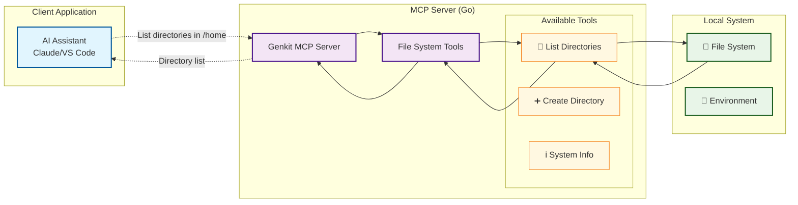

```mermaid
graph LR
    subgraph "Client Application"
        AI[AI Assistant<br/>Claude/VS Code]
    end
    
    subgraph "MCP Server (Go)"
        Server[Genkit MCP Server]
        Tools[File System Tools]
        
        subgraph "Available Tools"
            ListDir[📁 List Directories]
            CreateDir[➕ Create Directory]
            SysInfo[ℹ️ System Info]
        end
    end
    
    subgraph "Local System"
        FS[📂 File System]
        ENV[🔧 Environment]
    end
    
    AI -.->|"List directories in /home"| Server
    Server --> Tools
    Tools --> ListDir
    ListDir --> FS
    FS --> ListDir
    ListDir --> Tools
    Tools --> Server
    Server -.->|"Directory list"| AI
    
    classDef client fill:#e1f5fe,stroke:#01579b,stroke-width:2px
    classDef server fill:#f3e5f5,stroke:#4a148c,stroke-width:2px
    classDef tool fill:#fff8e1,stroke:#f57f17,stroke-width:1px
    classDef system fill:#e8f5e8,stroke:#1b5e20,stroke-width:2px
    
    class AI client
    class Server,Tools server
    class ListDir,CreateDir,SysInfo tool
    class FS,ENV system
```
