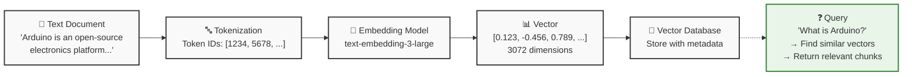

```mermaid
flowchart LR
    A["📄 Text Document<br/>'Arduino is an open-source<br/>electronics platform...'"]
    
    B["🔤 Tokenization<br/>Token IDs: [1234, 5678, ...]"]
    
    C["🤖 Embedding Model<br/>text-embedding-3-large"]
    
    D["📊 Vector<br/>[0.123, -0.456, 0.789, ...]<br/>3072 dimensions"]
    
    E["💾 Vector Database<br/>Store with metadata"]
    
    F["❓ Query<br/>'What is Arduino?'<br/>→ Find similar vectors<br/>→ Return relevant chunks"]
    
    %% Main flow
    A --> B --> C --> D --> E
    E -.-> F
    
    %% Styling
    classDef default fill:#f9f9f9,stroke:#333,stroke-width:2px
    classDef query fill:#e8f5e8,stroke:#2e7d32,stroke-width:2px
    
    class F query
```
