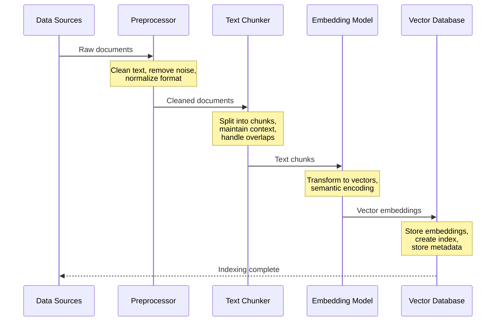

```mermaid
sequenceDiagram
    participant DS as Data Sources
    participant PP as Preprocessor
    participant TC as Text Chunker
    participant EM as Embedding Model
    participant VDB as Vector Database
    
    DS->>PP: Raw documents
    Note over PP: Clean text, remove noise,<br/>normalize format
    PP->>TC: Cleaned documents
    Note over TC: Split into chunks,<br/>maintain context,<br/>handle overlaps
    TC->>EM: Text chunks
    Note over EM: Transform to vectors,<br/>semantic encoding
    EM->>VDB: Vector embeddings
    Note over VDB: Store embeddings,<br/>create index,<br/>store metadata
    VDB-->>DS: Indexing complete
```