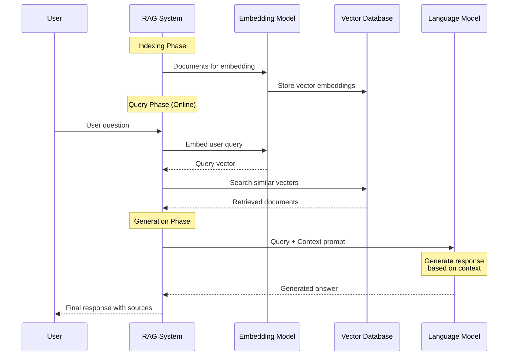

```mermaid
sequenceDiagram
    participant U as User
    participant RAG as RAG System
    participant EM as Embedding Model
    participant VDB as Vector Database
    participant LLM as Language Model
    
    Note over RAG: Indexing Phase
    RAG->>EM: Documents for embedding
    EM->>VDB: Store vector embeddings
    
    Note over RAG: Query Phase (Online)
    U->>RAG: User question
    RAG->>EM: Embed user query
    EM-->>RAG: Query vector
    RAG->>VDB: Search similar vectors
    VDB-->>RAG: Retrieved documents
    
    Note over RAG: Generation Phase
    RAG->>LLM: Query + Context prompt
    Note over LLM: Generate response<br/>based on context
    LLM-->>RAG: Generated answer
    RAG-->>U: Final response with sources
```