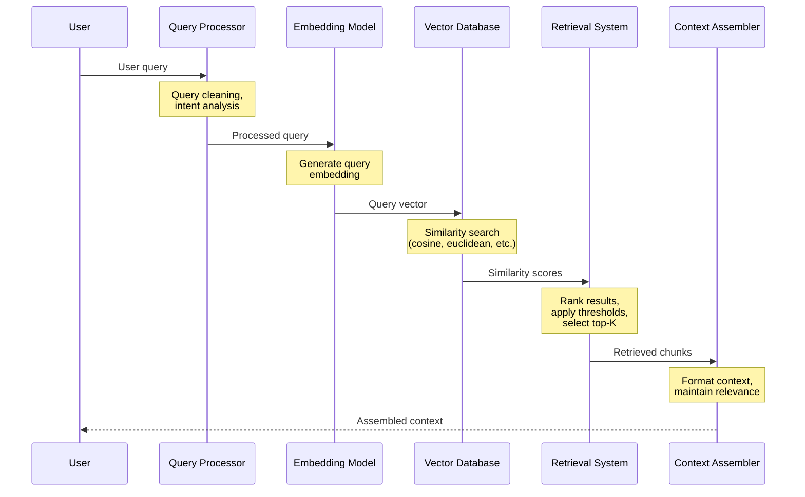

```mermaid
sequenceDiagram
    participant U as User
    participant QP as Query Processor
    participant EM as Embedding Model
    participant VDB as Vector Database
    participant RS as Retrieval System
    participant CA as Context Assembler
    
    U->>QP: User query
    Note over QP: Query cleaning,<br/>intent analysis
    QP->>EM: Processed query
    Note over EM: Generate query<br/>embedding
    EM->>VDB: Query vector
    Note over VDB: Similarity search<br/>(cosine, euclidean, etc.)
    VDB->>RS: Similarity scores
    Note over RS: Rank results,<br/>apply thresholds,<br/>select top-K
    RS->>CA: Retrieved chunks
    Note over CA: Format context,<br/>maintain relevance
    CA-->>U: Assembled context
```