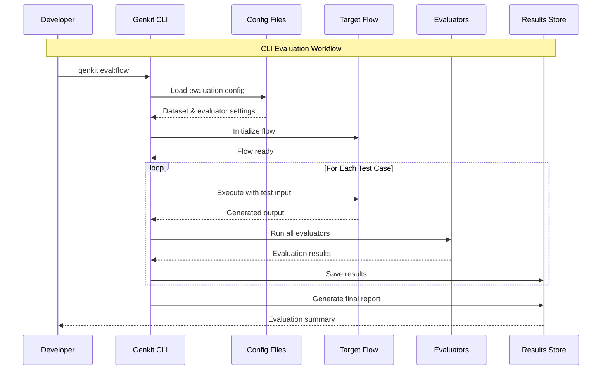

```mermaid
sequenceDiagram
    participant Dev as Developer
    participant CLI as Genkit CLI
    participant Config as Config Files
    participant Flow as Target Flow
    participant Eval as Evaluators
    participant Results as Results Store

    Note over Dev, Results: CLI Evaluation Workflow

    Dev->>CLI: genkit eval:flow
    CLI->>Config: Load evaluation config
    Config-->>CLI: Dataset & evaluator settings
    
    CLI->>Flow: Initialize flow
    Flow-->>CLI: Flow ready
    
    loop For Each Test Case
        CLI->>Flow: Execute with test input
        Flow-->>CLI: Generated output
        
        CLI->>Eval: Run all evaluators
        Eval-->>CLI: Evaluation results
        
        CLI->>Results: Save results
    end
    
    CLI->>Results: Generate final report
    Results-->>Dev: Evaluation summary
```