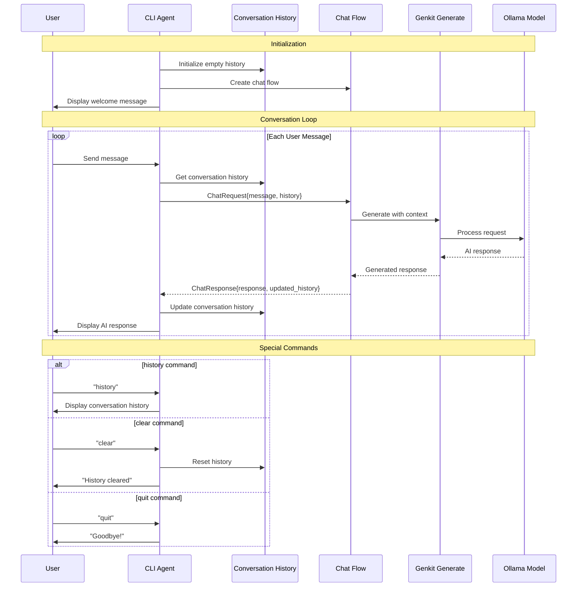

```mermaid
sequenceDiagram
    participant User
    participant CLI as CLI Agent
    participant History as Conversation History
    participant Flow as Chat Flow
    participant Genkit as Genkit Generate
    participant Ollama as Ollama Model

    Note over User, Ollama: Initialization
    CLI->>History: Initialize empty history
    CLI->>Flow: Create chat flow
    CLI->>User: Display welcome message

    Note over User, Ollama: Conversation Loop
    loop Each User Message
        User->>CLI: Send message
        CLI->>History: Get conversation history
        CLI->>Flow: ChatRequest{message, history}
        
        Flow->>Genkit: Generate with context
        Genkit->>Ollama: Process request
        Ollama-->>Genkit: AI response
        Genkit-->>Flow: Generated response
        
        Flow-->>CLI: ChatResponse{response, updated_history}
        CLI->>History: Update conversation history
        CLI->>User: Display AI response
    end

    Note over User, Ollama: Special Commands
    alt history command
        User->>CLI: "history"
        CLI->>User: Display conversation history
    else clear command
        User->>CLI: "clear"
        CLI->>History: Reset history
        CLI->>User: "History cleared"
    else quit command
        User->>CLI: "quit"
        CLI->>User: "Goodbye!"
    end
```