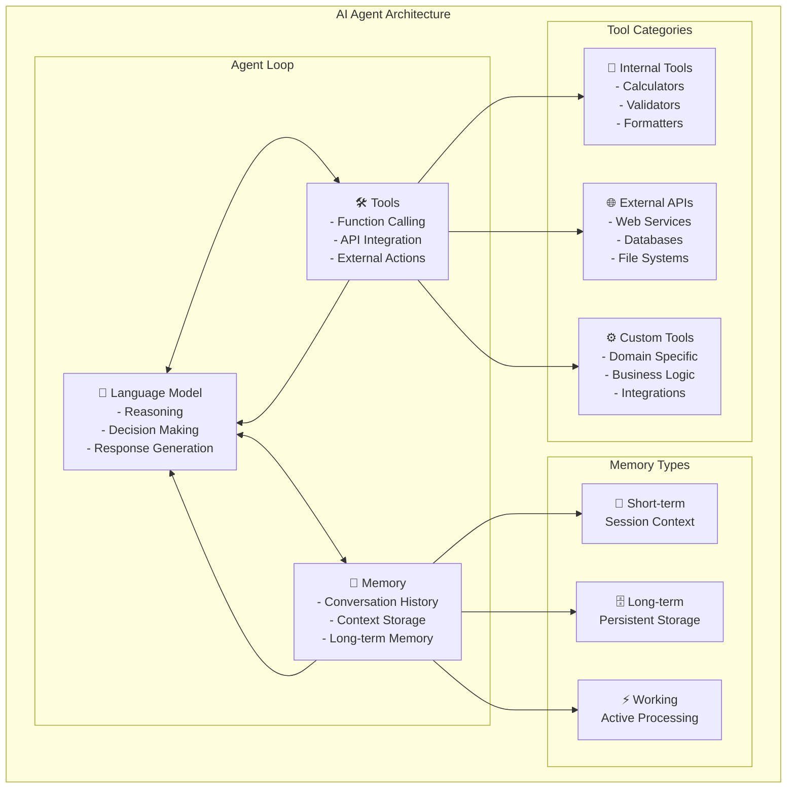

```mermaid
graph TB
    subgraph "AI Agent Architecture"
        
        subgraph "Agent Loop"
            LLM[🧠 Language Model<br/>- Reasoning<br/>- Decision Making<br/>- Response Generation]
            Memory[💾 Memory<br/>- Conversation History<br/>- Context Storage<br/>- Long-term Memory]
            Tools[🛠️ Tools<br/>- Function Calling<br/>- API Integration<br/>- External Actions]
            
            LLM <--> Memory
            LLM <--> Tools
            Memory --> LLM
            Tools --> LLM
        end
        
        subgraph "Memory Types"
            ShortTerm[📝 Short-term<br/>Session Context]
            LongTerm[🗄️ Long-term<br/>Persistent Storage]
            Working[⚡ Working<br/>Active Processing]
        end
        
        Memory --> ShortTerm
        Memory --> LongTerm
        Memory --> Working
        
        subgraph "Tool Categories"
            Internal[🔧 Internal Tools<br/>- Calculators<br/>- Validators<br/>- Formatters]
            External[🌐 External APIs<br/>- Web Services<br/>- Databases<br/>- File Systems]
            Custom[⚙️ Custom Tools<br/>- Domain Specific<br/>- Business Logic<br/>- Integrations]
        end
        
        Tools --> Internal
        Tools --> External
        Tools --> Custom
    end
```