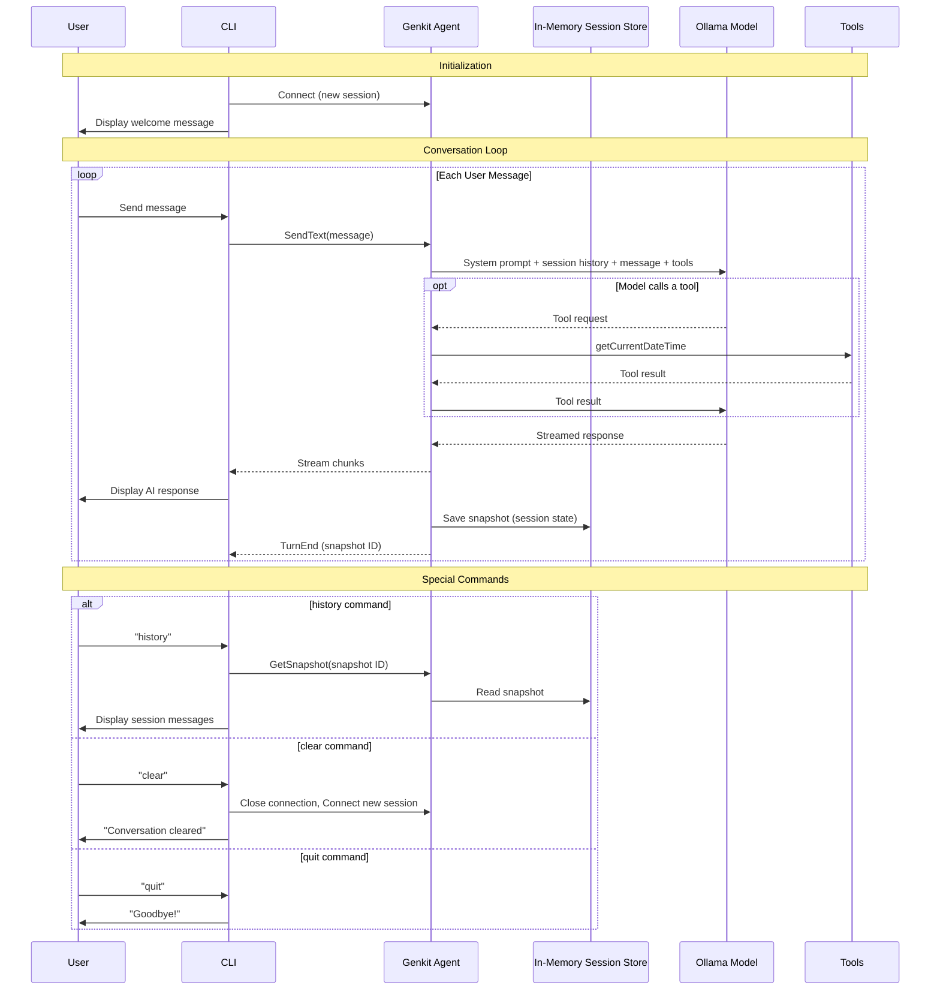

```mermaid
sequenceDiagram
    participant User
    participant CLI as CLI
    participant Agent as Genkit Agent
    participant Store as In-Memory Session Store
    participant Ollama as Ollama Model
    participant Tools as Tools

    Note over User, Tools: Initialization
    CLI->>Agent: Connect (new session)
    CLI->>User: Display welcome message

    Note over User, Tools: Conversation Loop
    loop Each User Message
        User->>CLI: Send message
        CLI->>Agent: SendText(message)
        Agent->>Ollama: System prompt + session history + message + tools
        opt Model calls a tool
            Ollama-->>Agent: Tool request
            Agent->>Tools: getCurrentDateTime
            Tools-->>Agent: Tool result
            Agent->>Ollama: Tool result
        end
        Ollama-->>Agent: Streamed response
        Agent-->>CLI: Stream chunks
        CLI->>User: Display AI response
        Agent->>Store: Save snapshot (session state)
        Agent-->>CLI: TurnEnd (snapshot ID)
    end

    Note over User, Tools: Special Commands
    alt history command
        User->>CLI: "history"
        CLI->>Agent: GetSnapshot(snapshot ID)
        Agent->>Store: Read snapshot
        CLI->>User: Display session messages
    else clear command
        User->>CLI: "clear"
        CLI->>Agent: Close connection, Connect new session
        CLI->>User: "Conversation cleared"
    else quit command
        User->>CLI: "quit"
        CLI->>User: "Goodbye!"
    end
```
