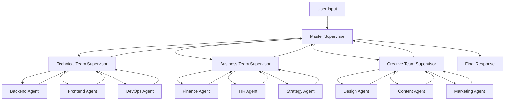

```mermaid
graph TD
    A[User Input] --> B[Master Supervisor]
    B --> C[Technical Team Supervisor]
    B --> D[Business Team Supervisor]
    B --> E[Creative Team Supervisor]
    
    C --> F[Backend Agent]
    C --> G[Frontend Agent]
    C --> H[DevOps Agent]
    
    D --> I[Finance Agent]
    D --> J[HR Agent]
    D --> K[Strategy Agent]
    
    E --> L[Design Agent]
    E --> M[Content Agent]
    E --> N[Marketing Agent]
    
    F --> C
    G --> C
    H --> C
    I --> D
    J --> D
    K --> D
    L --> E
    M --> E
    N --> E
    
    C --> B
    D --> B
    E --> B
    B --> O[Final Response]
```