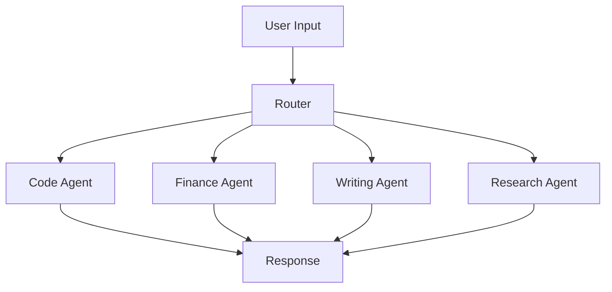

```mermaid
graph TD
    A[User Input] --> B[Router]
    B --> C[Code Agent]
    B --> D[Finance Agent]
    B --> E[Writing Agent]
    B --> F[Research Agent]
    C --> G[Response]
    D --> G
    E --> G
    F --> G
```