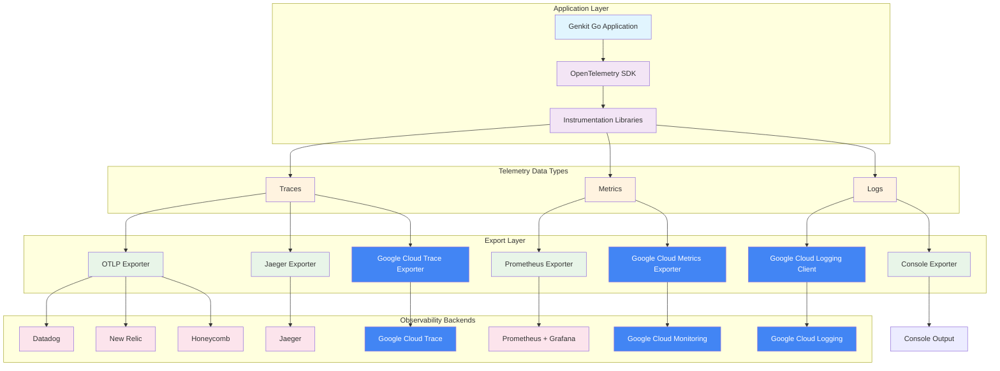

```mermaid
graph TB
    subgraph "Application Layer"
        A[Genkit Go Application]
        B[OpenTelemetry SDK]
        C[Instrumentation Libraries]
    end
    
    subgraph "Telemetry Data Types"
        D[Traces]
        E[Metrics]
        F[Logs]
    end
    
    subgraph "Export Layer"
        G[OTLP Exporter]
        H[Jaeger Exporter]
        I[Prometheus Exporter]
        J[Console Exporter]
        K[Google Cloud Trace Exporter]
        L[Google Cloud Metrics Exporter]
        M[Google Cloud Logging Client]
    end
    
    subgraph "Observability Backends"
        N[Jaeger]
        O[Prometheus + Grafana]
        P[Google Cloud Trace]
        Q[Google Cloud Monitoring]
        R[Google Cloud Logging]
        S[Datadog]
        T[New Relic]
        U[Honeycomb]
    end
    
    A --> B
    B --> C
    C --> D
    C --> E
    C --> F
    
    D --> G
    D --> H
    D --> K
    E --> I
    E --> L
    F --> M
    F --> J
    
    G --> S
    G --> T
    G --> U
    H --> N
    I --> O
    J --> Console[Console Output]
    K --> P
    L --> Q
    M --> R
    
    style A fill:#e1f5fe
    style B fill:#f3e5f5
    style C fill:#f3e5f5
    style D fill:#fff3e0
    style E fill:#fff3e0
    style F fill:#fff3e0
    style G fill:#e8f5e8
    style H fill:#e8f5e8
    style I fill:#e8f5e8
    style J fill:#e8f5e8
    style K fill:#4285f4,color:#ffffff
    style L fill:#4285f4,color:#ffffff
    style M fill:#4285f4,color:#ffffff
    style N fill:#fce4ec
    style O fill:#fce4ec
    style P fill:#4285f4,color:#ffffff
    style Q fill:#4285f4,color:#ffffff
    style R fill:#4285f4,color:#ffffff
    style S fill:#fce4ec
    style T fill:#fce4ec
    style U fill:#fce4ec
```