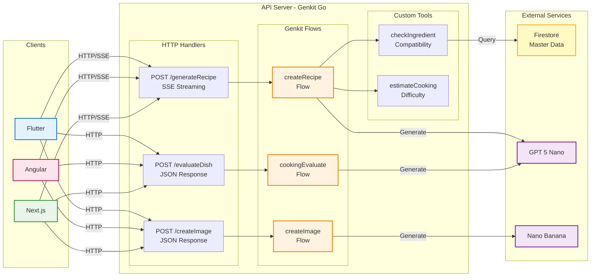

```mermaid
graph LR
    subgraph "Clients"
        A1[Flutter]
        A2[Angular]
        A3[Next.js]
    end
    
    subgraph "API Server - Genkit Go"
        subgraph "HTTP Handlers"
            B1[POST /generateRecipe<br/>SSE Streaming]
            B2[POST /createImage<br/>JSON Response]
            B3[POST /evaluateDish<br/>JSON Response]
        end
        
        subgraph "Genkit Flows"
            C1[createRecipe<br/>Flow]
            C2[createImage<br/>Flow]
            C3[cookingEvaluate<br/>Flow]
        end
        
        subgraph "Custom Tools"
            D1[checkIngredient<br/>Compatibility]
            D2[estimateCooking<br/>Difficulty]
        end
        
        B1 --> C1
        B2 --> C2
        B3 --> C3
        
        C1 --> D1
        C1 --> D2
    end
    
    subgraph "External Services"
        E1[Firestore<br/>Master Data]
        E2[GPT 5 Nano]
        E3[Nano Banana]
    end
    
    A1 -->|HTTP/SSE| B1
    A1 -->|HTTP| B2
    A1 -->|HTTP| B3
    
    A2 -->|HTTP/SSE| B1
    A2 -->|HTTP| B2
    A2 -->|HTTP| B3
    
    A3 -->|HTTP/SSE| B1
    A3 -->|HTTP| B2
    A3 -->|HTTP| B3
    
    D1 -->|Query| E1
    
    C1 -->|Generate| E2
    C2 -->|Generate| E3
    C3 -->|Generate| E2
    
    style A1 fill:#E3F2FD,stroke:#1976D2,stroke-width:2px
    style A2 fill:#FCE4EC,stroke:#C2185B,stroke-width:2px
    style A3 fill:#E8F5E9,stroke:#388E3C,stroke-width:2px
    
    style C1 fill:#FFF3E0,stroke:#F57C00,stroke-width:2px
    style C2 fill:#FFF3E0,stroke:#F57C00,stroke-width:2px
    style C3 fill:#FFF3E0,stroke:#F57C00,stroke-width:2px
    
    style E1 fill:#FFF9C4,stroke:#F9A825,stroke-width:2px
    style E2 fill:#F3E5F5,stroke:#7B1FA2,stroke-width:2px
    style E3 fill:#F3E5F5,stroke:#7B1FA2,stroke-width:2px
```
