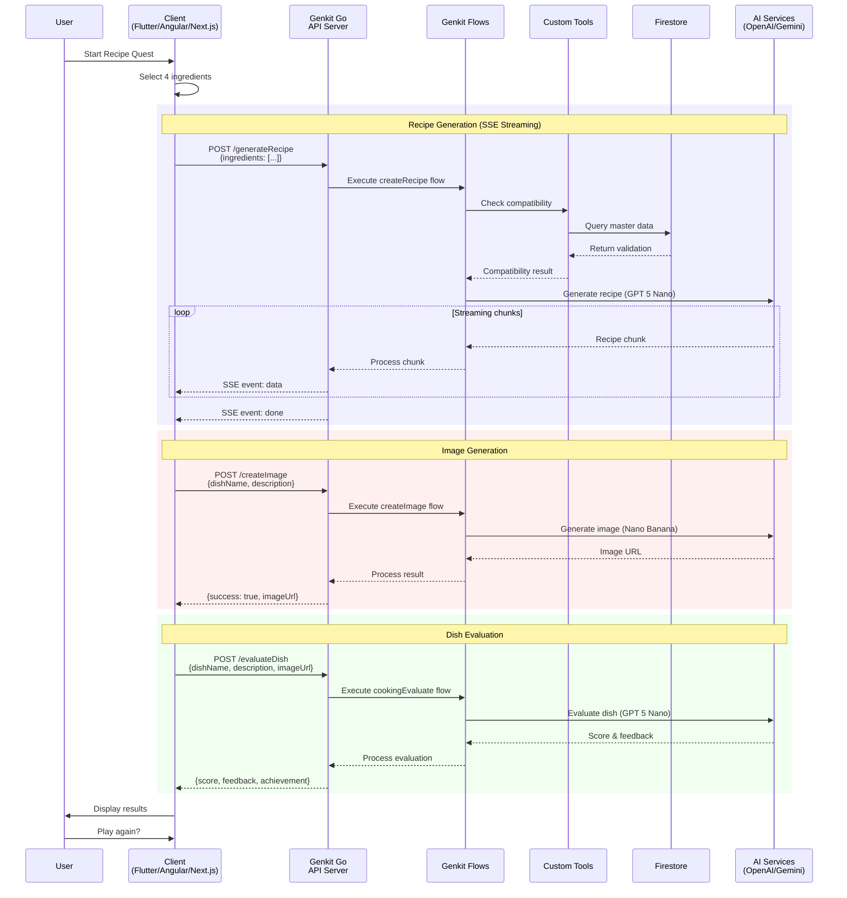

```mermaid
sequenceDiagram
    participant User
    participant Client as Client<br/>(Flutter/Angular/Next.js)
    participant API as Genkit Go<br/>API Server
    participant Flow as Genkit Flows
    participant Tool as Custom Tools
    participant DB as Firestore
    participant AI as AI Services<br/>(OpenAI/Gemini)
    
    User->>Client: Start Recipe Quest
    Client->>Client: Select 4 ingredients
    
    rect rgb(240, 240, 255)
        Note over Client,AI: Recipe Generation (SSE Streaming)
        Client->>API: POST /generateRecipe<br/>{ingredients: [...]}
        API->>Flow: Execute createRecipe flow
        Flow->>Tool: Check compatibility
        Tool->>DB: Query master data
        DB-->>Tool: Return validation
        Tool-->>Flow: Compatibility result
        Flow->>AI: Generate recipe (GPT 5 Nano)
        
        loop Streaming chunks
            AI-->>Flow: Recipe chunk
            Flow-->>API: Process chunk
            API-->>Client: SSE event: data
        end
        
        API-->>Client: SSE event: done
    end
    
    rect rgb(255, 240, 240)
        Note over Client,AI: Image Generation
        Client->>API: POST /createImage<br/>{dishName, description}
        API->>Flow: Execute createImage flow
        Flow->>AI: Generate image (Nano Banana)
        AI-->>Flow: Image URL
        Flow-->>API: Process result
        API-->>Client: {success: true, imageUrl}
    end
    
    rect rgb(240, 255, 240)
        Note over Client,AI: Dish Evaluation
        Client->>API: POST /evaluateDish<br/>{dishName, description, imageUrl}
        API->>Flow: Execute cookingEvaluate flow
        Flow->>AI: Evaluate dish (GPT 5 Nano)
        AI-->>Flow: Score & feedback
        Flow-->>API: Process evaluation
        API-->>Client: {score, feedback, achievement}
    end
    
    Client->>User: Display results
    User->>Client: Play again?
```
